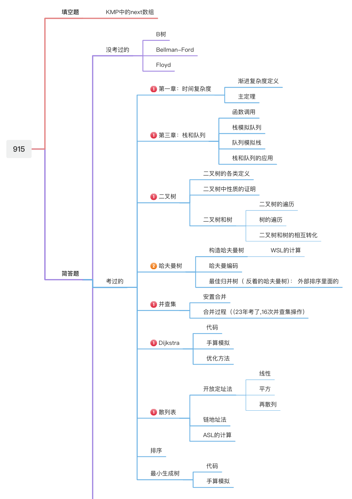
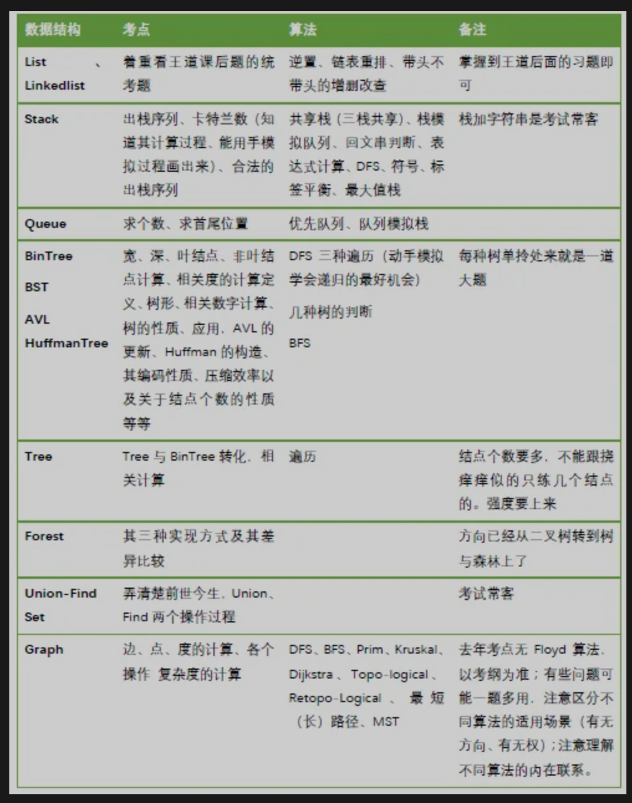

## 自我介绍

本人二战上岸软件工程专业，初试成绩 380+，专业课（915） 126分，数学 125 分。

## 备考方法

### 工具


工欲善其事，必先利其器。

APP

- 扇贝（背单词，看真题，推荐）
- 语雀（ios/android/win/ipad 都可以用，记笔记）
- GoodNotes（ipad用，tb买个盗版）
- Documents（ipad用，看pdf 比较方便）
- 扇贝考研（英语批改作文用）
- 百度网盘会员（不到200块，存储网盘资料用）


公众号：

- 陈叨叨杂货铺（网盘资料）
- 风中易小生（数学/政治做题本）
- 夫人的秘密花园（后期政治肖四，肖八总结的还不错）
- 考研经验超市（会告诉你在哪个阶段该做什么，如何提高）
- 考研小苗（网盘资料，更新速度快，价格七八十）
- 南山采菊花（政治小程序，手机刷政治选择用）
- 腿姐考研政治课堂（后期腿姐会有带背，可以用来磨耳朵）
- 肖秀荣教授（考研政治唯一考生）
- 研途可期（政治的一些总结）
- 有道考神刘金峰（数学真题的神，三卷合一效果非常好）
- 周兆鑫在修行（小众考研英语作文）

### 数学

我推荐的高数路线：

武忠祥提高课，配合武忠祥辅导讲义 `-->`660习题`-->` 李林880刷两遍（有时间可以看李林辅导讲义）`-->` 九月份/十月份开真题（推荐刘金峰讲的真题，他会把数一数二数三的真题都讲一遍） `-->` 市面上能见到的模拟卷 `-->` 考试

需要注意的是，数学的学习要不断的总结，练习，深刻的理解定理，常规题的思路明确。用刘金峰老师的话来说就是：分析考点，总结方法，计算正确。

数学的关键就在于：多思考，多练，题量要上去，思考要深刻。

可以用 错题本，但是错题本上的步骤用不到写的很完整，我的错题本只抄了题目和 我想不到/想错了的步骤，按照自己的习惯来，自己能看懂就行，没必要在这上面浪费太多时间，你真正要做的是，**没事拿出错题本来多翻，多练，重复练。**

基础：7月中旬结束，把所有科目的课程，辅导讲义都过一遍，660跟着做

提高：7月中旬到开学前：880刷两遍，做完再开真题

真题：10月之前刷完，刘金峰的三合一。 我当时是每天8:30-11:30 做一套数二的，然后下午做做数一数三的公共部分，第二天订正，改错。

模拟卷：限时模拟，错就仔细改，分数没有意义，学会最重要，不要看重分数，考研之前的任何分数都无所谓的，都只是检验你最近学习状态的。

### 915

我这里写一下我当时准备的过程

课本

- [x] 时间复杂度
- [x] 栈和队列
- [x] 二叉树（性质，特点，证明）
- [x] 二叉搜索树，b树，avl树
- [x] 图论（dijk，prim，floyd，bellman，kruskl），定义和模拟过程，代码
- [x] 查找，哈希表，折半查找树，散列删除/冲突，同义词啥的定义看看
- [x] 排序特性，稳定性，时间空间复杂度

软件精

- [x] 时间复杂度
- [x] 栈和队列
- [x] 二叉树（性质，特点，证明）
- [x] 二叉搜索树，b树，avl树
- [x] b树，avl树补充题：王道，1800
- [x] 图论（dijk，prim，floyd，bellman，kruskl），定义和模拟过程，代码
- [x] 查找，哈希表，折半查找树，散列删除/冲突，同义词啥的定义看看
- [x] 排序特性，稳定性，时间空间复杂度

软件精习题集

- [x] 图论
- [x] 树
- [x] 查找
- [x] 排序

主要看看 各个主要算法的代码，和模拟执行流程

- [x] avl树，插入，删除，旋转 
- [x] b树插入，删除 
- [x] 定义整理 
- [x] 软件精真题再过一遍
- [x] dijk，代码，模拟流程，path，dis数组的含义
- [x] prim 流程
- [x] kruskal 流程
- [x] toposort 代码，流程
- [x] dsu 流程
- [x] b树性质





### 图论常用板子（必背）

```c++
#include <bits/stcdc++.h>
using namespace std;
const int N = 100,M = 1000;
int n,m;
/*
    DFS
        邻接矩阵版: O(n^2)
        邻接表版:  O(n + m) 
        非递归
*/

// 邻接矩阵
int g[N][N];
bool st[N];     
void dfs_matrix(int u) {
    st[u] = true;
    for(int j = 1; j <= m; j ++) {
        if(!st[j] && g[u][j]) {
            dfs_matrix(j);
        }
    }
}

// 邻接表
bool st[N];
vector<int> e[N];
void dfs(int u) {
    st[u] = true;
    for(auto v: e[u]) {
        if(!st[v])
            dfs(v);
    }
}

// dfs 判环
bool st[N];
vector<int> e[N];
bool dfs(int u,int fa) {
    for(auto v: e[u]) {
        if(!st[v]) {
            return dfs(v,u);
        }
        else if(st[v] && fa != v) {
            return true;
        }
    }
}

/*
1.如果链表中有环，那么会有两个节点同时指向一个节点，所以可以遍历链表，
    将遍历过的节点记录下来，如果下一个指向的节点在前面已经遍历过了，说明存在环
2.新建两个节点名字均为头结点，其中一个头结点每次向后移动一个节点，
    另外一个节点每次向后移动两个节点，每次判断这两个节点指向的节点是否为同一节点，
    如果存在指向同一节点的情况，说明存在环。因为一个跑得慢，一个跑得快，他们必然会相遇。
3.从头结点开始，如果该节点没有指向自己，则将该节点指向自己，
    而原本该节点真正指向的下一节点称为新的头结点，以此类推，如果某一个节点指向的是自己，说明存在环。


*/
// 非递归形式
bool st[N];
vector<int> e[N];
void dfs_stack(int s){
    stack<int> stk;
    stk.push(s);
    st[s] = true;

    while(stk.size()) {
        int u = stk.top();
        stk.pop();

        for(auto v:e[u]) {
            if(!st[v]) {
                st[v] = true;
                stk.push(v);
            }
        }
    }

}
/*
    BFS:
        邻接矩阵版: O(n^2)
        邻接表版:  O(n + m) 
*/

// 邻接矩阵
int g[N][N];
bool st[N];
void bfs(int s) {
    queue<int> q;
    st[s] = true;
    q.push(s);

    while(q.size()) {
        int u = q.front();
        q.pop();
        for(int j = 0; j < m; j ++)
            if(g[u][j] == 1 && !st[j])
            {
                q.push(j);
                st[j] = true;
            }
    }
}

// 邻接表
bool st[N];
vector<int> e[N];
void bfs(int s) {
    queue<int> q;
    st[s] = true;
    q.push(s);

    while(q.size()) {
        int u = q.front();
        q.pop();
        for(auto v:e[u]) 
            if(!st[v]) {
                st[v] = true;
                q.push(v);
            }
    }
}

/*
    Dijkstra
        邻接矩阵版: O(n^2)
        邻接表版:  O(n + m) 
        堆优化版：O(nlogn)
*/
// 邻接矩阵
int dis[N];
int g[N][N];
bool st[N];
int dijkstra(int u,int final) {
    memset(dis,0x3f,sizeof(dis));
    dis[u] = 0;
    
    for(int i = 1; i <= n; i ++) {
        int t = -1;
        for(int j = 1; j <= n; j ++) {
            if(!st[j] && (t == -1 || dis[j] < dis[t]))
                t = j;
        }
        st[t] = true;

        for(int j = 1; j <= n; j ++)
            dis[j] = min(dis[j],dis[t] + g[t][j]);
    }
    if(dis[final] == 0x3f3f3f3f) return -1;
    return dis[final];
}

// 邻接表版:  O(n + m) 
bool st[N];
int dis[N];
vector<pair<int,int>> e[N];
int dijkstra(int u,int final) {
    memset(dis,0x3f,sizeof(dis));
    dis[u] = 0;
    
    for(int i = 1; i <= n; i ++) {
        int t = -1;
        for(int j = 1; j <= n; j ++) {
            if(!st[j] && (t == -1 || dis[j] < dis[t]))
                t = j;
        }
        st[t] = true;

        for(auto [v,w]:e[t]) {
            dis[v] = min(dis[v],dis[t] + w);
        }
    }
    if(dis[final] == 0x3f3f3f3f) return -1;
    return dis[final];
}

// 堆优化版
bool st[N];
int dis[N];
vector<pair<int,int>> e[N];
void dijkstra(int s) {
    // st表示结点是否在优先s队列中
    memset(dis,0x3f,sizeof dis);
    // {权值，起点}
    priority_queue<pair<int,int>, vector<pair<int,int>>, greater<>> pq;
    dis[s] = 0;
    pq.emplace(dis[s],s);

    while(pq.size()) {
        auto [distance,u] = pq.top();
        pq.pop();

        // 最短路出队
        if(st[u]) continue;
        st[u] = true;

        for(auto [v,w]: e[u]) {
            if(dis[v] > distance + w) {
                dis[v] = distance + w;
                pq.emplace(dis[v],v);
            }
        }
    } 
}
/*
    Bellman-Ford
        邻接表法：O(nm)
        执行多轮循环。每轮循环，对 所有边 都尝试进行一次松弛操作。
        当一轮循环中，没有成功的松弛操作时，算法停止。
*/

int dis[N];
vector<pair<int,int>> e[N];
int bellman_ford(int u,final) {
    memset(dis,0x3f,sizeof(dis));
    dis[u] = 0;
    bool flag; // 是否松弛
    for(int cnt = 1; cnt <= n - 1; cnt ++) {
        flag = false;
        for(int i = 1; i <= n; i ++) {
            for(auto [v,w]: e[i]) {
                if(dis[v] > dis[i] + w) {
                    dis[v] = dis[i] + w;
                    flag = true;
                }
            }
        }
        if(!flag) break;
    }
    // 若第 n 轮仍然有松弛操作，则说明存在环
    if(flag) return - 1;
    if(dis[N] == 0x3f3f3f3f) return -1;
    return dis[N];
}

/*
    Floyd:
        邻接矩阵法：O(n^3)
*/
int g[N][N];
int dis[N][N];

void floyd()
{
    memset(dis,0x3f,sizeof(dis));
    for(int k = 1; k <= n; k ++)
        for(int i = 1; i <= n; j ++)
            for(int j = 1; j <= n; j ++)
                dis[i][j] = min(dis[i][j],dis[i][k] + dis[k][j]);
}


/*
    Prim 加点法最小生成树
*/
int dis[N];
int g[N][N];
int prim(int s)
{
    memset(dis,0x3f,sizeof dis);
    dis[s]=0;
    int sum = 0; // 最小生成树的权值和
    for(int i = 1; i <= n; i ++) {
        int t = -1;
        for(int j = 1; j <= n; j ++) {
            if(!st[j] && (t == -1 || dis[j] < dis[t]))
                t = j;
        }
        // 不能构成最小生成树（图不连通）
        if(dis[t] == 0x3f3f3f3f) return -1;
        st[t] = true;
        sum += dis[t];

        for(int j = 1; j <= n; j ++) 
            // 这里是和 dijkstra 不同的地方
            dis[j] = min(dis[j],g[t][j]);

    }
    return sum;
}

// 邻接表版
int dis[N];
vector<pair<int,int>> e[N];
int prim(int s)
{
    memset(dis,0x3f,sizeof dis);
    dis[s]=0;
    int sum = 0; // 最小生成树的权值和
    for(int i = 1; i <= n; i ++) {
        int t = -1;
        for(int j = 1; j <= n; j ++) {
            if(!st[j] && (t == -1 || dis[j] < dis[t]))
                t = j;
        }
        // 不能构成最小生成树（图不连通）
        if(dis[t] == 0x3f3f3f3f) return -1;
        st[t] = true;
        sum += dis[t];

        for(auto [v,w]:e[t]) 
            // 这里是和 dijkstra 不同的地方
            dis[v] = min(dis[v],w);

    }
    return sum;
}

/*
    Kruskal
        时间复杂度：O(mlogm)
*/
struct edge{
    int u,v,w;
    bool operator <(const edge & t) {
        return w < t.w;
    }
}e[M];
int fa[N],cnt = 0;

int find(int x) {
    if(x == fa[x]) return fa[x];
    return fa[x] = find(fa[x]);
}
int kruskal() {
    int sum = 0; // 最小生成树的权值和
    sort(e,e + m); 
    for(int i = 0; i < m; i ++) {
        int fx = find(e[i].u);
        int fy = find(e[i].v);
        if(fx != fy) {
            fa[x] = y;
            sum += e[i].w;
            cnt ++;
        }
    }
    // 不能构成最小生成树（图不连通）
    if(cnt != n - 1) return - 1;
    return sum;
}

/*
    拓扑排序：toposort
        1、kahn算法：用队列维护一个入度为 0 的结点的集合
        2、DFS：在递归结束前输出，形成 逆拓扑排序
*/
// kahn 算法
vector<int> e[N];
int d[N]; // 入度
vector<int> tp; // 记录拓扑序
bool toposort() {
    queue<int> q;
    for(int i = 1; i <= n; i ++) 
        if(d[i] == 0)
            q.push(i);
    while(q.size()) {
        int x = q.front();
        q.pop();
        tp.push_back(x);
        for(int v:e[x]) 
            if(--d[v] == 0)
                q.push(v);
    }
    // 输出拓扑序
    for(int x:tp) cout << x << " ";
    cout << "\n";
    return tp.size() == n;
}


// dfs,形成逆拓扑排序
vector<int> e[N];
int d[N]; // 入度
vector<int> tp; // 记录拓扑序
bool st[N];
void dfs(int u) {
    st[u] = true;
    for(int v:e[u])
        if(!st[v])
            dfs(v);
    tp.push_back(u);
}
bool toposort() {
    for(int i = 1; i <= n; i ++) 
        if(!st[i])
            dfs(i);
    // 逆拓扑 --》 拓扑序
    reverse(tp.begin(),tp.end());
    for(int x:tp) cout << x << " ";
    cout << "\n";
    // 无环，存在拓扑排序
    if(tp.size() == n) return true; 
    else return false;
}
/*
    2023-915简答题伪代码实现
        栈和队列的转换
        把队列中的12345678通过栈换成13572468这样好像
*/

void QueueToStack(queue<int>&q,stack<int>& stk) {
    while(q.size()) {
        int x = q.front();
        q.pop();
        stk.push(x);
    }
}
void StackToQueue(stack<int>& stk,queue<int>&q) {
    while(stk.size()) {
        int x = stk.top();
        stk.pop();
        q.push(x);
    }
}
void solve()
{
    queue<int> q;
    for(int i = 1; i <= 8; i ++) q.push(i);

    stack<int> s1,s2;
    // 将队列中的12345678转到栈中
    while(q.size()) {
        int x = q.top();
        q.pop();
        if(x % 2 == 0) s1.push(x);
        else s2.push(x);
    }
    // 2468 --> 8642
    StackToQueue(s1,q);
    QueueToStack(q,s1);

    // 8642 -> 86427531
    while(s2.size()) {
        int x = s2.top();
        s2.pop();
        s1.push(x);
    }
    // 86427531 --> 13578642
    StackToQueue(s1,q);
    QueueToStack(q,s1);
    
}

```


## 总结

考研是一个持续了很多年的一个应试考试。应试考试都有方法，而且经过许多年的积累，好多方法都已经总结好了。

所以你应该做的第一步：搜集大量的信息，全面客观的认识考研，虽然认识的可能会不全面，但先知道考研是个怎么回事，他的流程是什么，什么时间该做什么事情。

其二：目的是明确的，手段是可变的。不存在放之四海而皆准的方法，每个方法存在都有它一定的优点，时间有限，吸收利用他的优点，至于总结什么的，可能早就有人总结好了，你要做的就是理解，弄清楚他的道理，简单的机械的重复劳动交给别人去做。

其三：脚踏实地，辛勤努力。推荐周计划，每周一列下这周要做的事情，具体到每一天看状态，切记：想多学的时候多学点，不想学的时候就做些自己感兴趣的。

其四：在努力的过程中，不要害怕犯错误，在最后的考试之前，任何模拟考试都是检测最近学习成果的，比较分数没有意义，重点是看自己在哪方面有欠缺，有错误是好事，在考试之前发现都是好事，解决它就好了，考试不再犯就好了。

其五：提高计算能力，多练练定积分，高阶偏导，二重积分的计算。隔一段时间就拿出来练，别手生了，提高计算的准确率（这个在反复计算的过程中，就能总结出来，大体在那个地方出错，然后想个办法来克服它。举个例子，我在定积分计算 含分数时候经常出错，所以我先把分数都提出来，里面全是整数，这样就极大提高了计算的准确度）

其六：英语很重要。阅读认真仔细的做，翻译和作文后期提分关键，要重视，作文采用手写印刷体，多练练。作文前期看思路，积累素材，后期背模板，实战套真题。

这个世界很残酷，人很可怕。难得可贵的是，有一些志同道合的朋友一起努力，有很多书籍供你思考，有很多看起来可行的方法可以执行，有很多宝贵经验可以借鉴，有你和有我创造更大的可能，that is enough.


## 网上看来的一篇经验贴


	本文来自网上，侵权删。


Hola，各位考研er，我是你们的开琰学长，小声bb软工方向二战上岸，但我始终觉得我比起那些大神还差的很远，内心以失败的考研er自居。

为撒子嘞：失败，成功无论标准是什么，在哪？自己心里要有自己的一杆秤。自己的两个高中的同学，二战交大仍未上，所以不客气的说，自己是踩着别人的尸体上来的，能上交大并非自己多么优秀，努力运气兼而有之，这话也是说给自己听，时刻告诫自己，有着别人未曾有过的幸运，更该尽己所能，助人也是助己。

有志于报考交大同学相信你们并不是一时冲动，而是踌躇徘徊了无数个日日夜夜，为了自己心中那个小小倔强的梦想啊。相信不少人还将交大默默藏在心底，不以轻易示人。同时也是基于自身实力及报考难度做出的最适合自己的选择。

因此，各位更不必妄自菲薄，时刻心里暗示着真正大佬都保研了，进大厂了，自己的竞争伙伴其实跟自己差不太远，so 从现在开始，踏实学到最后一天，干就完事了。

警惕往届考研er所犯的错误。因为失败的经历更要铭记于心，惨痛的回忆正是因为警醒后事才有意义。希望来年的学弟学妹鉴于我犯过的错不要再犯，走过的弯路顺利越过。

话不多说开始，本文分为以下几部分：三年的总体情况（近三年的真题变化）真题的风格一个是深（细）一个是广（知识面、内容、体系、题量）**｛特殊标注：二战的更能体会到这点｝**本帖更适合一战跨考人群，二战交大的可以对着提到的知识点查漏补缺（不信你可以试试）


### 风格篇

从深的角度来讲，说考的细更为贴切。

举个栗子，比较从几方面以下近十种排序算法，包括但不限于时空复杂度分析、稳定性、本次是否为最终结果，各自的应用场景（链、顺序、规模大、规模小），同级复杂度的优劣比较，不同场景下的优劣（快排一定比插排快吗 $nlogn$ 的排序一定比 $n^2$ 的快吗），以及给出数据要求写出中间某一步的结果。还有基数排序的复杂度的表示，其中每个符号、字母的意义。

再举个栗子，时空复杂度是翻开书就学到的第一个知识，但是不会像参考书里出的那么简单。会给定复杂度让你估算不同数据规模的处理时间，又会问到给定时间下给定复杂度的极限处理规模，这些问题如果不提前准备到，只知道 $O$ 的定义，大部分人第一次是不一定做得出来的。 

树那一章节的知识。在计算上，高（深度）、宽的定义（定义不同计算不同）、计算。叶结点，非叶结点，度为一，度为二结点个数等等的计算。背、现场推一定是不可以的。为啥子嘞：任何一个985老师都不可能出这种死记硬背可以混分，又可以轻松掌握的知识点。另超大的题量是不一定准确无误推出来的，况且，这样的题不光是小题，证明题正是基于对树节点个数的敏感才能有思路。

此外，关于算法题，定义虽不会明面上考你，但是草蛇灰线，伏脉千里，关于树的大部分算法都用到了定义！！！说烂了的二叉树求树高、求结点个数、判断 `isBST`、判断`isFullBinTree`、判断 `isSame` 、判断 `isAVL`，单凭背过几句定义、即使背完了代码，没有理解我估计递归代码是很难写出来的。

到了后面你会发现交大考的其实很学术，并不屑于考你简单的计算，2020就没有AOE、AOV关键路径的计算（这可是大题啊！！！），自己想，这玩意是不是图里最简单的，然而，，，这样的题（包括哈希及算查找长度）以后只会越来越少，因为它只是机械的计算，方法加细心就能拿分。

最后学到一定程度之后扪心自问，BinTree的定义，BST的定义，AVL的定义是不是理解了。

**即使背过也不等于有分可拿！**

这时候有人说，王道后面成堆的代码，我背个十几二十遍、抄个几遍不也能写下来吗？对于这样想法的同学，我就是一个活生生的例子，一战几乎背了所有的代码，但是我们都知道越是背的东西越是不稳定的，还需要喝前摇一摇考前记一记，然而临近考试要背的东西特别多（除了政治、大小作文专业课考试要背的东西也很多，到了考前十一月份自问哈希表为什么要假删除回答不出来的，建议一天不吃饭背完所有要背的）。

从广的角度，虽说只有两本书（数据结构与C语言）但其实涵盖的东西是远远不止两本书，甚至是整个计算机体系，这方面在体现在经典数据结构的应用以及经典算法的应用。

例如经典 `DataStructure—Stack`，除了以往说烂了的Stack、Queue互相模拟（注意是是互相哦）共享等等，会考到栈的应用，在Operating System这门课中反复提到了系统栈，熟悉这门课的人知道系统栈是干嘛用的，其中栈中的每个元素称之为栈帧（活动记录块）查一下这个栈帧存了哪些内容，是干嘛用的（曾考，但这些不属于DS也不属于C语言）。

队列，Operating System中也有等待队列、优先队列，多嘴一句（优先队列是基于哪种数据结构实现的呢，这一数据结构也曾用于某种排序）。同样的，经典算法的应用考的也很频繁，计算机网络中的生成树协议算法，路由表的最短路径计算。所以你会发现交大的出题风格并不屑于考你简单固定计算的，这也是只有基于数据结构的理解加上计算机体系的知识才能游刃有余。

说这些的目的并不是让你去以学408的知识去应对交大的两本书考试，而是要注意理解，从各自章节相互串成线、各本书连成面，最终体系的力量会让你最后心里特别有底，别人还在背算法定义抄代码的时候，你甚至可以从算法的前世讲到今生。

不会像被政治那样背过程、背定义概念、背算法。最后你会发现交大出题不是就题出题，而是能从宏观从体系上进行选拔，细致入微与面面俱到。其中的知识并非是铁板一块，学通了，学活了，知识就是在一遍又一遍的学习巩固理解再学习再巩固再理解螺旋上升的。（马原理诚不欺我）。

### 备考篇

我们需要准备到哪些内容呢，有志于考交大的同鞋心底就要有足够的困难应对能力。**学会只是入场券而已，精通才能胜出**。要知道，现在的考试难度很大程度上不在于题目，而在于无形中提高了竞争的激烈程度，题量很大，很多题不是你不会做，而是由于犹豫模棱两可白白丢掉了时间。

这个，是最最最痛彻心扉的惨痛回忆了。当你学通了练熟了，最后考时你会发现，你大题已经写了两道半了，周围人选填还没写完，这个，就是莫大的优势，这个，就是最大的信心。

数据结构的应用：List、Linkedlist、Stack、Queue 这些线性结构一定要熟练写出数据结构以及相关的操作eg：插入、删除、查找、出入栈（队列），判空、判满（注意队列），取top。因为大题是必定会考的。建议用C++类来实现，跨考同样不用担心，半天两小时就能练会，只是将struct改成了class，把对其操作（方法）写到了class里，不用谢构造析构等函数。

原因无他：一看就是练家子，无形中阅卷老师会觉得很专业，印象分就上去了。我这一届曾考hash的假删除，大家学过都知道原理，但是表述出来就显得不那么专业，因此必要的话术也得背。



算法的应用：递归、贪心、分治、DP、KMP、Broute Force（后两个一般选填）在这讲一个混分小技巧，代码三道题，前两道应该是不难的，一般是字符串加递归、第二道呢稍微代码量上来了，第三道就是贪心这类了，看清是哪种类型，上来先熟练的排个序，然后要求接着往下做（嘿嘿嘿………..） 


### 方法篇

先看交大需要咱掌握到那个程度：交大的难度是很难的，(自18届开始软工火起来之后，专业课就变难了。专业课成绩2019届均分九十（并不是没好好学，真实体会到兄弟姐妹刷了四五遍王道看到卷子的绝望），上一百的寥寥无几，但最高134。

2020我们这届稍简单点了，一百以上的人一百一的人还是很多的，最高应该是120+（错了有冒犯的轻喷奥））专业课也是有大小年的。尤其是今年底考研这届，讲实话，今年的专业课简单了，but基于今年香喷喷的交大软工明年报交大的人数估计大涨但是录的人数不可能像我们今年这样，估计两百四到两百六，所以专业课是个坎儿）。

既然认定要考交大了，就要按着交大的标准来办事。何为交大的标准，就是以前本科觉得难的东西在交大面前就是基础。eg：连续三届交大考研er被 `Union-Find Set` 虐的体无完肤了。

别人觉得图的算法难就不看了，但是连出了四道图的算法大题你敢想。别人觉得数学真题刷到00年之后就稳了但是考交大真的不行，今年的数学就有九几年的题哦（这种感jio在你上了研接触了交大的老师同学会更加明显，wuwuwu~）

我们这届考交大的有衡中打ACM上的国防科大、有本科985数学系的，有武大计科的。so出身一般的，更要付出百倍努力，用陕西话说就是，脱了hai都不一定追的上人家。因为高考一方面就是学习能力、抗压、心智、考试能力的筛选，好的大学或许有家境、智力、环境的因素，但是越好的大学十有八九代表着高效的学习思考能力，这是我们不得不承认的。

考了两年，认定一句话，高分真就是既学会了，又学对了。考研时间短、任务多。要考高分得讲方法。刷了红皮算法有好处吗？当然有，但是，不讲成本的好处都是耍流氓！宝贵的时间更应该用到刀刃上。

因此，复习应当分为三个阶段：

**第一阶段：**以王道为主打基础、力图扫盲，标准是王道后面的题上面提到的考点一定要会做，最好能熟念于心；

**第二阶段：**针对上面提到的考点专项强化练习（要背的、要算的、要证的、要代码的）过了这俩阶段基本也就没什么能难住你的了（因为你的理解深度、知识广度已经在前两个阶段已经建立起来了）

**第三阶段：**就查漏补缺了，看错题、看算法的思想、看看算法的关键步骤、看关键代码。代码题的话，那本剑指offer就够了！ 

That’s  all，常考的与交大常考的都涉及到了，以后会详细讲一下这两本书具体怎么学。只希望一路的血泪史能给考研的兄弟姐妹们填坑，最好是摸着我的尸体过河。


最后，认真的人，自带光芒，祝各位成功太俗，那就祝各位必胜！！！