# 第三次作业

## 线程

### Discuss the difference between user-level thread and kernel level thread.

用户级线程无法被内核感知，由用户级线程库创建和维护。内核级线程可以被内核感知，是调度的基本单位，被操作系统分配和维护。二者有诸多不同：

- 时间片分配上：系统只对用户级线程所在的进程分配时间片，所有用户级线程共享这段时间片；系统会对一个进程内的每个系统级线程分配相同的时间片
- 系统调用上：一个用户级线程发起系统调用，则其所处的整个进程阻塞；一个内核级线程发起系统调用，其他同进程的内核级线程仍然可以执行
- 用户级线程切换不需要内核特权，而系统级线程切换需要由内核完成。

### Which of the following components of program state are shared across threads in a multithreaded process?

**a. Register values**

**b. Heap memory**

**c. Global variables**

**d. Stack memory**

b： 堆内存和 c： 全局变量在线程之间共享。每个线程拥有独立的寄存器值和栈地址空间。

 

### The program shown below uses the Pthreads API. What would be output from the program at LINE C and LINE P?

```c
#include <stdlib.h>
#include <pthread.h>
#include <stdio.h>
#include <unistd.h>
 
int value=0;
void *runner(void *param); /* the thread */
 
int main()
{
   int pid;
   pthread_t tid;
   pthread_attr_t attr;
   pid=fork();
   if(pid==0)
   {
      pthread_attr_init(&attr);
      pthread_create(&tid, &attr, runner, NULL);
      pthread_join(tid, NULL);
      printf("CHILD: value=%d\n", value);  /* LINE C */
   }else if(pid>0){
      wait(NULL);
      printf("PARENT: value=%d\n",value);　/* LINE P */
   }
}
 
void *runner(void *param)
{
   value=5;
   pthread_exit(0);
}
```

C 行应当打印出：`CHILD: value=5`，因为线程共享全局变量，一个线程中修改的变量在同进程线程中同样被修改。

P 行应当打印出：`PARENT: value=0`，因为这段代码和修改 value 的函数不在同一进程执行，故变量的值不互通，保持为 0。

### 请说明三种多线程模型及其优缺点。

多线程模型是指用户级线程和内核级线程的绑定关心。三种多线程模型为：多对一、一对一、多对多。

多对一模型：同一进程中的多个用户级线程映射到单个内核级线程/整个进程上。

优点：可以在不支持内核级线程的系统上运行

缺点：任何时刻只能有一个线程访问内核（不能真正实现并发）；一个用户线程发起系统调用而阻塞，则同进程下所有用户级线程阻塞；分配时间片时总时长一定，线程越多，每个用户级线程得到的时间越短。

一对一模型：一个用户级线程映射到一个内核级线程。

优点：并发性好；任何线程阻塞时，不影响其他线程运行；线程是时间片分配单位，每个用户级线程都能得到单独的时间片。

缺点：每创建一个用户级线程就需要创建一个系统级线程，开销较大。需要限制内核级线程的总数（因此用户级线程也有数量限制）

多对多模型：n 个用户级线程绑定到不超过 n 个内核级线程上。此绑定一般是动态的，用户级线程和内核级线程并不完全一一对应。

优点：不限制用户级线程数，且可以做到 n 个线程并发（n 为内核级线程数）

缺点：实现麻烦（此外好像没啥缺点了）

## CPU调度

### Consider the following set of processes, with the length of the CPU burst given in milliseconds:

| **Process** | **Burst Time** | **Priority** |
| ----------- | -------------- | ------------ |
| **P1**      | **10**         | **3**        |
| **P2**      | **1**          | **1**        |
| **P3**      | **2**          | **3**        |
| **P4**      | **1**          | **4**        |
| **P5**      | **5**          | **2**        |

The processes are assumed to have arrived in the order P1, P2, P3, P4, P5, all at time 0.

  a. Draw four Gantt charts that illustrate the execution of these processes using the following scheduling algorithms: FCFS, SJF, nonpreemptive priority (a smaller priority number implies a higher priority), and RR (quantum = 1).

由于空间不足，下方的甘特图中使用了 CPU Time 和 T 两种标签，二者均指进程在 CPU 上运行的时间；

```mermaid
gantt
title FCFS 调度下的耗时
dateFormat  m
axisFormat %M
section P1
CPU Time :0,10
section P2
T:11
section P3
T :13
section P4
T: 14
section P5
CPU Time: 19
```

```mermaid
gantt
title SJF 抢占调度下的耗时
dateFormat  m
axisFormat %M
section P1
CPU Time :9,19
section P2
T:0,1
section P3
T :2,4
section P4
T: 1,2
section P5
CPU Time: 4,9
```

```mermaid
gantt
title 非抢占的优先级调度下的耗时
dateFormat  m
axisFormat %M
section P1
CPU Time :6,16
section P2
T:0,1
section P3
T :16,18
section P4
T: 18,19
section P5
CPU Time: 1,6
```

```mermaid
---
displayMode: compact
---
gantt
title RR 调度下的耗时
dateFormat  m
axisFormat %M
section P1
T :0,1
T: 5,6
T:8,9
T:10,11
T:12,13
T:14,19
section P2
T:1,2
section P3
T :2,3
T:6,7
section P4
T: 3,4
section P5
T: 4,5
T:7,8
T:9,10
T:11,12
T:13,14
```









  b. What is the turnaround time of each process for each of the scheduling algorithms in part a?

每个进程在不同调度算法下的周转时间如下：

| 周转时间 | FSFC | SJF  | 优先级 | RR   |
| -------- | ---- | ---- | ------ | ---- |
| P1       | 10   | 19   | 16     | 19   |
| P2       | 11   | 1    | 1      | 2    |
| P3       | 13   | 4    | 18     | 7    |
| P4       | 14   | 2    | 19     | 4    |
| P5       | 19   | 9    | 6      | 14   |

  c. What is the waiting time of each process for each of the scheduling algorithms in part a?

每个进程在不同调度算法下的等待时间如下：

| 等待时间 | FSFC | SJF  | 优先级 | RR   |
| -------- | ---- | ---- | ------ | ---- |
| P1       | 0    | 9    | 6      | 9    |
| P2       | 10   | 0    | 0      | 1    |
| P3       | 11   | 2    | 16     | 5    |
| P4       | 13   | 1    | 18     | 3    |
| P5       | 14   | 4    | 1      | 9    |

  d. Which of the algorithms in part a results in the minimum average waiting time (over all processes)?

 在以上算法中，SJF 算法的平均等待时间最短，平均等待 4 毫秒。

### Which of the following scheduling algorithms could result in starvation?

   a. First-come, first-served

   b. Shortest job first

   c. Round robin

   d. Priority

抢占式的 b. SJF 和 d. 优先级算法 可能出现饥饿现象。当有执行时间短的程序源源不断插入时，执行时间长的程序在 SJF 下可能一直无法执行；当有优先级高的程序源源不断插入时，优先级低的程序在优先级算法下可能一直无法执行。