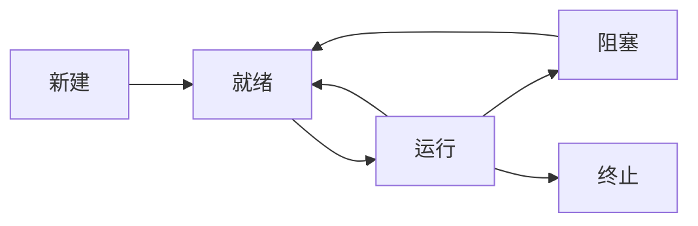

# 第二次作业

### 画出进程的5状态转换图，并说明转换原因。



新建->就绪：长调度选中进程，将其从作业队列（磁盘）放入就绪队列（内存）时

就绪->运行：进程被短调度程序选中，获得了 CPU 时间片

运行->阻塞：进程发起了阻塞性的系统调用（比如 I/O 操作请求）

运行->就绪：进程用完了分配给它的时间片/抢占式调度中，新进程优先级高于自身

阻塞->就绪：进程等待的某个操作完成而被唤醒

运行->终止：进程执行完成

### Describe the differences among short-term, medium-term, and long-term scheduling.

三种调度的区别在于，它们让进程转变的状态不同，目的也不同。

短调度：从就绪队列中选择进程，把 CPU 时间片分配给它。这会让进程从就绪状态转变为运行状态。

中调度：为了缓解内存紧张的状况，挂起部分就绪队列或者阻塞队列中的进程，将其包含的数据转移至磁盘。当进程重新具备运行条件时，再转移回内存。进程从原先的状态变为挂起状态。

长调度：从作业队列（磁盘）中选择进程，将其加入就绪队列（读取到内存中）。长调度控制多道计算机的「道」，即内存中同时存放多少个进程。这会让进程从新建状态转化为就绪状态。

短调度发生的频率最高，中调度发生的频率次之，长调度发生的频率最低。

### Describe the actions taken by a kernel to context-switch between processes.

在上下文切换时，内核需要：

- 保存旧进程的状态：保存旧进程的 PCB 块、寄存器、栈、进程地址空间等数据
- 读取新进程的状态：读取新进程的 PCB 块，寄存器、栈、地址空间等数据并加载到 CPU 中。

上下文切换由硬件完成，操作系统无法主动介入进行工作。

### 采用下述程序，确定A、B、C、D四行中pid和pid1的值。

（假设父进程和子进程的pid分别为2600和2603）

```c
#include <stdio.h>
#include <stdlib.h>
#include <unistd.h>
 
int main()
{
  pid_t pid,pid1;
 
  pid=fork();
 
  if (pid<0)
  {
    fprintf(stderr,"fork fail");
    return 1;
  }
  else if (pid==0)
  {
      pid1=getpid();
      printf("child:pid=%d",pid);      //A
      printf("child:pid1=%d",pid1);     //B
   }
   else
   {
      pid1=getpid();
      printf("parent:pid=%d",pid);     //C
      printf("parent:pid1=%d",pid1);   //D
      wait(NULL);
   }
  return 0;
}
```

A：pid = 0（由于这一部分在子进程中执行，子进程中 fork 的返回值 pid 为 0）

B：pid1 = 2603（子进程获得了自己的 pid，即 2603）

C：pid = 2603（这一部分在父进程中执行，父进程中 fork 的返回值 pid 为子进程 pid，即 2603）

D：pid1 = 2600（父进程获得了自己的 pid，为 2600）

### 课本P104页的3.10题

使用如图 3-33 所示的程序，请解释一下 X 和 Y 的输出是什么

```c
#include <sys/types.h>
#include <stdio.h>
#include <unistd.h>


#define SIZE 5

int nums[SIZE] = {0, 1, 2, 3, 4};

int main(){
    int i;
    pid_t pid;
    
    pid = fork();
    if (pid == 0){
        for (int i=0;i<SIZE;i++){
            nums[i] *= -i;
            printf("CHILD: %d ", nums[i]); /* LINE X */
        }
    }
    else if (pid > 0){
        wait(NULL);
        for (int i=0;i<SIZE;i++){
            printf("PARENT: %d ", nums[i]); /* LINE Y */
        }
    }
    
    return 0;
}
```

X 行产生的输出如下：

> CHILD: 0 CHILD: -1 CHILD: -4 CHILD: -9 CHILD: -16

Y 行产生的输出如下：

>PARENT: 0 PARENT: 1 PARENT: 2 PARENT: 3 PARENT: 4

原因：X 行是子进程中执行的，根据操作，可以推断出其输出。

Y 行内容仍然为原数组内容，是因为进程 fork 时，其内部的所有数据都会被复制一份，因此子进程中对数组的修改不会影响父进程，父进程中的数组还是原样不变。
