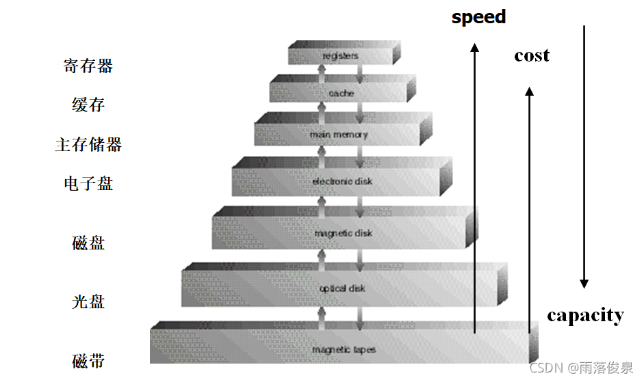

[toc]

# 02 计算机系统结构(Computer System Architecture)

## 计算机系统操作(Computer System Operation)

- I/O设备与CPU可并行运行
- 每一设备控制器负责一个设备类型
- 每一设备控制器有一局部缓存
- CPU通过局部缓存与主存交换数据
- I/O从设备到设备控制器的局部缓存（I/O is from the device to local buffer of controller）
- 设备控制器通过引起**中断**通知CPU操作已完成

### 中断机制

#### 中断的分类

- 硬件中断（Hardware Interrupt）
- 软件中断（Software Interrupt, **Trap**）

#### 中断的作用

- make the system more efficient and meanwhile more responsive；
- 现代操作系统是**中断驱动**的；
- 中断将控制权转移到中断服务程序。

#### 中断向量

中断向量是中断服务程序的入口地址；

将所有中断向量集中放在一起，形成中断向量表。

例如：

| 中断向量 | 中断号 | 中断用途              |
| -------- | ------ | --------------------- |
| 00-03    | 0      | 除法溢出中断          |
| 04-07    | 1      | 单布（用于DEBUG）     |
| 08-0B    | 2      | 非屏蔽中断（NMI）     |
| 0C-0F    | 3      | 断点中断（用于DEBUG） |
| 10-13    | 4      | 溢出中断              |
| 14-17    | 5      | 打印屏幕              |
| 18-1F    | 6,7    | 保留                  |

### 存储结构

### 硬件保护
**两状态操作 Dual-Mode Operation**

1. 用户态
2. 管态(或称 特权模式/系统模式) - 代表操作系统执行

模式位(mode bit)添加到计算机硬件，表示当前模式

系统引导时，硬件处于管态，在用户模式下执行用户进程；一开机的时候处于管态，要执行用户程序的时候转换为用户态；当出现中断或者陷阱时，硬件会切换到管态

特权指令: 只能在管态下运行的指令, 通常使用才做系统调用

例如: 设置定时器的值, 清除内存, 关闭中断.

非特权指令: 读时钟, 从用户态切换为管态

**I/O保护**
所有的I/O操作都是特权指令, 用户不能直接进行I/O操作, 必须通过系统调用.

确保用户程序不能在管态下控制计算机.

**内存保护**
必须保护中断向量与中断服务程序

确定进程能访问的合法空间

- 基址寄存器(base register): holds the smallest legal physical memory address
- 界限寄存器(limit register): contains the size of the range.

用户态下生成的每个地址都要经过硬件检查.

**CPU保护**
OS需要防止用户程序陷入死循环或者不调用系统服务且不将控制权返回到OS.

timer 定时器– interrupts computer after specified period to ensure operating system maintains control
