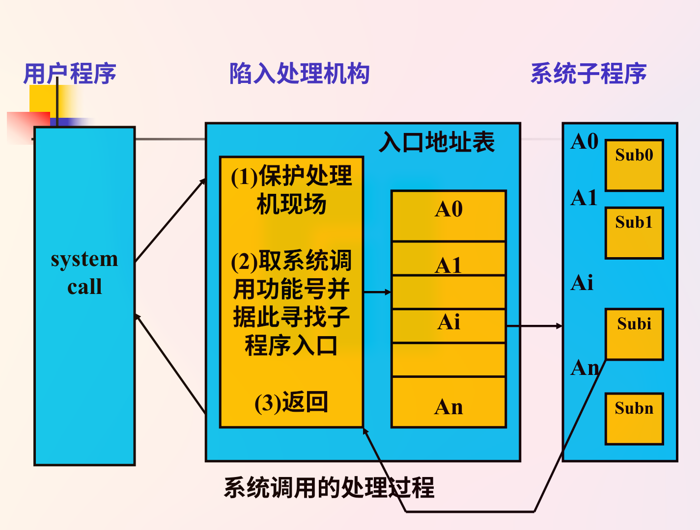
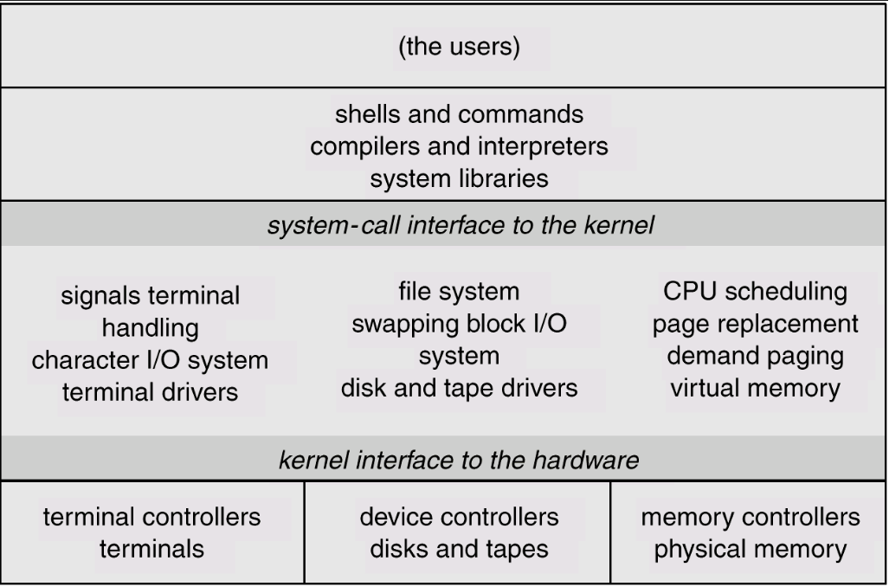
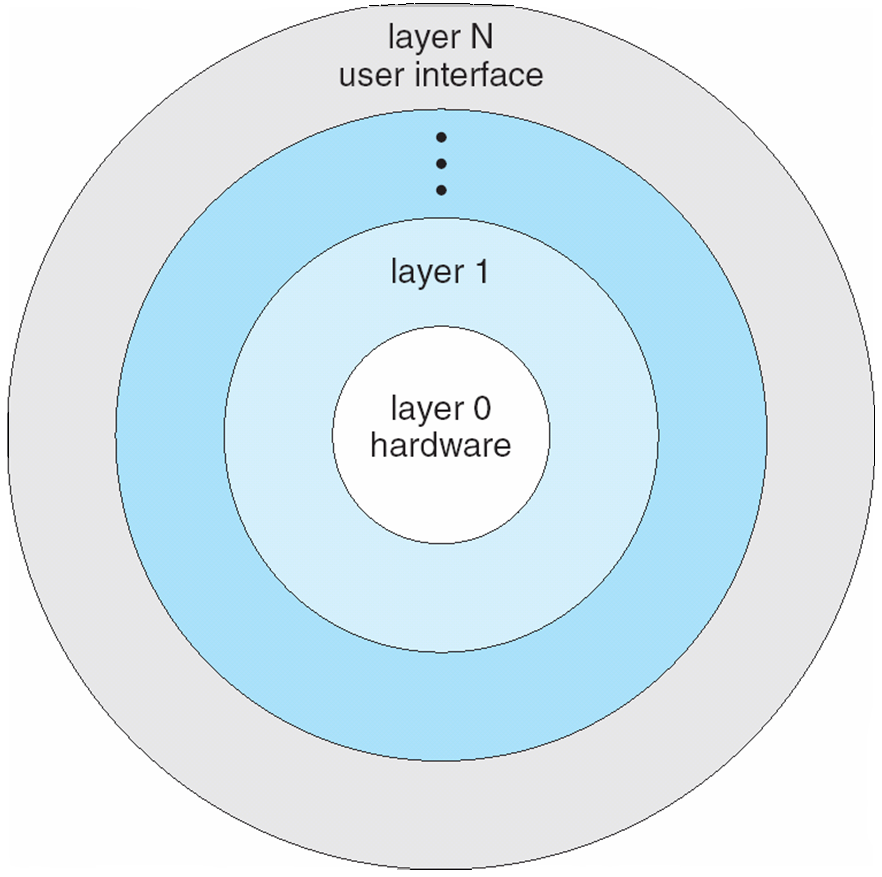

[toc]

# 03 操作系统结构 Operating-System Structures

## 3.1 操作系统服务 Operating System Services

For Users:

- **用户界面**(User Interface) 
- **程序执行**(Program Execution) 
- **I/O操作**(I/O Operations) 
- **文件系统操作**(File-System manipulation)
- **通信**(Communications)
- **出错检测**(Error Detection): 检测在CPU与内存硬件中, 在I/O设备中, 或在用户程序中的错误

其他服务, 为了系统的效率:
- *资源分配*(Resource Allocation): 把资源分配给多个用户或多个同时运行的作业
- *账务*(Accounting): 跟踪和记录用户对资源的使用, 用于帐单和统计
- *保护*(Protection): 确保对资源的所有访问均在控制中

## 3.2 系统调用 System Calls

**系统调用**( System  Calls)提供在运行程序和操作同之间的接口.

通常以汇编语言指令提供.

通常被程序通过一个高层次的应用程序接口(API)访问而非直接访问.

系统调用的处理机构:陷入（TRAP）或异常处理机构

把由于系统调用引起处理机中断的指令称为**陷入**或**异常指令**（或称访管指令）

- 当用户使用系统调用时，产生一条相应的指令
- CPU在执行到该指令时发生中断，发出有关的信号给陷   入处理机构；
- 处理机构在收到了CPU发来的信号后，启动相关的处理程序去完成该系统调用所要求的功能
- 在处理系统调用之前，陷入处理机构还需保存处理机现场（PSW、PC、系统调用号、用户栈指针、- 用寄存器、用户定义的参数等）

如何找到实现系统调用功能的子程序:**入口地址表**，每个入口地址与相应的系统程序对应

陷入处理程序用系统调用功能号查找入口地址表,得到该系统程序的入口地址,并执行之

系统调用处理结束后，要恢复处理机现场，从而用户程序可以继续执行

### 如何使用?
3种常见的方式用于在运行程序和操作系统之间的参数传递.

1. 寄存器中的参数传递;
2. 参数存在内存的一张表中, 表地址作为寄存器的参数传递
3. 程序把参数压入战, 由操作系统弹出

### 系统调用的类型

- Process Control: Including allocate and free momory
- File Management
- Device Management
- Information maintenance
- Communications

## 3.3 系统程序 System Programs
系统程序提供程序开发和执行的便利环境。可划分为：
- 文件操作
- 状态信息
- 文件修改
- 程序设计语言支持
- 程序调入和执行
- 通信
- 应用程序

## 3.4 系统部件 System Components

#### 3.4.1 Process Management 进程管理
进程是正在执行的程序。为了完成其任务，进程需要一定的资源，包括CPU时间，存储器，文件，以及I/O设备.

在同进程管理有关的活动中，操作系统负责下列事务：
- 进程创建和删除;
- 进程挂起和恢复;
- 提供有关机制:
  - 进程同步
  - 进程通信
- 处理死锁

#### 3.4.2 Main Memory Management 主存管理
存储器是字或字节的一个大数组，每一字或字节有自己的地址。它是一个可被CPU和I/O 共享、可快速存取数据的存放地

主存储器是一个易失性存储设备。系统失败时，会丢失其内容

在同存储管理有关的活动中，操作系统负责下列事务:
- 保持记录存储器的哪一部分当前被使用以及被谁使用;
- 当有可用存储空间时,决定调入哪个进程;
- 需要分配和收回存储空间
- Protection

#### 3.4.3 Secondary-Storage Management 二级储存器管理
由于主存（基本存储器）是易失性的，而且太小不足以永久保存所有的数据和程序，计算机系统必须提供二级存储器备份主存

多数现代计算机系统采用磁盘作为程序和数据的基本联机存储介质

在同磁盘管理有关的活动中，操作系统负责下列事务：
- 空闲空间管理;
- 存储器分配;
- 磁盘调度

#### 3.4.4 I/O System Management  I/O系统管理
I/O系统包括:
- 缓冲区-高速缓存系统;
- 通用设备驱动器接口
- 用于特定硬件设备的驱动程序

#### 3.4.5 File Management 文件管理
文件是由其创建者定义的关联信息的一个收集器，通常文件表示程序（源程序和目标程序）和数据

在同文件管理有关的活动中，操作系统负责下列事务：
- 文件创建和删除;
- 目录创建和删除;
- 支持操作文件和目录的原语;
- 把文件映像到二级存储器;
- 在稳定(非易失性)存储介质做文件副本;

#### 3.4.6 Protection System 保护系统
保护是一种机制，控制程序、进程、或用户对系统和用户资源的访问

保护机制必须:
- 区分授权和非授权使用;
- 确定要使用的控制
- 提供强制手段

#### 3.4.7 Networking 网络处理

#### 3.4.8 Command-Interpreter System 命令解释器系统
操作系统有许多命令，可以通过控制语句处理：
- 进程创建和管理
- 处理I/O
- 二级存储管理
- 主存管理
- 文件访问
- 保护
- 网络

读入和解释控制语句的程序有各种名称:
- control-card interpreter 控制卡解释器
- command-line interpreter 命令行解释器
- shell (in UNIX)

其功能是获得和执行下一个命令语句

## 3.5 虚拟机 Virtual Machines
虚拟机是层次化的逻辑结果。它把硬件和操作系统看成都是硬件

虚拟机为裸机提供了统一的接口

操作系统创建了多个进程，每一个进程有自己的处理器和（虚拟）内存

实现方式:  分时   共享
- 物理计算机的资源被共享，以创建虚拟机
  - CPU调度使得用户好像有自己的处理器 
  - Spooling和文件系统提供了虚拟卡片阅读机和打印机
  - 普通用户终端成为虚拟机操作员的控制台

虚拟机的优缺点:  
- 虚拟机概念提供对系统资源的完全保护，因为每个虚拟机同其他虚拟机隔离。当然，隔离不允许直接共享资源
- 虚拟机是研发操作系统的完美载体。系统开发在虚拟机上而不是在物理硬件上完成，从而不会打扰正常系统运行
- 由于需要对下面的机器进行精确的复制，所以虚拟机的概念实现困难

## 3.6 系统结构

### 3.6.1 简单结构
UNIX - 受硬件功能限制，早期UNIX只是有限的结构化。 UNIX包括2个分离的部分
- 系统程序(System Programs)
- 内核(Kernel)
  - 包括了在物理硬件之上, 系统调用之下的一切;
  - 提供文件系统, CPU调度, 存储管理和其他操作系统功能, 每一层有大量的功能.

    

### 3.6.2 层次化结构
操作系统划分为若干层，在低层上构建高层。底层（0层）为硬件；最高层（ N层）为用户层

考虑模块化，层的选择是每层只使用低层次的功能和服务

**分层的基本原则**
每一层都是用其底层所提供的功能和服务, 以便于系统调试和验证

**困难**
层次的划分和安排, 要保证不出现双向依赖关系.

    

**优点**  
- 低层和高层可分别实现（便于扩充）；
- 高层错误不会影响到低层，便于调试、利于功能的增删改；
- 调用关系清晰（高层对低层单向依赖），避免递归调用，有利于保证设计和实现的正确性 

**缺点**  
系统中所有进程的控制转移, 通讯等任务全部交给系统的核心去管理, 要花费一定的代价.

### 3.6.3 微内核
典型系统如MACH和Windows NT

操作系统由两大部分组成
- 运行在核心态的内核
- 运行在用户态并以C/S方式运行的进程层

基于微内核结构的OS和传统OS相比，具有以下特点：
1. **内核精巧**．通常内核只由任务管理、虚存管理和进程间通信3个部分组成．传统OS内核中的许多部分都被移出内核．采取服务器方式实现；
2. **面向多处理机和分布式系统**．基于微内核的OS，在内核中引入了多处理机调度和管理机制，并引入了细粒度并发机制——线程，使得多个处理机可以在同一个任务中并行地执行；
3. **基于客户／服务器体系结构**．在微内核结构的OS中，任务间通信机制—— 消息机制是系统的基础，OS的各种功能都以服务器方式实现，向用户提供服务．用户对服务器的请求是以消息传递的方式传给服务器的． 

优点：
- 易于扩充，易于移植
- 提高系统的可靠性：
- 提供多种操作环境
- 便于实现分布计算：以同样的调用形式，在下层可通过核心中的网络传送到远方服务器上  (RPC, Remote Procedure Call)

缺点：
- 消息传递方式增加开销，使响应变慢

### 3.6.4 模块
可加载的内核模块

- 使用面向对象的方法
- 每个核心组件都是分开的
- 每个都通过已知的界面与其他人联系
- 每个都可根据需要在内核内加载

内核提供核心服务，其他服务在内核运行时可动态加载，类似于分层，但是更加灵活，任何模块可以彼此调用，也类似于微内核，主模块只有核心功能，并知道如何加载其他模块和如何让模块进行通信

### 3.6.5 混合系统
大多数现代操作系统都不是单纯的一个结构，而是会采用多种结构

## 3.7 系统设计和实现 System Design and Implementation

系统设计目标:

用户目标 - 操作系统应该便于使用，易学，可靠，安全并且快捷

系统目标 - 操作系统应该容易设计、实现和维护，还要灵活、可靠、无错误和高效
