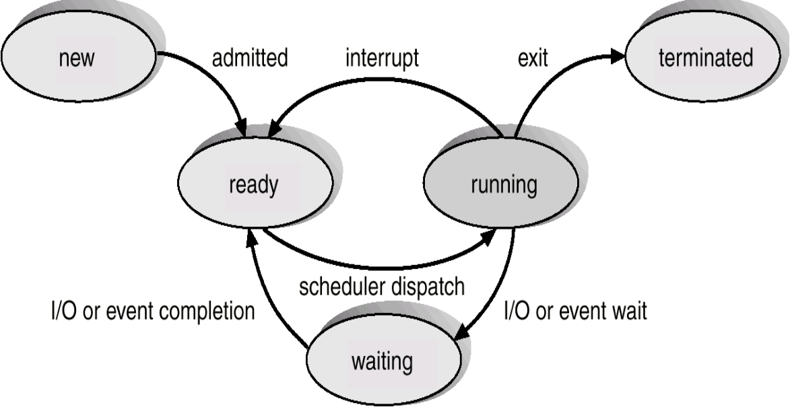
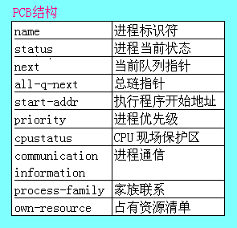
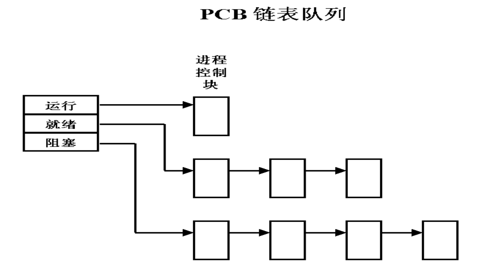
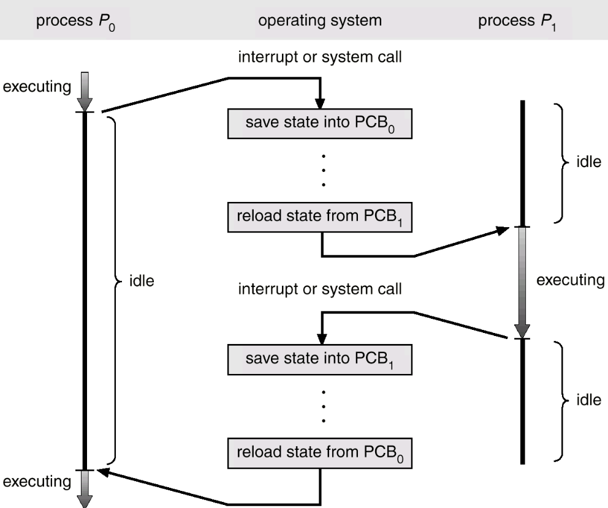
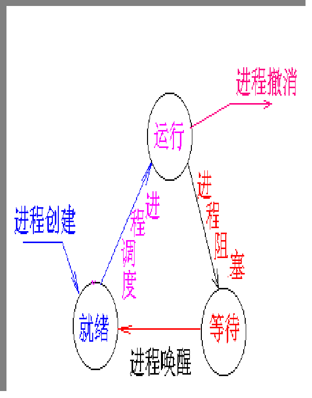
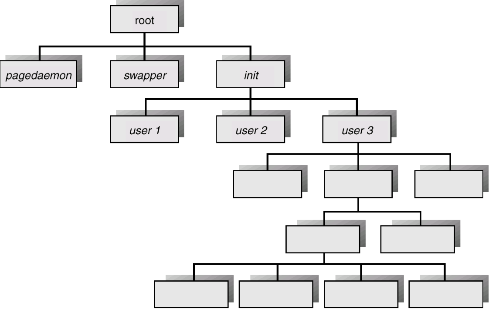

[toc]

# 04 进程（Process）

## 4.1 进程概念（Process Concept）

顺序环境计算机系统中只有一个程序在运行，该程序独占系统中的所有资源，其执行不受外界影响。

顺序执行的特征

- **顺序性**：按照程序结构所指定的次序（可能有分支或循环）；
- **封闭性**：独占全部资源，计算机的状态只由于该程序的控制逻辑所决定
- **可再现性**：**初始条件相同则结果相同**。如：可通过空指令控制时间关系。

并发环境: 一定时间内，物理机器上有两个或两个以上的程序同处于开始运行但尚未结束的状态，并且次序不是事先确定的。

**并发执行的特征**

- **间断(异步)性**："走走停停"，一个程序可能走到中途停下来，失去原有的时序关系；
- **失去封闭性**：共享资源，受其他程序的控制逻辑的影响。如：一个程序写到存储器中的数据可能被另一个程序修改，失去原有的不变特征；
- **失去可再现性**：失去封闭性 －>失去可再现性；外界环境在程序的两次执行期间发生变化，失去原有的可重复特征。

### 4.1.1 What is Process?

为了描述程序在并发执行时对系统资源的共享，我们需要一个**描述程序执行时动态特征**的概念，这就是进程。

进程是**执行中的程序**。

一个进程包括：

- Program Code
- PC 程序计数器
- stack 栈
- data 数据

#### 进程与程序

- 进程是动态的，程序是静态的；
- 进程是短暂的，程序是永久的；
- 进程与程序的组成不同：进程的组成包括程序、数据和进程控制块（PCB）；
- **进程与程序的对应关系**：通过多次执行，一个程序可对应多个进程；通过调用关系，一个进程可包括多个程序。

### 4.1.2 进程的特征

- **结构特征**：进程实体=程序段+相关数据段+PCB；
- **动态性**：进程的实质是进程实体的一次执行过程，因此动态性是进程的最基本特征；
- **并发性**：多个进程实体同存在于内存中，且能在同一段时间内同时运行，是最重要的特征；
- **独立性**：指进程实体是一个能独立运行、独立分配资源和独立接受调度的基本单位；
- **异步性**：进程按各自独立的、不可预知的速度向前推进。

### 4.1.3 进程的类型

在操作系统中同时有多个进程存在，可归纳为两大类：

1. **系统进程**
   - 系统进程起着**资源管理和控制**的作用；
   - 或者是执行操作系统核心代码的进程；
2. 用户进程
   - 执行用户程序的进程

#### 系统进程与用户进程的区别

- **资源的使用**
  - 系统进程被分配一个初始的资源集合，这些资源可以为它独占，也能以最高优先权的资格使用；
  - 用户进程通过系统服务请求的手段竞争使用系统资源；
- **I/O操作**
  - 系统进程可以做显示的、直接的I/O操作；
  - 用户进程不能直接做I/O操作；
- **CPU工作状态**：
  - 系统进程在管态下活动；
  - 用户进程在用户态下活动。

### 4.1.4 进程状态（Process State）

- **新建**（New）：在创建进程；
- **就绪**（Ready）：进程等待分配处理器；
- **运行**（Running）：指令在执行；
- **等待**（Waiting）：进程等待某些事件发生；
- **终止**（Terminated）：进程执行完毕。
  - 表格和其他信息暂时有辅助程序保留；
  - 当数据不再需要后，进程（和它的表格）被删除。




### 4.1.5 进程控制块（Process Control Block, PCB）

PCB是一个专门的数据结构，系统用它来记录进程的外部特征，描述进程的运动变化过程；

PCB是进程管理和控制的最重要的数据结构，在创建进程时，建立PCB，并伴随进程运行的全过程，知道进程撤销；

PCB是系统感知进程存在的唯一标志，进程与PCB是一一对应的；

PCB经常被系统访问，所以PCB应**常驻内存**。



- 进程标识符name

  每一个进程都必须有一个唯一的标识符，可以是字符串也可以是一个数字；

  UNIX系统中就是一个整数，在进程创建时由系统赋予。

- 进程当前状态status

  说明进程当前所处的状态

  为了方便管理，系统将相同状态的进程组成一个队列（如就绪队列）。

- 当前队列指针next

  登记与本进程处于同一队列的下一个进程的PCB的地址

- 进程优先级prority
  进程的优先级反映系统进程的紧迫程度，通常由用户指定和系统设置；
  UNIX系统采用用户设置和系统计算相结合的方式确定进程的优先级。
  
- CPU现场保护区 cpu status
  当进程因某种原因不能继续占用CPU时（如:等待打印机），释放CPU，这时就要将CPU的各种状态信息保护起来，为将来再次得到处理机恢复CPU的各种状态，继续运行。
  
- 通信信息 communication information
  是指某个进程在运行的过程中要与其它进程进行通信，该区记录有关进程通信方面的信息。
  
- 家族联系 process family
  进程可创建自已的子进程，子进程还可以创建，一个进程往往处在一个家族之中，就需要记录进程在家族中位置的信息。

- 占有资源清单 own-resource
  进程占用系统资源的情况，不同系统的处理差别很大，UNIX系统中就没有此项。

#### PCB的组织方式

**PCB表**：系统把PCB组织在一起，并放在内存的固定区域，就构成了PCB表；

PCB表的个数决定了系统中最多可同时存在的进程个数，称为系统的并发度。

PCB表的组织方式：

- 链接方式

  

- 索引方式

  

---

## 4.2 进程调度（Process Scheduling）

### 4.2.1 进程调度队列（Process Scheduling Queues）

**作业队列**（Job Queue）：系统中所有进程的集合；

**就绪队列**（Ready Queue）：在主内存中，就绪并等待执行的所有进程的集合；

**设备队列**（Device Queue）：等待某一I/O设备的进程队列。

### 4.2.2 调度（Schedulers）

#### (1) 长程调度（Long-term Scheduling, or Job Scheduling)

选择可以进入就绪队列的进程；

长程调度切换频率不高；

长程调度控制了多道程序的“道”

Long-term Scheduling controls the process mix of I/O-bound process and CPU-bound process.

#### (2) 短程调度（Short-term Schduling, or CPU Schduling）

选择可被下一个执行并分配的CPU进程；

短程调度切换频率高

#### (3) 中程调度（Medium-term Schduling）

为了缓和内存紧张的情况，将内存中处于阻塞状态的进程切换至外存上（挂起），降低多道程度的度。当这些程序重新具备运行条件时，再从外存上调入内存。

进程可以用以下方式描述：

- I/O型进程，花费I/O时间多于计算，许多短CPU处理；
- CPU型进程，花费更多时间于计算，许多长CPU处理；

### 4.2.3 上下文切换（Context Switch）

当CPU切换至另一个进程时，系统必须保存旧进程状态并为新进程调入所保留的状态；

上下文切换的时间开销较重，在切换时，系统没有做有用的工作。



---

## 4.3 进程上的操作（Operation on Process）

进程是有生命周期的：产生、运行、暂停、终止。对进程的这些操作叫做进程控制。

进程控制的职责是对系统中进程实施有效的管理，它是CPU管理的一部分（还有进程同步、通信和调度）。

当系统允许多进程并发执行时，为了实现共享、协调并发进程的关系，处理机管理必须对进程实行有效的管理。



### 4.3.1 进程创建（Process Creation）

进程何时创建?

- **作业调度**：批处理系统中，作业调度程序调度到某个作业以后，就把这个作业装入内存，并分配必要的资源,创建进程，插入就绪队列。
- **用户登录**：在分时系统中，用户在终端键入登录命令后，若是合法用户，系统建立一个进程，并插入就绪队列。

父进程创建子进程，构成一个进程树。



#### 资源共享（Resource Sharing）

- 父子进程共享所有资源；
- 子进程共享父进程资源的子集；
- 父子进程无资源共享。

#### 执行（Execution）

- 父子进程并发执行；
- 父进程等待，直到子进程终止。

#### 地址空间（Address Space）

- 子进程复制父进程；
- 子进程有一个程序被调入

#### 进程创建过程

1. **申请空白PCB**：为新进程分配唯一的数字标识符，并从PCB集合中索取一个空白的PCB；
2. **为新建立的进程分配资源**：为新进程的程序和数据以及用户栈分配必要的内存空间；
3. **初始化程序控制块**
   - 初始化标识符信息：将系统中分配的标识符、父进程标识符填入新PCB中；
   - 初始化处理机状态信息：是程序计数器指向程序的入口地址，栈指针指向栈顶；
   - 初始化处理机控制信息。将进程的状态设置为就绪状态或静止就绪状态；
4. **将新进程插入就绪队列**


```flow
S=>start: 入口
P1=>operation: 查PCB链表
C=>condition: 有空PCB?
FAIL=>end: 创建失败
P2=>operation: 取空PCB(i)
P3=>operation: 将有关参数填入PCB(i)相应表项
P4=>operation: PCB(i)入就绪队列
P5=>operation: PCB(i)入流程家族或进程链
END=>end: 返回
S(right)->P1->C
C(no)->FAIL
C(yes)->P2->P3->P4->P5(right)->END
```


### 4.3.2 进程终止（Process Termination）

进程执行最后一项并询问操作系统做出决定（退出）

父进程可终止子进程。

父进程通过系统调用wait等待子进程的终止，当父进程终止后，其子进程会以`init`为其父进程。

### 4.3.3 进程阻塞（Process Blocking）

- 引起进程阻塞和唤醒的事件：
    一个处在运行状态的进程，因等**待某个事件的发生**（如等待打印机、同步事件等）而不能继续运行时，将调用阻塞原语，把进程置为阻塞状态，并转进程调度程序（等于让出处理机）。
- 调用进程阻塞操作是**在进程处于运行状态下**执行的。它的执行将引起等待某事件的队列的改变.

```flow
S=>start: 入口
P1=>operation: 保存当前进程的CPU现场
P2=>operation: 置该进程的状态
P3=>operation: 被阻塞进程进入等待队列
E=>end: 转进程调度

S(right)->P1->P2->P3(right)->E

```

### 4.3.4 进程唤醒

当进程所等待的事件发生时，该进程将被唤醒（有进程唤醒操作完成）；

唤醒一个进程有两种方法：

1. 由系统进程唤醒
2. 由事件发生进程唤醒

```flow
S=>start: 入口
P1=>operation: 从等待队列中摘下被唤醒的进程
P2=>operation: 将被唤醒进程设置为就绪状态
P3=>operation: 将被唤醒进程送入就绪队列
END=>end: 转进程调度或返回

S(right)->P1->P2->P3(right)->END
```


---

## 4.4 协同进程（Cooperating Processes）

独立进程不会影响另一个进程的执行或被另一个进程执行影响

协同进程可能影响另一个进程的执行或被另一个进程执行影响

协同进程的优点：

- 信息共享（Information Sharing）；
- 加速运算（Computation Speed-up）；
- 模块化（Modularity）；
- 方便（Convenience）。

---

## 4.5 进程间通信（Interprocess Communication, IPC）

协同进程之间需要**进程间通信**（IPC）来交换数据（data）和信息（information）。

IPC的两种模型

- 共享存储
- 消息传递

### 4.5.1 共享存储

- 使用共享存储模型的进程间通信要建立共享存储区；
- 进程通过读写共享存储区来交换信息；
- 由通信进程来确定交换的数据和位置，不受操作系统的控制。

### 4.5.2 消息传递

- 用于进程通信的机制，同步其间的活动；
- 消息系统——进程间通信无须再利用共享变量；
- IPC提供两个操作：
  - send：发送消息
  - receive：接受消息

#### 直接通信

- 进程必须显示命名
- 通信连接的特性
  - 连接自动建立；
  - 连接精确的与一对在通信的进程相关；
  - 在没一对之间就存在一个连接；
  - 连接可以无向，但通常是双向的。

缺点：the limited modularity. 灵活性差

#### 间接通信

消息导向至信箱并从信箱接收（被视作端口）

- 每一个信箱有一个唯一的id
- 仅当共享一个信箱时进程才能通信

通信连接的特性：

- 仅当进程共有一个信箱时连接才能建立；
- 连接可同对个进程相关；
- 每一对进程可共享多个通信连接；
- 连接可是无向或双向的。

操作

```flow
S=>start: Create a New Mailbox
P1=>operation: Send & Recive Messages through Mailbox
End=>end: Destroy the Mailbox

S->P1->End
```


邮箱共享

- 允许一个连接最多同两个进程相关；
- 只允许一个时刻只有一个进程执行接受操作；
- 允许系统任意选择接受者，发送者被通知谁是接收者。

#### 同步问题

##### 阻塞

considered as 同步的

阻塞发送：发送者发送后一直等待被接收；

阻塞接收：接收者一直被阻塞，直到接收到消息才被唤醒。

##### 非阻塞

considered as 异步的

发送者非阻塞：发完消息后继续执行；

接收者非阻塞：一直不停的收消息，即使受到空（null）消息。

#### 缓冲 Buffering

- 零容量：发送者必须等待接收者；
- 有界容量：n个消息有限长度，连接满了发送者必须等待。
- 无界容量：发送者从不等待

### 4.5.3 生产者-消费者问题

生产者进程生产供消费者进程消费的信息

- 无界缓冲没有对缓冲区大小的限制；
- 有界缓冲对缓冲区大小做了限定。

