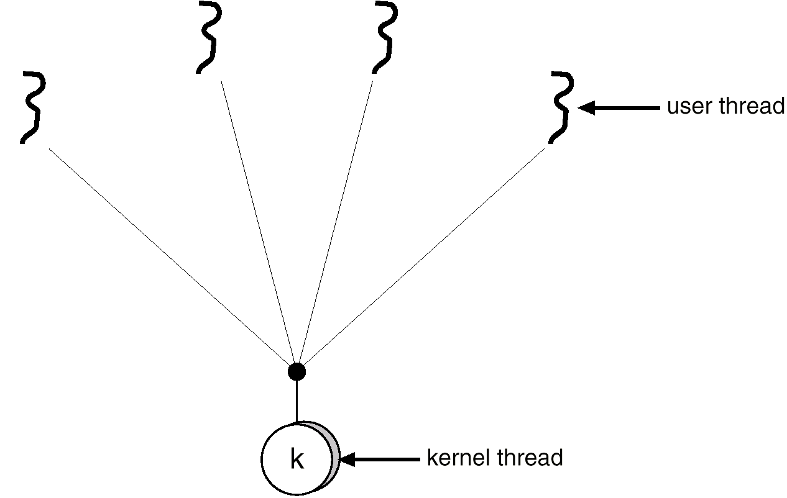
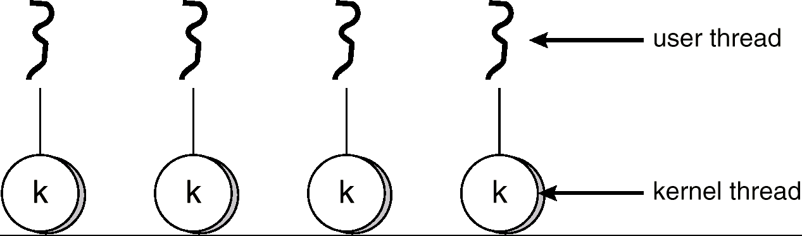
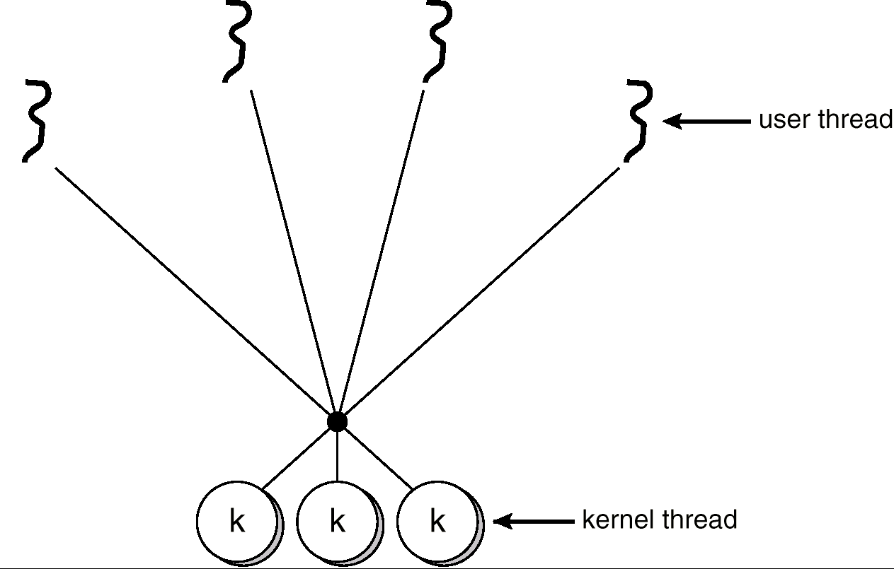

[toc]

# 5 线程

## 5.1 综述

### 5.1.1 为什么要引入线程？

引入进程是为了实现程序的**并发**。进程是**拥有资源的独立单位**，是**可独立调度和分派的基本单位**，这两者使进程成为并发执行的基本单位。

由于进程是一个资源的拥有者，因而在进程创建、撤销、调度切换时，系统需要付出较大的时空开销。
进程的数目不宜过多，进程切换频率不宜过高，**限制了并发程度**。

为了提高并发度的同时减小系统开销，将进程的两个基本属性分开：对于拥有资源的基本单位不对其进行频繁切换，对于调度的基本单位，不作为拥有资源的单位。

**引入线程的目的**: 简化线程间的通信，以小的开销提高进程内的并发程度。

线程：作为 CPU 调度的单位，而进程只作为其他资源分配单位

- 只拥有必不可少的资源：线程状态、程序计数器、寄存器上下文和栈等；
- 具有**就绪**、**阻塞**和**执行**三种基本状态；
- 可并发
- 同时拥有进程的所有资源

**线程的优点**：减小并发执行的时间和空间开销（线程的创建、退出和调度），因此容许在系统中建立更多的线程来提高并发程度。

- 线程的创建时间比进程短；
- 线程的终止时间比进程短；
- 同进程内的线程切换时间比进程短；
- 由于同进程内线程间共享内存和文件资源，可直接进行不通过内核的通信；

线程是 CPU 运用的一个基本单元，包括

- PC
- 寄存器集
- 栈

一个线程与它的对等线程共享：

- 代码段；
- 数据段；
- 操作系统资源。

### 5.1.2 进程和线程比较

- **并发性**：在引入线程的 OS 中，不仅线程之间可以并发执行，而且在一个线程中的多个线程之间亦可并发执行，因而使 OS 具有更好的并发性，从而能更有效地使用系统资源和提高系统吞吐量，进一步提高了并发程度；
- **拥有资源**：进程是拥有资源的独立单位；
- **系统开销**：在创建或撤消进程时，系统都要为之分配或回收资源，如内存空间、I/O 设备等。因此，OS 所付出的开销将明显地大于在创建或撤消线程时的开销；
- **地址空间和其他资源**：进程间相互独立，同一进程的各线程间共享，某进程内的线程在其他进程不可见；
- **通信**：进程间通信 IPC，线程间可以直接读写进程数据段（如全局变量）来进行通信－－需要进程同步和互斥手段的辅助，以保证数据的一致性；
- **调度**：线程上下文切换比进程上下文切换要快得多。

## 5.2 益处

**响应度高**：一个多线程应用在执行中，即使其中的某个线程阻塞，其他线程还可继续执行，从而提高响应度；

线程提供了一种机制，在系统阻塞时还能并发。

**资源共享**：同一进程的多个线程共享该进程的内存等资源；

**经济性**：创建和切换线程的开销要低于进程；

**MP 体系结构的运用**：多线程更适用于多处理机结构。

## 5.3 用户和内核线程

### 5.3.1 内核线程（Kernel-Level Threads）

由内核支持，在内核空间执行线程创建、调度和管理；

**内核级线程才是真正的 CPU 调度的基本单位，用户级的不是**。

- 内核维护进程和线程的上下文信息；
- 线程切换由内核完成；
- 一个线程发起系统调用而阻塞，不会影响其他线程的运行；
- 时间片分配给线程，所以多线程的进程获得更多的 CPU 时间。

### 5.3.2 用户级线程（User-Level Threads）

由用户级线程库进行管理的线程；

由线程库提供对线程创建/调度和管理的支持，无需内核支持。

例如：POSIX Pthreads；Mach C-threads；Solaris threads。

用户线程不依赖 OS 核心，应用进程利用线程库提供创建、同步、调度和管理线程的函数来控制用户线程。调度由应用软件内部进行，通常采用非抢占式和更简单的规则，也无需用户态/核心态切换，所以速度特别块。

- 用户线程的维护由应用进程完成；
- 内核不了解用户线程的存在；
- 用户线程切换不需要内核特权；
- 用户线程调度算法可针对应用优化；

缺点：

- 如果内核是单线程的，那么一个用户线程发起系统调用而阻塞，则整个进程阻塞；
- 事件片分配给进程，多线程则每个线程就慢。

**进程仍然作为 CPU 调度的基本单位**.

### 5.3.3 内核级线程与用户级线程比较

- **调度方式**：内核线程的调度和切换与进程的调度和切换十分相似，用户线程的调度不需要 OS 的支持；
- **调度单位**：用户线程的调度以线程为单位进行，在采用时间片轮转调度算法时，每个进程分配相同的时间片。对内核级线程，每个线程分配时间片。

---

## 5.4 多线程模型

### 5.4.1 多对一 Many to One

多个用户级线程映射到同一个内核级线程；

用于不支持内核线程的系统种；

优点：线程管理是由用户空间的线程库来完成的，因此效率更高；

缺点：任一时刻只能有一个线程可以访问内核，并发度低；

一个用户线程发起系统调用而阻塞则整个系统阻塞。

### 5.4.2 一对一 One to One

每个用户级线程映射到一个内核级线程。

优点：提供了更好的并发性，一个用户线程发起系统调用时允许另一个线程运行；

缺点：**开销大**，每创建一个用户线程需要创建一个相应的内核线程，带来了额外的开销，所以许多系统众限制应用中的线程数目。

### 5.4.3 多对多 Many to Many

不限制应用线程数、多个线程可以并发。

多个用户级线程绑定到多个内核级线程；

### 5.4.4 Two-Level Model

混合 1:1 与 M:M.

### 5.4.5 Threading Issues

`fork`：

线程的取消：

- 异步取消：一个线程立即终止目标线程；
  
  不会回收所有资源；

- 延迟取消：目标线程检查它是否应该终止。当执行到**取消点**时，安全结束线程。

#### Signal Delivery

当特定事件发生时，一般会给进程发送信号来通知

信号可以被**同步**或**异步**的接收

**同步信号**会发送到产生信号的同一个进程。比如，非法内存访问，或者除零错。

当信号是由运行进程之外的事件所产生 ，那么进程就**异步地**接收信号。比如，定时器中断或者 ctrl+C。

单线程进程中，信号总是发送给进程

在多线程进程中，同步信号需要发送到产生信号的线程，而不是进程中的其他线程

异步信号被发送给:

- 信号应用的线程
- 进程中的所有线程
- 进程的某些线程
- 一个特定线程用来接收所有信号

## 5.5 线程池

为什么要有线程池？

- 避免创建和撤销开销；
- 限制线程的数量。

线程池的主要思想：

希望线程能够被多次复用。线程结束后并没有撤销，而是回到线程池中等待复用。等到进程结束，线程被撤销。

## 5.6 线程特定数据

线程特定数据 is an independent copy of certain data owned by one thread example in a transaction processing system, service each transaction in a separate thread transaction ID to each thread supported in most thread libraries including Win32, Pthreads, Java
