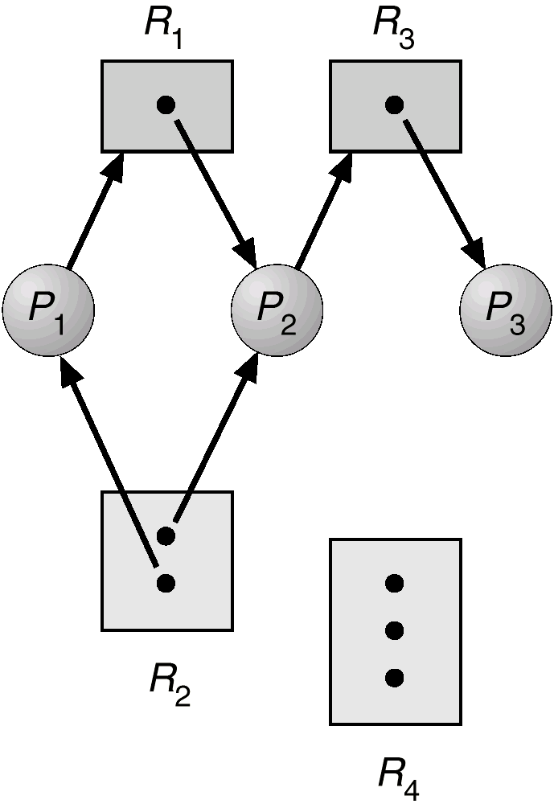

8 死锁

田志强 zhiqiangtian@xjtu.edu.cn

# 1. 系统模型-死锁问题

> 计算机系统中多道程序并发执行时, 两个或两个以上的进程由于竞争资源而造成的一种互相等待的现象, 如无外力作用, 这些进程将永远不能再向前推进.

共享资源的获取和释放

每一个进程如下使用资源: 

1. 申请(Request): 如果申请不能立即被允许, 那么进程必须等待知道能获取在资源
2. 使用(Use): 进程使用资源进行相关操作
3. 释放(Release): 进程释放资源

资源分类, 根据资源性质: 

- 可抢占资源

  >指资源占有进程虽然需要使用该资源, 但另一个进程却可强行把资源从占有者进程处抢来.

- 不可抢占资源.

  > 指只有占用者进程不再需要使用该资源而主动释放资源外, 其它进程不得在占有者进程使用资源过程中强行抢占

根据使用方式: 共享、独占

根据使用期限: 永久、临时

## 死锁的原因

- 竞争资源

- 进程推进顺序不当

# 2. 死锁特征

## 2.1 四个条件

当以下四个条件同时出现时, 死锁将会发生

- 互斥: 一次只有一个进程可以使用一个资源
- 占有并等待: 一个至少持有一个资源的进程等待获得额外的由其他进程所持有的资源（请求与保持）
- 不可抢占: 一个资源只有当持有它的进程完成任务后才能自由释放（非剥夺）;
- 循环等待: 等待资源的进程之间存在环.

## 2.2 资源分配图

进程指向资源: 请求边

资源指向进程: 分配i边

方形中的点代表有几个资源的实例（如打印机有四台等）

**如果资源分配图中没有环, 则不会形成死锁**.

如果图中有环: 

- 如果每一种资源类型只有一个实例, 那么死锁发生

- 如果每种资源有多个实例, 可能死锁.

图中, 资源内的点数代表有几个资源的实例, 如$R_4$有4个实例, $R_2$有两个实例等

# 3. 处理死锁的方法

忽略、预防、避免、检测、接触

## 3.1 忽略

假装系统中从未发生死锁

处理死锁的代价很大, 而且常常给用户带来许多不便的限制.

## 3.2 死锁预防

确保系统永远不会进入死锁状态

抑制死锁发生的必要条件

**占有并等待**

- 要求进程在执行前一次申请全部的资源;
- 没有资源时, 可以申请资源, 在申请更多其他资源之前需要释放已有资源
- 效率低, 可能出现饥饿

**非抢占 No Preemption**

- 如果一个进程的申请没有实现, 它要释放所有占有的资源;

- 抢占的资源放入进程等待资源列表中

- 只有进程能够重新得到就得资源和新申请的资源时, 才可以重新开始

  例如: 

  > 当进程A提出资源申请时, 首先检查这些资源是否可用
  > 是, 则分配之, 否则检查这些资源是否已分配给了另外的进程(而这个进程又在等待其他的资源)
  > 如果存在这样的进程B, 从进程B剥夺进程A所需的资源分配给进程A使用.相反, 则进程A等待, 当进程A在等待的过程中, 它所持有资源可能会被剥夺分配给其他的进程.这样, 进程A只有得到了它正在申请有资源以及等待过程中被剥夺的资源后, 才能恢复运行.

**循环等待**

将所有的资源类型放入资源列表中, 并且要求进程按照资源表申请资源

- 所有进程对资源的请求必须严格按照资源序号递增的次序提出

- 总有一个进程占据了较高序号的资源, 它继续请求的资源必然是空闲的, 可以一直向前推进.

- 在资源分配图中不可能出现环路, 因而摒弃了“环路等待”条件

- 这种策略可以提高资源利用率, 但在进程使用各类资源的顺序与系统规定的顺序不同时会造成资源浪费的情况.

  

上述预防死锁的方法通过限制资源请求来打破死锁的四个必要条件之一, 从而预防死锁的发生.

其可能的副作用: 

- 降低设备利用率和吞吐量
- 可能有进程饥饿

## 3.3 死锁避免

允许进程**动态地申请资源**, 系统在进行资源分配之前, 先计算资源分配的安全性.
若此次分配不会导致系统从安全状态向不安全状态转换, 便可将资源分配给进程, 否则不分配资源, 进程必须阻塞等待.

> 安全状态: 在此状态下, 系统能按照某种顺序来为各个进程分配其所需的资源, 直至最大需求, 使每个进程都可顺序地一个个完成.这个序列称为**安全序列**.

若某一时刻不存在一个安全序列, 则称系统处于**不安全状态**.

- 当进程申请一个有效的资源的时候, 系统必须确定分配后是安全的;
- 如果存在一个安全序列系统处于安全态;
- 如果每一个进程$P_i$所申请的资源小于当前可用资源数加上其他进程$P_j$所持有的该资源数

**基本事实**

- 如果一个系统在安全状态, 就没有死锁;
- 如果系统死锁, 则处于不安全状态;
- 如果一个系统处于不安全状态, 就有可能死锁;
- 避免: 确保系统永远不会进入不安全状态

### 3.3.1 资源分配图算法 Resource-Allocation Graph

**资源有单个实例时**

需求边 $P_i\rightarrow R_i$ 代表进程可能会申请资源 $R_i$ (表示为虚线)

一个进程申请资源的时候, 需求边转化为申请边

当资源被进程释放的时候, 分配边转化为需求边.

系统中的资源必须被事先声明.

当一个进程 $P_i$ 申请资源 $R_j$ 时, 由循环检测算法来检查:
- 如果把途中的申请边 $P_i\rightarrow R_j$转为分配边 $R_j\rightarrow P_i$, 图中是否会出现环路, 只有不出现环路时, 才实施资源分配;
- 

### 3.3.2 银行家算法 Banker's Algorithm

**资源有多个实例时**

针对多个实例, 每一个进程必须实现声明使用的最大量

当一个进程请求资源, 它可能要等待, 当一个进程得到所有的资源, 它必须在有限的时间内释放它们.

**银行家算法的数据结构**

$n$是系统进程的可用实例数量, $m$是资源类型的种类.

- `Available`: 一个长度为m的向量, 表示每种资源的**可用**实例数量;如果`Available[j]=k`, 则资源类型$R_j$有$k$个实例;
- $Max$: 一个$n\times m$的矩阵, 定义每个进程的最大需求.如果$Max[i][j]=k$, 则进程$P_i$最多可申请资源类型$R_j$的$k$个实例;
- $Allocation$: $n\times m$矩阵, 定义每个进程现在分配的每种资源类型的实例数量.如果$Allocation[i][j]=k$, 那么进程$P_i$已经分配了资源类型$R_j$的$k$个实例;
- $Need[i][j]$: 一个$n\times m$矩阵, 表示每个进程还需要的剩余资源.
  - $Need[i][j]=Max[i][j]-Allocation[i][j]$

**这一部分详细算法见课本222页**.

## 3.4 死锁检测

### 3.4.1 一个资源有单个实例
维护等待图, 定期检查是否有环.

等待图: 节点是进程. $P_i\rightarrow P_j$ 代表$P_i$ 在等待$P_j$.

### 3.4.2 一个资源有多个实例

可用: 一个长度m的向量代表每种资源类型的有效数目;

分配: 一个 $n\times m$ 的矩阵定义了当前分配的每一种资源类型的实例数目;

请求: 一个 $n\times m$ 的矩阵声明了当前的进程请求. 如果$Request[j][j] = k$, 那么进程 $P_i$ 请求 k 个资源 $R_j$ 的实例.

**检测算法**: **见课本P225$.

## 4.5 死锁恢复和解除

### (1) 操作员人工处理

### (2) 进程终止

极端的方式: 终止所有的死锁进程

一次终止一个进程直到死锁消失

选择终止的顺序

- 进程的优先级
- 进程的已经执行了多少时间, 还需要多少时间
- 进程使用的资源
- 进程还需要多少资源
- 多少个进程需要被终止

### (3) 资源抢占

逐步从进程中抢占资源, 直到打破死锁.

选择一个牺牲品: 最小化代价;

回退: 返回到安全的状态, 然后重新开始进程;

饥饿: 同一个进程可能总是被选中, 包括在回退时.
