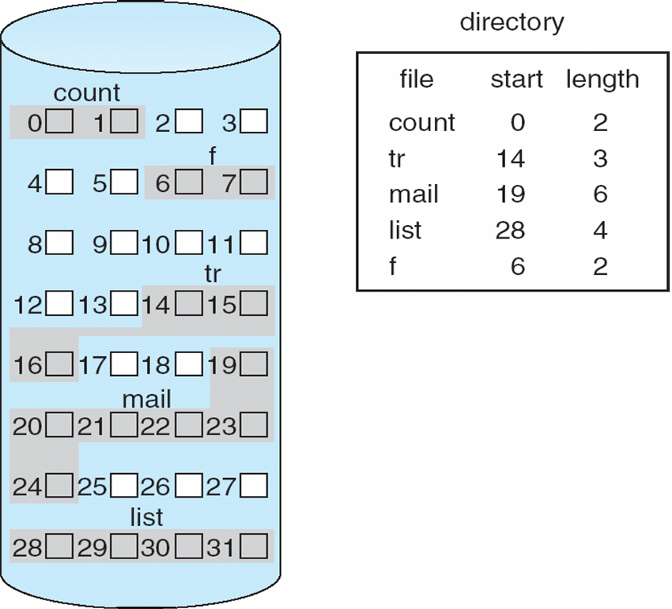
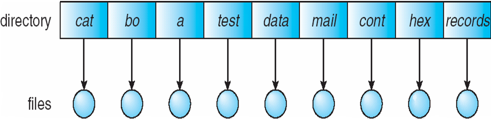
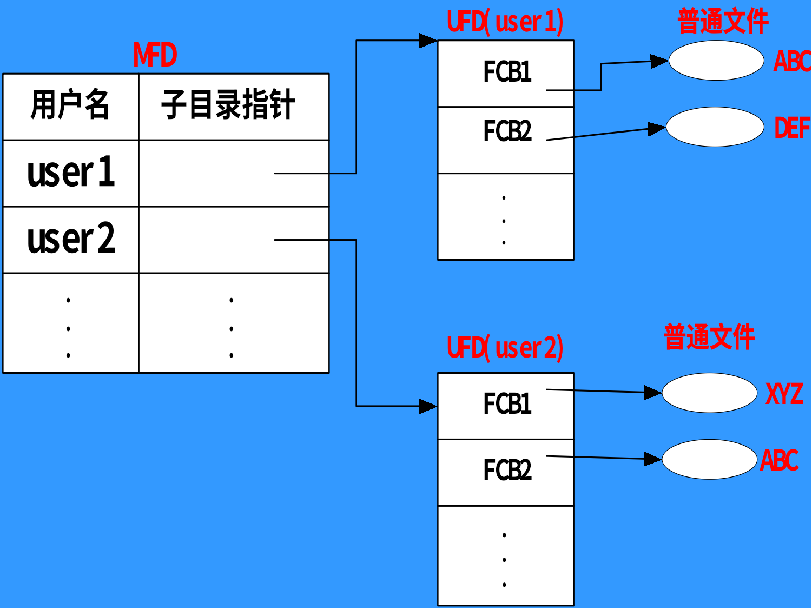
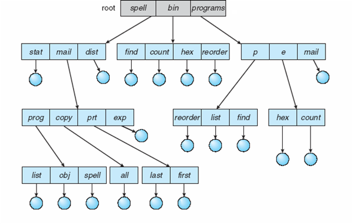

     文件系统 

# 1. 文件概念(File Conception)

## 1.1 文件管理的目的

信息是计算机系统中的重要资源；

操作系统中的一个重要组成部分——文件系统。其负责**信息的组织**、**存储和访问**;

文件系统的功能就是**提供高效、快速和方便的信息存储和访问功能**。

## 1.2 什么是文件系统？

文件系统是操作系统中以文件方式管理计算机软件资源的软件和被管理的文件和数据结构（如目录和索引表等）的集合。

从系统角度来看，文件系统是对文件存储器的存储空间进行组织、分配和回收，负责文件的存储、检索、共享和保护。

从用户角度来看，文件系统主要是实现 “**按名取存**” ，文件系统的用户只要知道所需文件的文件名，就可存取文件中的信息，而无需知道这些文件究竟存放在什么地方。

## 1.3 文件系统的功能

+ 提供对文件的各种访问，实现按名存取；

+ 提供合适的访问非方式；

+ 能够提供目录管理；

+ 实现文件的共享与保护；

+ 统一管理文件的存储空间，实现存储空间的分配和回收；

## 1.4 文件的概念

  文件是记录在外存上的**具有名字的**相关信息的集合。
  连续的逻辑地址空间。

### 1.4.1 文件类型

按用途分类：

- **系统文件** ：由系统软件构成的文件，大多数系统文件只允许用户调用，而不允许用户去读或修改它。

- **库文件** ： 指由系统提供给用户使用的各种标准子程序库。这类文件允许用户调用，但不允许用户修改。

- **用户文件** ： 用户委托文件系统保存的文件。如源程序，目标程序，原始数据等。  

按信息保存期限分类

- 临时文件；
- 永久文件；
- 档案文件。

按文件的保护方式分类

- 只读文件；
- 读写文件；
- 只执行文件。

按文件的逻辑结构分类

- 流式文件；
- 记录式文件。

按文件的物理结构分类

- 顺序（连续）文件；
- 链接文件；
- 索引文件

按信息流向分类:

- 输入文件
- 输出文件
- 输入/输出 文件(存储设备)

按文件中的数据分类:

- 源文件
- 目标文件
- 可执行文件

按文件的性质分类:

- 普通文件
- 目录文件 
- 特殊文件

### 1.4.2 文件属性

**文件名**(Name)：唯一的以人们可以理解的方式保存的信息；
**类型**(Type)：需要可以支持多种类型的系统；
**位置**(Location)：指向文件在设备上的存储位置的指针；
**大小**(Size)：当前文件的大小；
**保护**(Protection)：控制对文件的读取，改写和执行的权限；
**时间，日期和用户身份**(Time, Date and User Identification)w：保护和安全需要的数据；

**文件属性的存储：单独放在目录中。**

### 1.4.3 文件系统结构

文件结构 File Structure

- 逻辑存储单元(Logical Storage Unit)
- 相关信息的集合

文件系统存在与辅助存储器中——磁盘

**文件控制块**(File Control Block, FCB)：由一个文件的相关信息组成的存储结构。

### 1.4.4 文件结构与存储设备

用户和文件系统往往从不同的角度对待同一个文件：

- **用户**：从使用的角度，按信息的使用和处理方式组织文件；
- **文件系统**：从文件的存储和检索的角度，根据用户对文件的存取方式和存储介质的特性组织文件，决定用户文件存放在存储介质上的方式。

文件有两种形式的结构：文件的逻辑结构和文件的物理结构。

- **逻辑结构**：用户对文件的组织结构；

- **物理结构**：文件在外存储器上的存储结构
  
  物理结构直接影响存储空间的使用和检索文件信息的速度。

逻辑文件保存到存储介质上的工作由文件系统来做，这样可以减轻用户的负担。根据用户对文件的存取方式和存储介质的特性，文件在存储介质上可以有多种组织形式。

# 2. 存取方法(Access Methods)

## 2.1 顺序存取 Sequential Access

按照文件信息的逻辑顺序依次存取。

- 在记录文件中：按记录的排列顺序存取；
- 在流式文件中：反映为当前读写指针的变化，在存取完一段信息后，读写指针自动加上这段信息的长度，以便指出下次存取时的位置。

Works as well on sequential-access devices as it does on random-access ones

对于不定长记录，只能顺序访问。

## 2.2 直接/随机存取

直接定位指定记录。
随机存取是根据记录的编号来直接存取文件中的任意一个记录，而无需存取其前面的记录。
对于连续文件(固定长度),第i个记录的地址(addr0为首记录地址,L为记录长度):rptr:=addr0+i*L
对于索引文件:先随机查找索引表,再取地址

# 3. 文件结构

文件有两种形式的结构：文件的**逻辑结构**和文件的**物理结构**。

逻辑结构：用户对文件的组织结构；

物理结构：文件在外存储器上的存储结构。

物理结构直接影响存储空间的使用和检索文件信息的速度
逻辑文件保存到存储介质上的工作由文件系统来做，这样可减轻用户的负担。根据用户对文件的存取方式和存储介质的特性，文件在存储介质上可以有多种组织形式。

## 3.1 文件的逻辑结构

文件从逻辑结构上分为两种形式：一种是**无结构的流式文件**，另一种是**有结构的记录式文件**。

流式文件是指对文件内的信息不再划分单位，它是一次的一串字符流构成的文件。

记录式文件是用户把文件内的信息按逻辑上独立的含义划分信息单位，每个单位称为一个逻辑记录（简称记录）。所有记录通常都是描述一个实体集的，有着相同或不同数据的数据项，记录的长度可分为<u>定长</u>和<u>不定长</u>记录两类。

记录文件有**顺序**、**索引**、**索引顺序**文件几种。

### (1) 顺序文件 Sequential File

顺序文件的所有记录按键值的约定次序组织。
记录可以是**定长**的，也可以是**变长**的。
顺序文件常用于批量记录读取，对于访问某个记录的请求则处理性能不佳。
对于定长记录文件，若要查找第$i$个记录，可根据下式得到相对于第一个记录首址的地址：$A_i=i\times d$（$d$为记录的长度）。
对于非定长记录文件，若要查找第$i$个记录，则需要有每个记录的长度：$Ai=\sum d_i$（$d$为记录的长度）。

### (2) 索引文件 Indexed File

建立一张**索引表**，记录下每个记录长度及指向该记录的指针，从而方便了直接存取。

索引文件对主文件中的记录按需要的数据项建立索引表。

索引文件本身是顺序文件组织。

### (3) 索引顺序文件 Indexed Sequential File

索引顺序文件是基于键的约定次序组织的。将顺序文件中的所有记录分为若干个组；再为顺序文件建立一张索引表，表中记录每个组的第一个记录，该索引项包含记录的键值和指向该记录的指针。它是顺序文件和索引文件的结合。
检索时，**先根据关键字去检索索引表，找到该记录所在组的第一个记录的位置，然后再利用顺序查找法去查找主文件，找到所需记录**。

## 3.2 文件的物理结构

**用户按逻辑结构使用文件，文件系统按物理结构管理文件**。因此，当用户请求读写文件时，文件系统必须实现文件的逻辑结构与物理结构之间的转换。

文件在外存上的组织方式称为文件的物理结构。文件的物理结构与存储设备的特性有很大关系。
文件的存储设备通常划分为**大小相等的物理块**，物理块是分配及传输信息的基本单位。一个物理块中可以存放若干个逻辑记录，一个逻辑记录也可以存放在若干个物理块中。
文件的物理结构外存的分配方式：

- 连续分配——顺序结构

- 链接分配——链接结构

- 索引分配——索引结构

#### 3.2.1 文件的存储设备

+ 磁带
  永久大容量数据
  #顺序存储设备#
+ 磁盘
  直接存取设备，三种文件物理结构都可以采用。
  - 若文件是顺序存取的，采用顺序结构和链接结构都可行；
  - 若采用直接存取方式且文件大小不固定，则应采用索引结构

#### 3.2.2 连续分配

最简单的物理文件结构，它将逻辑上连续的文件信息依次存放在外存连续的物理块中
这些信息存储在目录中。

+ 浪费空间，产生外碎片。
+ 文件不能方便地动态增长.

逻辑地址与物理地址的转换：

- Block to be accessed = starting address+Q
- Displacement into block = R

#### 3.2.3 链接分配

按所需分配磁盘块，链接在一起。

优点：简单，只需要起始地址

缺点：

- 不支持随机存取。
- 目录中存储起始的块。指针会占用空间。
- 更多的寻道时间。

**隐式链接**

一个文件的信息存放在若干不连续的物理块中，各块之间通过指针连接，前一个物理块指向下一个物理块。

优点

- 提高了磁盘空间利用率，不存在外部碎片问题；
- 有利于文件插入和删除；
- 有利于文件动态扩充。

缺点

- 存取速度慢，不适于随机存储；
- 可靠性问题：如指针出错；
- 更多的寻道次数和寻道时间；
- 指针占用空间。

可以将多个块组成簇，以簇为单位分文件，指针占用百分比减少，但增加内碎片；

链接结构的一个变形：**显式链接**。
文件分配表FAT（整个磁盘只有一张）
FAT中存储块与块之间的链接关系。

#### 3.2.4 索引分配

打开某个文件时，只需要知道该文件所在的盘块号

**一个文件的信息存放在若干不连续物理块中，系统为每个文件建立一个索引表，并将这些块的块号存放在索引表中**。

一个索引表就是磁盘块地址数组,其中第i个条目指向文件的第i块

可以随机存取且没有外碎片。

优点:

- 保持链接结构的优点，又克服了其缺点:

缺点:

- 较多的寻道次数和寻道时间
- 索引表本身带来了系统开销,如：内外存空间，存取时间

#### 3.2.5 索引表分配

索引表组织：

- 链接模式：大的文件，索引表占用了若干个盘块，一个盘块一个索引表，多个索引表链接起来；

- 多级索引：将一个大文件的所有索引表（二级索引）的地址放在另一个索引表（主索引）。
  
  在两级索引分配方式，若每个盘块大小为1KB，每个盘块号占4字节，则一个索引块中可存放256个盘块号。则两级索引最多可包含的盘块号总数为64K个（$256\times 256$）。因此，所允许的文件的最大长度为64MB（$64K\times 1KB$）

- 混合索引
  UNIX文件系统采用的是多级混合索引结构(综合模式)。每个文件的索引表为13个索引项，每项2个字节。最前面10项直接登记存放文件信息的物理块号（直接寻址）
  如果文件大于10块，则利用第11项指向一个物理块，该块中最多可放256个物理块的块号（一次间接寻址）。对于更大的文件还可利用第12和第13项作为二次和三次间接寻址  

---

# 4. 目录结构

## 4.1 设备目录中的信息

- 名称 Name
- 类型 Type
- 地址 Address
- 当前长度 Current length
- 最大长度 Maximum Length
- 最后访问时间 Date last accessed
- 数据最后更新时间
- 所有者ID
- 保护信息

## 4.2 文件目录 File Directory

### 4.2.1 文件控制块 FCB

- 用于**描述和控制文件的数据结构**，它至少要包括文件名和存放文件的盘物理地址；
- 文件控制块的有序集合称为文件目录，即一个文件控制块FCB就是一个目录项

一个FCB包含：

- **文件基本信息**：文件名，用户名，文件地址，文件长度，文件逻辑结构，物理结构；
- **存取控制信息**：文件存取权限
- **管理信息**：共享计数，文件的建立日期，保存期限，最后修改日期，最后访问日期

### 4.2.2 文件目录

文件目录块的有序集合

- 文件目录适用于检索文件爱你的，它是文件系统实现按名存取的重要手段，它的组织和管理应便于检索和防止冲突。
- **目录项**：构成文件目录的项目（目录项就是FCB）

文件结构的组织关系到：

- 文件的存取速度
- 文件共享性和安全性

## 4.3 目录操作

- 寻找文件
- 建立文件
- 删除文件
- 列出目录的列表
- 重命名文件
- 遍历文件系统

## 4.4 组织目录的逻辑结构

评判标准：

1. **效率**：快速定位一个文件
2. **命名**：方便用户
   - 两个用户可以有相同名字的不同文件；
   - 相同文件可以有不同名字。
3. **分组**：从逻辑上对文件俺属性进行分组，比如所有的Pascal程序、游戏等。

### 4.4.1 单级目录 Single-Level  Directory

问题：命名问题 & 分组问题 

### 4.4.2 二级目录 Two-Level Directory

为解决一级目录文件命名冲突，并提高对目录文件检索速度而改进 
目录分为两级：

- 一级称为**主文件目录**（MFD），给出用户名，用户子目录所在的物理位置；
- 二级称为**用户文件目录**（UFD，又称用户子目录），给出该用户所有文件的FCB

优点：

- 解决了文件的重名问题:用户名|文件名
- 查找时间降低

提高了搜索效率，依旧无法分组

### 4.4.3 树型目录 Tree-Strucured Directories

优点：

- 层次结构清晰，便于管理和保护；
- 有利于文件分类；
- 解决重名问题；
- 提高文件检索速度；

缺点：

- 查找一个文件按路径名逐层检查，由于目录文件都放在外存，多次访盘影响速度

# 5 文件系统结构(File System Structure)

## 5.1 文件结构

分层结构

((看图))

FCB：文件控制块，由一个文件。。。

### 5.2 Why 分层？

用户和文件系统往往从不同的角度对待同一个文件：

+ 用户：
+ 文件系统：

文件有两种形式的结构：文件的逻辑结构和文件的物理结构。

## 5.3 文件的逻辑结构

用户对文件的组织结构
文件从逻辑结构上分成两种形式，一种是 #无结构的流式文件#，另一种是 #有结构的记录式文件#。

### (1) 流式文件

。。。

### (2) 记录式文件

#### 顺序文件

按照约定顺序将记录排列。
记录可以是定长的，也可以是变长的。

#### 索引文件

对主文件中的记录按需要的数据项建立索引标表。

#### 顺序索引文件

。。。
先分组，后分组。

OS必须支持的文件：可执行程序

## 5.4 文件的物理结构

文件在外存储器上的存储结构。
#物理结构直接影响存储空间的使用和检索文件信息的速度#

# 6 分配方法(Allocation Methods)

## 联合策略

# 7 文件目录

## 7.1 磁盘结构

磁盘一般可以分为多个分区，分区可以是“生”的（Raw）或“熟”（Formatted），即格式化的文件系统。
包含文件系统的实体称为卷。
每个卷都保存盖卷中文件的信息，这些信息存储在设备或这别。。。

## 7.2 文件控制块FCB

用于描述和控制文件。。

### FCB中包含

#### 文件名

#### 文件。。

## 文件目录与目录文件

### 文件目录

文件目录是用于检索文件的，它是文件系统实现按名存取的重要手段，它的组织和管理应便于检索和防止冲突。

### 目录文件

为了实现读i温暖见目录的内容能够，。。。

## 组织目录的结构逻辑

+ 效率：快速定位一个文件；
+ 两个目录，。。

### 单极目录

一个对所有用户的简单目录结构。

- 命名问题。。。

### 两极目录

一级：主文件目录；
二级：。。。。

### 树型目录

现在常用

#### 优点

+ 层次结构清晰，便于管理和维护；

+ 有利于文件分类。。。

+ 。。。

+ 。。。
  
  ### 无环图
  
  支持文件共享（不同路径访问同一个文件）
  两种方式：共享计数、符号链接。
  
  ### 普通图
  
  避免产生环：
- 只允许链接到文件而不允许链接到子目录

- 垃圾收集

## 文件目录检索

目录检索：用户给出文件名，。。。

### 目录实现

#### 线性列表

利用给定文件名，在各级目录中顺序查找
简单but耗时间

#### 哈希表

目录项信息存在哈希表中
搜索时根据文件名计算哈希值

## 文件目录改进

为加快目录检索，可以采用目录项分解法，把FCB分解成两部分。

- 符号文件目录
  。。。
- 基本文件目录
  。。。

# 8 文件操作

## 创建（Create）

操作系统需要创建一个FCB、向FCB中填充响应的信息；
分配必要的外存空间；
在文件目录中建立一个目录项，目录项中记录新文件的文件名及其在外存的地址等属性。

## 删除（delete）

。。。

## 读（Read）

把文件数据从外存读入内存的用户区；

+ 查找目录。。。。

+ 从外存将数据读入内存
  
  ## 改写（Write）
  
  。。
  
  ## 打开文件（Open）
  
  为了避免每次访问文件都要从外存中查找文件目录

+ 将待访问文件的目录信息读入内存活动文件表中，建立用户和文件的关系；

+ 在有些系统中，通过读命令隐含地向系统提出打开文件的要求。。。
  
  ## 关闭文件（Close）
  
  。。。
  
  ## 重定位（Seek）
  
  系统为每一个打开文件维护一个读写指针，是相对文件开头的偏移指针。
  。。。
  
  ## 文件共享
  
  ### 打开文件结构：动态共享
  
  系统打开文件表

# 空闲空间管理（Free-Space Management）

## 位图法（Bit Map）

用一串二进制位反应磁盘空间中分配使用情况，每个物理块对应一位，已分配物理块为0，否则为1。
申请物理块时，可以在位图中。。。

### 块号计算（Block Number Calculation）

+ 。。。
+ 。。。
+ 。。。

### 位图需要额外存储空间

如：。。。

### Bit Map的管理

保证磁盘与内存上的bit map一致
因为需要经常访问，因此Bit Map会常驻内存
。。。

## 空闲块法

将所有空闲块。。。

## 空闲块链表法

离散的，不容易找到连续的块。
改进：成组链接法
。。。。

# 9 文件系统实现

## 实现文件系统的数据结构

### 磁盘上的数据结构

引导控制块
分区控制块
目录结构
FCB

### 内存中的数据结构

+ 内存分区标

+ 内存目录结构

+ 系统范围打开文件表

+ 单个进程的打开文件表
  
  ## 保护
  
  文件的两级权限
  ...

### 磁盘高速缓存

+ 专用
  在内存中开辟出一个单独的存储空间作为磁盘高速缓存...
+ 公用
  一共统一的以页为单位的buffer

## 优化数据分布

优化..的使磁头 的移动距离减少.
优化索引结点的分布:

## 文件的一致性

盘号的一致性
每次启动计算机时检查这些结构

## 可靠性

抵抗物理/软件损坏
增加冗余

### 低级容错

防止磁盘表面缺陷造成的数据丢失

### 二级容错

防止磁盘驱动器和磁盘控制器
实现:磁盘镜像/双宫

## 恢复

一致性检查: 比较目录结构中的数据和磁盘块中的数据,修正不一致
