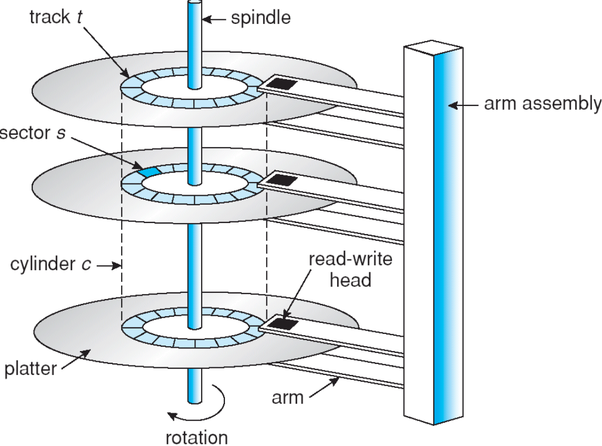
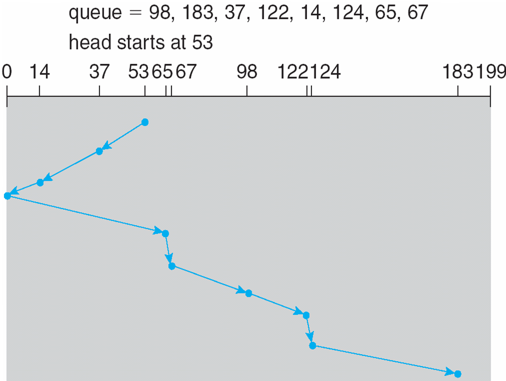
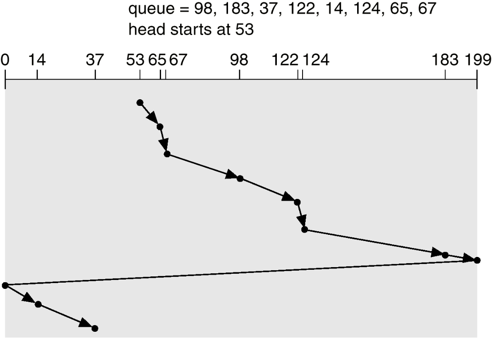
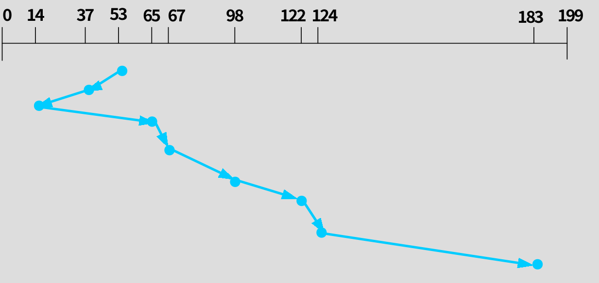
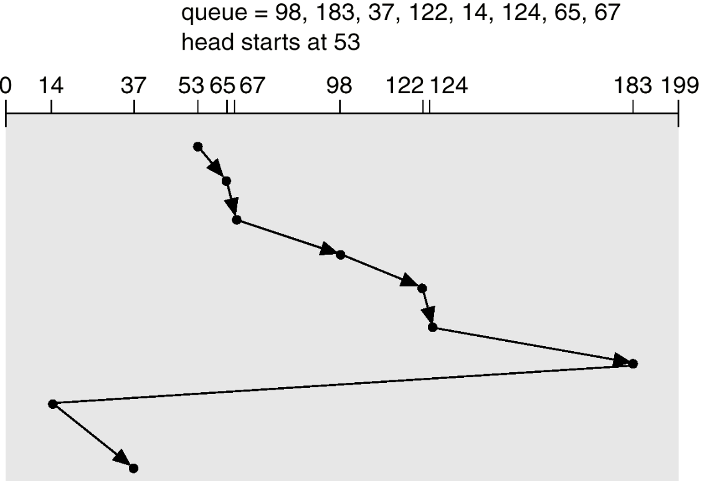

[TOC]

# 13 二级存储 Secondary Storage

## 13.1 磁盘结构 Disk Structure

使用三元组**(柱面号,磁盘号,扇区号)**指定磁盘上的任何一个物理记录。

磁盘设备是以一种逻辑块的一维大数组的形式编址的，这里的逻辑块是传输的最小单位。
逻辑块的一维数组映射到磁盘上一些相连的扇区。

- 0扇区是最外边柱面的第一个磁道的第一个扇区。
- 数据首先都映射到一个磁道，其余的数据映射到同一柱面的其他磁道，然后按照从外向里的顺序映射到其余的柱面。

**磁盘组**：由若干磁盘组成，绕枢轴高速旋转，目前主流磁盘转速7200转/分

**物理记录定位**：

- **柱面号**：各盘面所有的读写头同时移动，并定位在同样的垂直位置的磁道上，这些磁道形成了一个柱面。由外向内是：0，1，2，……，L。
- **磁头号**：磁盘的全部有效盘面从上到下依次编号：0,1,2,……,H。磁头号与盘面号是相对应的。
- **扇区号**：将各盘面分割成若干大小相等的扇区，编号：0,1,2,3,……,n

### 如何提高磁盘 I/O 速度?

- 选择好的磁盘;
- 设置磁盘高速缓冲区；
- 采用好的磁盘调度算法。

### 磁盘访问时间

寻道时间Ts + 旋转延迟时间Tr + 传输时间Tt

#### 寻道时间

把磁头从当前位置移动到指定磁道上所经历的时间，它与磁盘转速、移动的磁道数有关。
该时间是**启动磁盘的时间s**与**磁头移动n条磁道**所花费的时间之和，即
$$
T_s = m\times n + s
$$

式中，**m**是常数，它与磁盘驱动器的速度有关。

- 对—般磁盘，m＝0.2；
- 对高速磁盘，m$\le$0.1，磁臂启动时间约为2ms。

—般, 寻道时间将随寻道距离的增大而增大

#### 旋转延迟时间

**$T_r$是指定扇区移动到磁头下面所经历的时间**
**与磁盘转速有关** 
$$
T_r = \cfrac{1}{2r}
$$

其中$r$为磁盘转速

如果磁盘旋转速度为$5400 \;\mathrm{r／min}$

则$\cfrac{1}{r}=\cfrac{1}{5400\;\mathrm{r/min}}=\cfrac{60\;\mathrm s}{5400\;\mathrm r}=\cfrac{1}{90}\;\mathrm{s}\approx 11.1\;\mathrm {ms}$，即每转需要约$11.1\;\mathrm{ms}$

平均旋转延迟时间$T_r=\cfrac{1}{2}\times \cfrac{1}{r}=0.5\times 11.1\;\mathrm{ms}=5.55 \;\mathrm{ms}$。

#### 数据的传输时间

$T_t$是指把数据从磁盘读出，或向磁盘写入数据所经历的时间。
$$
T_t = \cfrac{b}{rN}
$$

b为所读／写的字节数;
r为磁盘以秒计的旋转速度；
N为一条磁道上的字节数。

---

综上,$T_a = T_s + \cfrac{1}{2r}+\cfrac{b}{rN}$

寻道时间$T_s$和旋转延迟时间$T_r$，基本都与所读／写数据的多少无关，通常是访问时间的主要量。

主要量: $T_s+\cfrac{1}{2r}$
可改变量: 寻道道数$N$

## 13.2 磁盘调度 Disk Scheduling

当有多个请求时，优先响应哪个请求?

寻道时间与寻道距离成正比.

 磁盘带宽：用传输的总位数，除以第一个服务请求与最后传输完成之间的总时间

### 1. 先来先服务 FCFS

略

### 2. 最短寻道时间优先 SSTF

选择从当前磁头位置所需寻道时间最短的请求. 是SJF调度的一种形式。

**可能导致饥饿**

### 3. SCAN算法

不仅考虑到欲访问的磁道与磁头当前位置间的距离，更优先考虑的是磁头当前的移动方向。算法所选择的访问对象应当是与磁头当前的移动方向一致且距离最近的。当磁头自里向外移动时，直到再无更外的磁道需访问时，才改成自外向里移动。反之亦然.

磁头从磁盘的一端开始向另一端移动，沿途响应访问请求，直到到达了磁盘的另一端，此时磁头反向移动并继续响应服务请求. 又称电梯算法.

又有一个问题: 平均等待时间比较长

### 4. C-SCAN

磁头从磁盘的一段向另一端移动，沿途响应请求。当它到了另一端，就立即回到磁盘的开始处，在返回的途中不响应任何请求. 

### 5. LOOK

SCAN算法的一种形式

 磁臂在每个方向上仅仅移动到最远的请求位置，然后立即反向移动，而不需要移动到磁盘的一端

### 6. C-LOOK

C-SCAN算法的一种形式

磁臂在每个方向上仅仅移动到最远的请求位置，然后立即反向移动，而不需要移动到磁盘的一端.

### 7. 分布扫描法 N Steps Scan

将磁盘请求队列分成若干个长度为N的子队列，**磁盘调度按FCFS依次处理这些子队列**。

**每处理一个子队列时又按SCAN算法**

对一个队列处理完成后，再处理其他队列

当处理某一子队列时，若又出现新的I/O请求，便将请求进程放入其他子队列。

当N取值很大时，算法性能接近于SCAN算法，当N=1时，算法成为FCFS算法。 

优点：能使I/O请求的等待时间不至于过长，不会发生饿死现象

#### FSCAN

是N步SCAN的简化

**只将磁盘请求队列分成两个子队列**。

- 一个子队列是由当前所有请求磁盘I/O的进程组成的，按SCAN算法调度

- 而扫描期间新出现的请求进程，放入另一个**等待处理的请求队列**

---

### 磁盘高速缓存 Disk Cache

#### 磁盘高速缓存的形式

是*<u>利用内存中的存储空间，来暂存从磁盘中读出的一系列盘块中的数据</u>*。即高速缓存是一组在逻辑上属于磁盘，而物理上是驻留在内存中的盘块

两种实现形式：

- 一种是在内存中开辟一个单独的大小固定的存储空间，不受应用程序多少的影响；
- 另一种是把所有未利用的内存空间变为一个**缓冲池**，供请求分页系统和磁盘I/O共享。

#### 数据交付方式

数据交付方式——**将磁盘高速缓存中的数据传送给请求者进程的方式**。
**数据交付**：直接将高速缓存中的数据传送到请求者进程的内存工作区；
**指针交付**：只将指向高速缓存中某区域的指针交付给请求者进程。

#### 置换算法

通常LRU
将高速缓存中所有盘块数据拉成一条LRU链
将会严重影响到数据一致性的盘块和很久都不会再使用的盘块都放在LRU链的头部，使它们能优先写回磁盘
对于那些可能在不久又会访问的数据，应放在LRU尾部，以便以后再用时，可以直接在高速缓存中找到.

#### 解决数据一致性问题

举例：

UNIX系统增设一个修改程序（Update），在后台周期性地调用一个系统调用SYNC，强制性地把所有在高速缓存中已修改的盘块数据写回磁盘，两次调用SYNC的时间间隔为30s。

MS-DOS的方法：只要高速缓存中的数据被修改，便立即将它写回磁盘，此即“写穿透高速缓存”（Write-Through Cache）。 

## 13.3 磁盘管理 Disk Management

低级格式化，或物理格式化——把磁盘划分成扇区，以便磁盘控制器可以进行读写。
为了使用磁盘保存文件，操作系统还需要在磁盘上保存它自身的数据结构。
Partition the disk into one or more groups of cylinders.    把磁盘划分成一组或多组柱面。

- Logical formatting or “making a file system”.    逻辑格式化或“创建文件系统”。
- Boot block initializes system.  启动块初始化系统
- The bootstrap is stored in ROM.  引导程序存储在ROM中
- Bootstrap loader program.    引导程序装载程序。
- Methods such as sector sparing used to handle bad blocks.    一些方法，例如保留扇区，可以用来处理坏块。

Boot Block

The bootstrap program is stored in ROM
It initializes all aspects of the system, and then starts the OS by reading the boot code from MBR
MBR: the first sector( 0# ) on the hard disk
Boot block: the first sector in the active partition

### Bad Block

On simple disk, such as IDE disk 

- Bad blocks are handled manually
- The MS-DOS format command performs logical formatting
  - Scan the disk to find bad blocks
  - For bad block, it writes a special value into the FAT entry to tell the allocation routines not to use the block.

On high-end disk, such as SCSI disk

- Methods such as sector sparing used to handle bad blocks
  - The controller maintains a list of bad blocks on the disk
  - The list is initialized during the low-level formatting at the factory and is updated over the life of the disk.
  - Low-level formatting sets aside spare sectors not visible to OS
  - The controller can be told to replace a bad sector logically with one of the spare sectors.  

## 13.4 Swap-Space Management 交换空间管理

## 13.5 Disk Reliability  磁盘可靠性

磁盘使用技术中，有几种实现都包括了使用多个磁盘协同工作方式。
磁盘条使用一组磁盘作为一个存储单元。
RAID系统依靠存储冗余数据改善了存储系统的性能和可靠性。
镜像或影像为每个磁盘保存了备份。
块交叉奇偶方式大大地减少了冗余。

1. 通过把多个磁盘组织在一起，作为一个逻辑卷提供磁盘跨越功能
2. 通过把数据分成多个数据块，并行写入/读出多个磁盘，以提高访问磁盘的速度。

RAID2：海明码，字节为单位

RAID3：奇偶校验码

RAID4：块为单位做校验

## 13.6 Stable-Storage Implementation 稳定存储实现

## 13.7 Tertiary Storage Devices 三级存储设备

特征：低成本。

通常，三级存储由可移动介质构成。

### 层次存储管理

## 13.8 Operating System Issues 有关操作系统的问题

## 13.9    Performance Issues 有关性能的问题
