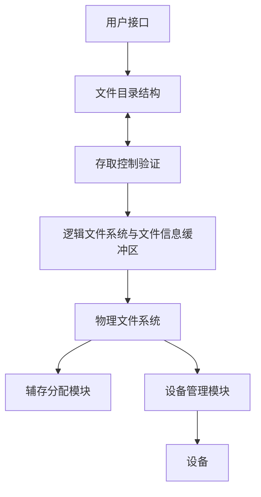

# 第十一章 文件系统

> 易俊泉学长原始笔记的链接如下：
>
> [第十一章-文件系统](docs/课内笔记/大三上/操作系统/笔记/易俊泉/第十一章-文件系统.md)

## 11.1 基本概念

内存具有易失性，需要文件系统管理信息

信息是计算机系统中的重要资源；

操作系统中的一个重要组成部分——文件系统，就负责**信息的组织、存储和访问**；

文件系统的功能就是**提供高效、快速和方便的信息存储和访问功能。**

> 文件系统是<mark>操作系统中以文件方式管理计算机软件资源的软件和被管理的文件和数据结构（如目录和索引表等）的集合。</mark>
>
> 从系统角度来看，文件系统是对文件存储器的存储空间进行组织、分配和回收，负责文件的存储、检索、共享和保护。
>
> 从用户角度来看，文件系统主要是实现“**按名取存**”，文件系统的用户只要知道所需文件的文件名，就可存取文件中的信息，而无需知道这些文件究竟存放在什么地方。  

### 文件系统的层次结构




### 文件系统的作用

> 提供对文件的各种操作，实现按名存取
>
> 提供合适的访问方式
>
> 提供目录管理和操作
>
> 实现文件的共享、保护
>
> 统一管理文件的存储空间，实现存储空间的分配和回收
>
> 实现逻辑文件与物理文件间的转换

### 文件概念

<mark>文件</mark>是记录在外存上的具有名字的相关信息的集合。文件可以被分为多种类型：

- 二进制文件
- 文本文件

#### 分类

> 用途分类：系统文件、库文件、用户文件
>
> 信息保存期限：临时文件、永久文件、档案文件
>
> 文件保护方式：只读文件、读写文件、只执行文件
>
> 逻辑结构：流式文件、记录式文件
>
> 物理结构：连续文件；链接文件；索引文件
>
> ......

#### 文件属性

文件名、类型、大小、位置、保护（读取、改写权限）、时间......

文件属性信息是与文件本体分离、单独存放的，放在**目录**中，存储在硬盘里

#### 文件系统结构

文件系统按层组织，为了存储文件相关的信息，我们使用类似“进程控制块”的文件控制块：FCB。

<font color="red">文件控制块FCB</font>：由一个文件的相关信息组成的存储结构


文件系统的层次如右侧所示。应用程序访问文件系统，首先接触到逻辑文件系统；逻辑文件系统根据文件名，从目录存储的 FCB 中得到文件的相关信息（比如权限、位置），传递给下一层；下一层文件组织系统负责实现逻辑记录（文件路径）到数据块的映射，得到文件在磁盘上的实际位置；基本文件系统负责实际读取磁盘中的文件，发送消息给 I/O 模块，并返回读取结果。

FCB 中通常包含如下内容：

- 基本信息：文件名称，文件类型，文件大小，创建者 id
- 权限信息：不同用户/不同组用户对文件的访问权限
- 使用信息：文件的上次打开时间、创建时间等信息。

磁盘中通常包含很多的文件。将多个文件组合在一起，就形成了「文件目录」。文件目录是 FCB 块的集合，而目录文件是文件目录在磁盘上的具体存储方式。这些内容在后面会涉及到。

### 索引文件

查找目录中的文件时，我们需要频繁读取所有文件 FCB，比较 FCB 中存储的文件名和待查找内容是否一致。既然我们实际只用到 FCB 中的文件名部分，有没有什么方法可以不读取整个 FCB，只读取文件名？

可以通过将文件名和 FCB 中的其他部分分离实现此点。在 UNIX 中，文件名和文件描述信息是分离的，文件描述信息形成一个我们称为「索引节点」的数据结构，简称「i 结点」（inode）。

在查找文件时，可以只读取文件名集合，不读取文件描述信息，大大减少了访问磁盘的次数。

## 11.2 文件结构与存储设备

**用户和文件系统往往从不同的角度对待同一个文件 **

> 用户：从使用的角度，按信息的使用和处理方式组织文件。 更关注「文件里存储了什么内容」。
>
> 文件系统：从文件的存储和检索的角度，根据用户对文件的存取方式和存储介质的特性组织文件，决定用户文件存放在存储介质上的方式。 更关注如何快速读写文件，如何减小文件占用的存储空间。

因为用户和文件系统对文件的关注点不同，**文件有两种形式的结构：文件的逻辑结构和文件的物理结构。**

> 逻辑结构:**用户对文件的组织结构**
>
> 物理结构:**文件在外存储器上的存储结构**
>
> 物理结构直接影响存储空间的使用和检索文件信息的速度
>
> 逻辑文件保存到存储介质上的工作由文件系统来做，这样可减轻用户的负担。文件的物理结构对用户是透明的。根据用户对文件的存取方式和存储介质的特性，文件在存储介质上可以有多种组织形式。

### 文件的逻辑结构

文件从逻辑结构上分成二种形式，**一种是无结构的流式文件，另一种是有结构的记录式文件。**

> 流式文件是指对文件内信息**不再划分单位**，它是依次的一串字符流构成的文件。如exe文件，这种文件存储的内容是不能被直接阅读的。
>
> 记录式文件是用户把文件内的信息**按逻辑上独立的含义划分信息单位**，每个单位称为一个逻辑记录（简称记录）。所有记录通常都是描述一个实体集的，有着相同或不同数目的数据项，记录的长度可分为定长和不定长记录两类。
>
> 定长记录是指所有记录的长度都是相同的，因此可以预先推理出每条记录的位置，从而可以单独读取一条记录。
>
> 不定长记录是指某些记录长度不同，因此读取某条记录是时需要遍历整个文件，寻找这个记录。解决方法：建立索引表。
>
> > 记录文件有**顺序、索引、索引顺序**文件几种。

**文件的结构由操作系统和程序决定**

#### 顺序结构文件

顺序文件的所有记录按键值的约定次序组织

记录可以是定长的，也可以是变长的，定长的便于查找。不定长记录可以通过建立索引表，减少搜索记录的时间。

顺序文件<font color="red">常用于批量记录读取</font>，对于访问某个记录的请求则处理性能不佳

#### 索引文件

对于定长记录的顺序结构文件，可以简单的通过计算 记录数 * 记录长度 得到中间某个记录的位置。但对于不定长记录的顺序文件，就必须从前到后依次读取记录了，这实在太慢了，因此我们引入索引文件。

索引文件对主文件中的每条记录建立一个索引表项，表中存储这个记录在主文件的开始位置和记录长度。

索引文件本身是顺序文件组织，是一个定长文件。

因此，查询时，可以先跳转到索引文件的记录处，再访问主文件的对应位置，不需要从前向后遍历主文件了。

**优点**：便于随机访问、易于文件增删

**缺点**：增加了空间开销，查找策略影响很大

#### 索引顺序文件

索引顺序文件是基于键的约定次序组织的。将顺序文件中的所有记录分为若干个组；再为顺序文件建立一张索引表，表中记录每个组的第一个记录，该索引项包含记录的键值和指向该记录的指针。它是顺序文件和索引文件的结合。

检索时，先根据关键字去检索索引表，找到该记录所在组的第一个记录的位置，然后再利用顺序查找法去查找主文件（把索引关键字和搜索关键字拼接起来），找到所需记录


#### 文件的访问方式

常用的包括顺序存取、直接/随机存取

> 顺序访问：按照文件信息的逻辑顺序依次存取
>
> 随机存取：根据记录的编号来直接存取文件中的任意一个记录，而无需存取其前面的记录。一般适用于索引文件或者定长记录文件这种能确定记录位置的文件。

### 文件的物理结构

用户按逻辑结构使用文件，文件系统按物理结构管理文件。因此，当用户请求读写文件时，文件系统<mark>必须实现文件的逻辑结构与物理结构之间的转换。</mark>

**文件在外存的存放组织形式**称为文件的物理结构

文件的物理结构**取决于外存的分配方式**

- 连续分配——顺序结构

- 链接分配——链接结构

- 索引分配——索引结构

> 虽然这里的索引分配名字里有索引，但是它和逻辑结构中的索引文件半点关系都没有

文件的存储设备主要有磁带，磁盘，光盘等，存储设备的特性可以决定文件的存取方法。

> 文件的存储设备常常划分为若干大小相等的**物理块**
>
> 以块为单位进行信息的存储、传输
>
> 磁带：采用顺序存取结构，不能直接定位
>
> 磁盘：直接存取设备：三种文件物理结构都可以采用，划分为磁道-扇区

#### 顺序分配

每一个文件占用一个连续的磁盘块的集合。

磁盘按照块组织，每个块号的大小固定。


文件目录需要存储的内容包含：**每个文件的首地址**+**文件的长度**。

可以随机存取、但会**产生外碎片**。

> 本质上是因为这是一种动态空间分配，自然存在外碎片

不能随意的增加文件大小（因为后面不一定存在足够大小的连续空间了）；如果在中间插入新内容，必须向后移动插入点后侧的所有数据，因此添加内容时访问开销大。

从逻辑地址映射到物理地址：`逻辑地址/块大小=块号	逻辑地址%块大小=偏移`

**优点**：

> 简单,支持随机存取和顺序存取
>
> 顺序存取速度快
>
> **所需的磁盘寻道次数和寻道时间最少**

**缺点**：

> 要求连续的存储空间
>
> <mark>会产生外碎片</mark>
>
> 要求用户给出文件最大长度:不利于文件的动态扩充
>
> 不利于文件的插入和删除


#### 链接分配

**隐式链接**：一个文件的信息存放在若干不连续的物理块中，各块之间通过指针连接，前一个物理块指向下一个物理块。利用类似链表的方式，存储文件所在的各个块

由于指针藏在每个存储块中，而不是统一的位置，这种方法被称为隐式链接。

两大缺点：**不支持随机访问**（必须从链表头开始访问所有内容）、指针占据存储空间(所以计算文件某部分内容所处位置时，除的时候要减去指针的空间)

在中间添加内容时，必须从头指针顺序访问到待添加位置，I/O 开销大。

需要存储的内容：**每个文件的头指针+尾指针（确定文件结束的块）**。

优点：不会产生外碎片

**优点**

> 提高了磁盘空间利用率,不存在外部碎片问题
>
> 有利于文件插入和删除
>
> 有利于文件动态扩充

**缺点**

> <mark>存取速度慢，不适于随机存取</mark>
>
> 可靠性问题，如指针出错
>
> 更多的寻道次数和寻道时间
>
> 指针占用空间

可将多个块组成簇，以簇为单位分配（相当于块大小增加），指针占用百分比减少，但增加内碎片（文件可能用不完簇中的所有空间）

隐式链接方式可以变形得到**显式链接**：不再把指向下一个块的指针隐藏到某个文件存储块中；建立文件分配表 FAT（整个磁盘只有一张），表的索引是文件的起始指针，表项目存储此文件下一个块的指针。

文件目录中只需要记录文件的头指针，其他内容就可以通过查 FAT 得到。

另有一个「目录索引表」，索引为文件名称，表项目为文件起始指针的位置。就像下图、利用目录索引表和文件分配表，可以在不访问文件的情况下、得到文件占用的所有块数。


> 注：FAT 表也是存储在磁盘上的

显式链接的优点：

- 支持顺序访问和直接访问：可以通过 FAT 表，在不访问磁盘块内容的情况下，找到第 i 个块的位置
- 访问速度快，不需要多次访问磁盘：FAT 表在系统启动时就读入内存

缺点：

需要占用一定内存空间存储 FAT 表。

#### 索引结构

> 链接结构没有外碎片，但不能直接存取；此外，FAT方式需要占用较大的内存空间。
>
> 既然使用链式结构得到文件占用的所有块很麻烦，我们为何不直接记录文件占用的所有磁盘块，按照顺序直接访问这些块呢？这样不就支持随机存取了？

**事实上，打开某个文件时，只需知道该文件所在的盘块号**，不需要读取整个 FAT 到内存中。那么，我把文件涉及的所有磁盘块存储在一个磁盘块内，查找文件时就读这一个块，然后再读取文件，不就即有 FAT 的优点还不占内存了吗？

一个文件的信息存放在若干不连续物理块中，系统为每个文件建立一个索引表，并将这些块的块号存放在索引表中

一个索引表就是磁盘块地址数组,其中第 i 个条目指向文件的第 i 块的块号。


上图中，右侧圆形是索引块，占用第 19 号磁盘块，其内部存储的数组表示此文件占用的所有磁盘块的顺序。操作系统可以按照此顺序读取对应的块，拼接成完整的文件。

此时的「目录索引表」中存储文件名和此文件索引块的地址。

**既没有外碎片，也可以随机访问**。

**需要存储：索引块的地址**

索引结构的总结：

**优点**:

保持链接结构的优点，又克服了其缺点:

- 既能顺序存取又能随机存取

- 满足了文件动态增长\插入删除要求

- 能充分利用外存空间

**缺点**:

- 由于此方法需要先访问索引块、再寻找文件，会带来**较多的寻道次数和寻道时间**

- 索引表本身带来了系统开销，因为其需要占用存储空间

**索引表的组织**

每个文件在索引方式下，都需要一个索引块记录其占用块号，那这么多的索引块该如何组织呢？主要存在两种方法：

**链接模式**

把所有索引块一个一个链接起来，就像前面提到的链接方式一样，每个索引块的末端记录指向下一个索引块的指针。

**多级索引**

> :o:将一个大文件的所有索引表（二级索引)的地址放在另一个索引表（主索引，一级索引)中
> :o:在<mark>两级索引分配方式</mark>，若每个盘块大小为1KB，每个盘块号占4字节，则一个索引块中可存放 256 个盘块号。一个一级索引块可以存放 256 个二级索引块位置，一个二级索引块可以存放 256 个数据块的位置，因此两级索引最多可包含的盘块号总数为 64K个（256\*256）。因此，所允许的文件的最大长度为 64MB（64K 个盘块 * 每盘块大小1KB）（假设每个数据块长度为 1KB）

**混合索引**

小文件适合链式结构，因为不需要占用额外的一整个块；大文件适合索引结构，可以随机读取。问题是，在写入文件前，我怎么知道这个文件是小文件还是大文件呢？

可以采用混合索引方式：索引块中存在直接索引、一级和二级索引表的指针

计算可通过此索引块访问的文件的最大大小时，分别计算直接索引、一级间接索引和二级间接索引可索引大小，将它们加起来求和即可。

 


## 11.3 目录结构

操作系统中包含了数以百万计的文件，该如何管理这些文件呢？我们可以使用目录组织这些文件。

**磁盘结构**

一块磁盘可以被分为多个分区

分区可以是“生”的（没有文件系统），或者是“熟”的（存在格式化的文件系统）。

> 一般对换区（虚拟内存使用的）采用的磁盘是生的（不需要文件系统），存储文件使用的磁盘是“熟”的（需要文件系统）

每个卷（分区）都保存该卷中文件的信息，这些信息保存在设备目录或者卷内容表中。

设备目录（目录）记录了分区上所有文件的各种信息。

**目录**：一个包含着所有文件信息的节点的集合。文件信息都存储在 FCB 中，因此目录实际就是 FCB 的集合。

目录结构和文件都保存在磁盘上


**文件目录**中主要保存 FCB（文件信息的集合）

**目录中的信息**：名称、类型、地址、当前长度、最大长度、最后访问时间、数据最后更新时间、所有者ID、保护信息

:book: 文件**控制块FCB**

> 用于描述和控制文件的数据结构，它至少要包括文件名和存放文件的盘物理地址
>
> 文件控制块的有序集合称为文件目录，即**一个文件控制块 FCB 就是一个文件目录项**。

FCB 块可能包含：

> 文件基本信息：文件名，用户名，文件地址，文件长度，文件逻辑结构，物理结构
>
> 存取控制信息：文件存取权限
>
> 管理信息：共享计数，文件的建立日期，保存期限，最后修改日期，最后访问日期

文件名：标识了某个文件，在系统中、文件必须具有唯一的名字

文件的物理地址：因文件物理结构不同，操作系统不同，存储的内容也不同：（重要，需要理解）

- 连续结构：存储文件的起始块号和占用块数
- 链式结构：存储文件的首指针和尾指针
- 索引结构：存储文件的索引块

### 区分：文件目录与目录文件

:star: **文件目录：文件控制块的有序集合**

> 文件目录是用于检索文件的，它是文件系统实现按名存取的重要手段 ，它的组织和管理应便于检索和防止冲突 
>
> 目录项：构成文件目录的项目（目录项就是FCB）

:star: **目录文件：为了实现对文件目录的管理，将文件目录以文件的形式保存在外存，这个文件就叫目录文件**

> 目录结构的组织关系到: 文件的存取速度、文件共享性和安全性
>

即目录文件是对「文件目录」这一实体的具体保存方式。

### 目录操作

可以对文件目录进行的操作：

建立、寻找、删除一个文件，列出目录的列表，重命名文件，遍历文件系统，搜索文件

根据目录的结构不同，这些操作的具体实现可能存在差异。

### 组织目录的逻辑结构

Organize the Directory （Logically） to Obtain

两个用户可以有相同名字的不同文件、相同内容的文件可以有不同的名字

#### 单级目录 Single-Level Directory

整个文件系统中，单级目录结构只建立一张目录表；所有用户的文件都放在同一级目录下。


**缺点**：不允许文件重名、文件查找速度慢

#### 二级目录 Two-Level Directory

解决一级目录文件命名冲突，并提高了对目录文件的检索速度

每个用户有单独的目录，可以在自己的目录下操作，不用担心自己的文件和其他用户的文件冲突。

目录分为两级：

> 一级称为主文件目录（MFD），给出用户名，用户子目录所在的物理位置；
>
> 二级称为用户文件目录（UFD，又称用户子目录），给出该用户所有文件的FCB

**优点**：

> 解决了文件的重名问题：文件名现在由两部分组成，用户名|文件名；查找时间降低

**缺点**

> 缺乏灵活性，不利于共享

 

#### 树型目录 Tree-Structured Directories 

> 现在的大多数文件系统都支持树形结构


第一级目录为根目录、第二级-最后一级目录为子目录、叶子节点为文件

**优点**：

> 层次结构清晰，便于管理和保护；
>
> 可以创建多级子目录，有利于文件分类；
>
> 解决重名问题；
>
> 提高文件检索速度；

**缺点**：

> 查找一个文件按路径名逐层检查，由于目录文件都放在外存，多次访盘影响速度；
>
> 无法共享文件

#### 无环图结构目录Acyclic-Graph Directories

可以实现共享子目录和文件


比如，上图中两个 count 名称的文件实际指向同一个文件；左侧的 all 文件和下方的 list 文件其实也指向同一个文件（类似符号链接）

当用户要求删除一个共享节点时，系统不能简单地就删除，否则会导致其他用户访问时找不到，可以为每个共享节点设置一个共享计数器，每增加一个共享链时，计数器加一；每当有一个用户提出删除要求时，计数器减一，仅当计数器的值为 0 时，才真正删除结点。

重要问题：**不能存在环**。解决方式：

- 只允许链接到文件，不能链接到目录
- 每次添加链接时，都用一种算法判断是否会形成环。

### 文件共享

#### 基于索引结点的共享方式——硬链接


将文件的名称、属性等内容放到索引节点内，文件目录不再记录指向文件内容的链接，而是改为记录指向索引节点的链接。

通过多个文件名链接(link)到同一个索引结点，可建立同一个文件的多个彼此平等的别名。

索引结点中存在链接计数：每当一个文件目录链接到索引结点时，计数 +1；删除链接时，计数 -1。若其减至 0，则文件被删除（所有硬链接文件都被删除时，其指向的文件才被真正删除）

硬链接文件名的地位是等同的，每个文件名都可以直接访问到文件内容节点。

#### 利用符号链接实现文件共享——软链接


特殊类型的文件，其内容是到另一个目录或文件路径的链接。建立符号链接文件，并不影响原文件，实际上它们各是一个文件。可以建立任意的别名关系，甚至原文件是在其他计算机上。

软链接和被链接的文件是不平等的；软链接文件单方面的链接到其他文件，且删除软链接文件不影响源文件，删除源文件则软链接文件一同失效。

删除源文件之后，软链接文件不会被删除，但是会失效；下次访问软链接文件时，系统会删除此文件。

### 文件目录改进

为加快目录检索可采用目录项分解法：把FCB分成两部分

> •**符号文件目录**：
>
> ​     由文件名和文件内部标识组成的树状结构，
>
> ​     按文件名排序；
>
> • **基本文件目录**（索引节点目录）：
>
> ​     由其余文件说明信息组成的线性结构，
>
> ​     按文件内部标识排序。

这两部分内容可以分开存储。在搜索文件时，可以只读取多个文件的符号文件目录到磁盘，加快搜索速度。

### 文件目录检索

用户给出文件名，按名寻找目录项

根据路径名检索**：**

- 全路径名：从路径根开始

- 相对路径：从当前目录开始寻找文件

> 设置当前工作路径后，可以设置在当前路径下搜索，限制文件搜索范围，减少访问磁盘的次数。

文件寻址：根据 FCB 中文件物理地址等信息，求出文件的任意记录或字符在存取介质上的地址

寻找多级目录（两级、树状目录、无环图目录）下的路径时，需要逐级访问路径中包含的目录，读取每个目录的信息。比如：

访问 `/usr/include/opencv4/opencv2/opencv.hpp` 时，需要先访问 `/` 目录，遍历其中的项目，找到 `/usr` 目录文件的位置；然后依次访问 `/usr` 目录，`/usr/include` 目录，`/usr/include/opencv4`，`/usr/include/opencv4/opencv2`，`/usr/include/opencv4/opencv2/opencv/hpp`，才能访问到目标文件。

对于相对路径，可以从当前路径开始访问，减少几次磁盘读取。比如：当前路径为 `/usr/include/opencv4`，那么访问上述文件就只需要依次访问 `/usr/include/opencv4`，`/usr/include/opencv4/opencv2`，`/usr/include/opencv4/opencv2/opencv/hpp` 三个节点，减少了三次磁盘读取次数。


## 11.4 文件操作

文件的基本操作包含：建立、删除、读、写、打开、关闭文件。

**建立文件**: 

1. 建立文件的 FCB

2. 分配必要的外存空间

3. 在文件目录中为之建立一个目录项，FCB 中记录新文件的文件名及其在外存的地址等属性，返回一个文件描述符。

**删除文件**: 

1. 从目录中找到要删除文件的目录项

2. 使之成为空闲目录项

3. 回收该文件所占用的存储空间和 FCB 块

**读文件** : 把文件中的数据从外存读入内存的用户区

1. 查找目录，找到指定文件的目录项（FCB），从中得到被读文件在外存的地址

2. 从外存将数据读入内存

**写文件** : 

1. 查找目录，找到指定路径文件的目录项（FCB）

2. 利用目录中的文件指针/地址将信息写入文件

**打开文件**: 为了避免每次访问文件时都要从外存中查找文件目录，系统提供了打开文件命令。

将待访问文件的目录信息读入系统打开文件表中，建立起用户和文件的联系，返回一个**文件描述符**（即此目录在活动文件表中的索引编号）。用户后续可以通过这个编号访问文件，系统无需再从目录中查找文件。

> 打开文件不包含从目录中查找到 FCB 这一步骤，只包含把 FCB 中的文件位置指针复制到打开文件表中。

在有些系统中，也可以通过读命令隐含地向系统提出打开文件的要求。若在读写命令中不包含打开文件功能，则在使用文件之前，必须先打开文件。

**只要完成了打开操作，后续对文件的读/写/定位/删除操作都通过 文件描述符 进行，不再需要文件名**。

> 扩展：Python 打开文件的代码实例如下：
>
> ```python
> f = open("test.txt", "w")
> f.write("Hello, filesystem!")
> f.close()
> ```
>
> 第一步的 open 函数打开了一个新文件 test.txt。操作系统为此文件创建了新的目录项，分配外存空间，随后打开这个文件，将其加载到打开文件表中，返回文件描述符 f（f 指向文件在打开文件表中的索引）
>
> 之后，我们都通过文件描述符 f 而非文件名对文件进行操作。f.write 函数向描述符对应文件中写入数据（不需要文件名）
>
> f.close 函数关闭文件 test.txt。关闭后，系统从打开文件表中移除此项，将其内容写入磁盘中。

**关闭文件**: 

删除主存中有关该文件的目录信息（FCB），切断用户与该文件的联系；将文件的**控制信息**写回外存。

### 文件指针定位

`seek(fd, 新指针的位置)` 可以移动读写指针。

读写指针：系统为每个打开的文件维护一个读写指针，这是相对文件开头的一个偏移地址，初始指向文件开头，在每次读写完成后，读写指针向后后移对应读取长度。

### 打开文件结构中的共享

> 很多程序可能会打开/搜索同一个文件，因此，文件的 FCB 可能会被高频读写。因此，我们可以建立一些缓存表，存储文件的 FCB 块，以便加快访问。

打开的文件会被保存在表中：

- 系统打开文件表（每个系统只有一张）：

  放在内存中，用于保存所有用户已经打开文件的 FCB。

- 用户/进程打开文件表（每个进程一个）

  包含文件描述符，打开方式，读写指针，系统打开文件表入口。也在内存中

  进程的PCB中，记录了用户打开文件表的位置


**文件打开的方式：**

1. 根据文件名查系统打开文件表，看文件是否已被打开；

   - 是→共享计数加1，无需再去磁盘读取 FCB 块

   - 否→根据文件路径名查目录，找到 FCB 主部；根据打开方式、共享说明和用户身份检查访问合法性。

     如果访问合法，将外存中的FCB主部等信息填入系统打开文件表的空表项，共享计数置为 1；

2. 在用户打开文件表中取一空表项，填写打开方式、读写指针等，并把入口指向系统打开文件表对应表项（上一步中已经把 FCB 放到系统文件打开表中了）

   返回信息：fd：文件描述符，是一个非负整数，用于以后读写文件，是该文件在用户打开文件表中的索引

**文件关闭的方式**：

1. 从用户打开文件表中删除对应条目
2. 访问此文件在系统文件打开表中的位置，使其共享计数器 -1；如果共享计数器减小到 0，那么说明此文件不再被使用，从系统文件打开表中删除对应条目。


## 11.5 文件存储空间管理 Free-Space Management

在分配内存时，我们使用一张表，存储所有已经分配的内存块的起始点、大小和分配给的进程；那该如何统计所有磁盘空间的使用情况呢？

**位示图法**

用一串二进制位反映磁盘空间中分配使用情况, 每个物理块对应一位, **已分配物理块为 0，否则为 1**。 申请物理块时，可以在位图中查找为 1 的位，设置分配位为 0，返回对应物理块号；归还时，将对应位置重新设为 1。

缺点：位图需要占用额外的磁盘空间。为了快速访问，位图的备份同样会保存在主存中

为保证磁盘和主存中位图的一致性，我们需要遵循如下规则更改位图：

1. 修改磁盘上的位图
2. 为文件分配空间
3. 修改主存中的位图

> 位图表示中每个物理块只需要 1bit，因此计算位图占用长度时，只需要计算磁盘有多少物理块即可。

**空闲块表** 

将所有空闲块记录在一个表中，即空闲块表，有两项：该空闲区的第一个盘块号、该区的空闲盘块总数。

空闲块表方法类似于内存分配中的动态分区分配，属于文件物理结构中的连续分配，会为文件分配一块连续的磁盘空间。

**空闲块链表**

> 把所有空闲块通过指针链成一个链. 扩展：成组链接法
>
> 需要分配空间时，找到首指针，一直向后遍历，直到找到足够大的空闲空间。
>
> 缺点：链表链接常常是跳跃的，很难找到连续的磁盘空间。

**成组链接法**

文件区的所有空闲盘块被分成若干组（如100个空闲盘分成一组）

每一组的第一个盘块中记录有下一组的盘块总数和每个盘块的编号，其他 99 个盘块都是空的。

> 每一组都记录下一组的盘块总数和所有空闲盘块号，那第一组的信息放到哪一组里呢？其实是放到特殊的空间：空闲盘块号栈中。

空闲盘块号栈：存放当前可用的空闲盘块号及空闲盘块号数 N（最多100个）。

第一组盘块总数和盘块号（第一个盘块号永远指向下一组的记录栈）记入空闲盘块号栈中

能快速找到大量空闲块的地址


分配时：**从下向上分配块**。比如上图中的分配顺序是 201，202，203，...，300。

在分配完空闲盘块号栈的所有块后，我们把其 0 位置的块（这个块里一定存储下一组的记录栈）的内容全部移动到空闲盘块号栈中，然后把这个块分出去，这样空闲盘块号栈又满了。

在回收块导致空闲盘块号栈满后，回收下一个块时，把整个栈移动到这个块中，然后清空空闲盘块号栈，压入这个块的块号作为栈的第一个元素。之后，空闲盘块号栈又空了，可以继续接受块号。


## 11.6 文件系统实现

文件系统的实现需要数据结构的支持：包含磁盘中的结构和内存中的结构


MBR 是主引导记录，存储分区表（磁盘如何分区）。读取 MBR 后，我们可以了解到那个分区是启动分区。

磁盘中的结构：引导控制块、分区控制块、目录结构FCB

**引导控制块**（Windows 下叫分区启动块）：

引导控制块存储如何引导操作系统的相关信息。

**分区控制块**：

分区控制块存储磁盘上的一些具体信息，比如剩余空闲块数、指针，空闲 FCB 块数和指向 FCB 的指针等

FCB：文件目录 FCB 被存储在磁盘上的目录文件中（和绕口令似的）

内存中的结构：

系统文件打开表，用户文件打开表：上面提到过，两者都在内存中

下图表示了文件系统打开文件的过程：请求打开文件，读取 FCB，存储 FCB 到系统文件打开表，放到用户文件打开表，返回文件在用户文件打开表中的索引作为文件描述符。


## 11.7 保护

文件一般包含两种保护方法：

识别访问者，识别操作权限

1. 对访问者的识别：对用户分类：

   文件主（owner）；文件主的同组用户（group）；其它用户（other**）**

2. 对操作权限的识别：unix 中使用 rwx 三种权限表示文件的操作权限；所有者用户、所有者同组用户、其他用户对文件的 rwx 权限不同。

### 效率和性能

文件系统的访问效率取决于磁盘分配和目录算法，以及保存在文件目录项中的数据类型。

> 比如，将 FCB 分为两部分：文件名和指针一部分、其他权限内容一部分就是对 FCB 数据类型的优化，可以加速遍历文件的效率

在以上内容都已经确定时，我们仍然可以通过其他操作进一步优化磁盘的性能：

#### 磁盘高速缓存

磁盘高速缓存（Disk Cache）是指利用内存中的存储空间，来暂存从磁盘中读出的一系列盘块中的信息。

> 就像内存可以通过添加 cache 加速访问，磁盘也可以通过占用部分内存作为 cache 加速访问

磁盘高速缓存的形式 ：

专用:在内存中开辟一个单独的存储空间来作为磁盘高速缓存，大小固定；

公用:把所有未利用的内存空间作为一个缓冲池，供请求分页系统和磁盘I/O共享。

不同的缓存方式：

块缓存:在内存中将文件数据作为块来缓存（按照磁盘中组织文件的习惯）

页缓存(page cache):将文件数据作为页来缓存（按照内存中组织数据的习惯）

如果不使用统一的 buffer 缓存

**板载高速缓存**

磁盘设备控制器中存在一块高速缓存，可以缓存一整个磁道的内容，这样顺序读取时就不用访问磁盘了。

#### 优化数据的分布

1. 优化物理块的分布，让同一文件的内容尽可能放在相邻物理块，减少块变化导致的寻道时间
2. 在使用索引结构作为文件物理结构时，让索引块和文件物理块离得更近，节约寻道时间

#### 其他方法

提前读（Read-Ahead）：用户（进程）对文件进行顺序访问的情况下，在读当前块的同时，可提前将下一个盘块读入缓冲区。这样由于空间局部性原理，当前块附近的块很可能马上会被访问，再次被访问时就不用读了。

延迟写：是指在缓冲区 A 中的数据，本应立即写回磁盘，但考虑到该缓冲区中的数据，不久后可能还会被访问，因而并不立即将该缓冲区 A 中的数据写入磁盘，而将它挂在空闲缓冲区队列的末尾。

虚拟盘（Virtual Disk）：是指利用内存空间去仿真磁盘，又称为 RAM 盘。 由于内存物理上远快于磁盘，内存盘的速度远远快于磁盘（除了断电丢数据之外简直完美）

### 数据一致性问题

重复文件的一致性 ：

- 为保证文件系统的可用性，在有些系统中为关键文件设置了多个重复拷贝，将它们分别存储在不同的地方

- 在有重复文件时，若一个文件拷贝被修改，则必须同时修改其它几个文件拷贝，以保证该文件中数据的一致性。

盘块号一致性的检查：


## 11.8 文件物理结构添加块的次数

这个点应该比较常考，总结一下：

连续分配在前面/中间加入块时，需要读取此位置后的块，把这些块写回后一个的位置，再加入一个新块，共计读写 2n+1 次（n 为需要移动的块的数量）

链式分配添加块时，需要先读取到此块的位置（n 次），加入新块（1次），修改前一块的指针（1次），共计 2n+1 次（n 是待修改块是第几个块）

磁盘访问次数

> 假设索引块已经读取进入内存，链式分配采用隐式链式分配。

> 索引块只需要一次访问是因为只需要写入

|          | 连续分配 | 链式分配 | 索引分配 |
| -------- | -------- | -------- | -------- |
| 最前方   | 201次    | 1次      | 1次      |
| 第50块后 | 101次    | 52次     | 1次      |

