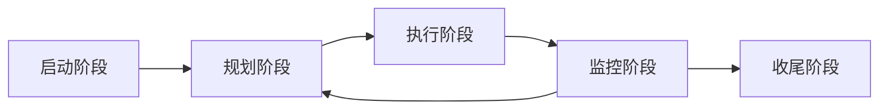

# 第一章 软件项目管理课程简介

软件项目管理的四个基本目标：范围，时间，成本，质量。这被称为「项目管理的核心知识领域」

剩余的六个目标：人力资源管理，风险管理，沟通管理，采购管理，干系人管理，整体管理辅助项目目标的达成。

## 项目与项目管理的基本概念

项目：项目是用来创建**唯一性（Unique）**的产品或服务的**临时性（Temporary）**努力。

> 临时性：每个项目都有确切的开始和结束时间，不会没完没了的持续下去
>
> 唯一性：生产的产品要和类似的产品有明显的区别

### 项目的四个特性

临时性和唯一性是项目的两个特性。此外，项目还具有另外两个特性：

- 渐进明细性：项目具有不确定性，随着项目进度的进展，项目的计划会持续的改进和细化

  典型的例子就是「产品经理改需求了，不得不大改程序」

- 资源约束性：项目的资源（人力资源、物质资源等）是有限的

  比如，老板给你这个项目组分了 10 个人，那就只有 10 个人的人力资源；老板买不起 A800，只买得起一块 4090，那你的模型就只有一张卡能用

### 项目的四维约束（也叫四个目标）

> 请注意，四维约束 != 四个特性，请注意区分。

**成本，质量，时间，范围**是项目的「四维约束」，也可以叫做「四个目标」。每个项目都会受到这四个目标的约束，比如项目一般都会要求：范围多、时间快、质量好、成本省（多快好省）。

四个目标的变化会相互影响。比如，项目范围变大了，一般来说，项目耗时就会变长。当一个目标变化的时候，需要重新评估其他三个目标是否有所变化。

### 项目是否成功？

项目是否成功就看**项目的四个目标是否实现**。

成功：如果项目在交付时：

- 在规定的时间内
- 在批准的预算范围内
- 完成约定的工作范围
- 符合质量性能要求

那么这个项目就是成功的，客户就能满意的接受这个产品。

----

或者，成功还有一个定义：

成功：使客户感到满意

> 据老师所说，软件也是一种服务业，所以软件项目的成功与否，还要看客户是否满意。

---

这两种定义说明，项目的成功既要项目结果成功，又要项目的过程成功（过程中使客户满意）

### 项目的生命周期

任何项目都会经历**启动、规划、执行、监控、收尾**这样一个过程。这个过程称为项目生命期

监控阶段返回规划阶段箭头的含义：

有些时候，大家都努力工作~~天天996~~，但是还是完不成项目，可能是因为规划有问题；监控阶段下发现这种情况，就需要重新规划项目。

五个阶段分别对应五个不同的过程组；事实上，五个阶段并不是「一个接一个」进行的，部分阶段（比如监控阶段）可以横跨规划、执行两个阶段存在。

> 这是很自然的，如果等到执行阶段结束才开始监控就有点晚了，一旦出现问题，需要重复整个执行阶段。

## 项目管理的概念

项目管理的定义：项目管理是在项目活动中运用知识、技能、工具和技术，以便**满足和超过**项目干系人对项目的需求和期望。

> 为什么要「超过」期望？这是因为在完成用户要求功能基础上，多做一些实用功能，可以让用户超级满意

但是，满足项目干系人对项目的需求是很困难的，我们需要：

- 在四维约束（范围，时间，质量，成本）之间寻求平衡
- 平衡有不同要求和期望的项目干系人
- 完成明确的需求和未明确的需求

> 明确的需求就是客户点名提出的需求；未明确的需求就是客户没提出，但是按照行业标准必须完成的需求。比如，做登录功能时，就算客户没要求，数据库的密码也要加密存储（存加盐 md5 之类）

项目干系人：是指所有参与项目互动或者受项目活动影响的人。比如：项目发起人、项目成员、客户、使用者、支持人员，甚至项目人员的家属

**成功的项目管理需要建立和维护与项目干系人的关系，理解并满足项目干系人的需要和期望**

软件项目管理：就是对软件项目的项目管理

### 项目管理的要素

- 项目管理的工作对象：项目的整个生命周期

- 五个标准过程组：由于软件项目管理需要管理项目的整个生命周期，因此在项目的五个阶段（启动，规划，执行，监控，收尾）中，都需要执行管理。对一个阶段的管理称为**过程组**。软件项目管理包含如下五个过程组：

  启动过程组、规划过程组、执行过程组、监控过程组、收尾过程组

>  软件项目的生命周期一般包含：
>
> 1. 需求分析
> 2. 设计
> 3. 编码
> 4. 测试
> 5. 运行维护
> 6. 用户支持
>
> 这六部分。其中，每一个部分都具有五个阶段（启动、规划、执行、监控、收尾），都需要使用五个标准过程组管理。

这是描述五个标准过程组在项目中开始和结束之间的一张图。可以看出，监控过程贯穿始终，启动过程、规划过程、执行过程、收尾过程一个接一个。

这是项目管理的五个阶段与十个管理目标的交叉对照表。这张表阐明了在项目各个具体阶段的不同过程组中如何进行管理。比如，「项目集成管理」和「启动阶段」的交点是「制定项目章程」，说明「制定项目章程」这个过程是需要在「启动阶段」进行的，属于「项目集成管理」这个模块。

### 项目管理的原因

只有 16% 的项目能按照预定时间和预算完成项目目标，在 84% 没能完成的项目中，31% 的项目在完成前被取消，大约浪费掉了 810 亿美元。所以需要对软件开发过程实施有效的项目管理。

项目管理的重要性：印度有 95% 的软件能按时完成开发（真的吗？），就是因为他们良好的项目管理。

### 项目管理的学科属性与发展过程

项目管理的母学科是组织论。项目管理是一个交叉学科，属于一般管理知识与实践、应用领域的知识与实践的交界处。

发展过程：

- 1940 年代，美国曼哈顿计划，现代项目管理的起源
- 1950 年代，美国路易斯维化工厂，通过将检修任务分组与调配实现整体停工时间最短。
- 1980-1990：现代项目管理兴起，PMI（美国项目管理协会）制定了 PMBOK（项目管理知识体系指南），向全世界推行项目管理标准。

### 项目管理的指导思想和哲学思想

只有**明确四个目标**（范围、时间、成本、质量）的项目才称为项目管理意义上的项目。没有明确目标的项目不是项目，因此不需要控制，也无法控制。

项目管理需要对变化保持敏锐，监控项目变化。

### 项目群和项目群管理

**项目群**：是指一组相互联系的项目，使用协同的方法对他们进行管理和控制以取得单独管理这些项目时不易获得的收益。项目群由项目群经理负责

项目群经历：对项目群内的项目管理进行领导并指明方向

**项目组合管理**：简称为组合管理，将项目及项目群组合并进行管理，使其作为一个「投资组合」，促成企业成功。

> :star: 项目管理完成的是战术目标 	项目组合管理完成的是战略目标，从战略角度选择项目并组织投资。

### 项目经理

**项目经理**：是项目的负责人，负责项目的组织、计划以及实施过程，以保证项目目标的成功实现，是项目小组的灵魂

**职责**

> **计划**
> 	设定目标,制定政策与程序,编制进程与预算
> **组织**
> 	确定组织结构,明确汇报关系,营造工作环境
> **指导**
> 	收集与发布信息,作决策,激励与培养员工
> **控制**
> 	成立 CCB 并规定其工作流程与职责,监督与检查

项目经理：整合者、沟通交流人、团队领导、决策者、氛围营造者：**既是领导者，又是管理者**

> 是一个通才、有责任心、具有系统综合的能力，**并不是一个技术专家，主要解决人际关系和管理**

**核心技能**：人际关系能力、领导能力、善于倾听等。需要擅长人际关系和管理，不需要很擅长技术问题。

:question: 选择什么样的人进入项目团队

> 有类似的经验吗
> 具备胜任所负责活动方面的技术能力吗？
> 能与他人合作共事并分享信息吗？
>
> 能认真负负责并与项目一起成长？

优秀的项目小组成员的要求：

- 3E：敬业（Ethic），整体观念（Ensemble），不断成长（Education)
- 3C：Corporation（精诚合作），Communication（信息共享），Commitment（认真负责）

**项目经理与项目干系人**：项目经理需要识别项目干系人、认识项目干系人的重要作用、与各项目干系人发展良好的关系，以确保对其需要和期望有较好的理解

### PMBOK，PMP 和 IPMP

IPMP 是国际项目管理协会的认证体系；PMP 是美国项目管理协会的认证体系，其知识体系为 PMBOK。

美国项目管理协会提供 PMP 认证。

PMBOK：对一次性的创新性管理给出了标准化、模块化的内容，开放的，不断发展的知识平台。

PMP：项目管理专业人士的简称；全球市场最重要的资格证明（吗？）

每三年，PMI 都会对 PMP 资格进行重新审查。

PMRC：中国的项目管理研究委员会，同样提供一个类似 PMP 的认证：C-NCB。考试分为四个级别：项目管理员/助理项目管理师/项目管理师/高级项目管理师
