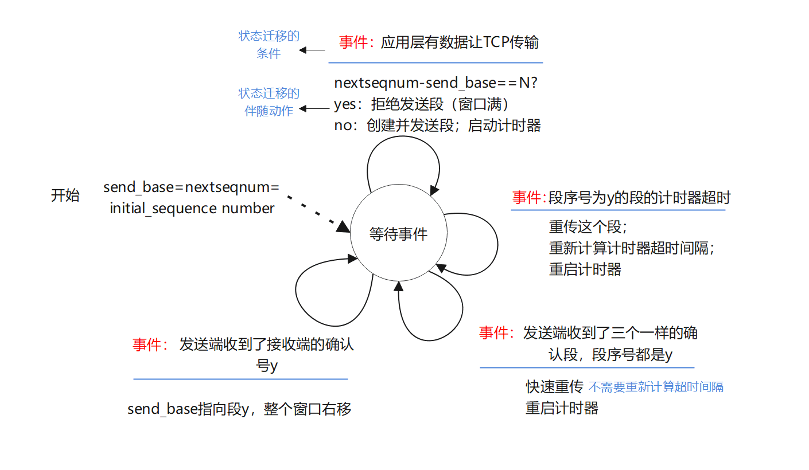
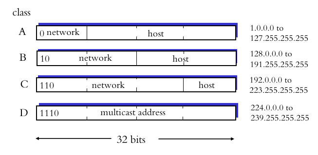
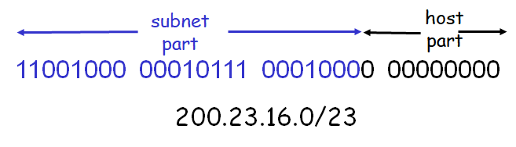
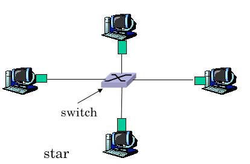

[toc]

# Introduction


## ISO/OSI 七层/五层模型
五层模型 : <b>物理层</b> (Physical), <b>数据链路层</b> (Data Link), <b>网络层</b> (Network), <b>传输层</b> (Transport), <b>应用层</b> (Application).

七层模型 : <b>物理层</b>, <b>数据链路层</b>, <b>网络层</b>, <b>传输层</b>, <b>会话层</b> (Session), <b>表示层</b> (Presentation), <b>应用层</b>.

各层的 PDU (Protocol Data Unit, 协议数据单元):

层     | PDU
-------| -------------------------
应用层 | <b>报文</b> (Message)
传输层 | <b>段</b> (Segment)
网络层 | <b>数据报</b> (Datagram)
链路层 | <b>帧</b> (Frame)
物理层 | <b>位</b> (Bit)


## QoS
1. 丢包率
2. 吞吐率
3. 实时性
4. 安全性


## Internet 架构
硬件 :
- <b>边缘</b>
- <b>核心</b>
- <b>链路</b>

软件 :
- 协议 & 应用
- 网络操作系统

## 什么是协议
> 协议规定了报文的格式命令以及报文传输和接收时所采取的行动.

## 网络接入方式
### 住家接入
- <b>拨号上网</b> Dail Up
- <b>不对称数字用户线</b> ADSL
- <b>光纤入户</b> Fibre To The Home, FTTH
- <b>混合光纤同轴电缆</b>, Hybrid Fiber Coax, HFC

### 机构接入
也可以用作住家接入
- 以太网
- 无线接入

## 物理媒介
有向介质
- 铜
- 光缆
- 同轴电缆

无向介质
- 地面微波
- 卫星无线电通道

## 数据交换模式
### 电路交换 Circuit Switching
需要拨号, 信号从发送端直接发送到接收端

### 分组交换 Packet Switching
不需要拨号, 将数据封装成小包, 放到队列中, 按照算法将数据报放到数据端口, 发送到下一个端口.

### 分组交换 vs 电路交换
##### 分组交换の优点
1. 技术简单, 无需拨号
2. 承载用户更多
3. 适合突发数据传输
4. 资源共享/利用率高

##### 分组交换の缺点
1. 可能发生拥塞, 导致数据包延迟或丢失
2. 实时性弱

## 丢包与延时
### 四种延时
1. 结点处理延时
2. 排队延时 (不可忽略)
3. 传送延时
4. 传播延时

### 哪里可能发生丢包?
1. <b>主机</b> (应用层)
2. <b>TCP (缓存满)</b> (传输层)
1. <b>路由器</b> (网络层)
3. <b>交换机</b> (链路层)

-----------

# 应用层

## DNS

### DNS 提供的服务

1. 主机名到 IP 地址的转换
2. 邮件服务器别名
3. 主机别名
4. 使服务器集群相对负载均衡

### IP 地址与域名的映射关系

> IP 地址与域名之间是**多对多**的关系.

### 为什么不使用集中式 DNS 服务
1. **单点故障** : 如果该服务器故障, 则整个 Internet 随之崩溃 ;
2. **维护困难** : 单个 DNS 服务器不得不保留所有 Internet 主机记录. 致使数据库庞大, DNS 服务器不得不为解决每个新添加的主机而频繁更新.
3. **通信容量有限** : 单个 DNS 服务器不得不处理所有 DNS 查询 ;
4. **远距离的集中式数据库** : 单个 DNS 服务器不可能临近所有客户.

-----------

# 传输层
## 传输层提供の服务
1. **提供应用进程间的逻辑通信**
2. **复用和解复用**
3. **可靠性控制**
    - **差错检测**
    - **重传丢失的数据段**
4. 提供无连接或面向连接的服务

OSI 7 层模型中, 提供端到端的透明数据传输服务、差错控制和流量控制的层是<b>传输层</b>.

## UDP

如果用户程序使用 UDP 进行数据传输, 那么<b>应用层</b>协议必须承担可靠性方面的全部工作.

## 哪些应用是 TCP, 哪些是 UDP?

应用         |       应用层协议      |   依靠的传输层协议
:-----------:|:---------------------:|:---------------------:
电子邮件     |         SMTP          |          TCP
远程终端访问 |         Telnet        |          TCP
网页         |         HTTP          |          TCP
文件传送     |         FTP           |          TCP
文件传送     |         TFTP          |          UDP
流媒体       |         HTTP          | UDP(局域网内) 或 TCP
网络电话     | STP, RTP, Proprietary |      通常是 UDP
域名转换     |         DNS           |        UDP/TCP
路由选择协议 |         RIP           |          UDP
网络管理     |         SNMP          |          UDP
IP 地址配置  |         DHCP          |          UDP

### UDP の 特点
1. 简单
2. 段头小
3. 速度比较快


## TCP
### TCP 三控一管
1. 可靠性控制
2. 拥塞控制
3. 流泪控制
4. 连接管理

### 可靠性控制
基本思想 : **丢包重传**

如何确认段丢失 :
> TCP 每发送一个报文段, 就对这个报文段设置一次计时器. 只要到了计时器设置的重传时间还没有收到确认段, 那么就要重传该报文段.

如何确认一个段没有收到 :
- 通过段序号

#### 可靠性控制算法 DFA

<center>
    
    <p><b>TCP 可靠性控制算法有限状态机</b></p>
</center>

#### 可靠性控制算法伪代码

```c
// 假设发送端不受 TCP 流量和拥塞控制
// 来自上层数据的长度小于 MSS
// 且数据传输只在一个方向进行
sendbase = initial_sequence_number;
nextseqnum = initial_sequence_number;

while (true) {
    switch (event) {
        event (data received from application above):
            // 接收到应用层数据
            if (nextseqnum-sendbase < N) {
                // 创建段序号为 nextseqnum 的 TCP 段
                create TCP segment with sequence number nextseqnum;
                // 启动计时器
                start timer for segment nextseqnum;
                // 将段发送给网络层
                pass segment to IP;
                nextseqnum = nextseqnum + len(data);
            } else {
                // 拒绝发送段
                refuse to pass segment;
            }
        event (timer timeout for segment with sequence number y):
            // 段序号为 y 的段计时器超时
            // 重传段 y
            retransmit segment with sequence number y;
            // 重新计算计时器超时间隔
            compute new timeout interval for segment y;
            // 重启计时器
            restart timer for sequence number y;
        event (ACK received, with ACK field value of y):
            // 收到 ACK, 字段值为 y
            if (y > sendbase) {
                # y 之前的所有段都已收到
                # 取消段 y 之前的所有段的计时器
                cancel all timers for segments with sequence numbers < y;
                sendbase = y;
            } else if (y == sendbase) {
                // A duplicate ACK for already ACKed segment
                // 对 ACK 字段为 y 的计数器 + 1
                increment number of duplicate ACKs received for y;
                if (number of duplicate ACKs received for y == 3) {
                    // 对 ACK 字段为 y 的计数器等于 3
                    // 快速重传 y
                    resend segment with sequence number y;
                    // 重启段 y 的计时器
                    restart timer for segment y;
                }
            } else {
                // 什么也不做
                do nothing:
            }
    }
}
```

### 流量控制

TCP 通过让发送端维护一个称为**接收窗口**的变量来进行流量控制, 接收窗口用于给发送端一个指示: 接收端还有多少可用的缓存空间.

下面假设主机 A 向主机 B 发送数据.

#### 接收端

接收端维护以下变量:
- **RcvBuffer**: TCP 接收缓冲区的大小
- **RcvWindow**: 接收缓冲区的空闲空间大小
- **LastByteRead** : 主机 B 上的应用进程从缓存中读出的最后一个字节的编号 (被读走的最后一个段序号).
- **LastByteRcvd** : 从网络中到达的并且已经放入主机 B 的接收缓存中的数据流的最后一个字节的编号 (刚收到的段的段序号)

在连接过程中, 维护下式成立:

$$
\mathrm{LastByteRcvd-LastByteRead\leq RcvBuffer}
$$

接收窗口 (空闲缓存) RcvWindow 根据下式设置:

$$
\mathrm{RcvWindow = RcvBuffer - (LastByteRcvd - LastByteRead)}
$$

#### 发送端

主机 A 跟踪两个变量 : **LastByteSent** 和 **LastByteAcked**. 这两个变量之差就是**主机 A 已经发送但未被确认的数据量**. 通过将未确认的数据量控制在 rwnd (RcvWindow) 内, 就可以保证主机 A 不会使主机 B 的接收缓存溢出. 因此, 主机 A 在连接过程中需要保证 :

$$
\mathrm{ LastByteSent - LastByteAcked \leq rwnd }
$$

当 rwnd = 0 时, 在将 rwnd = 0 通知给主机 A 后, 如果主机 B 没有任何数据发送给主机 A, 此时, 主机 B 上的应用会逐渐使 rwnd > 0. 因为**TCP仅当在它有数据或有确认要发送时才会发送报文给主机 A**, 因此主机 A 不会得到通知, 致使连接阻塞.

为了避免这个问题, **当主机 B 的接收窗口 = 0 时, 主机 A 持续发送只有一个字节数据的报文段, 直至接收端的确认报文中 rwnd > 0**.

### 拥塞控制

- **轻度拥塞** : 收到 3 个相同的确认段
- **重度拥塞** : 发生超时

#### TCP Slowstart
```c
initialize:
    Congwin = 1
    threshold = 适当的值
for (each segment ACKed)
    Congwin++
until (loss event or Congwin >= threshold)
```

#### TCP Congestion Avoidance

```c
/* 慢启动过程结束 */
/* 此时 Congwin > threshold */

/**
 * 没有丢包时,
 * 到达阈值之后,
 * 发送窗口线性增加
 */
while (no loss event) {
    // 每 w 个段被确认:
    every w segments ACKed:
        Congwin++;
}

// 发生丢包
threshold = Congwin / 2;
Congwin = 1;

// 执行慢启动
perform Slowstart;
```
<center> <p> Tahoe 算法 </p> </center>

对于 Tahoe 算法, 轻度拥塞时发送窗口也会变成 1, 有点不合理. 因此提出 Reno 算法.

```c
/* 慢启动过程结束 */
/* 此时 Congwin > threshold */

// 当没有丢包事件发生时
while (no loss event) {
    // 每 w 个段被确认:
    every w segments ACKed:
        Congwin++;
}

threshold = Congwin / 2;
// 检测到超时丢包
if (loss detected by timeout) {
    Congwin = 1;
    perform slowstart;
} else if (loss detected by triple duplicate ACK) {
    // 接收到 3 个相同的确认段
    Congwin = Congwin / 2;
}
```
<center> <p> Reno 算法 </p> </center>

但是 Reno 算法也存在问题: 当处于快速恢复时期时, 如果又收到 3 个相同确认段, 则无法处理.

#### TCP の 四个特性
1. **有效性**
2. **收敛性**
3. **公正性**
4. **友好性**

### 连接管理
#### 连接建立 : 三路握手
1. 第一次握手
    1. 发送端给接收端发送一个 SYN 段 (在 TCP 标头中 SYN 位为 1 的 TCP/IP 包), 在该段中也包含给客户端的初始序列号 J ;
	2. 接收端返回给发送端 SYN + ACK 段 (SYN 和 ACK 位都为 1 的包), 该段中包含接收端的初始序列号 K ; 同时使确认号 = J + 1 来表示确认已收到客户端的 SYN 段
2. 第二次握手 : **接收端开辟缓存**, 发送端响应一个 ACK 段, 该段中使确认号 = K + 1 来表示已收到服务器的 SYN 段
3. 第三次握手 : **发送端开辟缓存**.
#### 连接关闭 : 两次握手
1. Clinet : 端系统发送 TCP FIN 控制段
2. Server : 接收到 FIN, 返回 ACK; 关闭连接, 发送 **FIN**
3. Client : 接收到 FIN, 返回 ACK;
4. Server : 接收 ACK, **连接关闭**

-----------

# 网络层
## 两个关键功能
1. 路由选择 (Routing)
2. 转发数据报 (Forwarding)

## 路由器の两个重要功能
1. <b>运行路由算法/路由协议</b> (RIP, OSPF, BGP);
2. <b>转发数据报</b>.

## IP 地址
IP 地址是分层的. IP 地址分为<b>网络部分</b> (高若干位) 与<b>主机部分</b> (低若干位).
同一网段内, 网络部分相同; 不同网段间, 网络部分不同.

路由器的一个接口对应一个网段, 称为<b>子网</b> (subnet).

IPv4 共有 5 类地址, 可以使用的是 ABCD 类, E 类保留. 每个地址 32 位, 网络或主机部分全 0 或全 1 的地址不会分配给主机.

实际上网络部分全 1 的地址只会是被保留未使用的 E 类地址, 因此在平时只会遇到网络部分全为 0 的地址.

<center>
	
	<p><b>各类 IP 地址范围</b></p>
</center>

Special Address | Meaning
:--------------:|:-------------------------------:
全 0            | 本网络本主机, 获取 IP 地址时使用
网络部分全 0    | 本网络某主机
全 1            | 广播地址
主机部分全 1    | 广播地址, 广播发到某网络
网络部分为 127  | 自测试地址

### 子网掩码
网络及子网地址部分全 1, 主机部分全 0.

<center>
	
	<p><b>CIDR 例子</b></p>
</center>

### ICMP, Internet 控制报文协议
ICMP 报文由三部分组成 : <b>类型</b>, <b>代码</b>和<b>差错原因</b>.

一些重要的报文 :

<b>Type</b> | <b>Code</b>  | <b>Description</b>
-----------:|:------------:|:------------------
0           | 0            | echo reply (pang)
8           | 0            | echo request (ping)
11          | 0            | TTL Expired

## IPv6
### IPv6 地址
IPv6 地址长度为<b>128</b>位. 

### 为什么需要 IPv6
1. IPv4 地址很快将被是用完
2. IPv4 不支持 QoS

### 从 IPv4 到 IPv6
 
在很长一段时间内,  IPv4 都将与 IPv6 共存.
为了解决 IPv4 与 IPv6 的不兼容问题, 有以下方法:

1. **双协议栈** : 在边缘路由器进行 IPv4 与 IPv6 的转换;
2. **隧道技术** : IPv6 穿越 IPv4 的隧道, 在 IPv6 包的基础上添加 IPv4 的头, 创建一个 IPv4 的包, 将原先 IPv6 的包作为数据传输.

## 路由算法

### 全局的路由算法 : 链路状态算法
**符号**           | **含义**
------------------:|:-----------------------------
$\mathbf{c(x, y)}$ | 结点 x 到 y 的链路代价
$\mathbf{D(v)}$    | 源结点到 v 的链路代价
$\mathbf{p(v)}$    | 从源到 v 路径上的前继结点
$\mathbf{N'}$      | 最短路径已经求出的结点的集合

```plain
Initialization:
N' = {u}
for (all nodes v) {
	if (v adjacent to u) {
		D(v) = c(u, v);
	} else {
		D(v) = +inf;
	}
}

Loop:
do {
	find node w not in N' that D(w) is the minimum;
	add w to N';
	update D(v) for all v adjacent to w and not in N':
		D(v) = min(D(v), D(w) + c(w, v));
} until (all nodes in N');
```
<center> <p> Dijkstra 算法 </p> </center>

### 分散的路由算法 : 距离矢量算法

依据 B-F 方程 :

$$
\mathrm{d}_x(y) = \min\limits_{v}\{\mathrm{c}(x, v)+\mathrm{d}_v(y)| v\text{ is the neighbor of }x\}
$$

```plain
Initialization:
	for (all destination nodes y) {
		if (y is a neighbor)
			Dx(y) = c(x,y);
		else
			Dx(y) = inf;
	}

	for (each neighbor w) {
		// 将最短距离值广播给邻居
		send distance vector Dx = [Dx(y) : y in N] to w;
	}

loop forever {
	wait (until see a link cost change to neighbor w || until receive update from neighbor w);
	for (each destination y) {
		Dx(y) = min_v{c(x, v) + Dv(y)};
	}

	if (Dx(y) changed for any destination y) {
		// 将新的 Dx(y) 广播给邻居
		send new value of min Dx(y) to all neighbors;
	}
}
```
<center> <p> Bellman-Ford 算法 </p> </center>

引入**毒性逆向路径**. 如果 Z 到 X 的最短路经过 Y, 则 Z 广播给 Y : Z 到 X 的直接路径代价为无穷.

但是当遇到 3 个或以上结点组成的环路时, 毒性逆向路径会失效.

## 内部网关协议
### RIP 路由信息协议
1. AS 内部最远的两点不能超过 15 跳
2. 每 30 秒将距离矢量信息广播给邻居
3. 每次广播距离矢量时, 传播不超过 25 个子网
4. 180 秒不收到来自邻居的路径矢量信息, 则认为出现故障, 链路断掉, 按照 BF 方程进行重新计算, 广播给邻居

所有的链路代价都是 1, 如果两个路由器之间的最优路径有多条, 则只能选择一条.

### OSPF 协议
周期性地向 AS 广播邻居及代价等信息. 周期一般为 30 分钟. OSPF 将报文封装在 IP 包内.

相比于 RIP, OSPF 具有以下优点:
1. **安全性** : RIP 没有安全性, OSPF 中, 在两个路由器通信之前需要先对路由器做一个认证;
2. **两点之间允许有多条最优路径** : 两点之间允许有多条总代价相同的最优路径, 且都可以同行;
3. **对同一条链路, 不同业务可以配置不同代价** : LS 代价不必为 1;
4. **集成了单波/多波支持**
5. **可分层** : 当路由表比较大时, 可以分层.

## AS 之间的协议 -- BGP 协议
AS 之间只有一个协议 -- BGP 协议 (边界网关协议)

BGP 提供给每个 AS :
- 通过邻居 AS 来获得子网可达信息;
- 向 AS 内部的所有路由器广播可达信息;
- 基于可达信息与自定义规则决定将可达信息广播给其他 AS.

在转发数据时, 路由器可能会面临多个选择, 此时 BGP 协议允许有多种决策方式:
1. 自定义规则;
2. 最短 AS 路径;
3. 到哪个边界网关最短 (烫手山芋).

-----------

# 链路层
## 链路层提供的服务
1. <b>封帧</b>
2. <b>链路访问控制</b>
2. <b>可靠传递</b> : 现在的链路都不提供可靠性控制
3. <b>流量控制</b> : 现在的链路都不提供流量控制
4. <b>差错检测和纠正</b> : 现在的链路检测到差错后直接丢弃, 不再传输
5. <b>半双工 & 全双工通信</b>
    - <i>全双工</i> (full duplex) : 接收数据的同时也能发送数据, 现在使用的大部分都是全双工通信;
	- <i>半双工</i> (half duplex) : 不能同时接收与发送数据.

## 多路访问链路与控制协议
### 多路访问链路
有三种多路访问链路
1. 点对点链路
2. 广播式链路
3. 交换式链路

### 多路访问控制协议 MAC Protocols
多路访问控制协议有三种:
1. 信道划分
2. 随机访问
3. 轮流使用

#### 信道划分
1. TDMA 时分复用
2. FDMA 频分复用
3. CDMA 码分复用

#### 随机访问
##### Slotted ALOPHA
1. 所有帧大小相同;
2. 将 1s 划分为若干时间片;
3. 每个结点只有在时间片开始时才能发送数据;
4. 如果发生碰撞, 则下一个时间片以 p 的概率发送数据;

该方式的极限效率为
$$
\cfrac{1}{e}\approx 37\%
$$

##### Pure ALOPHA

在接收到帧后可以立刻发送, 不必在时间片的开始.

极限效率为

$$
\cfrac{1}{2e}\approx 18\%
$$

## ARP, Address Resolution Protocol, 地址解析协议

因为存在网络层地址 (如 IP 地址) 和链路层地址 (MAC 地址),
因此需要在它们之间进行转换.
对于因特网而言, 这就是**地址解析协议**的任务.

**每个结点在网络层与链路层之间维护了一个表 -- ARP 表. 该表中的内容为 IP 地址与 MAC 地址的对应关系**.
**如果在 ARP 表中没有要找的 MAC 地址, 则进行广播**.

ARP 协议是工作在局域网内的协议.

- A 想发送数据报到 B, 而 B 的 MAC 地址不在 A 的 ARP 表中 ;
- A 广播一个包含 B 的 IP 地址的 ARP 询问包 ; 目的 MAC 地址是全 1 的广播地址 : FF-FF-FF-FF-FF-FF. 所有在局域网内的主机都接收到该广播.
- B 接收到了 A 的询问, 向 A 回复其 MAC 地址.
- A 将对应的 IP-MAC 关系缓存到它的 ARP 表中, 直至超时;

## 跨路由器的通信

## 以太网
### 星形拓扑
最早使用的总线拓扑最长不能超过 185 米, 最多可连接 30 台主机. 该技术又称 “10base2”.

- **10** : 带宽 10 M
- **base** : 基带传输
- **2** : 不超过 200 米

<center>
	
	<p><b>总线拓扑</b></p>
</center>

现在使用的多是星形拓扑.

<center>
	
	<p><b>星形拓扑</b></p>
</center>

### 服务模型
以太网提供的服务 :
- 提供**无连接的, 不可靠的**服务
- 只有 CRC 检查, 没有握手, 没有重传.
- 没有确认与复确认.

以太网の模型 :
$$
\mathbf{CRC + CSMA/CD}\\
\text{差错检测 + 发送数据之前先感知链路是否空闲以避免碰撞}
$$

**CSMA/CD 算法** :

```c
// 感知信道, 如果信道空闲
A : sense channel, if (idle) then {
	// 传输数据并继续监视信道, 看会不会发生碰撞
	transmit and monitor the channel;
	if (detect another transmission) then {
		// 检测到另外一个传输, 发生碰撞 (一旦发生碰撞, 电平会升高)
		// 停止发送数据, 发送一个 jam 信号, 通知所有结点
		abort and send jam singal;
		// 更新碰撞次数 (碰撞次数 + 1)
		update # collisions;
		// 规避, 指数性 backoff 算法
		delay as required by exponential backoff algorithm;
		goto A;
	} else {
		done with the frame;
		// 将碰撞次数计数器清零
		set collisions to zero;
	}
} else {
	wait until ongoing transmission is over and goto A;
}
```

**指数性的规避算法**
发生碰撞后, 要规避 $K\times 512$ 的时间后才能再次发送数据.
- 第一次碰撞从 $\{0, 1\}$ 中选择 K
- 第二次碰撞口从 $\{0, 1, 2, 3\}$ 中选择 K, 依此类推
- $\ge$ 10 次碰撞之后, 从 $\{0, 1, 2, 3, 4\cdots, 1023\}$ 中选择 K

## 互联设备
### 集线器 HUB

### 交换机 Switch
每一个交换机都有一个交换表, 交换表中的每一项为:
$$
\text{(主机 MAC 地址, 主机接口, 时间戳)}\\
\text{(MAC Address of Host, Interface to Reach Host, Time Stamp)}
$$

#### 交换机的过滤转发算法

```c
When frame received // 当收到帧时
1. record link associated with sending host (self-learning); // 记录链路与对应的发送主机 MAC 地址 (自学习, self learning), 如果已经有了, 则将其计时器恢复到 60min;
2. index switch table using dest MAC address; // 使用目的 MAC 地址搜索交换表;
3. if (entry found for destination) then {
    if (dest on segment from which frame arrived) then {
        // 如果目的 MAC 地址与帧到达的端口相同
        // 该数据帧已经收到过了
        // 直接丢弃
        drop the frame;
    } else {
        // 否则, 执行 CSMA/CD 算法
        CSMA/CD;
        // 将数据转发到对应接口
        forward the frame on interface indicated;
    }
} else {
    // 在交换表中没有
    // 询问空闲
    CSMA/CD;
    // 执行 flooding
    flood;
}
```

#### 交换机 VS 路由器
1. 都是存储转发设备, 都可以隔离碰撞域
    - 交换机工作在链路层 (层二设备)
	- 路由器工作在网络层 (层三设备)
2. 路由器维护路由表, 实现路由算法
3. 交换机维护交换表, 实现 CSMA/CD 算法, 过滤算法发, 自学习算法
