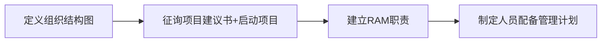

# 第七章 软件项目人力资源管理

### 人力资源是第一资源

**人才才理论发展的五个里程碑**

> 第一里程碑：人的有用才能是经济增长的源泉
>
> 第二里程碑：人力资本是最重要的一种资本
>
> 第三里程碑：资本也包括无形资本
>
> 第四里程碑：人力资本投资收益高于物质资本
>
> 第五里程碑：专业化人力资本才是经济增长的真正动力

**知识经济时代生产力要素的新演绎** 生产力=(劳动者+劳动资料+劳动对象)高科技

我国人力资本投资远低于世界平均水平 人力资本投资明显不足，人力资源开发明显滞后,

### 人员管理的关键

心理学家及管理学家认为，影响人们如何工作和如何更好地工作的心理因素有以下几点：

激励理论 影响力和权利 有效性

#### 激励理论

**马斯洛的需求层次理论**

> 人们的行为受到一系列需求的引导和刺激。人们可以通过努力工作来掌握自己的命运,可以自然地一层一层地达到自己的需求。

安全因素：有社会保障，比如生了病有医保，失业了有保险金

社会因素：和他人之间有良好的关系，比如和朋友有友情，和男/女朋友有爱情，和父母有亲情……

受尊敬：字面意思，做出贡献，让他人尊敬自己

已经满足的因素就不再是激励因素；尚未满足的因素可以激励员工工作

**赫兹伯格的“激励-保健”理论**

> 把影响人们动机的因素分为激励因素和保健因素
>
> > 激励因素：使人们产生工作满意感的因素，如成就认可、晋升
> >
> > 保健因素：造成员工不满情绪的因素。如更高的工资、更好的环境

给予人们激励因素可以让员工更加积极的工作；给予保健因素并不能让员工更加认真的工作，但是不给予这些因素会导致员工不满意（导致员工不想工作）

促使人们工作的因素来源于激励因素。

**麦克利兰的“获得-需求”理论**

成就需求、权力需求、归属需求

**麦格雷戈的X理论和Y理论**

> x理论：人天生不喜欢工作，会尽可能地逃避工作，经理需要采取强迫威胁和各种控制措施
>
> y理论：人不是天生不喜欢工作，而是将工作当作很自然的事情，最有效的奖励就是尊重和自我实现的需求
>
> z理论：强调信任、品质、共同决策和文化价值

#### 影响力和权力

权力是对他人产生预期效果的能力，是将意愿施加于他人身上的支配力量。

- 强制性

- 潜在性

- 与职位相关性

影响力是一种不运用权力就使他人或下属做事的能力。

- 一种追随
- 一种自觉

- 一种认同

- 非制度化

[

#### 提高有效性

Covey 的四个象限：紧急和重要组成的

Covey的七种习惯：积极主动、以终为始、要事第一、双赢思维、**知己知彼(移情倾听）**、统合综效、不断更新

> 这块前几年考过简答题，不过 2024 年没考过。
>
> 如果真的要背这东西，建议去网上搜索一下具体含义，理解着背会舒服一点。

### 人力资源管理内容

包括**计划人力资源管理、组建项目团队、建设项目团队、管理项目团队**

### 制定人力资源计划

产出结果：项目组织结构图、工作定义和分配过程、RAM:责任分配矩阵、资源直方图

### 组建项目团队

组建项目团队是确认可用人力资源并组建项目所需团队的过程

四个象限：

|        | 能力弱 | 能力强 |
| ------ | ------ | ------ |
| 态度好 | 慎用   | 重用   |
| 态度差 | 不用   | 可用   |

#### 资源负荷

特定时间段内，既定进度计划所需的个体资源的数量

#### 资源平衡

一种通过任务延迟来解决资源冲突的技术，在允许的时差范围内移动任务，使各个时段的资源负荷变化达到最小

### 建设项目团队

建设项目团队是提高工作能力、促进团队互动和改善团队氛围，以提高项目绩效的过程

#### 团队建设的目标

- 提高团队成员的知识、能力（能力层面）
- 提高团队成员之间的信任和认同感，以提高士气、减少冲突和增进团队协作；（交流层面）

- 创建富有生气和凝聚力的团队文化，振奋团队精神，促进合作，以分享知识和经验（氛围层面）

### 管理项目团队

管理项目团队通过观察团队成员的表现、提供反馈、对项目绩效进行评价、解决问题并管理变更以优化项目绩效的过程。

解决冲突的方法：

原则：不要刺激对方

- 及时指出问题并记录（不要拖到一定时间再一起告诉）
- 不要批评他人的性格，就事论事
- 表扬对方才能让对方愿意深入交流；让他人进行自我评估，认识到自己的问题

**建议**

制定良好的规章制度

营造积极进取团结向上的工作气氛

建立明确共同的目标

尽量规避团队管理的误区

良好的沟通是解决问题的金钥匙

### 自我测评

- 什么是第一资源？

- 人力资源管理的五个里程碑是什么？
- 生产力的新公式是什么？
- 三个激励理论：马斯洛，赫兹伯格，麦克利兰的内容是什么？
- 什么是影响力和权力？二者存在什么区别？
- 什么是科维的四个象限和七个习惯？
- 人力资源管理包含哪四个步骤？
- 制定人力资源计划的含义是什么，输入是什么，输出是什么？
- 制定人力资源计划的四个步骤是什么？
- 组建项目团队的定义是什么？输入、输出是什么？
- 选择人才的四个象限是什么？对应做什么处理？
- 资源平衡如何完成？
- 建设项目团队的定义是什么？
- 团队成员的成长包含哪四个阶段？在四个阶段中，人的能力和意愿是怎么改变的？
- 团队建设的三个目标是什么？
- 管理项目团队的定义是什么？
- 简单了解解决冲突的五种方法，哪个是最好/最差的？适用场景是什么？