# 第五章 项目时间管理

## 项目时间管理的重要性

- 进度问题是项目生命周期内造成项目冲突的主要原因

  进度问题：不能按时完成任务。

时间：其特点是一维性，是一种特殊的资源。其他特性：

- 供给毫无弹性（每天只有 24 小时，无法「把今天的时间留给下一天用」
- 无法蓄积
- 无法取代
- 无法失而复得（时间浪费了就是浪费了，无法追回）

**项目时间管理**：就是**为了确保项目准时完成所必须的过程**

### 项目时间管理的主要过程

定义活动：将工作分为模块较小的活动，把 WBS 工作包的结果进一步分解。（进一步定义范围）

排序活动：分析各个项目活动间必要的联系，合适的安排进度时间（进一步定义时间）

使用**一些基本的项目管理工具和技术可以改善时间管理：甘特图、网络图、关键路径分析等**

## 计划进度管理

确定将用于计划、执行和控制项目进度的政策、流程和文档

要求：存在项目管理计划、章程，……（左侧列出的几个资料）

后期工作：进度模型等一大堆新堆新的内容。

控制阈值：延期超过多少的时候，认为进度出了问题，开始分析。

## 活动定义

**活动定义**是指识别项目成员和利益相关者为完成项目所必须开展的具体活动

活动定义的主要工作是**分解**。是**对WBS中的工作包进行的进一步分解**，它通过非常详细的确定资源和进度估算产生项目可交付成果

**:label:活动与工作包的区别（重要）** 工作包是可以交付的东西、是产品负责人关心的、最终用户看得到。活动是不可交付的东西，产品负责人不关心，用于给开发人员确定进度的。

活动或任务是项目过程中所从事工作的**基本要素**，清晰地定义工作是所有项目的关键

**活动定义的目标**：确保团队彻底地理解他们所必须从事的工作

## 排序活动

排序活动是指**识别并记录项目活动之间的关系**

通过「图」这一结构，形式化的表达出项目活动之间的关系。

> 上方图片的三个框从左向右依次表示：此步骤所需的资源->对活动排序（寻找活动间的依赖关系）->得到项目网络图（依赖关系图）并更新项目文档

### 活动之间的依赖关系

活动之间有三种逻辑依赖关系

> **强制依赖关系**：又称为硬逻辑关系，是项目工作固有的特性
>
> 比如，必须先设计数据库才能开始编写数据库操作代码，必须先写完代码才能写测试，这种不可能更改的、客观存在的依赖关系称为强制依赖关系。
>
> **自由依赖关系**：又称为软逻辑关系，指的是由项目团队定义的制度
>
> 比如，团队规定通过飞书进行沟通，一周必须开一次全体大会……这种人为确定的规章制度称为自由依赖关系。
>
> **外部依赖关系**：设计项目活动和非项目活动之间的关系
>
> 比如，此项目需要买的深度相机到了才能开展；项目需要一个 ROS 机器人套装才能开展。

### 项目网络图（重点）

#### 任务依赖类型

活动之间存在四种类型的任务依赖

> 完成→开始（Finish-Start）：某活动必须完成，另一活动才能开始
> 完成→完成：A 活动完成后，B 活动才能完成　 
> 开始→开始：A 活动开始后，B 活动才能开始　　 
> 开始→完成：A 活动开始后，B 活动才能结束

#### 项目网络图基本概念

什么是项目网络图？

**项目网络图是项目的所有活动以及它们之间逻辑关系或排序的图形显示。**

> 项目网络图包含两个信息：项目包含哪些活动；项目活动之前存在什么样的依赖关系

项目网络图是活动排序的输出，它有以下作用：

> （1）能表示项目活动，并表明活动之间的依赖关系
> （2）表明项目活动将以什么顺序继续。
> （3）在进行工期估计时，表明项目将需要多长时间。
> （4）当改变某项活动工期时，表明项目工期将如何变化（变更发生时，指出项目总工期会如何变化）

项目网络图有<mark>两种表示形式</mark>：
（1）前导图法PDM
（2）箭线图法ADM

#### 项目网络图的表现形式

两种图选择图的不同部分表达「活动」：箭线图认为图的边代表活动，节点代表项目当前处于某种状态；前导图认为图的节点代表活动，边代表活动之间的联系。

箭线图有固有的缺陷：需要虚拟活动清晰的表示活动间的关系。虚拟活动

## 活动资源估算

估算活动资源是估计项目团队为完成项目活动所需要使用多少资源（人力、设备、材料）

需要一个熟悉项目的人，估算项目各个活动所需的资源

产生**资源分解结构**

## 活动历时估算

估算活动工期是估计完成单个活动需要多长时间

**工期=完成任务时间+间歇时间**

**工期不等于人工量（人时，人日，人月）**

### 估计方法

生产率：生产单位成果/单位资源所需要花费的时间

> 比如写 1000 行代码需要多长时间

参数估计法：活动历时=成果数量*生产率/可用资源数量

三点估算法：平均估算值=（最可能时间*4+最乐观+最悲观）/6

> 用于不确切知道活动花费时间时，估计项目时间的情况

使用估算扑克：每个人自我思考，团队讨论

> 每人发一套写了数字的牌，每个人估算同一个任务所需的时间，并出相应数字的牌，扣在桌面上。所有人出牌完成后，一起翻牌，并相互讨论为何自己认为任务需要这么多时间。

## 制定进度计划

在活动定义、活动排序、活动资源估算和活动历时估计的基础上，综合各个项目活动的开始和结束日期、最终的活动顺序以及工期来确定项目的总体进度计划

### 甘特图

通过日历方式列出项目活动及其相应的开始和结束日期，它为反映项目进度信息提供了一种标准形式。

**里程碑**：黑色的菱形符号

**概要活动**：有箭头的粗黑条

**工期**：浅灰色横条

> 可以通过 mermaid 画，很简单

甘特图还有加强后的变体，通过一个活动末端->下一个活动的连线表达两个活动的关联

### 关键路径分析（重点）

关键路径法(CPM)：又称为关键路径分析，是一种用来预测总体项目历时的网络分析技术。

注意：关键路径**不是项目网络图中最短的路径**（相反，是最长的）

> 一个项目的**关键路径是指一系列决定项目最早完成时间的活动。**
> 关键路径是**项目网络图中最长（时间最长）的路径。**
> 关键路径上任何活动的延迟都会导致整个项目活动时间的延迟。（因为关键路径工期是最长的）
> 但是关键路径长度的缩短未必会导致项目时间的缩短（因为一条路径缩短后，可能出现新的、更长的关键路径）
> 关键路径代表项目完成所需要的最短时间。

查找关键路径实例

> 箭线图法：ADM
>
> 列出所有开始节点-> 结束节点的路径，找出这些路径中工期最长的路径（每个活动的工期一般会标明）（把路径中每个活动花费的工期加起来即可），就得到了关键路径
>
> 纯粹的枚举法，但确实有用。
>
> 前导图法：PDM
>
> 通过检查所有开始活动-结束活动的路径，找出工期最长的路径即可。

#### 常见问题

> :question:关键路径包括最重要的活动？
> :label: NO.关键路径**只与项目的时间维度有关**。“关键”一词并不表明它包含了所有的关键活动

> :question:关键路径是项目网络图从头至尾的最短的路径？
> **:label: NO.对于项目来说，完成每一项活动都是为了完成项目。它与选择最短的路径没有关系**

> :question:一个项目可能有一条以上的关键路径？
> :label: **YES.如果项目有两条长度相同的最长路径吗？路径,它就有两条关键路径**

> :question:关键路径可能发生变化吗？
> **:label: YES.随着项目的进展，随着活动实际花费时间发生变化，关键路径可能会发生变化。**

向关键路径要时间，向非关键路径要资源

> 即尽量缩短关键路径时间，以缩短整个项目的时间；
>
> 非关键路径可能有一些空闲时间（也可以理解为资源多余），出现新需求时，可以减少非关键路径的资源/延长时间，将资源投入给新的项目

#### ==利用关键路径分析平衡进度计划（大题）==

通过跟踪关键路径，项目经理及其团队应该在控制项目进度方面采取一些预防性措施。
平衡进度计划的一项工具是确定每个项目活动的**自由浮动时间和全部浮动时间**，为谈判项目进度计划打下基础。

**关键字:key:**：最早开始日期FS、最早完成日期FF、最晚开始时间LS、最晚完成日期LF、自由浮动时间、全部浮动时间

> FS、FF、LS、LF 就是其字面上的定义

<mark>自由浮动时间</mark>：某项活动的自由浮动时间是指一项活动在不耽误其后继活动的的情况下可以利用的机动时间（所有紧后工作最早开始日期的最小值-FF-1）

<mark>全部浮动时间</mark>：某项活动的全部浮动时间是指一项活动在不影响总项目工期的前提下所利用的机动时间（LF-FF or LS-FS）。

注意所有活动的可用时间**包含日期的两端**，比如 12-4～12-5 号算两天可用时间而非一天。

```mermaid
gantt
dateFormat  m
axisFormat %M
section P1
第一个工作 :0,5
section P2
二:6,7
section P3
三:7,8
section P4
四:8,9
section 总时间
总时间:0,10
```

**举例说明：**

> FS、FF、LS、LF 四个时间在前导图中如上图中 2x2 的表示，在每个框的下方。
>
> 五格图：包含名称、FS、FF、LS、LF；七格图：除五个图的五项之外，还有活动编号的活动历时两部分。（活动历时用 xxxD 表示，后面字符是 D 代表 Day，不是 0；历时内**不算休息日**！）
>
> 每个活动要等待其所有前序活动中最晚的最晚完成时间后一个工作日再开始（如果最晚完成时间是周五，记得下周一才开始）
>
> 周末不算在工作时间内
>
> 关键路径上的浮动时间最短。单个工作的浮动时间：最晚开始时间-最早开始时间 或者 最晚完成时间-最早完成时间（记得去掉其中的工作日）
>
> 全部浮动时间：下减上，表示某条路径上工作共用的浮动时间（一个工作用了，同路径上其他工作就没了）
>
> 自由浮动时间：后减前（后一个活动的最早开始时间-前一个活动的最早完成时间），即最早情况下两个活动可以相差的时间。
>
> 一般来讲，**只有多合一分支的前部节点存在自由浮动时间**，这些节点所在支线具有全部浮动时间。关键路径丧的节点没有任何浮动时间。

三类节点：

- 位于关键路径上的节点（没有全部浮动时间和自由浮动时间）

- 自己不在关键路径，且后续活动不为关键活动的节点（有全部浮动时间，但一定没有自由浮动时间）
- 自己不在关键路径，且后续活动是关键活动的节点（自由浮动时间等于总浮动时间）

> 这相当于说项目间的工作（的最早时间）都是排满的，一个接一个（除了周末），不会故意留出一天来休息；如果一个活动自身不在关键路径上而后面是关键路径，由于关键路径时间最长，这个活动大概率需要额外等待，因此存在自由浮动时间。

#### 缩短工期

缩短项目时间的关键是**缩短关键路径上的活动历时**、给关键路径上的活动分配更多资源（从非关键路径取资源）或变更它们的范围

**赶工**：赶工是一种为了以最少的成本最大限度地压缩工期吗，而在成本和进度之间进行均衡的技术（金钱换时间）

> 通常会提高项目的成本

**快速跟进**：并行执行那些通常是顺序执行的活动（增加风险）

> 缺点是可能会造成增加风险，造成返工，影响项目最终的进度

### 计划评审技术 PERT

计划评审技术(PERT)：当某些活动工期估算存在很大的不确定性时，用来估计项目历时的网络分析技术。

采用概率时间估计，根据乐观的，最可能的，悲观的活动历时估计进行项目历时估计的方法。（代替了具体的，离散的历时估算）

**计算方法**：$PERT加权平均值=(乐观时间+4\times最可能时间+悲观时间)/6$

> 相当于对乐观时间/最可能时间/悲观时间做 1:4:1 的加权平均

**优点**：试图将风险与工期的估计联系起来，降低了工期估算的风险，较为准确

**缺点**：需要几个历时估计值，**工作量较大**，在评估风险方面并非最好的概率方法

### 关键链法

约束理论（TOC，Goldratt）在项目时间管理上的应用

传统项目时间管理方法的问题：

- 学生症候群：不到最后一刻不开工，前面不着急，后面疯狂赶工
- 帕金森定律：工作会不断扩展，直到占用了所有可用的时间。 这意味着，如果你给自己一天的时间来完成一个任务，你就会花一天的时间来做；如果你给自己一个小时的时间，你就会在一个小时内完成

关键链法（CCM）：是一种进度规划方法，允许项目团队在任何项目进度路径上设置缓冲 ,以**应对资源限制和项目不确定性**。这种方法建立在关键路径法之上考虑了资源分配、资源优化、资源平衡和活动历时不确定对关键路径的影响引入了**缓冲和缓冲管理**的概念，示例如下图所示

> 项目缓冲，在关键链末端设置的安全时间（应对进度风险）
> 接驳缓冲，在非关键链与关键链的汇合处设置的安全时间（担心非关键链活动延迟导致关键链活动延迟）
>
> 资源缓冲：关键链上有可能产生资源冲突的任务之前的安全时间（在资源冲突时缓冲）

关键链法砍掉了每个活动的浮动时间，而在部分工作前加上缓冲（如上三种缓冲）

关键链法是从关键路径法的基础上延伸出来的，因此，确定关键路径的方法是相似的。但是在步骤上有区别，关键路径法是直接找出所有路径中最长的一条作为关键路径，而关键链法是**先考虑瓶颈资源，然后进行瓶颈资源平衡，然后形成的那条最长的路径作为关键路径**，同时关键链法需要考虑缓冲区的设置和缓冲区大小的计算。

## 进度控制

控制和管理项目进度的变更
目的是了解进度状况，干预导致进度变更的因确定进度变更的发生并对变更进行管理

**制定一个符合实际的现实的进度计划**是进度控制的关键，可以减少进度管理的工作量。

几个要点：

- 保证项目进度计划是现实的（可实现的）
- 要有纪律和领导来强调遵守并达到项目进度计划的重要性
- 要进行项目工期的优化（缩短工期）

**控制与人有关的进度变更的两种技巧**

> 进度计划的实际检查
>
> 处理人的问题（比如处理团队纪律）

## 课后习题

:one: 快速跟进是一种权衡成本和进度以最小的成本获取最大的进度的技术

> :x: 这是赶工的定义

:two: **跟踪甘特图**可以显示计划和实际项目进度的信息

## 自我测试

- 时间的四个特点是什么？
- 项目时间管理的定义是什么？
- 项目时间管理的主要过程包含什么？
- 什么是计划进度管理？需要什么输入（需要项目管理计划作为输入吗？需要项目范围说明书作为输入吗？）
- 活动定义的主要工作是什么？活动和工作包的区别是什么？目的是什么？（确保团队彻底理解……）
- 项目中从事工作的基本要素是什么？（WBS 是产品负责人和可交付工作的基本要素）
- 活动排序的定义是什么？输出了一种什么样的图？活动间存在哪三种常见的依赖关系？
- 什么是项目网络图？网络图中包含哪四种依赖类型？
- 什么是箭线图和前导图？哪个图的活动在边上？哪个图需要虚拟活动？
- 什么是活动资源估算？产出是什么？
- 什么是活动历时估算？常见的估算方法包含什么？活动历时等于人工量吗？
- 什么是进度安排？输入是什么？（上两部+进度管理计划+项目管理计划）输出是什么？主要包含哪两种方法？
- 什么是关键路径分析？关键路径的定义是什么？为什么说「从关键路径要时间，非关键路径要资源」？
- 什么是自由浮动时间，什么是全部浮动时间？
- 关键路径上的节点具有浮动时间吗？后续节点为关键路径的节点具有自由浮动时间吗？如果是，其自由浮动时间和全部浮动时间有什么关系？后续节点为非关键路径的节点有自由浮动时间吗？有全部浮动时间吗？
- 缩短工期的两种方法是什么？
- 赶工的定义是什么？快速跟进的定义是什么，有什么副作用？
- 计划评审技术（PERT）是什么，旨在解决什么问题？计算公式是什么？
- 关键链法是什么？在关键路径的基础上，把浮动时间砍成了哪三种缓冲，分别在什么位置？其关键路径如何形成？
- 进度控制的定义是什么？关键是什么？