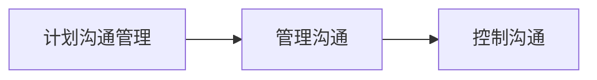
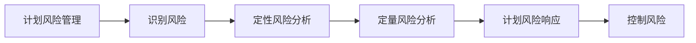
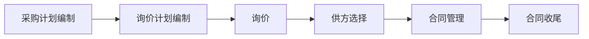

# 软件项目管理最后几章

由于第八章——第十章内容都不多，我把它们合成一个文件记录。

## 软件项目沟通管理

### 项目沟通管理的定义

在项目生命周期，通过适当和及时的生成、采集、储存、处理和发布有关的项目信息，确保项目干系人能够在*正确的时间、地点以正确的方式*获得正确的**信息**的管理过程和活动

项目经理在沟通中起到**中心角色**作用，需要及时发现并排除沟通障碍

**沟通管理的过程**

### 计划沟通管理

计划沟通管理是对项目全过程的沟通工作、沟通方法、沟通渠道等各个方面的计划和

该计划需要根据项目计划实施的结果进行定期的检查，并做必要的调整和补充

#### 识别干系人

识别干系人是识别所有受项目影响以及影响项目的人员或组织，并记录其利益、参与情兄和对项目成功的影响过程。

#### 建立沟通管理计划

### 管理沟通

管理沟通按照沟通管理计划创建、存储、检索和处置项目信息

#### 沟通渠道计算

沟通渠道数量=N(N-1)/2

（N 为团队总人数）

每两个人之间的沟通线路就是一条沟通渠道。

#### 沟通方法和媒介

|          | 典型方法                       | 特点                                       |
| -------- | ------------------------------ | ------------------------------------------ |
| 互动沟通 | 会议、电话、谈判、谈话、打招呼 | 确保共同理解                               |
| 推送沟通 | 邮件、传真、微信、qq           | 确保信息的分发，但是不能保证被收到或被理解 |
| 拉式沟通 | 公告板、网站、信息系统、知识库 | 同上                                       |

需要有效倾听和有效表达

#### 报告绩效

绩效报告是收集并发布绩效信息,从而使项目干系人了解为了取得项目的目标是如何使用资源的(**状态报告、进度报告**、预测)

- 状态报告：介绍项目在某一特定的时间点上所处的位置。如，从达到范围，时间，成本目标上将项目所处的状态。
- 进展报告：介绍项目在某一特定的时间期间内所完成的工作。（每个人月/周单位提交，项目经理汇总）
- 预测：在过去资料和发展趋势的基础上，预测项目未来的状态和进度。（时间，成本）

绩效报告一般有三种形式：

> ●定期项目报告
> ●阶段审查
> ●紧急报告

**状态评审会议**是绩效报告的重要方法之一。

### 控制沟通

监控项目沟通，在整个项目生命周期中确保最佳的信息流

### 改善沟通的建议

尽早沟通、主动沟通

### 课后习题

:one: 在面对面的沟通中，大多数信息是**通过肢体语言**传递的

:two: **邀请更多支持你项目的人，让会议更顺畅地运行**不是帮助改善在会议上花费的时间的指导方针

### 自我测试

- 什么是管理的本质？

- 什么是项目沟通管理？

  > 通过积极发布信息，确保项目干系人在正确的时间地点及时获得相关信息

- 谁是沟通的中心角色？

- 沟通管理分为哪三个部分？

- 计划沟通管理的对象是什么？分为哪两个子工作？

- 识别干系人是什么？对利益高/低，权力高/低的干系人，应该怎么做？

- 管理沟通的定义是什么？n 个人之间存在多少条沟通渠道？（注意除 2）

- 信息发布方法中，互动、推式、拉式沟通的特点是什么，有哪些例子？

- 绩效报告需要报告哪三种内容？什么会议是绩效报告的重要方法？

- 控制沟通是指什么？（不是变更沟通）改善沟通的建议有什么？

## 软件项目风险管理

软件项目风险：为了确保软件项目的成功，我们规范化的控制影响项目成功的因素，辨识（识别风险），描述和消除风险因素

### 风险与风险管理

风险指具有不确定性的事件或情况。一旦发生，会对项目自标产生**积极的或消极**的影响

三要素：**风险事件、风险发生概率、风险结果**

风险是介于确定性和不确定性之间的状态，是处于无知和完整知识之间的状态

### 项目风险管理的主要过程

**项目风险管理的目标**：使潜在的机会或回报最大化、使潜在的损失最小化

### 计划风险管理

计划项目管理是决定如何实施项目风险管理活动的过程（即计划如何管理风险）

风险分解结构实例：

以上内容是项目中可能出现的风险，主要分为技术、外部、组织、项目管理风险四种。

风险概率和影响的定义:

两种定义方法：相对量表（定性，低、中等、高）

数字量表（定量，给出风险概率数字）

### 识别风险

识别风险使判断哪些潜在事件可能损害或增强某个特定项目并记录其特征。

识别方法：根据风险管理计划识别，产出风险登记表

#### 信息搜集技术

头脑风暴法、德尔菲技术(专家调查法)

这两种技术在项目范围管理中提到过。

#### SWOT分析

横轴为事件发生的因素，纵轴为我们处理事件的态度，象限表示事件来源+我们的处理态度会得到什么样的结果。

#### 使用风险识别检查表识别风险

风险识别检查表是基于以前项目所遇到的风险，给出了解当前项目风险的模板

常用于识别IT项目风险的检查表

> 根据项目特性以及项目的产品特性识别风险
>
> 通过项目管理知识领域识别风险

#### 使用图表识别风险

因果图、流程图、影响图

### 定性风险分析

风险定性分析是指评估已识别风险的影响和概率、确定其大小和优先级

#### 用概率和影响矩阵的风险评级

结合风险的概率和影响两方面，依据组织风险承受临界值。将风险分为高、中、低不同等级。

数字量表：红色区域为发生概率高的内容（无论是威胁还是机会）

量表的数字 = 概率 * 影响

上图中，下方这一行就是影响因子

0.1 以上高优先级，0.05-0.1 中优先级，低于 0.05 低优先级（无论是机会还是威胁）

#### 十大风险事项追踪

开发人员、管理人员和用户一起定期审查项目最重大的风险事项，对其状况进行分析。

### 定量风险分析

定量风险分析是就已识别风险对项目整体目标的影响进行定量分析

#### 决策树和期望货币值

**决策树**：在未来收益不确定时，帮助你选择最好的行为方式

**期望货币值EMV**：风险事件概率和风险事件货币值的乘积（类似于概率论的的数学期望）

期望货币值**计算案例**：

期望货币值=风险发生概率 * 风险发生后会损失的金额，相当于每个风险损失金额的期望。

决策树和 EMV 结合计算案例：

下图表示投标决策树可能出现的情况，并计算了投资每个项目的数学期望；投入 Project1 的成功概率为 20%，可以赚 300000 元；80% 的概率没有成功，会浪费标书制作成本 40000 元。可以算出，投资项目一赚钱的数学期望是 28000 元；

同理，可以根据项目二可能出现的投标情况，算出项目二的期望货币值

注意这种情况下，需要计算每个决策的期望货币值，对其进行累加，才能得到此决策的期望货币值。

**投色子的EMV分析**

**决策树分析路线**

计算多个路线的期望，选择最佳路线

#### 风险分析的模拟

用系统的模型或者表示法来分析系统的预期行为或绩效

风险分析模拟技术——蒙特卡洛分析

> 这种分析通过多次模拟一个模型的结果，从而提供计算结果的统计分布

#### 灵敏度分析

通过改变一个或多个变量，观察其对结果的影响，有助于确定哪些风险对项目具有最大的潜在影响

### 风险响应计划

制定风险响应计划就是针对项目目标、制定提高机会、降低威胁的方案和措施的过程。

**根据风险优先级指制定应对措施。**

#### 消极风险或威胁的应对策略

##### 风险规避

发生在决策阶段，通过可行性研究预测和规避风险

> **决策阶段**：可行性研究，不要开始可能存在风险的模块
>
> **实施阶段**：避免引发风险事件的行为

##### 风险转移

缓解风险的一般策略。控制对象包含：

- 会对项目目标产生影响的风险

可以选择向其他项目相关方转移；向专业机构转移

##### 风险承担（接受）

无法消除项目的全部风险行为时，采用风险承担的方法

被动承担：不采取任何措施，风险发生时再随机应变

主动承担：建立应急储备，安排一定的时间、资金或资源来应对风险

##### 风险缓解（控制）

通过减少风险事件发生的概率来缓解风险事件的影响：可以使用成熟的技术、招募有能力的项目成员等

#### 应对积极风险和机会的策略

积极风险就是指「可能出现的机会」。

开发（消除不确定性，确保机会肯定出现，对应规避）、共享（和能帮助项目抓住机会的第三方合作，对应转移）、增强（提高机会发生概率和积极影响，对应缓解）、承担（机会发生时积极利用，但不追求，对应承担）

### 控制风险

控制风险是指**执行风险管理过程**以应对风险事件。

在整个项目中，实施风险响应计划、跟踪已识别风险、监测残余风险、识别新风险和评估风险过程有效性。

### 自我测试

- 什么是项目风险管理？

- 风险的定义是什么？只会对项目产生消极影响吗？风险的三要素是什么？

- 风险管理的过程包含哪六个部分？目标是什么？

- 计划风险管理的内容是什么？给出了风险分解结构和风险识别表，风险识别表中包含了哪些内容？

- 风险识别的定义是什么？有哪四种方法？信息搜集法包含哪两种方法？SWOT 分析横轴纵轴是什么，四个象限表示什么？风险识别检查表是哪里来的？

- 什么是定性风险分析？矩阵分析法的横轴是什么，纵轴是什么，优先级高/中/低的分界大小又是什么？

- 定量风险分析是什么？期望货币值的计算公式是什么？决策树中如何使用期望货币值计算哪个决策最好？

  EMV 的本质就是收益的期望。

- 什么是风险模拟技术，最常见的是？什么是灵敏度分析技术？

- 风险应对计划的定义是什么？对于负面的风险，四个处理方法是什么，具体做什么？对于正面的风险（或称为机会），应当怎么做（四个关键词）？

## 软件项目采购管理

采购是为达成项目范围的工作而从执行组织外部获取商品和服务的各种过程

### 重要性

可以降低成成本

可以使组织把重点放在核心业务

可以得到技能和技术

可以提供经营的灵活性

可以提高责任心

### 项目采购管理的主要过程

六个过程

第二步：产生招标文件

### 计划采购管理

#### 自购-外购决策分析

请专家决定在组织内部制作某些产品or从组织外部购买这些产品

考虑以下几个方面：成本问题（**包括全生命期成本**）、能力问题、可用性、商业秘密等

#### :book:工作说明书

工作说明书是规定项目采购细节的文档，目的是让潜在的卖方确定他们是否有能力提供所需的产品或服务

#### 采购文档

让潜在卖方响应和决定授予评估标准的文件

### 询价

询价就是从潜在的卖方获得建议书或者标书

买方负责为询价做广告，召开投标会议回答询价的潜在问题

### 实施采购

获得卖家响应、选择卖方并授予合同

#### 合同谈判

获得公平合理的价格，与承包商建立良好的合作关系

#### 签署成本（掌握合同类型）

##### 成本加成本百分比合同CPPC

买房给卖方支付完成服务的成本，再加上实现规定的成本百分比作为利润

| CPPC                                        |                             |
| ------------------------------------------- | --------------------------- |
| 估计成本：1000000                           | 百分比：10%（100000）       |
| 估计总价：1100000（估计成本+估计成本的10%） |                             |
| 如果成本增加到1300000，则实际总价为1430000  | 1300000+1300000x10%=1430000 |

**特点**

> 所有合同中买方风险最大的一种，会促使卖方增加成本

##### 成本加固定费合同CPFF

买方给卖方支付完成服务的成本，再加上完成合同时的个固定费用作为利润。例如,

| CPFF                                                      |                  |
| --------------------------------------------------------- | ---------------- |
| 估计成本：1000000                                         | 估计费用：100000 |
| 估计总价：110000（估计成本+固定费用）                     |                  |
| 如果成本增加到1300000，则实际总价为1300000+100000=1400000 |                  |

##### 成本加奖励费合同CPIF

买方给卖方支付完成服务的成本，再加上事先决定的费用和激励奖金作为利润。例如,

| CPIF                                                        |                                                            |
| ----------------------------------------------------------- | ---------------------------------------------------------- |
| 估计成本：1000000                                           | 卖方费用：100000                                           |
| 估计总价：1100000                                           | 分担公式：85/15（买方承担85%，卖方承担15%）                |
| 实际花费：800000（节省200000）                              | 实际花费：1200000（多花200000）                            |
| 卖方得到（费用+节省费用*15%） 100000+200000x15%=130000 | 卖方得到（费用-节省费用*15%） 100000-200000x15%=70000 |
| 买方节省：（节省费用*85%） 200000x85%=170000           | 买方超支：（多花费用*85%） 200000x85%=170000          |

多花了按比例承担，少花了按比例分红

**特点**：适用于需要**长时间**完成的硬件开发或者软件测试

##### 固定总价加激励合同FPIF

买卖双方就完成服务的成本达成一致，并且还包括一个满足或超过既定项目目标的奖励，例如：

超过最高价格还需要倒贴

特点：

- 花费在目标成本下，则按比例分剩下的钱
- 花费大于目标成本但是小于最高价格，按照实际花费付钱
- 花费大于最高价格，按照最高价格给

相对 CFIP（成本加奖励费）多了最高价格的规定：超过此价格买方就不承担成本了。

##### 固定价格合同FFP

**卖方承担最大的风险**，承担了资本超支、履约失败等其他问题。适用于定义了明确的指标和相对确定的成本的项目

##### 单价合同

要求买方向卖方按单位服务的预定金额支付的合同，合同的总金额随完成的总工作量的变而变

特点：

> 通常用于服务采购，其中工作很难具体描述清楚，而且在一张合同里总成本也无法估计。

##### 各类合同的风险

### 控制采购

管理与卖家的关系、合同履约监管并根据市场需要作必要的修改

> 采购合同虽然可以转移风险，但是并不能消除风险

#### 工具和技术

合同变更控制系统CCCS

绩效报告

支付管理系统

#### 问题与对策

### 采购收尾

采购收尾就是对项目进行正式验收，向卖方提供合同已经完成的正式书面通知。

采购收尾过程的内容:

> 进行产品审核，协商解决问题
> 验证所有工作是否被正确地、
> 令人满意地完成
> 更新反映最终成果的记录
> 归档将来会用到的的管理信息

### 自我测试

- 采购管理的定义是什么？
- 采购的六部分是什么？
- 询价的定义是什么？买方需要做什么？
- 合同有哪五种类型？每种的定义是什么？对买方和卖方风险分别有多大？
