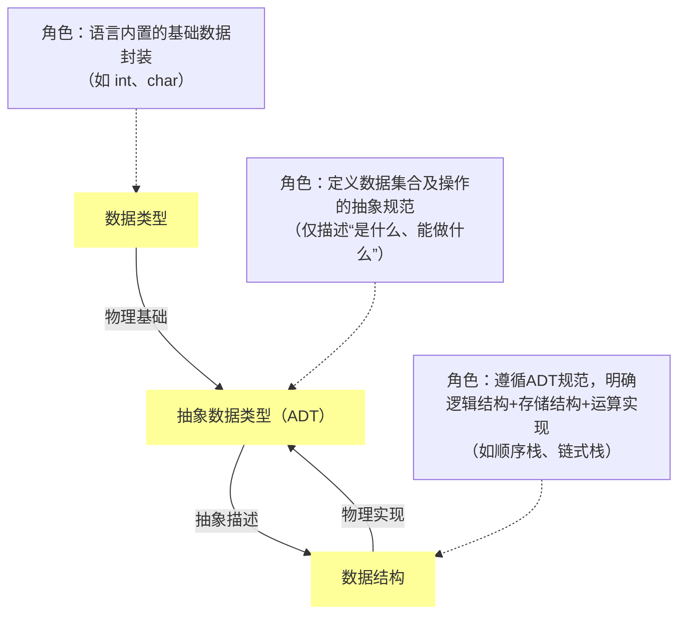

# 1. 数据结构基本概念

## 1.1 数据、数据元素、数据项之间的关系
数据由若干个数据元素组成，而数据元素又由若干个数据项组成。

*   **数据**：是描述客观事物的符号的集合，是信息的载体。
*   **数据元素**：是组成数据的的基本**单位**。在程序中作为整体处理。
*   **数据项**：是数据元素的**组成部分**，是数据中不可分割的**最小单位**。一个数据元素可以由若干个数据项组成。

**关系总结：**
**数据 > 数据元素 > 数据项**

**举例说明：**
一个班级的花名册（**数据**）由许多行记录组成，每一行记录对应一个学生（**数据元素**）。而每个学生的记录又包含了学号、姓名、成绩等（**数据项**）。

## 1.2 数据结构的定义

**数据结构**由某一数据元素的集合以及该集合所有元素的关系组成，记为 `Data_Structure = {D, R}` ，D 是元素集合，R 是元素间关系的有限集合。

## 1.3 数据结构的三要素

一个完整的数据结构包含以下三个要素：**逻辑结构、存储结构、运算**。

1.  **逻辑结构**
    *   **定义**：从逻辑上描述数据元素之间的相互关系，与数据的存储无关，可以看作是抽象意义上的数据结构。
    *   **主要分类**：
        *   **线性结构**：“一对一”。例如：线性表、栈、队列。
        *   **非线性结构**：
            *   **树形结构**：“一对多”。例如：树、二叉树。
            *   **图状/网状结构**：“多对多”。例如：图。

2.  **存储结构**
    *   **定义**：指数据结构在计算机中的实际表示（映像），包括数据元素的表示和关系的表示。
    *   **主要分类**：
        *   **顺序存储**：把逻辑上相邻的元素存储在物理位置上也相邻的存储单元中。优点是随机存取，缺点是可能产生碎片。例如：数组。
        *   **链式存储**：不要求逻辑上相邻的元素在物理位置上也相邻，通过附加的**指针**来表示元素之间的逻辑关系。优点是利用碎片空间，缺点是不能随机存取。例如：链表。
        *   **索引存储**：在存储元素的同时，还建立附加的索引表。通过索引可以快速定位元素。
        *   **散列存储（哈希存储）**：根据元素的关键字通过哈希函数直接计算出该元素的存储地址。

3.  **运算**
    *   **定义**：指施加在数据上的一组操作或算法。它定义了在特定逻辑和存储结构上，允许执行哪些功能。

**三要素关系**：一种**逻辑结构**可以用多种**存储结构**来实现，而不同的存储结构会导致**运算**在实现效率上产生差异。

## 1.4 数据类型、抽象数据类型和数据结构之间的关系

1.  **数据类型**
    *   **定义**：是一组性质相同的值的集合以及定义在这个集合上的一组操作的总称。(一个类型和定义在该类型上的操作)
    *   **作用**：规定了该类型变量的取值范围和所能进行的操作。例如，C语言中的 `int` 类型，其值集是某个区间内的整数，操作集包括加、减、乘、除、取模等。
    *   **本质**：是程序设计语言中为了实现“信息隐藏”和“数据封装”而引入的机制。
2.  **抽象数据类型 ADT** (Abstract Data Type)
    *   **定义**：是指基于一个逻辑类型的数据类型以及这个类型上的一组操作。包含数据对象、数据关系和基本操作。
    *   **核心思想**：**封装**和**分离关切点**。ADT 将**使用**和**实现**分离。使用者只需要关心它做什么（操作），而不需要关心它怎么做（实现细节）。
    *   **表示**：通常用 `(D, S, P)` 三元组表示，其中 D 是数据对象，S 是数据关系，P 是对数据的基本操作集。
    *   **例如**：“线性表”可以看作一个 ADT，它定义了 `InitList`, `Insert`, `Delete`, `GetElem` 等操作，而不管它是用数组还是链表实现的。
3.  **三者之间的关系**
    *   **数据类型是抽象数据类型的物理基础**：ADT 的概念借鉴和扩展了数据类型的思想，将其从内置类型（如int）提升到了用户自定义的复杂逻辑结构（如List, Stack）。
    *   **抽象数据类型是数据结构的抽象描述**：一个 ADT 定义了一个数据结构的**逻辑结构**和**运算**，但不涉及存储结构。例如，“栈”这个 ADT 定义了“后进先出”的逻辑特性和 `push`, `pop` 等操作。
    *   **数据结构是抽象数据类型的物理实现**：当我们用某种编程语言，选择一种**存储结构**来实现 ADT 中定义的所有操作时，我们就得到了一个具体的数据结构。

**关系总结：**
**数据类型 → 抽象数据类型 (ADT) → 数据结构**

