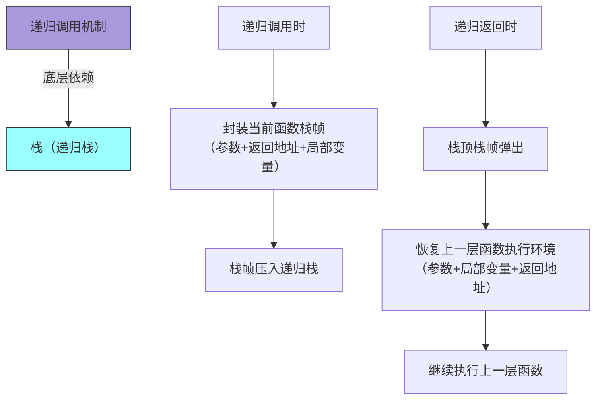

# 3. 线性表(含栈和队列)

## 3.1 线性表的逻辑结构与基本操作

线性表是具有相同数据类型的 $n(n≥0)$ 个数据元素的有限序列，记为 $L=(a_0, a_1, ..., a_{n-1})$。其中：
- $a_0$ 是表头元素 (head)，$a_{n-1}$ 是表尾元素 (tail) 
- 每个元素都有自己的位置
- 除 $a_0$ 外，每个元素有且仅有一个直接前驱
- 除 $a_{n-1}$ 外，每个元素有且仅有一个直接后继
- 数据元素之间是一对一的线性关系

```java
public interface ListADT<E> {
    public void clear();				// 清空表
    public void append(E it);			// 在表尾添加元素
    public void insert(E it);			// 在 cur 插入元素
    public Object remove();				// 删除 cur 的值并返回该位置的元素
    public void setFirst(); 			// 将 cur 设置到表头
    public void next();					// 将 cur 后移
    public void prev();					// 将 cur 前移
    public int length();  				// 获取表实际大小
    public void setPosition(int position);	 	// 将 cur 设置为 pos
    public Object currValue(); 			// 获取 cur 的元素值
    public void setValue(E it);			// 设置 cur 的元素值
    public boolean isInList();			// 判断 cur 是否合规
    public boolean isEmpty(); 			// 判断表是否为空
    public boolean isFull();			// 判断表是否已经满了
    public void print(); 				// 打印表
}
```


## 3.2 顺序表

```java
public class SequentialList<E> implements ListADT<E> {
    private static final int DEFAULT_SIZE = 10;//默认大小

    private int maxSize;//表的最大大小
    private int numInList;//表中的实际元素数
    private int curr;//当前元素的位置
    private E[] listArray; //包含所有元素的数组

    private void setUp(int sz) {//初始化方法
        maxSize = sz;
        numInList = curr = 0;
        listArray = (E[]) new Object[sz];
    }

    public SequentialList() {//默认构造
        setUp(DEFAULT_SIZE);
    }

    public SequentialList(int maxSize) {//限制大小的构造
        setUp(maxSize);
    }

    public void clear() {
        numInList = curr = 0;//元素清空
    }

    /*在当前位置插入一个元素，从curr开始的元素全部向后移动一位
       curr上的元素变为插入的元素
     */
    public void insert(E it) {
        if (isFull()) {
            System.out.println("list is full");
            return;//表满
        } else if (curr<0||curr>numInList) {
            System.out.println("bad value for curr");
            return;//当前位置不合规
        } else {
            for (int i = numInList; i > curr; i--) {
                listArray[i] = listArray[i - 1];
            }
            listArray[curr] = it;
            numInList++;
        }
    }

    //在表尾插入一个元素
    public void append(E it) {
        if (isFull()) {
            System.out.println("list is full");
            return;//表满
        } else {
            listArray[numInList] = it;
            numInList++;
        }
    }

    //删除当前位置的值并返回该位置的元素
    public E remove() {
        if (isEmpty()) {
            System.out.println("list is empty");
            return null;
        } else if (!isInList()) {
            System.out.println("no current element");
            return null;
        } else {
            T it = listArray[curr];
            for (int i = curr; i < numInList - 1; i++) {
                listArray[i] = listArray[i + 1];//元素前移
            }
            numInList--;
            return  it;
        }
    }

    //将当前位置设置到初始位置
    public void setFirst() {
        curr = 0;
    }

    //位置前移
    public void prev() {
        curr--;
    }

    //位置后移
    public void next() {
        curr++;
    }

    //设置当前位置
    public void setPosition(int position) {
        curr = position;
    }

    //设置当前位置的元素值
    public void setValue(E it) {
        if (!isInList()) {
            System.out.println("no current element");
        } else {
            listArray[curr] = it;
        }
    }

    //获取当前位置的元素值
    public E currValue() {
        if (!isInList()) {
            System.out.println("no current element");
            return null;
        } else {
            return listArray[curr];
        }
    }

    //获取顺序表实际大小
    public int length() {
        return numInList;
    }

    //判断当前位置是否合规
    public boolean isInList() {
        return (curr >= 0 && curr < numInList);
    }

    //判断顺序表是否已经满了
    public boolean isFull() {
        return numInList >= maxSize;
    }

    //判断顺序表是否为空
    public boolean isEmpty() {
        return numInList == 0;
    }

    //打印顺序表
    public void print() {
        if (isEmpty()) {
            System.out.println("empty");
        } else {
            System.out.print("(");
            for (setFirst(); isInList(); next()) {
                System.out.print(currValue() + " ");
            }
            System.out.println(")");
        }
    }
}
```

## 3.3 链式存储结构的实现技术 例如单向链表及带头节点的链表
节点结构：每个节点含 “数据域”（存储元素）和 “指针域”（指向后继节点）

单向链表：节点仅存后继指针，逻辑顺序通过指针关联，内存可分散分配
带头节点链表：增设头节点（不存有效数据），统一空表与非空表的操作逻辑，简化边界处理


## 3.4 链表

```java
public class Link <E> {
    //单链表结点类
    private E element;
    private Link next; //指向的下一个结点
    //构造方法
    public Link(E element, Link next) {
        this.element = element;
        this.next = next;
    }

    public Link(Link next) {
        this.next = next;
    }
    //getter和setter
    public E getElement() {
        return element;
    }

    public void setElement(E element) {
        this.element = element;
    }

    public Link getNext() {
        return next;
    }

    public void setNext(Link next) {
        this.next = next;
    }
}
```


```java
public class LinkedList<E> implements ListADT<E> {
    //单链表的定义
    //带有表头结点header node
    private Link<E> head;//头指针
    private Link<E> tail;//尾指针
    protected Link<E> curr;//指向当前元素前驱结点的指针


    private void setUp() {
        tail = head = curr = new Link<>(null);
    }//初始化

    //构造器
    public LinkedList() {
        setUp();
    }

    public LinkedList(int sz) {
        setUp();
    }//忽略size

    @Override
    public void clear() {  //清空所有结点
        head.setNext(null);
        curr = tail = head;
    }

    @Override
    public void insert(E it) {//在当前位置插入元素
        if (curr == null) {
            System.out.println("no current element");
            return;
        } else {
            curr.setNext(new Link(it, curr.getNext()));
            if (tail == curr) {
                tail = curr.getNext();//如果curr是尾部，则tail需要后移
            }

        }

    }

    @Override
    public void append(E it) {//在表的尾部插入元素
        tail.setNext(new Link(it, null));
        tail = tail.getNext();

    }

    @Override
    public E remove() {//删除并返回当前位置的元素值
        if (!isInList()) return null;
        E it = (E) curr.getNext().getElement();
        if (tail == curr.getNext()) tail = curr;//如果是最后一个元素，则要将尾指针前移
        curr.setNext(curr.getNext().getNext());//移除当前元素
        return it;
    }

    @Override
    public void setFirst() {//将当前位置移到开头
        curr = head;
    }

    @Override
    public void prev() {//将当前位置向前移
        if ((curr == null) || (curr == head)) {
            curr = null;
            return;
        }
        Link<E> temp = head;
        while ((temp != null) && temp.getNext() != curr) {
            temp = temp.getNext();//从头开始找，直到指针域指向curr
        }
        curr = temp;
    }

    @Override
    public void next() {//将当前位置往后移
        if (curr != null) curr = curr.getNext();
    }

    @Override
    public void setPosition(int position) {
        curr = head;
        for (int i = 0; (curr != null) && (i < position); i++) {
            curr = curr.getNext();//从头开始找
        }
    }

    @Override
    public void setValue(E it) {//设置当前位置的元素值
        if (!isInList()) {
            System.out.println("no current element");
            return;
        }
        curr.getNext().setElement(it);

    }

    @Override
    public E currValue() {//获取当前位置的元素值
       if(!isInList())return null;
       return (E) curr.getNext().getElement();
    }

    @Override
    public int length() {//获取表的实际大小
        int count=0;
        for (Link temp = head.getNext(); temp!=null ; temp=temp.getNext()) {
            count++;
        }
        return count;
    }

    @Override
    public boolean isInList() {
       return (curr!=null)&&(curr.getNext()!=null);
    }

    @Override
    public boolean isFull() {
        return false;
    }

    @Override
    public boolean isEmpty() {//判断表是否满了
        return head.getNext()==null;
    }

    @Override
    //打印表
    public void print() {
        if (isEmpty()) {
            System.out.println("empty");
        } else {
            System.out.print("(");
            for (setFirst(); isInList(); next()) {
                System.out.print(currValue() + " ");
            }
            System.out.println(")");
        }
    }
}
```

## 3.5 实际应用中不同存储结构的选取判断能力

核心判断逻辑：基于**操作频率、访问方式、内存限制、容量需求**四大核心因素，匹配顺序存储（顺序表）与链式存储（链表）的特性差异，具体选取标准如下：

| 应用场景关键词                | 推荐存储结构 | 核心原因                                                                 |
|-----------------------------|--------------|--------------------------------------------------------------------------|
| 频繁按索引随机**访问**（如查第k个元素、排序后取值） | 顺序表       | 数组下标支持O(1)随机访问，无需遍历，效率远高于链表的O(n)遍历访问           |
| 频繁在中间/头部**插入/删除**（如日志实时插入、队列调度） | 链表（带头节点） | 仅需修改指针域（O(1)操作），无需移动大量元素，规避顺序表的O(n)移动开销     |
| 内存空间紧凑、存储密度要求高（如嵌入式设备、数据量大且无频繁修改） | 顺序表       | 无指针域开销，存储密度100%，链表因指针占用额外内存（存储密度<100%）         |
| 内存碎片多、无法分配连续大块空间（如长期运行的服务） | 链表         | 节点分散存储，无需连续内存，顺序表需连续数组空间，易因内存碎片分配失败     |
| 容量可预测、无需频繁扩容（如固定长度的配置表） | 顺序表       | 初始化时指定容量，避免扩容开销；链表虽无容量限制，但节点创建有额外开销     |
| 频繁尾插/尾删（如栈的基础操作、数据采集缓存） | 顺序表/链表均可 | 顺序表尾插尾删（不扩容时）O(1)，链表尾插（记录尾节点）也O(1)，按需选择     |


1. 若需“查找+修改”高频组合（如学生成绩查询与更新），优先顺序表；
2. 若需“动态增减+遍历”高频组合（如购物车商品添加/删除），优先链表；
3. 顺序表需注意扩容阈值（如原容量1.5倍），避免频繁扩容导致的性能波动；
4. 链表需注意首尾节点记录（如双向链表、循环链表），优化首尾操作效率。


## 3.6 栈与队列的逻辑结构与基本操作

栈的基本操作
```java
public interface StackADT<E> {
    public void clear();//清空栈中所有元素
    public void push(E it);//压栈
    public E pop();//出栈
    public E topValue();//返回栈顶元素
    public boolean isEmpty();//判断栈是否空
    public void print();//打印栈中的所有元素
}
```

队列的基本操作
```java
public interface QueueADT <E>{
    //定义队列的抽象数据类型
    public void clear();//清空队列
    public void enqueue(E it);//入队
    public E dequeue();//出队
    public E firstValue();//；获得队首元素
    public boolean isEmpty();//判断队列是否空
    public boolean isFull();//判断队列是否为满
    public void print();//打印队列
    public int size();//获得队列中实际的元素个数
}
```


## 3.7 顺序栈和队列

顺序栈

```java
public class AStack<E> implements StackADT<E> {
    //构造顺序栈
    private final int DEFAULT_SIZE = 10;
    private int size;//栈最多能容纳的元素个数
    private int top;//可插入位置的下标
    private E[] listArray;//存储栈中元素的数组

    //初始化
    private void setUp(int size) {
        this.size = size;
        top = 0;
        listArray = (E[]) new Object[size];
    }

    //构造器
    public AStack() {
        setUp(DEFAULT_SIZE);
    }

    public AStack(int size) {
        setUp(size);
    }

    @Override
    public void clear() {
        top = 0;
    }

    @Override
    public void push(E it) {
        if (top >= size) {
            System.out.println("stack overflow");
            return;
        }
        listArray[top++] = it;
    }

    @Override
    public E pop() {
        if (isEmpty()){return null;}
        return listArray[--top];//top-1才是存储最顶元素的位置
    }

    @Override
    public E topValue() {
        if (isEmpty()){return null;}
        return listArray[top-1];
    }

    @Override
    public boolean isEmpty() {
        return top==0;
    }

    @Override
    public void print() {
        if (isEmpty()){
            System.out.println("empty");
        }
        for (int i=top-1;i>=0;i--){
            System.out.println(listArray[i]);
        }
    }
}
```


顺序队列

```java
public class AQueue<E> implements QueueADT<E> {
    //定义顺序队
    private static final int DEFAULT_SIZE=10;
    private int max_size;//定义队列的实际最大容纳量+1
    private int size;//队列中实际的元素个数
    private int front;//队首元素的前驱元素下标
    private int rear;//队尾元素下标
    private E[] listArray;//存储元素的下标
    
    private void setUp(int size){
        this.max_size=size+1;
        front=rear=0;
        listArray=(E[])new Object[size+1];
    }

    public AQueue() {
        setUp(DEFAULT_SIZE);
    }
    public AQueue(int size){
        setUp(size);
    }

    @Override
    public void clear() {//清空队列元素
        front=rear=0;
    }

    @Override
    public void enqueue(E it) {//进队
        if (isFull()){
            System.out.println("queue is full!");
            return;//队列已经满了
        }
        rear=(rear+1)%max_size;
        listArray[rear]=it;
        this.size++;
    }

    @Override
    public E dequeue() {//出队
        if (isEmpty()){
            System.out.println("queue is empty");
            return null;
        }
        front=(front+1)%max_size;
        size--;
        return listArray[front];
        
    }

    @Override
    public E firstValue() {
        if (isEmpty()){
            System.out.println("queue is empty");
            return null;
        }
        return listArray[(front+1)%max_size];
    }

    @Override
    public boolean isEmpty() {
        return front==rear;
    }

    @Override
    public boolean isFull() {
        return front==(rear+1)%max_size;
    }

    @Override
    public void print() {
        if (isEmpty()){
            System.out.println("queue is empty");
            return;
        }
        int temp= front+1;
        while((temp%max_size)!=rear){
            System.out.print(listArray[temp]+" ");
            temp++;
        }
        System.out.println(listArray[temp]);
    }

    @Override
    public int size() {
        return this.size;
    }
}
```


## 3.8 链栈和队列

首先定义链表

```java
public class Link <E> {
    //结点类
    private E element;
    private Link next; //指向的下一个结点
    //构造方法
    public Link(E element, Link next) {
        this.element = element;
        this.next = next;
    }

    public Link(Link next) {
        this.next = next;
    }
    //getter和setter
    public E getElement() {
        return element;
    }

    public void setElement(E element) {
        this.element = element;
    }

    public Link getNext() {
        return next;
    }

    public void setNext(Link next) {
        this.next = next;
    }
}

```


链栈

```java
public class LStack<E> implements StackADT<E> {
    private Link<E> top;//栈顶元素

    //初始化与构造器
    private void setUp() {
        top = null;
    }

    public LStack() {
        setUp();
    }

    public LStack(int size) {
        setUp();
    }

    @Override
    public void clear() {
        top = null;
    }

    @Override
    public void push(E it) {
        top = new Link<E>(it, top);
    }

    @Override
    public E pop() {
        if (isEmpty()) {
            System.out.println("stack is empty");
            return null;
        }
        E it = top.getElement();
        top = top.getNext();
        return it;
    }

    @Override
    public E topValue() {
        if (isEmpty()) {
            System.out.println("no top value");
            return null;
        }
        return top.getElement();
    }

    @Override
    public boolean isEmpty() {
        return top == null;
    }

    @Override
    public void print() {
        if (isEmpty()) {
            System.out.println("empty");
            return;
        }
        Link<E> temp = top;
        while (temp != null) {
            System.out.println(temp.getElement());
            temp = temp.getNext();
        }
    }
}
```


链队列
```java
public class LQueue<E> implements QueueADT<E> {
    private Link<E> front;//指向队首元素的指针
    private Link<E> rear;//指向队尾元素的指针
    private int size=0;//队列中实际的元素个数

    private void setUp() {
        front = rear = null;
    }

    public LQueue() {
        setUp();
    }

    public LQueue(int size) {
        setUp();
    }

    @Override
    public void clear() {
        front = rear = null;
    }

    @Override
    public void enqueue(E it) {//进队
        if (isEmpty()) {
            front = rear = new Link<E>(it, null);//队列为空
        } else {
            rear.setNext(new Link<E>(it, null));
            rear = rear.getNext();//尾指针后移
        }
        size++;

    }

    @Override
    public E dequeue() {//出队
        if (isEmpty()) {
            System.out.println("queue is empty");
            return null;
        }
        E it = front.getElement();
        front = front.getNext();
        if (front == null) rear = null;//如果队空了，也要将尾指针设为null
        size--;
        return it;
    }

    @Override
    public E firstValue() {
        if (isEmpty()) {
            System.out.println("queue is empty");
            return null;
        }
        return front.getElement();
    }

    @Override
    public boolean isEmpty() {
        return front == null;
    }

    @Override
    public boolean isFull() {
        return false;
    }

    @Override
    public void print() {
        if (isEmpty()) {
            System.out.println("queue is empty");
            return;
        }
        Link<E> temp = front;
        if (temp == rear) {
            System.out.println(temp.getElement());
            return;
        }
        while (temp != rear) {
            System.out.print(temp.getElement() + " ");
            temp = temp.getNext();
        }
        System.out.println(temp.getElement());
    }

    @Override
    public int size() {
        return size;
    }
}
```


## 3.9 顺序存储结构中循环队列的实现具体要求

- 存储基础：基于数组实现，通过“循环复用数组空间”避免普通顺序队列的“假溢出”问题
- 核心设计要求
  1. 指针定义：`front`（队首指针，指向队首元素）、`rear`（队尾指针，指向队尾元素的下一个空位置）
  2. 判空与判满设计：判空 `front == rear`，判满 `(rear + 1) % size == front`
  3. 容量设计：数组容量固定（或支持扩容），初始化时指定最大容量
- 基本操作要求：
  - 入队：先判满，再将元素存入rear位置，`rear = (rear + 1) % size`
  - 出队：先判空，再取出front位置元素，`front = (front + 1) % size`
  - 取队首：判空后直接返回数组[front]，不移动指针
  - 清空：`front = rear = 0`（或 `size = 0`）

其实就是在普通的顺序队列的所有操作加上**取模**


## 3.10 递归调用和栈之间的关系

- 核心关联：递归调用的执行机制完全依赖“栈”（称为“递归栈”），**栈是递归实现的底层支撑**
- 具体对应关系：
	- 递归调用 ⇔ 入栈操作
	- 递归返回 ⇔ 出栈操作
	- 递归深度 ⇔ 栈的最大深度
	- 执行顺序：递归调用顺序 → 栈的入栈顺序；递归返回顺序 → 栈的出栈顺序（LIFO特性匹配）
- 关键注意：递归深度过大会导致“栈溢出”（栈空间不足）


- 实例：计算 `n!` 的递归调用
```
// 计算factorial(3)时的调用栈变化：
// 初始：空栈
// 调用factorial(3): 压入(3, 返回地址)
// 调用factorial(2): 压入(2, 返回地址)
// 调用factorial(1): 压入(1, 返回地址) - 递归基
// 返回1: 弹出factorial(1)的信息
// 返回2: 弹出factorial(2)的信息
// 返回6: 弹出factorial(3)的信息
```


- **任何递归算法都可以通过显式栈转换为非递归算法**
```java
// 递归版本的深度优先遍历
public void dfsRecursive(Node node) {
    if (node == null) return;
    visit(node);
    dfsRecursive(node.left);
    dfsRecursive(node.right);
}

// 非递归版本使用显式栈
public void dfsIterative(Node root) {
    if (root == null) return;
    Stack<Node> stack = new Stack<>();
    stack.push(root);
    
    while (!stack.isEmpty()) {
        Node node = stack.pop();
        visit(node);
        if (node.right != null) stack.push(node.right);
        if (node.left != null) stack.push(node.left);
    }
}
```

## 3.11 栈和队列的经典应用

- 栈的经典应用（基于LIFO：后进先出特性）
	1. 括号匹配校验（如LeetCode 20题）：左括号入栈，右括号与栈顶左括号匹配则出栈，最终栈空则合法
	2. 表达式求值（前缀/中缀/后缀表达式）：中缀转后缀用栈存储运算符，后缀求值用栈存储操作数
	3. 函数调用栈：JVM中方法递归/嵌套调用时，用栈保存方法栈帧（参数、返回地址等）
	4. 深度优先搜索（DFS）：用栈存储待访问节点，回溯时弹出节点，遍历图/树的所有路径
	5. 浏览器前进后退功能：两个栈分别存储“前进历史”和“后退历史”，切换时转移栈中元素
- 队列的经典应用（基于FIFO：先进先出特性）
	1. 广度优先搜索（BFS）：用队列存储待访问节点，按层级遍历图/树（如二叉树层序遍历、最短路径求解）
	2. 任务调度（如线程池、消息队列）：按提交顺序依次执行任务，避免任务抢占导致的无序问题
	3. 缓冲队列（如IO缓冲、网络数据传输）：暂时存储突发的大量数据，按顺序处理，缓解处理模块压力
	4. 生产者-消费者模型：队列作为数据缓冲区，生产者入队数据，消费者出队数据，解耦生产与消费节奏
	5. 循环队列的实际应用：打印机任务队列、网络请求排队处理（利用循环复用空间的高效特性）


## 补充：3.12 java.util中的 Queue Deque Stack 

Queue
```java
// 使用LinkedList作为队列
Queue<Integer> queue1 = new LinkedList<>();
// 使用ArrayDeque作为队列
Queue<Integer> queue2 = new ArrayDeque<>();

// Queue 接口方法
boolean add(E e);           // 添加元素到队列尾部，失败抛异常
boolean offer(E e);         // 添加元素到队列尾部，失败返回false
E remove();                 // 移除并返回头部元素，空队列抛异常
E poll();                   // 移除并返回头部元素，空队列返回null
E element();                // 返回头部元素但不移除，空队列抛异常
E peek();                   // 返回头部元素但不移除，空队列返回null
boolean isEmpty();          // 判断队列是否为空
int size();                 // 返回队列元素数量
void clear();               // 清空队列
boolean contains(Object o); // 判断是否包含某元素
```

Deque
```java
// 使用ArrayDeque作为双端队列
Deque<Integer> deque1 = new ArrayDeque<>();
// 使用LinkedList作为双端队列
Deque<Integer> deque2 = new LinkedList<>();

// Deque 接口方法
// 继承自Queue的方法（一般不用，但因为Deque继承自Queue所以必须实现）
// （操作头部）：
E remove();     // 等价于 removeFirst() - 移除并返回头部元素
E poll();       // 等价于 pollFirst()   - 移除并返回头部元素
E element();    // 等价于 getFirst()    - 返回头部元素但不移除
E peek();       // 等价于 peekFirst()   - 返回头部元素但不移除
//（操作尾部，保持FIFO）：
boolean add(E e);    // 等价于 addLast(e)   - 添加到尾部
boolean offer(E e);  // 等价于 offerLast(e) - 添加到尾部

// 以下是Deque新增的方法：

// 头部操作
void addFirst(E e);
boolean offerFirst(E e);
E removeFirst();
E pollFirst();
E getFirst();
E peekFirst();

// 尾部操作
void addLast(E e);
boolean offerLast(E e);
E removeLast();
E pollLast();
E getLast();
E peekLast();

// 栈操作
void push(E e);
E pop();

// 双向迭代
Iterator<E> descendingIterator();

// 删除特定元素
boolean removeFirstOccurrence(Object o);
boolean removeLastOccurrence(Object o);
```
Stack：**Stack 类已过时——Java官方推荐使用 Deque 实现栈**

*为什么用 Deque 替代 Stack：
- Stack 继承自 Vector，是同步的，性能较差
- Stack 允许在任意位置插入删除，不符合栈的抽象
- Deque 提供了更清晰、更高效的栈操作

```java
// 使用Deque作为栈（推荐替代Stack类）
// 推荐：使用ArrayDeque作为栈
Deque<Integer> stack = new ArrayDeque<>();

// 压栈（将元素推入栈顶）
void push(E e);          // 等效于 addFirst(e)

// 弹栈（移除并返回栈顶元素）
E pop();                 // 等效于 removeFirst()

// 查看栈顶元素（不移除）
E peek();                // 等效于 peekFirst()

// 栈的基本操作（继承自Collection）
boolean isEmpty();       // 判断栈是否为空
int size();              // 返回栈中元素个数
void clear();            // 清空栈
boolean contains(Object o); // 判断是否包含某元素

// 注意：Deque作为栈使用时没有search()方法
```

另外实际上现在都推荐使用 ArrayDeque:

```java
// 现代Java开发的最佳选择：

// 1. 栈：ArrayDeque
Deque<T> stack = new ArrayDeque<>();

// 2. 队列：ArrayDeque
Queue<T> queue = new ArrayDeque<>();

// 3. 双端队列：ArrayDeque  
Deque<T> deque = new ArrayDeque<>();

// 4. 优先级队列：PriorityQueue
Queue<T> pq = new PriorityQueue<>();

// 5. 并发队列：ConcurrentLinkedQueue
Queue<T> concurrentQueue = new ConcurrentLinkedQueue<>();
```