# 4. 二叉树 树和森林

## 4.1 二叉树、树和森林的定义及三者之间的异同点

- **二叉树（Binary Tree）**：n（n≥0）个节点的有限集合，每个节点最多有两个子树（左子树、右子树），**子树有左右顺序之分**

- **树（Tree）**：n（n≥0）个节点的有限集合，存在唯一 “根节点”，其余节点划分为互不相交的子树（n=0 时为空树），**子树之间没有次序关系。**

- **森林（Forest）**：m（m≥0）棵互不相交的树的集合（m=0 时为空森林，单棵树可视为 m=1 的森林）

**三者之间的异同点**：

| 特征 | 二叉树 | 树 | 森林 |
|------|--------|----|------|
| **结点度数** | 每个结点最多2度（0,1,2） | 每个结点度数无限制 | 每棵树的结点度数无限制 |
| **子树次序** | 左、右子树有严格次序 | 子树无次序关系 | 树与树之间无次序关系 |
| **基本结构** | 递归定义为根+左子树+右子树 | 递归定义为根+子树集合 | 多棵互不相交的树 |
| **空结构** | 允许空二叉树（n=0） | 允许空树（n=0） | 允许空森林（m=0） |
| **相互关系** | 树的特例 | 森林加根成为树，树去根成为森林 | 树的集合 |


## 4.2 二叉树的四种遍历以及相关操作

二叉树节点定义：
```java
class TreeNode<T> {
    T val;
    TreeNode<T> left;
    TreeNode<T> right;
    public TreeNode(T val) {
        this.val = val;
        this.left = null;
        this.right = null;
    }
}
```

1. 前序遍历（根→左→右）
```java
// 递归版
public void preOrder(TreeNode<T> root, List<T> result) {
    if (root == null) return;
    result.add(root.val); // 访问根
    preOrder(root.left, result); // 遍历左子树
    preOrder(root.right, result); // 遍历右子树
}
```

2. 中序遍历（左→根→右）
```java
// 递归版
public void inOrder(TreeNode<T> root, List<T> result) {
    if (root == null) return;
    inOrder(root.left, result); // 遍历左子树
    result.add(root.val); // 访问根
    inOrder(root.right, result); // 遍历右子树
}
```

3. 后序遍历（左→右→根）
```java
// 递归版
public void postOrder(TreeNode<T> root, List<T> result) {
    if (root == null) return;
    postOrder(root.left, result); // 遍历左子树
    postOrder(root.right, result); // 遍历右子树
    result.add(root.val); // 访问根
}
```

4. 层序遍历（按层级从左到右，基于队列实现）
```java
public void levelOrder(TreeNode<T> root, List<T> result) {
    if (root == null) return;
    Queue<TreeNode<T>> queue = new LinkedList<>();
    queue.offer(root);
    while (!queue.isEmpty()) {
        TreeNode<T> node = queue.poll();
        result.add(node.val); // 访问当前层节点
        if (node.left != null) queue.offer(node.left); // 左孩子入队
        if (node.right != null) queue.offer(node.right); // 右孩子入队
    }
}
```

**核心操作**

1. 求二叉树节点总数（后序遍历）
```java
public int countNodes(TreeNode<T> root) {
    if (root == null) return 0;
    // 1. 先遍历左子树，求左子树节点数（左）
    int leftCount = countNodes(root.left);
    // 2. 再遍历右子树，求右子树节点数（右）
    int rightCount = countNodes(root.right);
    // 3. 最后处理根：当前树的节点数 = 左 + 右 + 1（根自己）（处理根）
    return leftCount + rightCount + 1;
}
```

前序遍历版：

```java
// 前序版求节点总数（逻辑能跑，但顺序变了）
public int countNodesPre(TreeNode<T> root) {
    if (root == null) return 0;
    // 1. 先处理根：计数+1（处理根）
    int count = 1;
    // 2. 遍历左子树，累加左子树节点数（左）
    count += countNodesPre(root.left);
    // 3. 遍历右子树，累加右子树节点数（右）
    count += countNodesPre(root.right);
    return count;
}
```


2. 求二叉树深度（后序遍历）
```java
public int treeDepth(TreeNode<T> root) {
    if (root == null) return 0;
    // 1. 遍历左子树，求左子树深度（左）
    int leftDepth = treeDepth(root.left);
    // 2. 遍历右子树，求右子树深度（右）
    int rightDepth = treeDepth(root.right);
    // 3. 处理根：当前树深度 = 左右子树最大深度 + 1（根自己的层）（处理根）
    return Math.max(leftDepth, rightDepth) + 1;
}
```

3. 查找指定值节点（前序遍历）
```java
public TreeNode<T> findNode(TreeNode<T> root, T target) {
    if (root == null) return null;
    // 1. 先处理根：检查当前根是不是要找的目标（处理根）
    if (root.val.equals(target)) return root;
    // 2. 根不是，遍历左子树找（左）
    TreeNode<T> leftFind = findNode(root.left, target);
    if (leftFind != null) return leftFind;
    // 3. 左子树没找到，遍历右子树找（右）
    return findNode(root.right, target);
}
```

4. 构建二叉树（基于前序+中序遍历结果）
```java
public TreeNode<Integer> buildTree(int[] preOrder, int[] inOrder) {
    if (preOrder.length == 0 || inOrder.length == 0) return null;
    // 前序第一个元素为根节点
    TreeNode<Integer> root = new TreeNode<>(preOrder[0]);
    // 找到中序中根节点的索引，划分左右子树
    int rootIdx = 0;
    for (int i = 0; i < inOrder.length; i++) {
        if (inOrder[i] == root.val) {
            rootIdx = i;
            break;
        }
    }
    // 递归构建左右子树
    root.left = buildTree(Arrays.copyOfRange(preOrder, 1, rootIdx + 1),
                          Arrays.copyOfRange(inOrder, 0, rootIdx));
    root.right = buildTree(Arrays.copyOfRange(preOrder, rootIdx + 1, preOrder.length),
                           Arrays.copyOfRange(inOrder, rootIdx + 1, inOrder.length));
    return root;
}
```

5. 验证二叉搜索树（中序遍历特性：结果递增）
```java
private TreeNode<Integer> prev = null;
public boolean isValidBST(TreeNode<Integer> root) {
    if (root == null) return true;
    // 1. 先遍历左子树，校验左子树是否合法（左）
    if (!isValidBST(root.left)) return false;
    // 2. 处理根：校验当前根是否比前一个节点大（中序遍历结果要递增）（处理根）
    if (prev != null && root.val <= prev.val) return false;
    prev = root; // 记录当前根，作为下一个节点的“前一个节点”
    // 3. 再遍历右子树，校验右子树是否合法（右）
    return isValidBST(root.right);
}
```

**遍历方式的选择依据**：
- 需要先访问父结点再访问子结点时使用前序遍历
- 需要按照排序顺序访问二叉搜索树时使用中序遍历
- 需要先处理子结点再处理父结点时使用后序遍历
- 需要按层级处理结点时使用层次遍历


## 4.3 二叉树采用顺序存储结构和链式存储结构的差异性

- 顺序存储结构：以**数组**为底层载体，按“层序遍历顺序”存储二叉树节点，通过数组索引映射节点的父子关系，*空节点需占用数组位置*（或用特殊值标记）。
- 链式存储结构：以**节点**为基本单元（每个节点含“数据域”+“左指针域”+“右指针域”），节点间通过指针关联父子关系，内存可分散分配，空指针表示无左/右子树。


| 对比维度               | 顺序存储结构                          | 链式存储结构                          |
|------------------------|---------------------------------------|---------------------------------------|
| 存储逻辑               | 依赖数组索引映射父子关系，物理存储连续 | 依赖指针关联父子关系，物理存储分散     |
| 适用二叉树类型         | 完全二叉树/满二叉树（空间无浪费）     | 任意二叉树（含斜树、稀疏二叉树）      |
| 空间利用率             | 完全二叉树：100%；普通二叉树：大量空闲位置（浪费严重） | 仅存储有效节点+指针，无空闲浪费，空间利用率高 |
| 访问节点效率（父/子）  | **O(1)**（通过索引直接计算，无需遍历）    | **O(n)**（需从根节点开始遍历查找目标节点） |
| 插入/删除节点效率      | **O(n)**（可能需移动数组元素，或扩容）    | **O(1)**（找到目标节点后，仅需修改指针）  |
| 扩容/伸缩性            | 固定容量（需提前分配），扩容需复制数组 | 动态伸缩（按需创建/释放节点），无扩容开销 |
| 空节点处理             | 占用数组位置（或特殊值标记）          | 指针置空，不占用额外空间              |
| 实现复杂度             | 简单（无需处理指针，仅数组操作）      | 稍复杂（需管理指针，避免空指针异常）  |
| 内存要求               | 需连续大块内存（数组特性）            | 无需连续内存，支持分散分配            |

1. 顺序存储的“索引映射规则”：仅适用于完全二叉树，若为普通二叉树（如斜树），数组会出现大量空闲位置（例如斜树 $n$ 个节点，需占用数组 $2^{n-1}$ 个位置），空间浪费极严重。
2. 链式存储的扩展能力：支持灵活扩展为“三叉链表”（增加“父指针域”），方便回溯父节点（如二叉树遍历中的回溯操作），而顺序存储无法直接支持该扩展。
3. 操作效率的核心差异：顺序存储的优势是“随即访问”（如快速获取第k层第m个节点），链式存储的优势是“动态修改”（如插入新节点、删除叶子节点）。
4. 实际应用场景：顺序存储常用于堆排序（基于完全二叉树的堆结构）、优先队列；链式存储常用于二叉树遍历、动态构建任意结构二叉树（如表达式树、搜索树）。

顺序存储：

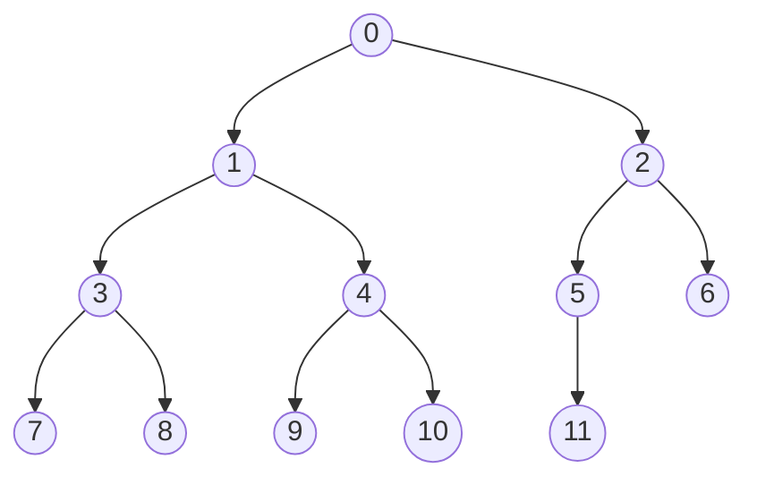
对于节点 $r$
- `parent(r) = (r - 1) / 2 ` (0<r<n)
- `leftchild(r) = 2r + 1` (2r+1<n)
- `rightchild(r) = 2r + 2` (2r+2<n)
- `leftsibling(r) = r - 1` (r 为偶数且 0<r<n)
- `rightsibling(r) = r + 1` (r 为奇数且 r+1<n)


| 结点 | 0 | 1 | 2 | 3 | 4 | 5 | 6 | 7 | 8 | 9 | 10 | 11 |
|-----------|---|---|---|---|---|---|---|---|---|---|----|----|
| 父结点     | – | 0 | 0 | 1 | 1 | 2 | 2 | 3 | 3 | 4 | 4  | 5  |
| 左子结点   | 1 | 3 | 5 | 7 | 9 | 11| – | – | – | – | –  | –  |
| 右子结点   | 2 | 4 | 6 | 8 | 10| – | – | – | – | – | –  | –  |
| 左兄弟结点 | – | – | 1 | – | 3 | – | 5 | – | 7 | – | 9  | –  |
| 右兄弟结点 | – | 2 | – | 4 | – | 6 | – | 8 | – | 10| –  | –  |

### 链式二叉树的实现

结点类
```java
public class BinNodePtr {
    //链式二叉树的结点类
    private Object element;		//存储数据的元素
    private BinNodePtr left;	//左子结点
    private BinNodePtr right;	//右子结点

    //constructor部分
    public BinNodePtr(){}
    public BinNodePtr(Object element){this.element = element;}
    public BinNodePtr(Object element, BinNodePtr l, BinNodePtr r){
    	this.element = element;
		left = l; right = r;
	}

    //getter与setter部分
    public Object getElement() {return element;}
    public void setElement(Object element) {this.element = element;}

    public BinNodePtr getLeft() {return left;}
    public void setLeft(BinNodePtr left) {this.left = left;}

    public BinNodePtr getRight() {return right;}
    public void setRight(BinNodePtr right) {this.right = right;}
    
    public boolean isLeaf() {
        return (left == null) && (right == null);
    }		
   
    public String toString() {
        return "BinNodePtr{" +
                "element=" + element +
                '}';
    }
}
```


## 4.4 二叉检索树、Huffman编码树及堆的实现
### Huffman编码树
**Huffman编码**：一种不等长编码。高频字符用短码，低频用长码，保证无歧义，且总编码长度最短。

- 基本概念
	- **路径长度**：从根结点到某结点所经过的边数。
	- **外部路径长度**：树中所有**叶子结点**到根节点的路径长度之和。
	- **内部路径长度**：树中所有**非叶子结点**到根节点的路径长度之和。
	- **带权路径长度**：树中所有 **叶子结点的权值**$\times$到根节点的路径 之和。
- Huffman编码树的构建流程
	1. 根据给定的n个权值{W₁, W₂…, Wₙ}，构造n棵二叉树的集合F = {T₁, T₂,…, Tₙ}，其中每棵二叉树中均只含一个带权值为Wᵢ的根结点，其左、右子树为空树；
	2. 在F中选取其根结点的权值为最小（通过 `hufflist` 维护）的两棵二叉树，分别作为左、右子树构造一棵新的二叉树，并置这棵新的二叉树根结点的权值为其左、右子树根结点的权值之和；
	3. 从F中删去这两棵树，同时加入刚生成的新树；
	4. 重复(2)和(3)两步，直至F中只含一棵树为止

- **图解样例** `happy every weekend` （忽略空格）
步骤0：初始状态
初始列表按权重排序：h:1, a:1, v:1, r:1, w:1, k:1, n:1, d:1, p:2, y:2, e:5

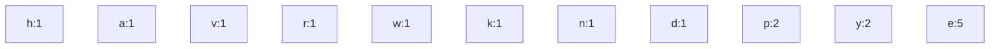

步骤1：合并h(1)和a(1)
移除h和a，合并为(h+a):2，插入到p:2之前

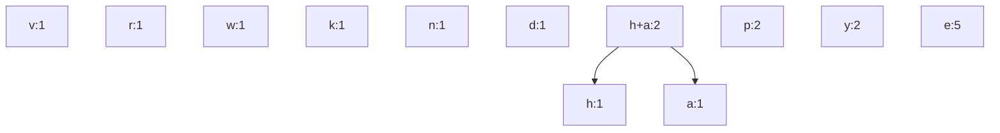

步骤2：合并v(1)和r(1)
移除v和r，合并为(v+r):2，插入到p:2之前

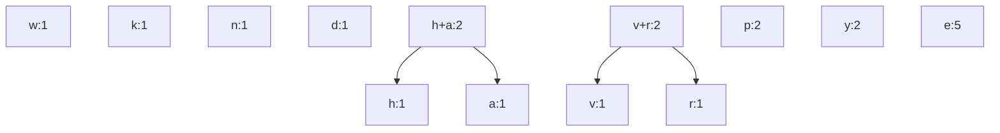

步骤3：合并w(1)和k(1)
移除w和k，合并为(w+k):2，插入到p:2之前

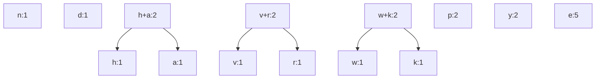

步骤4：合并n(1)和d(1)
移除n和d，合并为(n+d):2，插入到p:2之前

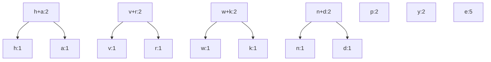

步骤5：合并p(2)和y(2)
移除p和y，合并为(p+y):4，插入到e:5之前

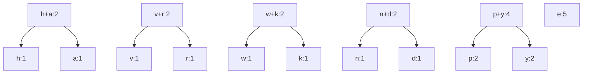

步骤6：合并(h+a)(2)和(v+r)(2)
移除(h+a)和(v+r)，合并为(h+a+v+r):4，插入到e:5之前

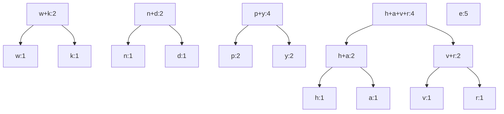

步骤7：合并(w+k)(2)和(n+d)(2)
移除(w+k)和(n+d)，合并为(w+k+n+d):4，插入到e:5之前（权重4<5）

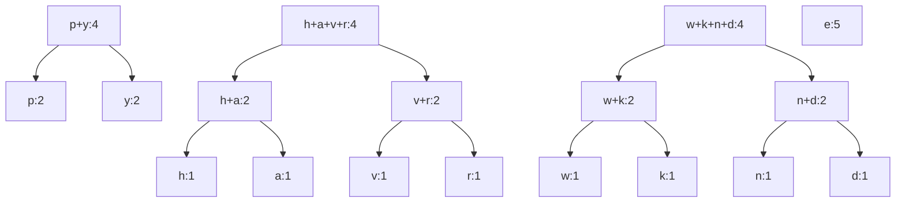
步骤8：合并(p+y)(4)和(h+a+v+r)(4)
移除(p+y)和(h+a+v+r)，合并为(p+y+h+a+v+r):8，插入到e:5之后（权重8>5）

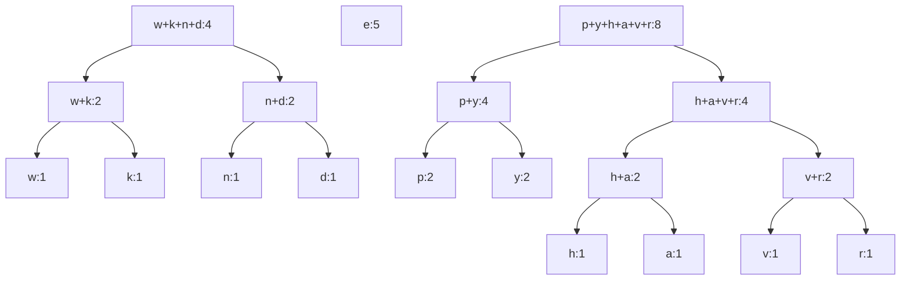

步骤9：合并(w+k+n+d)(4)和e(5)
移除(w+k+n+d)和e，合并为(e+w+k+n+d):9，插入到(p+y+h+a+v+r):8之后（权重9>8）

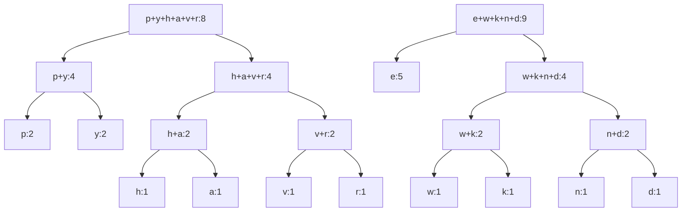

步骤10：合并(p+y+h+a+v+r)(8)和(e+w+k+n+d)(9)
移除最后两个元素，合并为最终Huffman树(根:17)

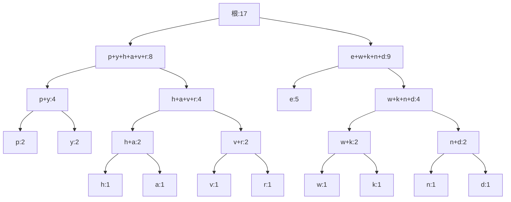

代码实现
```java
// 字母-频率配对类：存储单个字符及其出现频率
class LettFreq { 
    private char lett;  // 存储的字母
    private int freq;   // 该字母的出现频率

    // 构造方法1：初始化字母和对应的频率
    public LettFreq(int f, char l) { 
        freq = f; 
        lett = l; 
    }

    // 构造方法2：仅初始化频率（用于哈夫曼树的中间节点，无实际字母）
    public LettFreq(int f) { 
        freq = f; 
    }

    // 返回当前对象的频率（作为哈夫曼树节点的权重）
    public int weight() { 
        return freq; 
    }

    // 返回当前对象对应的字母
    public char letter() { 
        return lett; 
    }
} // end class LettFreq
```
```java
// 哈夫曼树类：表示一棵哈夫曼编码树
class HuffTree { 
    private BinNode root;  // 哈夫曼树的根节点（BinNode是二叉树节点的自定义类型）

    // 构造方法1：创建仅含一个节点的哈夫曼树（对应哈夫曼树初始的“单节点树”）
    public HuffTree(LettFreq val) {
        // BinNodePtr是BinNode的实现类，这里用val初始化根节点
        root = new BinNodePtr(val); 
    }

    // 构造方法2：合并两棵哈夫曼树，创建新的哈夫曼树
    // 参数：val（新根节点的字母-频率）、l（左子树）、r（右子树）
    public HuffTree(LettFreq val, HuffTree l, HuffTree r) {
        // 新根节点的元素是val，左孩子是左子树的根，右孩子是右子树的根
        root = new BinNodePtr(val, l.root(), r.root()); 
    }

    // 返回哈夫曼树的根节点
    public BinNodePtr root() { 
        return root; 
    }

    // 返回哈夫曼树的权重（即根节点的权重，哈夫曼树权重=根节点权重）
    public int weight() { 
        // 根节点的元素是LettFreq类型，强转后取weight
        return ((LettFreq)root.element()).weight(); 
    }
} // end class HuffTree
```

```java
// 从哈夫曼树列表构建最终哈夫曼树的静态方法
// 参数：hufflist是有序列表（按哈夫曼树权重从小到大排序）
static HuffTree buildTree(List hufflist) {
    HuffTree temp1, temp2, temp3;  // 临时变量：存储取出的两棵树、合并后的新树
    LettFreq tempnode;             // 临时变量：存储新树的根节点（字母-频率）

    // 循环条件：列表中至少有两个元素（需要合并操作）
    // setPos(1)：将列表指针设为1（可能是确保列表有多个元素的判断逻辑）
    for(hufflist.setPos(1); hufflist.isInList(); hufflist.setPos(1)) {
        hufflist.setFirst();        // 将列表指针移到第一个元素
        temp1 = (HuffTree)hufflist.remove();  // 取出列表中第一个树（权重最小）
        temp2 = (HuffTree)hufflist.remove();  // 取出列表中第二个树（权重次小）
        
        // 新建LettFreq：权重是两棵树的权重之和（无实际字母，用于中间节点）
        tempnode = new LettFreq(temp1.weight() + temp2.weight());
        // 合并temp1和temp2为新树temp3：新树根是tempnode，左子树temp1，右子树temp2
        temp3 = new HuffTree(tempnode, temp1, temp2);

        // 将新树temp3按权重有序插入列表（保持列表从小到大排序）
        for (hufflist.setFirst(); hufflist.isInList(); hufflist.next()) {
            // 找到第一个权重≥temp3的位置，插入temp3
            if (temp3.weight() <= ((HuffTree)(hufflist.currValue())).weight()) {
                hufflist.insert(temp3); 
                break; 
            }
        }
        // 如果遍历完列表都没找到（temp3是权重最大的），则追加到列表末尾
        if (!hufflist.isInList()) {
            hufflist.append(temp3);
        }
    }
    hufflist.setFirst();            // 列表只剩最后一棵树，指针移到第一个元素
    return (HuffTree)hufflist.remove();  // 返回最终的哈夫曼树
}
```

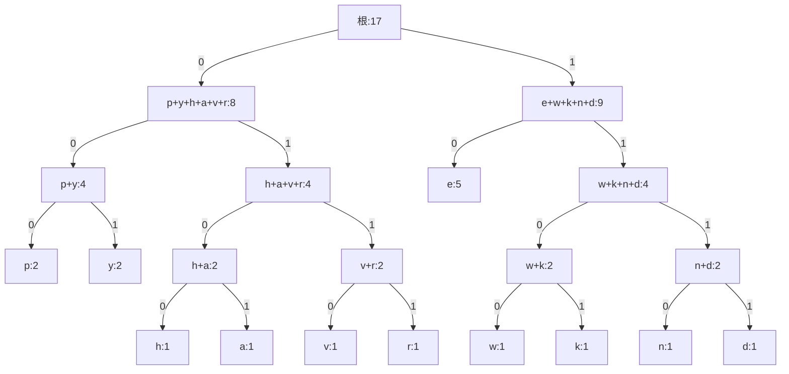
左子节点连的边标0，右子节点连的边标1，从根到子节点的路径（外部路径）即所有字符的编码：
```
p: 000
y: 001
h: 0100
a: 0101
v: 0110
r: 0111
e: 10
w: 1100
k: 1101
n: 1110
d: 1111
```


### 二叉搜索树 BST（Binary Search Tree）

**BST：任意节点左子树所有节点值 < 该节点值 < 右子树所有节点值。**

**使用中序排序打印所有节点将得到从小到大的排序。**

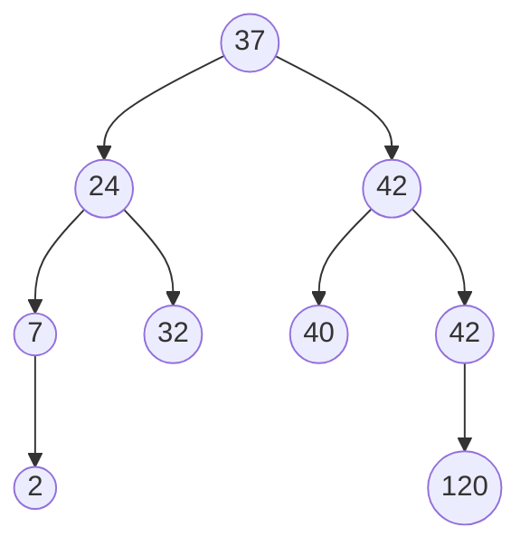

假设我们有一个输入数组：**`arr = [41, 20, 65, 11, 29, 50, 91]`**

1.  比当前节点**小**，往**左**走。
2.  比当前节点**大**，往**右**走。
3.  如果有空位，就坐下。

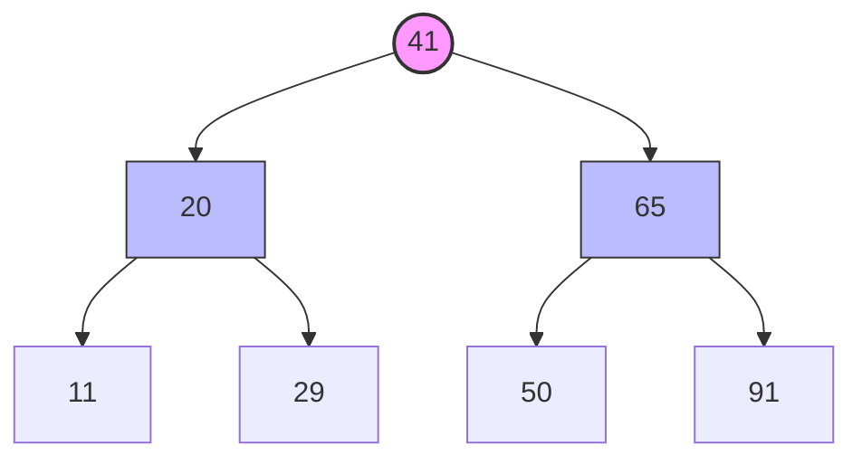

若 `arr = [41, 20, 65, 11, 9, 8, 29, 50, 91] `

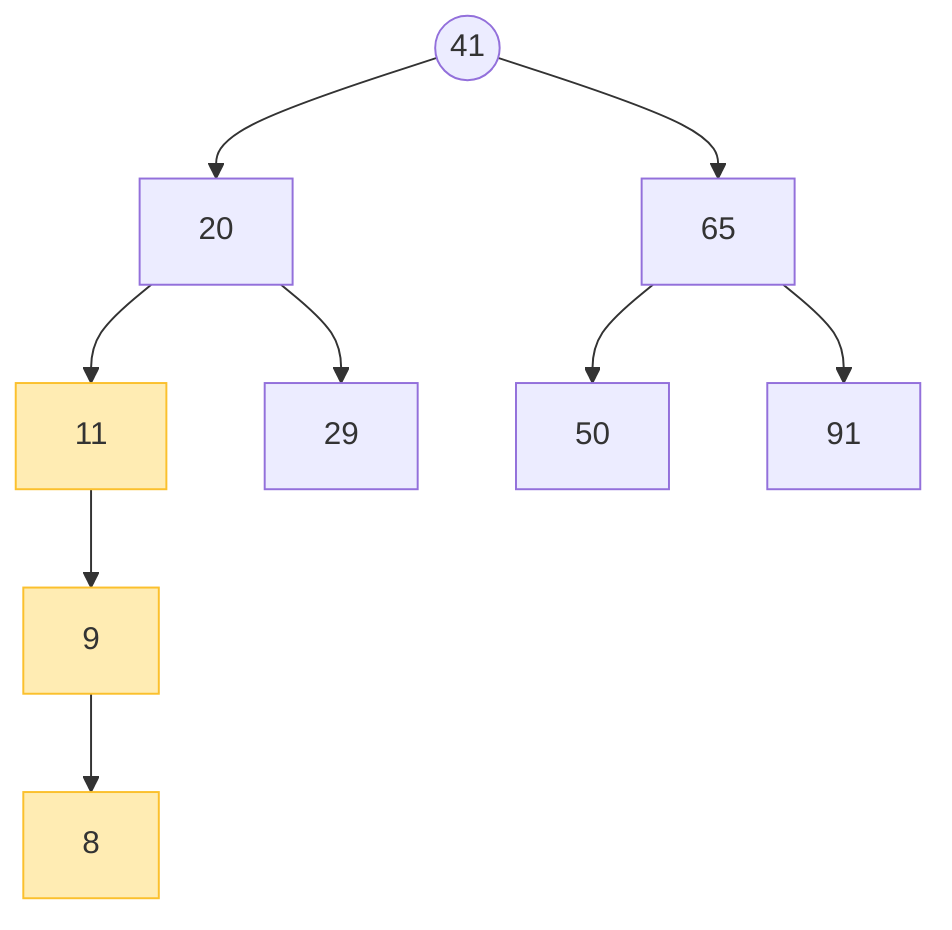

BST 的缺陷：

1.  **最坏情况**：如果你插入的数据是**有序**（或近似有序）的（比如 11, 9, 8...），BST 就会退化成一个**链表**。
2.  **效率下降**：
    *   树越高，查找越慢，复杂度从 $O(\log n)$ 变成了 $O(n)$。

这就是为什么在工程中，我们通常不使用原始的 BST，而是使用 **AVL 树** 或 **红黑树**，它们会在你插入 `9` 和 `8` 的时候自动“旋转”，把树掰直，保持平衡。

*补充红黑树：
在红黑树中，当插入 `8` 时，因为连续出现了红色节点，会触发旋转，把 `9` 提起来当父节点，`8` 和 `11` 变成左右孩子。


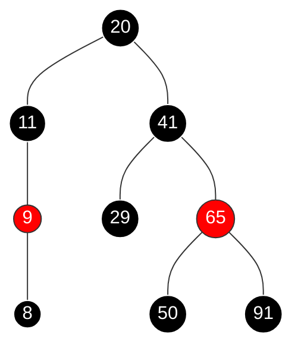

红黑树通过牺牲一点点插入时间（用来做旋转和变色），换取了**查询效率的稳定**。不管你插入的数据多么“烂”（比如倒序插入），红黑树都能保证自己不会退化成链表。
*

BST 的 ADT

```java
public interface BSTADT <K extends Comparable<K>, V> {
    public void insert(K key, V value);//插入结点
    public V remove(K key);//根据key值删除结点
    public boolean update(BinNode<K, V> rt, K key, V value);//更新结点值
    public V search(K key);//搜索key所对应结点的value
    public int getHeight(BinNode<K, V> rt);//获得树高
    public boolean isEmpty();//判断是否为空
    public void clear();//清空树
}
```
BST 的结点类

```java
public class BinNode<K extends Comparable<K>, V> {
    private K key;
    private V value;

    private BinNode<K, V> left;
    private BinNode<K, V> right;

    public BinNode(K key, V value){
        left = right = null;
        this.key=key;
        this.value=value;
    }
    public BinNode() {left = right = null;}

    public boolean isLeaf() {return (left == null) && (right == null);}

    public K getKey() {return key;}
    public void setKey(K key) {this.key = key;}

    public V getValue() {return value;}
    public void setValue(V value) {this.value = value;}

    public BinNode<K, V> getLeft() {return left;}
    public void setLeft(BinNode<K, V> left) {this.left = left;}

    public BinNode<K, V> getRight() {return right;}
    public void setRight(BinNode<K, V> right) {this.right = right;}
}
```


```java

/**
 * @author yjq
 * @version 1.0
 * @date 2021/11/20 22:51
 */

public class BinarySearchTree<K extends Comparable<K>, V> implements BSTADT<K, V> {
    private BinNode<K, V> root;
    private V removeValue;

    public BinarySearchTree() {
        root = null;
    }

    public BinNode<K, V> getRoot() {
        return root;
    }

    public void insert(K key, V value) {
        try {
            if (key == null) {
                throw new Exception("Key is null, insert fault!");
            }
            if (value == null) {
                throw new Exception("Value is null, insert fault!.");
            }
        } catch (Exception e) {
            e.printStackTrace();
        }
        root = insertHelp(root, key, value);
    }

    private BinNode<K, V> insertHelp(BinNode<K, V> rt, K key, V value) {
        if (rt == null) {
            return new BinNode<K, V>(key, value);
        }

        if (key.compareTo(rt.getKey()) < 0) {
            rt.setLeft(insertHelp(rt.getLeft(), key, value));
        }//跟删除结点有异曲同工之妙

        else if (key.compareTo(rt.getKey()) > 0) {
            rt.setRight(insertHelp(rt.getRight(), key, value));
        }

        else {
            rt.setValue(value);
        }//key值相同则更新
        return rt;
    }

    /**
     *
     * @param key 关键字
     * @return 删除的结点的值
     */
    public V remove(K key) {
        removeValue = null;
        try {
            if (key == null)
                throw new Exception("Key is null, remove failure");
            root = removeHelp(root, key);
            return removeValue;
        } catch (Exception e) {
            e.printStackTrace();
            return null;
        }
    }

    private BinNode<K, V> removeHelp(BinNode<K, V> rt, K key) {
        if (rt == null)
            return null;
        if (key.compareTo(rt.getKey()) < 0) {
            rt.setLeft(removeHelp(rt.getLeft(), key));
        } else if (key.compareTo(rt.getKey()) > 0) {
            rt.setRight(removeHelp(rt.getRight(), key));
        } else {
            if (rt.getLeft() == null) {
                removeValue = rt.getValue();
                rt = rt.getRight();
                //左子结点为空，直接将右子结点作为当前根结点
            } else if (rt.getRight() == null) {
                removeValue = rt.getValue();
                rt = rt.getLeft();
                //右子结点为空，直接将左子结点作为当前根结点
            } else {
                //待删除结点有两个子结点
                rt.setKey((K) getMinNode(rt.getRight()).getKey());
                rt.setValue((V) getMinNode(rt.getRight()).getValue());
                //将当前结点的key和value更新为右子树中的最小结点的值
                rt.setRight(removeMinNode(rt.getRight()));
                //将当前结点的右子结点进行更新
            }
        }
        return rt;
    }

    private BinNode getMinNode(BinNode<K, V> rt) {
        if (rt.getLeft() == null)
            return rt;
        else
            return getMinNode(rt.getLeft());
    }

    //返回的是更新以后的根结点
    private BinNode<K, V> removeMinNode(BinNode<K, V> rt) {
        if (rt.getLeft() == null) {
            return rt.getRight();
        }
        rt.setLeft(removeMinNode(rt.getLeft()));
        //保证了二叉检索树的规范性
        return rt;
    }

    public V search(K key) {
        return search(root, key);
    }

    private V search(BinNode<K, V> rt, K key) {
        try {
            if (key == null)
                throw new Exception("key is null");
            if (rt == null)
                return null;
            if (key.compareTo(rt.getKey()) < 0)
                return search(rt.getLeft(), key);//小于当前key值则往左子树查找
            if (key.compareTo(rt.getKey()) > 0)
                return search(rt.getRight(), key);//大于当前key值则往右子树查找
            return rt.getValue();//找到值
        } catch (Exception e) {
            e.printStackTrace();
            return null;
        }
    }

    public boolean update(K key, V value) {
        return update(root, key, value);
    }

    public boolean update(BinNode<K, V> rt, K key, V value) {
        try {
            if (key == null)
                throw new Exception("Key is null, update failure.");
            if (value == null)
                throw new Exception("value is null, update failure");
            if (key.compareTo(rt.getKey()) == 0) {
                rt.setValue(value);
                return true;
            }
            if (key.compareTo(rt.getKey()) < 0)
                return update(rt.getLeft(), key, value);
            if (key.compareTo(rt.getKey()) > 0)
                return update(rt.getRight(), key, value);
            return false;
        } catch (Exception e) {
            e.printStackTrace();
            return false;
        }
    }

    public boolean isEmpty() {
        return root == null;
    }

    public void clear() {
        root = null;
    }
    
    public int getHeight(BinNode<K, V> rt) {
        int height = 0;
        if (rt == null)
            return 0;
        else
            height++;
        height += Math.max(getHeight(rt.getLeft()), getHeight(rt.getRight()));
        return height;
    }
}
```


### 堆

在优先队列的实现中，可以考虑使用 BST，其平均操作的时间代价为 $O(n \log n)$，但是在某些情况下，BST 会变得十分不平衡，使其的性能变得很差，因此发明了一种新的数据结构以保证较高的效率——堆。

*   **定义**：堆是一种基于**数组**实现的**完全二叉树**。
*   **大顶堆性质**：任意节点的值 $\ge$ 其子节点的值。
    *   这意味着堆顶（数组下标 0）总是存储着整个集合中的**最大值**。
*   **用途**：高效地查找和移除最大元素（优先队列），用于堆排序等。

数组表示法 (Array Representation)
*   **父节点 (Parent)**: `(pos - 1) / 2`
*   **左孩子 (Left Child)**: `2 * pos + 1`
*   **右孩子 (Right Child)**: `2 * pos + 2`
*   **叶子节点判断**: 利用完全二叉树的性质，如果 `pos >= n/2`，则该节点必为叶子，无子节点。

**纯文本示意（大根堆）：**
```text
       [90]             数组索引:  0   1   2   3   4   5
      /    \            数组内容: [90, 80, 70, 60, 40, 30]
    [80]   [70]
    /  \    /
  [60][40][30]
```

```java
/**
 * Max Heap
 * E 必须实现 Comparable 接口用于比较大小
 */
public class MaxHeap<E extends Comparable<E>> { // 大根堆实现
    private E[] Heap; // 指向堆数组的指针
    private int size;    // 堆的最大容量
    private int n;       // 当前堆中的元素数量

    public MaxHeap(E[] h, int num, int max) { // 构造函数
        Heap = h; 
        n = num; 
        size = max; 
        buildheap(); 
    }

    public int heapsize() { // 返回堆的当前大小
        return n; 
    }

    public boolean isLeaf(int pos) { // 若pos是叶子节点位置则返回true
        return (pos >= n/2) && (pos < n); 
    }

    // 返回pos的左孩子的位置
    public int leftchild(int pos) {
        if (pos >= n/2) throw new IllegalArgumentException("Position has no left child");
        return 2 * pos + 1;
    }

    // 返回pos的右孩子的位置
    public int rightchild(int pos) {
        if (pos >= (n - 1)/2) throw new IllegalArgumentException("Position has no right child");
        return 2 * pos + 2;
    }

    public int parent(int pos) { // 返回父节点的位置
        if (pos <= 0) throw new IllegalArgumentException("Position has no parent");
        return (pos - 1)/2;
    }

    public void buildheap() { // 堆化Heap数组的内容
        for (int i = n/2 - 1; i >= 0; i--)  // 非叶子结点下沉
            siftdown(i); 
    }

    private void siftdown(int pos) { // 将元素放到正确的位置
        if (pos < 0 || pos >= n) throw new IllegalArgumentException("Illegal heap position");
        
        while (!isLeaf(pos)) {
            int j = leftchild(pos);
            // 如果有右孩子（右孩子没出界），且右孩子 > 左孩子
            if ((j < (n - 1)) && (Heap[j].compareTo(Heap[j + 1]) < 0))
                j++; // j现在是值较大的孩子的索引
            // 用较大的孩子和pos比 孩子比pos大的话 就交换
            if (Heap[pos].compareTo(Heap[j]) >= 0) return; // 完成（满足大顶堆条件）
            
            swap(pos, j); // 使用内部swap
            pos = j; // 向下移动
        }
    }

    public void insert(E val) { // 将值插入堆
        if (n >= size) throw new RuntimeException("Heap is full");
        
        int curr = n++;
        Heap[curr] = val; // 从堆的末尾开始
        
        // 向上调整，直到当前节点的父节点键大于当前节点键
        while ((curr != 0) && (Heap[curr].compareTo(Heap[parent(curr)]) > 0)) {
            swap(curr, parent(curr)); // 使用内部swap
            curr = parent(curr);
        }
    }

    public E removemax() { // 移除最大值
        if (n <= 0) throw new RuntimeException("Removing from empty heap");
        
        swap(0, --n); // 将最大值与最后一个元素交换
        if (n != 0) // 不是最后一个元素
            siftdown(0); // 将新堆顶元素放到正确位置
        
        return Heap[n];
    }

    // 移除指定位置的元素
    public E remove(int pos) {
        if (pos <= 0 || pos >= n) throw new IllegalArgumentException("Illegal heap position");
        
        swap(pos, --n); // 与最后一个元素交换
        if (n != 0) // 不是最后一个元素
            siftdown(pos); // 将该位置的元素放到正确位置
        
        return Heap[n];
    }
    
    // --- 私有辅助方法 ---
    private void swap(int i, int j) {
        E temp = Heap[i];
        Heap[i] = Heap[j];
        Heap[j] = temp;
    }

} // 类MaxHeap
```


- 建堆 (Build Heap)
	*   **代码对应**：`buildheap()`
	*   **逻辑**：不要从头遍历！而是从**最后一个非叶子节点**（索引 `n/2 - 1`）开始，倒序遍历到根节点 `0`。对每个节点调用 `siftdown`。
	*   **效率**：这种 Floyd 建堆算法的时间复杂度是 **O(n)**，比一个个插入 O(n log n) 更快。

- 下沉 (Sift Down)
	*   **代码对应**：`siftdown(int pos)`
	*   **逻辑**：
	    1.  判断当前节点 `pos` 是否有孩子（`!isLeaf(pos)`）。
	    2.  如果有，找到左右孩子中**值较大**的那个（索引记为 `j`）。
	    3.  比较当前节点与较大孩子：
	        *   若 `Heap[pos] >= Heap[j]`：满足堆性质，停下。
	        *   若 `Heap[pos] < Heap[j]`：破坏了规则，**交换**两者，并将 `pos` 更新为 `j`，继续循环。

- 上浮 (Sift Up - 隐式实现)
	*   **代码对应**：`insert` 方法中的 `while` 循环。
	*   **逻辑**：
	    1.  新元素放在数组末尾 `n`。
	    2.  比较当前元素与父节点 `parent(curr)`。
	    3.  若 `当前 > 父`（大顶堆），则交换，并继续向上走。
	    4.  直到到达根节点或满足 `当前 <= 父`。

- 移除最大值 (Remove Max)
	*   **代码对应**：`removemax()`
	*   **逻辑**：
	    1.  **Swap**：将堆顶（最大值）与数组最后一个有效元素交换。
	    2.  **Shrink**：堆大小 `n` 减 1（逻辑上删除了最大值）。
	    3.  **Sift Down**：刚才换上来的末尾元素可能很小，破坏了堆顶的大值性质，需要调用 `siftdown(0)` 把它沉下去。

 复杂度分析

| 操作 | 时间复杂度 | 说明 |
| :--- | :--- | :--- |
| **isLeaf / parent / child** | **O(1)** | 简单的数学计算 |
| **insert (插入)** | **O(log n)** | 最坏情况是从底部上浮到根（树高） |
| **removemax (移除堆顶)** | **O(log n)** | 最坏情况是从根下沉到底部（树高） |
| **buildheap (建堆)** | **O(n)** | 经过数学级数求和证明，非常高效 |
| **空间复杂度** | **O(n)** | 依赖外部传入的数组 |

与标准库 PriorityQueue 的区别
1.  **方向不同**：Java 的 `PriorityQueue` 默认是**小根堆**（Min Heap），而这份代码实现的是**大根堆**（Max Heap）。
2.  **底层操作**：这份代码暴露了更底层的操作（如 `buildheap`），并且存储结构是固定大小的数组（依赖传入的 `size`），不支持自动扩容，而 `PriorityQueue` 支持动态扩容。

## 4.5 树和森林采用的各种存储方式的差异性

树的ADT
```java
interface GINode {  // 通用树节点ADT（抽象数据类型）
    public Object value();  // 返回节点的值
    public boolean isLeaf();  // 若该节点是叶节点，则返回TRUE
    public GINode parent();  // 返回父节点
    public GINode leftmost_child();  // 返回最左子节点
    public GINode right_sibling();  // 返回右兄弟节点
    public void setValue(Object value);  // 设置节点的值
    public void setParent(GINode par);  // 设置父节点
    public void insert_first(GINode n);  // 添加新的最左子节点
    public void insert_next(GINode n);  // 插入新的右兄弟节点
    public void remove_first();  // 移除最左子节点
    public void remove_next();  // 移除右兄弟节点
} // interface GINode


interface GenTree {  // 通用树ADT（抽象数据类型）
    public void clear();  // 清空树
    public GINode root();  // 返回根节点
    // 为树创建新根节点，该根的子节点为first、兄弟节点为sib
    public void newroot(Object value, GINode first, GINode sib);
} // interface GenTree
```

树和森林的存储方式主要有以下几种，每种方式都有不同的特点和应用场景：

**1. 双亲表示法**（父指针表示法）
- **存储结构**：使用数组存储结点，每个结点包含数据域和父结点索引
- **实现方式**：
```java
class ParentNode {
    int data;
    int parentIndex;  // -1表示根结点
}

class ParentTree {
    ParentNode[] nodes;
    int size;
}
```
- **特点**：
  - 查找父结点方便，时间复杂度O(1)
  - 查找孩子结点需要遍历整个数组
  - 适合查找祖先路径、并查集等应用


**2. 孩子表示法**（子节点表表示法）
- **存储结构**：使用数组存储结点信息，同时每个结点维护一个孩子链表
- **实现方式**：
```java
class ChildNode {
    int childIndex;
    ChildNode next;
}

class TreeNode {
    int data;
    ChildNode firstChild;  // 指向第一个孩子
}

class Tree {
    TreeNode[] nodes;
    int size;
}
```


- **特点**：
  - 查找孩子结点方便
  - 查找父结点困难
  - 适合需要频繁访问子结点的场景

```java
class MultiChildNode {
    int data;
    int degree;        // 结点的度
    MultiChildNode[] children;  // 孩子指针数组
}
```
- **特点**：
	- 直观反映树的结构
	- 适用于度数固定的特殊树


```java
class AdjTreeNode {
    int data;
    List<AdjTreeNode> children;  // 使用链表或数组存储孩子
}
```
- **特点**：
  - 动态性好，易于添加删除
  - 适用于度数不确定的树


**3. 孩子兄弟表示法（左子结点/右兄弟结点表示法）**
- **存储结构**：每个结点包含数据、指向第一个孩子的指针、指向右兄弟的指针
- **实现方式**：
```java
class CSNode {
    int data;
    CSNode firstChild;  // 指向第一个孩子
    CSNode nextSibling; // 指向右兄弟
}
```
- **特点**：
  - 将树转换为二叉树的一种方法
  - 实现简单，操作方便
  - 广泛应用于树的存储和操作


## 4.6 树和森林与二叉树的转换

（书上似乎只有二叉树与树的转化 即左孩子右兄弟法）

**1. 树转换为二叉树（左孩子右兄弟法）**
- **转换规则**：
  1.  **加线**：在所有兄弟结点之间加一条连线。
  2.  **去线**：对每个结点，只保留它与第一个孩子的连线，断开与其他孩子的连线。
- **示意图**：
```
【原始普通树】           【中间步骤】          【转换后的二叉树】
      A                       A                    A
    / | \                   /                     /
   B  C  D                B-->C-->D              B
  / \                    /                     / \
 E   F                  E-->F                 E   C
                                               \   \
                                                F   D

中间步骤说明（图中横箭头表示 nextSibling 指针，竖线表示 children 列表）：
- 在原树中每一组同父节点的孩子之间，增加 nextSibling 指针：
  - B.nextSibling -> C, C.nextSibling -> D
  - E.nextSibling -> F
- 同时保留 children 结构（用于之后把第一个孩子作为 left 指针）。
- 最终转换时：
  - 节点的第一个孩子（children.get(0)）会对应为 left（左孩子）。
  - 节点的 nextSibling 会对应为 right（右孩子）。
```

- **Java 代码实现**：
  ```java
  // 定义普通树节点
  class TreeNode {
      int val;
      List<TreeNode> children = new ArrayList<>();
      TreeNode(int val) { this.val = val; }
  }

  // 定义二叉树节点
  class BinaryTreeNode {
      int val;
      BinaryTreeNode left;  // 指向原树的第一个孩子
      BinaryTreeNode right; // 指向原树的下一个兄弟
      BinaryTreeNode(int val) { this.val = val; }
  }

  // 转换函数
  public BinaryTreeNode treeToBinary(TreeNode root) {
      if (root == null) return null;
      
      // 1. 创建当前的二叉树节点
      BinaryTreeNode newRoot = new BinaryTreeNode(root.val);
      
      // 2. 处理孩子节点
      if (!root.children.isEmpty()) {
          // 原树的第一个孩子 -> 二叉树的左孩子
          newRoot.left = treeToBinary(root.children.get(0));
          
          // 原树的剩余孩子 -> 二叉树左孩子的右链（兄弟链）
          BinaryTreeNode curr = newRoot.left;
          for (int i = 1; i < root.children.size(); i++) {
              curr.right = treeToBinary(root.children.get(i));
              curr = curr.right;
          }
      }
      return newRoot;
  }
  ```

- **解释**：
  - 转换后的二叉树，根节点一定没有右子树（因为根节点在原树中没有兄弟）。
  - 原树中的“兄弟关系”在二叉树中变成了“父子关系”（右孩子）。

**2. 二叉树转换为树（逆用左孩子右兄弟法）**
- **转换规则**（逆转换）：
  1.  **左孩子**：二叉树中某结点的左孩子，代表该结点在原树中的**第一个孩子**。
  2.  **右孩子**：二叉树中某结点的右孩子，代表该结点在原树中的**兄弟**。
  - 简单来说：将左孩子和该左孩子右链上的所有节点，都变成当前节点的子节点，而右孩子全部变成兄弟。

- **示意图**：
```
【二叉树结构】                     【还原后的普通树】
      A                                  A
     /                                 / | \
    B            (B是A的长子)         B  C  D
   / \           (C是B的兄弟)        /
  E   C          (D是C的兄弟)       E
       \         (E是B的长子)
        D
```

- **Java 代码实现**：
  ```java
  public TreeNode binaryToTree(BinaryTreeNode binaryRoot) {
      if (binaryRoot == null) return null;
      
      TreeNode root = new TreeNode(binaryRoot.val);
      
      // 如果有左孩子，说明原树有子节点
      if (binaryRoot.left != null) {
          // 左孩子是第一个子节点
          root.children.add(binaryToTree(binaryRoot.left));
          
          // 沿左孩子的右链遍历，找回所有兄弟作为子节点
          BinaryTreeNode sibling = binaryRoot.left.right;
          while (sibling != null) {
              root.children.add(binaryToTree(sibling));
              sibling = sibling.right;
          }
      }
      return root;
  }
  ```

- **解释**：
  - 这是一个还原过程。代码中，我们只查看`binaryRoot.left`，因为`binaryRoot.right`表示的是`root`自己的兄弟，不属于`root`的子树范围（通常根节点右侧为空）。
  - 通过遍历左节点的`right`链，找回了原树中所有的并列兄弟。

**3. 森林转换为二叉树**
- **转换规则**：
  1.  先把森林中的每一棵树各自转换为二叉树。
  2.  将第二棵二叉树的根节点，作为第一棵二叉树根节点的**右孩子**；第三棵作为第二棵的右孩子，依此类推。
  - **实质**：将森林看作一棵虚拟根节点被移除的树，各树根互为兄弟。

- **示意图**：
```
  【原始森林】             【树转为二叉树】        【合并后的二叉树】
 树1:       树2:          树1:       树2:              A
   A          X            A         X               / \
  / \        /            /         /               B   X  <-- X接在A的右边
 B   C      Y            B         Y               /   /
                        /                         C   Y
                       C
图解说明：
1. 树1内部：B是A的长子(left)，C是B的兄弟(right) -> A-L->B-R->C
2. 树间关系：X视为A的兄弟(right) -> A-R->X
3. 树2内部：Y是X的长子(left) -> X-L->Y
```


```
[原始森林]                               [每棵树各自转换为二叉树]           [最终合并后的二叉树]
    树1         树2        树3        二叉树1     二叉树2     二叉树3        （合并结果）
      A          X          M            A          X         M                A  --->1 root
     / \        / \        /|\          /           /        /               /   \
    B   C      Y   Z      P Q R        B           Y        P               B     X  --->2 root
   /                                  / \           \        \             / \   / \
  E                                  E   C          Z         Q           E   C Y   M  --->3 root
                                                               \                 \  /
                                                                R                Z  P
                                                                                     \
                                                                                      Q
                                                                                       \
                                                                                        R
```

- **Java 代码实现**：
  ```java
  // 输入是多棵普通树的列表
  public BinaryTreeNode forestToBinary(List<TreeNode> forest) {
      if (forest == null || forest.isEmpty()) return null;
      
      // 1. 将第一棵树转为二叉树，作为整体的根
      BinaryTreeNode root = treeToBinary(forest.get(0));
      
      // 2. 后续的树依次挂在右链上
      BinaryTreeNode current = root;
      for (int i = 1; i < forest.size(); i++) {
          current.right = treeToBinary(forest.get(i));
          current = current.right;
      }
      
      return root;
  }
  ```

- **解释**：
  - 森林转二叉树后，根节点**可能有右子树**，这个右子树就是森林中第二棵树转换来的。
  - `current.right` 的连接操作体现了森林中各树根节点之间的“兄弟”关系。

**4. 二叉树转换为森林**
- **转换规则**：
  1.  若二叉树根节点有右链，则断开右链。
  2.  根节点及其左子树（及其左子树的右链）还原为第一棵树。
  3.  断下的右链部分（右孩子）作为下一棵树的二叉树形态，重复步骤1、2。

- **示意图**：
```
【二叉树】                              【还原出的森林】
      A                                  树1:      树2:
     / \                                   A         X
    B   X   <-- 在这里断开!                /         /
   /   /                                 B         Y
  C   Y                                 /
                                       C

操作步骤：
1. 识别出 A 的右孩子是 X。
2. 切断 A -> X 的连接。
3. 得到两棵二叉树：(A及其左子树) 和 (X及其子树)。
4. 分别调用 binaryToTree 进行还原。
```

- **Java 代码实现**：
  ```java
  public List<TreeNode> binaryToForest(BinaryTreeNode binaryRoot) {
      List<TreeNode> forest = new ArrayList<>();
      
      BinaryTreeNode current = binaryRoot;
      while (current != null) {
          // 1. 暂存右子树（这是下一棵树的根）
          BinaryTreeNode nextTreeRoot = current.right;
          
          // 2. 断开右指针，以便将当前节点作为一棵独立的树还原
          // 注意：我们需要先断开，再调用 binaryToTree，否则 binaryToTree 会把右链误判为当前树的兄弟
          current.right = null; 
          
          // 3. 还原当前这棵树并加入森林
          forest.add(binaryToTree(current));
          
          // 4. 恢复右指针(如果需要保持原二叉树结构) 或 直接移动到下一棵
          // 这里我们直接处理下一个
          current = nextTreeRoot;
      }
      
      return forest;
  }
  ```

- **解释**：
  - 此方法通过不断剥离二叉树根节点的右孩子，将其分解为多棵独立的二叉树。
  - 然后复用之前的 `binaryToTree` 方法，将每一棵独立的二叉树还原为普通树。
  - **关键点**：在调用 `binaryToTree` 之前，必须将 `current.right` 设为 `null`，否则还原算法会把后续的树根误认为是当前树根的子节点（兄弟关系）。


## 4.7 树和森林在遍历方面与二叉树的差异及相关性

**1. 树的遍历方式**
- **先根遍历**：
  1. 访问根结点
  2. 从左到右依次先根遍历每棵子树
  ```java
  void preOrderTraverse(TreeNode root) {
      if (root == null) return;
      visit(root);
      for (TreeNode child : root.children) {
          preOrderTraverse(child);
      }
  }
  ```

- **后根遍历**：
  1. 从左到右依次后根遍历每棵子树
  2. 访问根结点
  ```java
  void postOrderTraverse(TreeNode root) {
      if (root == null) return;
      for (TreeNode child : root.children) {
          postOrderTraverse(child);
      }
      visit(root);
  }
  ```

- **层次遍历**：（书上没有）
  1. 从上到下按层访问
  2. 每层从左到右访问
  ```java
  void levelOrderTraverse(TreeNode root) {
      if (root == null) return;
      Queue<TreeNode> queue = new LinkedList<>();
      queue.offer(root);
      
      while (!queue.isEmpty()) {
          TreeNode node = queue.poll();
          visit(node);
          for (TreeNode child : node.children) {
              queue.offer(child);
          }
      }
  }
  ```

**2. 森林的遍历方式**
- **先序遍历森林**：
  1. 访问第一棵树的根结点
  2. 先序遍历第一棵树的子树森林
  3. 先序遍历剩余树构成的森林
  ```java
  void preOrderForest(List<TreeNode> forest) {
      for (TreeNode tree : forest) {
          preOrderTraverse(tree);
      }
  }
  ```

- **后根遍历森林**：
  1. 后根遍历第一棵树的子树森林
  2. 访问第一棵树的根结点
  3. 后根遍历剩余树构成的森林

**3. 树、森林与二叉树遍历的对应关系**

| 树/森林遍历 | 对应二叉树遍历 | 说明 |
|------------|---------------|------|
| 树的**先根遍历** | 二叉树的**先序遍历** | 树转换为二叉树后，遍历顺序一致 |
| 树的**后根遍历** | 二叉树的**中序遍历** | 树转换为二叉树后，遍历顺序一致 |
| 森林的**先序遍历** | 二叉树的**先序遍历** | 森林转换为二叉树后，遍历顺序一致 |
| 森林的**后根遍历** | 二叉树的**中序遍历** | 森林转换为二叉树后，遍历顺序一致 |

**4. 遍历的相关性证明**
- **树先根遍历 ≡ 二叉树先序遍历**：
	```
	【原始普通树】           【中间步骤】          【转换后的二叉树】
	      A                       A                    A
	    / | \                   /                     /
	   B  C  D                B-->C-->D              B
	  / \                    /                     / \
	 E   F                  E-->F                 E   C
	                                               \   \
	                                                F   D
	```
	顺序：A -> B -> E -> F -> C -> D
	

- **树后根遍历 ≡ 二叉树中序遍历**：
同上树结构，顺序：E -> F -> B -> C -> D -> A


## 4.8 并查集的意义 其两个基本操作的实现 以及重量权衡平衡原则和路径压缩

### 4.8.1 并查集的意义

**“朋友的朋友就是朋友”**

并查集主要用于处理**不相交集合（Disjoint Sets）的合并及查询**问题。它的核心意义在于高效地维护一个动态的集合系统。

*   **应用场景**：
    *   **连通性判断**：判断图中的两个点是否连通（例如：两台电脑是否在同一个局域网）。
    *   **最小生成树**：Kruskal 算法的核心组件。
    *   **亲戚关系/社交网络**：判断两个人是否属于同一个家族或朋友圈。

*   **形象理解**：
    *   这是一个“帮派”管理系统。每个人都有一个老大，如果两个人的老大是同一个人，那他们就是同一个帮派的。
    *   如果两个帮派要合并，只需要让其中一个帮派的老大成为另一个帮派老大的小弟即可。


### 4.8.2 两个基本操作

并查集内部通常用一个**数组** `parent[]` 来实现，`parent[i]` 表示元素 `i` 的父节点。

- 查找 (Find)
**功能**：找到元素 `x` 所属集合的代表元素（即“帮派的老大”）。
**规则**：如果一个节点的父节点是它自己（`parent[x] == x`），那它就是根节点（老大）。否则，递归向上查找。

```java
// 基础查找代码
int find(int x) {
    if (parent[x] == x) return x; // 找到了老大
    else return find(parent[x]); // 接着往上找
}
```

- 合并 (Union)
**功能**：将两个元素 `x` 和 `y` 所在的集合合并。
**步骤**：
	1.  找到 `x` 的老大 `rootX`。
	2.  找到 `y` 的老大 `rootY`。
	3.  如果 `rootX` 不等于 `rootY`，就让其中一个指向另一个（例如 `parent[rootX] = rootY`）。

```java
// 基础合并代码
void union(int x, int y) {
    int rootX = find(x);
    int rootY = find(y);
    if (rootX != rootY) {
        parent[rootX] = rootY; // 让X的老大认Y的老大做大哥
    }
}
```

### 4.8.3 优化策略一：重量权衡平衡原则 (Weighted Union / Union by Rank)

**问题**：如果暴力合并，可能会让树退化成一条长链（如下图左），导致查找效率变为 O(N)。
**解决**：**小树挂在大树下**。合并时，总是把节点少（或深度小）的树挂在节点多（或深度大）的树下面，这样树的高度增加得最慢。

```plaintext
【糟糕的合并：把大树挂在小树下】           【平衡合并：把小树挂在大树下】
       3 (小树)                                 1 (大树根)
      /                                       /   \
     1 (大树根)        查询4的路径变长了        2     3 (原来的小树)
    /                                         \
   2                                           4
    \
     4

结果：树越来越高，查询慢                   结果：树高变化小，查询快
```

实现代码（按重量/大小）
我们需要一个额外的数组 `size[]` 来记录每棵树的节点数量。

```java
// 初始化时，每个集合size都是1
int[] size; 

void union(int x, int y) {
    int rootX = find(x);
    int rootY = find(y);
    
    if (rootX == rootY) return;
    
    // 谁大谁做主（小树挂大树）
    if (size[rootX] > size[rootY]) {
        parent[rootY] = rootX;
        size[rootX] += size[rootY]; // 大树吃掉小树，体积增加
    } else {
        parent[rootX] = rootY;
        size[rootY] += size[rootX];
    }
}
```

### 4.8.4 优化策略二：路径压缩 (Path Compression)

这是并查集**最核心**的优化。
**思路**：在查找老大（`find`）的过程中，既然我经过了这条路径上的所有人，我知道大家的老大都是同一个最终BOSS，不如**直接把路径上所有人的父节点都直接指向BOSS**。

**意义**：下一次再查询这些节点时，一步就能找到老大，复杂度近乎 O(1)。

```plaintext
【没有路径压缩】                 【执行路径压缩后】
       1 (老大)                        1 (老大)
      /                             /  |  \
     2                             2   3   4
    /                             
   3                              (2, 3, 4 全都直接连向 1)
  /                               
 4 (查询我)                        

查找4时，递归经过3,2,1。
顺手把4,3,2的父节点全改成1。
```
实现代码（递归版）

```java
int find(int x) {
    if (parent[x] == x) return x;
    else return parent[x]= find(parent[x]); // 递归找到老大，并直接赋值给 parent[x]
}
```
### 4.8.5 完整代码实现

包含路径压缩和按秩合并（Rank，类似高度）的最终版本。

```java
class UnionFind {
    private int[] parent;
    private int[] rank; // 记录树的高度（近似）

    public UnionFind(int n) {
        parent = new int[n];
        rank = new int[n];
        for (int i = 0; i < n; i++) {
            parent[i] = i; // 初始时，自己是自己的老大
            rank[i] = 1;   // 初始高度为1
        }
    }

    // 查找 + 路径压缩
    public int find(int x) {
        if (parent[x] != x) {
            // 递归寻找根节点，并将沿途节点的父节点直接指向根
            parent[x] = find(parent[x]);
        }
        return parent[x];
    }

    // 合并 + 按秩合并（平衡原则）
    public void union(int x, int y) {
        int rootX = find(x);
        int rootY = find(y);

        if (rootX != rootY) {
            // 只有根不同才合并
            // 高度低的树挂在高度高的树下
            if (rank[rootX] > rank[rootY]) {
                parent[rootY] = rootX;
            } else if (rank[rootX] < rank[rootY]) {
                parent[rootX] = rootY;
            } else {
                // 高度相同，随便挂，被挂的那个树高度+1
                parent[rootY] = rootX;
                rank[rootX] += 1;
            }
        }
    }
    
    // 判断连通性
    public boolean isConnected(int x, int y) {
        return find(x) == find(y);
    }
}
```

 总结

| 特性 | 说明 |
| :--- | :--- |
| **时间复杂度** | 经过两个优化（路径压缩+平衡原则）后，操作的平均时间复杂度接近 **O(1)** (即反阿克曼函数 $O(\alpha(N))$，增长极慢)。 |
| **空间复杂度** | **O(N)**，需要存储 parent 数组。 |
| **核心思想** | 1. **找老大** (Find)：认祖归宗，顺便抄近道 (路径压缩)。<br>2. **合并** (Union)：拜把子，弱者依附强者 (平衡原则)。 |


## 补充：4.9 满二叉树、完全二叉树与二叉树定理

**满二叉树** full binary tree：满二叉树的每一个结点，要么是一个恰有两个非空结点的分支结点要么是一个叶子结点。

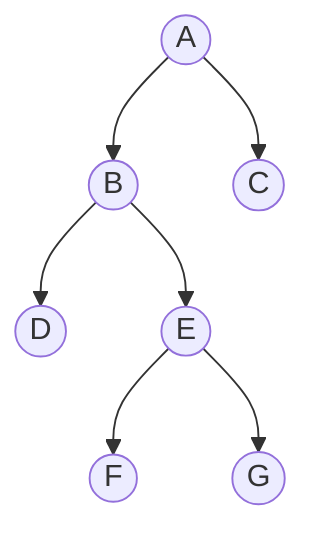

**完全二叉树** complete binary tree：完全二叉树有严格的要求，从根结点起，**每一层从左往右填充**。一棵高度为d的完全二叉树除了d-1层（最后一层）以外，每一层都是满的


-  **二叉树基本定理：对任何一棵二叉树T，如果其叶结点数为 $n_0$，则双孩子结点数为 $n_2$，则有  $n_0 = n_2 + 1$**
**证明**：二叉树中，只有三种结点: 叶结点 $n_0$，单孩子结点 $n_1$，双孩子结点 $n_2$，设该树的结点总数为 $n$，则有 $n = n_0 + n_1 + n_2$，也有 $n = \underbrace{0 \times n_0 + 1 \times n_1 + 2 \times n_2}_{分支数} + 1$，结合这两个式子消去 $n$ 即可证明.

- **满二叉树定理：非空满二叉树的叶结点数等于其分支结点数+1**
	**证明**：满二叉树无单孩子结点 $n_1=0$，其分支结点即为双孩子节点 $n_2$，由二叉树基本定理，叶结点数 $n_0$ = 分支节点数 $n_2$ + 1.
	```
	            A
	           /  \
	          B    C
	         /\    /\
	        D  E   F  G
	       /\  /\  	  /\ 
	      H I J K	  L M
	```
	叶结点数 7 = 分支节点数 6 + 1
- **一棵非空二叉树空子树的数目等于其结点数目+1**
**证明**：二叉树有 $n$ 个结点，每个节点有两个指针，共有 $2n$ 个，其中非空指针数即为树的边数 $n-1$，那么空指针数也就是空子树数目为 $2n-(n-1) = n+1$.
	```
	      A
	     / ×
	    B
	   × \
	      C
	     × ×
	```
	空子树4 = 结点数3 + 1
	```
	    A
	   / ×
	  B
	 × ×
	```
	空子树3 = 结点数2 + 1


- **高度为k的二叉树最多有 $2^k - 1 (k \geq1)$ 个结点**
**证明**：当二叉树为满二叉树时结点数最多。第 $i$ 层最多有 $2^{i-1}$ 个结点，共 $k$ 层，故最多结点数为：
$$\sum_{i=1}^k 2^{i-1} = 2^k - 1.$$


- **具有 $n$ 个结点的完全二叉树的高度为 $\lfloor log_2 n \rfloor +1$ 或 $\lceil log_2(n+1) \rceil$**
**证明**：设高度为 $h$。由完全二叉树定义，前 $h-1$ 层满（共 $2^{h-1}-1$ 个结点），第 $h$ 层至少 $1$ 个、至多 $2^{h-1}$ 个结点，故：
$$2^{h-1} \le n \le 2^h - 1 < 2^h$$
取对数得
$$h-1 \le \log_2 n< h$$
$$\log_2 n < h  \le \log_2 n + 1$$
$$h = \lfloor \log_2 n \rfloor + 1.$$
同时由 $2^{h-1} < n+1 \le 2^h$ 取对数可得：
$$h-1 < \log_2(n+1) \leq h   $$
$$h = \lceil \log_2 (n+1) \rceil.$$

