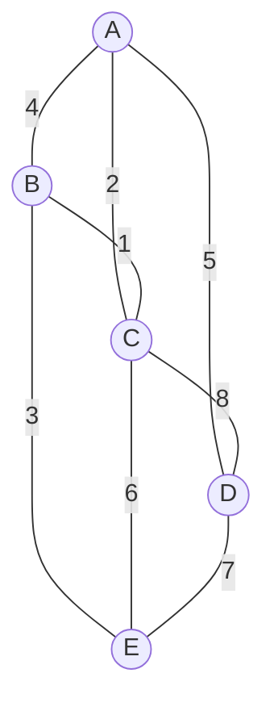
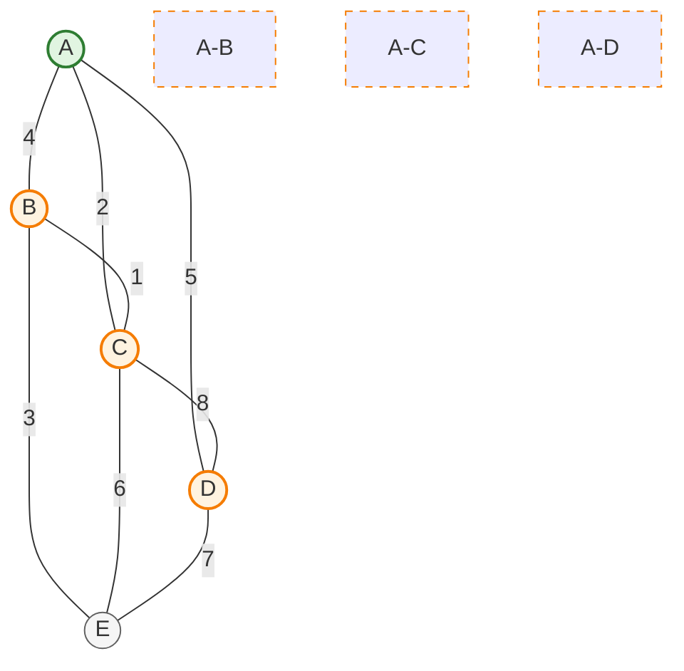
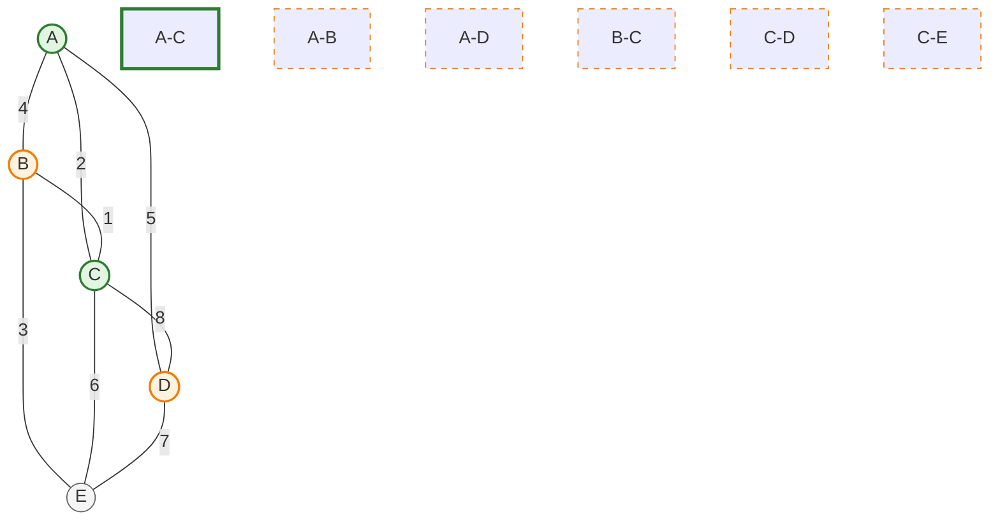
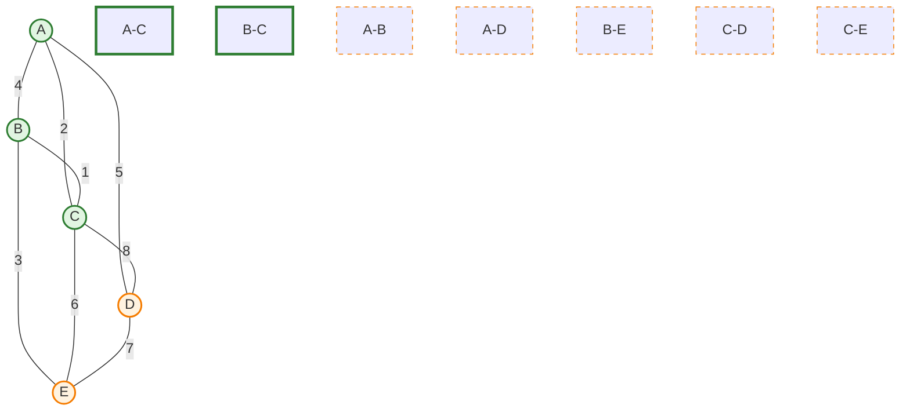
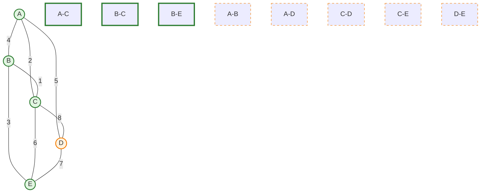
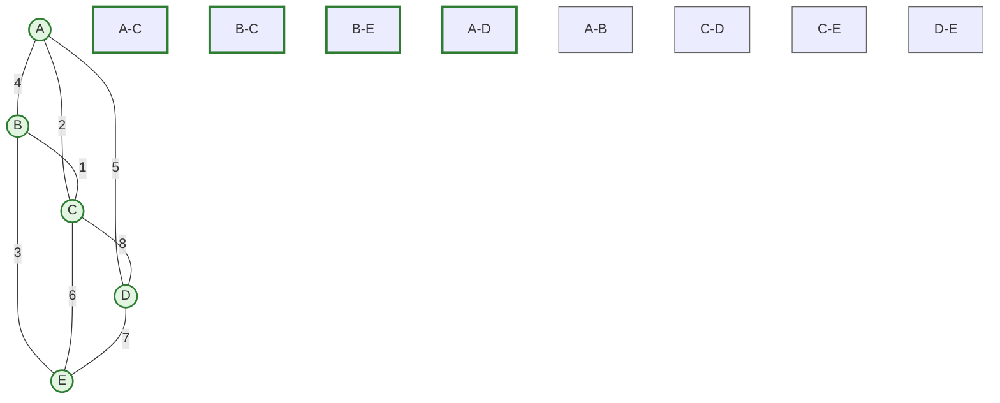
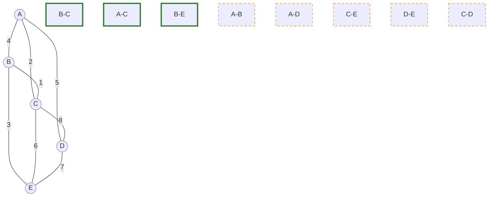
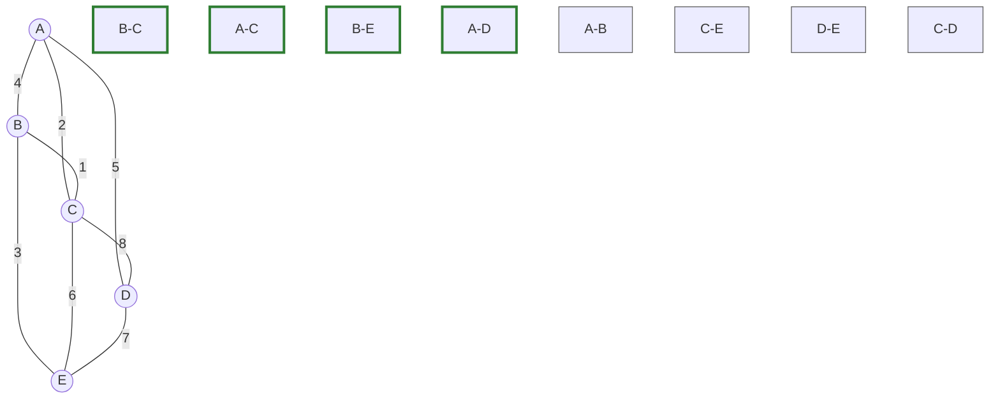

# 5. 图

## 5.1 图的定义（包括完全图、连通图、简单路径、有向图、无向图、无环图等）及图与二叉树、树和森林的结构异同点 

### 5.1.1 图的基本概念与分类

图（Graph）是由顶点的非空有限集合 $V$ 和顶点之间边的集合 $E$ 组成的数据结构，通常表示为 $G = (V, E)$。

*   **有向图 (Directed Graph)**
    *   边是有方向的，称为**弧**。
    *   表示为尖括号 $<v, w>$，其中 $v$ 为弧尾（起点），$w$ 为弧头（终点）。
    *   $<v, w> \neq <w, v>$。
*   **无向图 (Undirected Graph)**
    *   边没有方向。
    *   表示为圆括号 $(v, w)$。
    *   $(v, w) = (w, v)$。
*   **完全图 (Complete Graph)**
    *   **无向完全图**：任意两个顶点之间都存在一条边。若有 $n$ 个顶点，则边数为 $n(n-1)/2$。
    *   **有向完全图**：任意两个顶点之间都存在方向互为相反的两条弧。若有 $n$ 个顶点，则弧数为 $n(n-1)$。
*   **稀疏图与稠密图**
    *   边数很少（如 $e < n \log n$）称为稀疏图，反之称为稠密图。

### 5.1.2 路径、回路与特殊结构
*   **路径 (Path)**
    *   顶点序列 $v_1, v_2, ..., v_k$，其中相邻顶点之间存在边/弧。
*   **简单路径 (Simple Path)**
    *   序列中顶点**不重复**出现的路径。
*   **回路/环 (Cycle)**
    *   第一个顶点和最后一个顶点相同的路径。
    *   **简单回路**：除起点和终点外，其余顶点不重复的回路。
*   **无环图 (Acyclic Graph)**
    *   不存在环的图。
    *   **DAG (Directed Acyclic Graph)**：有向无环图，常用于描述工程进度、依赖关系（拓扑排序）。

### 5.1.3 连通性相关定义
*   **连通图 (Connected Graph)**
    *   **无向图**：若图中任意两个顶点都是连通的（有路径可达），则称该图为连通图。
    *   **连通分量**：无向图中的极大连通子图。
*   **强连通图 (Strongly Connected Graph)**
    *   **有向图**：若任意两个顶点 $v_i$ 和 $v_j$ 之间都存在双向路径（从 $v_i$ 到 $v_j$ 以及从 $v_j$ 到 $v_i$），则称该图为强连通图。
    *   **强连通分量**：有向图中的极大强连通子图。

### 5.1.4 顶点的度 (Degree)
*   **无向图的度**：TD(v) = 依附于顶点 $v$ 的边数。总度数 = 边数的2倍。
*   **有向图的度**：
    *   **入度 (ID)**：以顶点 $v$ 为终点的弧的数目。
    *   **出度 (OD)**：以顶点 $v$ 为起点的弧的数目。
    *   **度 (TD)**：$TD(v) = ID(v) + OD(v)$。有向图的弧数 = 所有顶点的入度之和 = 所有顶点的出度之和。

### 5.1.5 图与二叉树、树、森林的异同点

| 比较维度 | 图 (Graph) | 树 (Tree) | 森林 (Forest) | 二叉树 (Binary Tree) |
| :--- | :--- | :--- | :--- | :--- |
| **定义核心** | 多对多关系 | 一对多关系 | m棵互不相交的树 | 特殊的一对多（有序） |
| **父子关系** | 无父子概念，只有邻接关系 | 有明确的父子层次关系 | 有明确的父子层次关系 | 有明确的父子层次关系 |
| **根结点** | 通常无根（除非人为指定） | 有且仅有一个根结点 | 有 m 个根结点 | 有且仅有一个根结点 |
| **回路/环** | **可以有环** | **绝对无环** | **绝对无环** | **绝对无环** |
| **连通性** | 可能连通，也可能不连通 | **必须连通** | 由多个连通分量组成 | **必须连通** |
| **边数限制** (n个顶点) | $0 \le e \le n(n-1)$ | **恰好 n-1 条边** | $n - m$ 条边 | **恰好 n-1 条边** |
| **孩子有序性** | 无序 | 无序（普通树） | 无序 | **有序**（左右孩子严格区分） |
| **结构包含关系** | 最通用的结构，包含树和森林 | 是特殊的图（连通且无环） | 是特殊的图（无环，非连通） | 特殊的树形结构 |


## 5.2 图采用相邻矩阵和邻接表进行存储的差异性

### 5.2.1 邻接矩阵 (Adjacency Matrix)
*   **定义**：用一个二维数组 `A[n][n]` 存储图，其中 `n` 是顶点数。
    *   若 $(v_i, v_j) \in E$，则 `A[i][j] = 1`（或权值）。
    *   否则 `A[i][j] = 0`（或 $\infty$）。
*   **特点**：
    *   **无向图**：矩阵关于主对角线对称，存储时可压缩为上/下三角矩阵。
    *   **有向图**：不一定对称。行和 = 出度，列和 = 入度。
*   **空间复杂度**：$O(n^2)$。
    *   空间只与顶点数有关，与边数无关。
*   **适用场景**：**稠密图**（边数接近 $n^2$），或需要快速判断两点间是否有边的场景。

```java
public class AdjacencyMatrix {
    private int n; // 顶点数
    private int[][] graph; // 邻接矩阵

    // 初始化：n个顶点，初始无边
    public AdjacencyMatrix(int n) {
        this.n = n;
        graph = new int[n][n]; // 默认值0（无边）
    }

    // 添加边：无向图（i→j 和 j→i 都设为1），有向图只需保留一行
    public void addEdge(int i, int j) {
        if (i >= 0 && i < n && j >= 0 && j < n) { // 避免数组越界
            graph[i][j] = 1;
            graph[j][i] = 1; // 无向图关键：双向边
        }
    }

    // 打印邻接矩阵（直观查看存图结果）
    public void print() {
        for (int i = 0; i < n; i++) {
            for (int j = 0; j < n; j++) {
                System.out.print(graph[i][j] + " ");
            }
            System.out.println();
        }
    }

    // 测试：3个顶点（0,1,2），边0-1、1-2、0-2
    public static void main(String[] args) {
        AdjacencyMatrix am = new AdjacencyMatrix(3);
        am.addEdge(0, 1);
        am.addEdge(1, 2);
        am.addEdge(0, 2);
        System.out.println("邻接矩阵（3顶点无向图）：");
        am.print();
    }
}
```


### 5.2.2 邻接表 (Adjacency List)
*   **定义**：数组 + 链表的结合体。
    *   一个数组 `adj[n]` 存储所有顶点。
    *   每个数组元素 `adj[i]` 指向一个单链表，链表中存储所有与顶点 $v_i$ 邻接的顶点。
*   **特点**：
    *   **无向图**：每条边 $(v_i, v_j)$ 在链表中出现两次（分别在 $i$ 的链表和 $j$ 的链表中）。
    *   **有向图**：
        *   **邻接表**（出边表）：存储出度边。便于求出度，难求入度。
        *   **逆邻接表**（入边表）：存储入度边。便于求入度，难求出度。
*   **空间复杂度**：
    *   有向图：$O(n + e)$。
    *   无向图：$O(n + 2e)$。
*   **适用场景**：**稀疏图**（边数远小于 $n^2$），或需要频繁遍历邻接点的场景。

`ArrayList[]` 的实现

```java
import java.util.ArrayList;

public class AdjacencyListArray {
    private int n; // 顶点数
    private ArrayList<Integer>[] adj; // 核心存储：数组元素是ArrayList（邻接顶点列表）

    // 初始化：n个顶点，给每个顶点创建空的邻接列表
    @SuppressWarnings("unchecked") // 抑制泛型数组的编译警告（Java语法兼容）
    public AdjacencyListArray(int n) {
        this.n = n;
        // 1. 创建数组：长度为n，每个元素是ArrayList<Integer>类型
        adj = new ArrayList[n];
        // 2. 给每个顶点初始化邻接列表（必须手动创建，否则会空指针）
        for (int i = 0; i < n; i++) {
            adj[i] = new ArrayList<>();
        }
    }

    // 添加边（无向图：i和j互相添加为邻接顶点）
    public void addEdge(int i, int j) {
        // 校验顶点合法性（避免数组越界）
        if (i >= 0 && i < n && j >= 0 && j < n && i != j) {
            adj[i].add(j); // 数组索引i直接访问，调用add()添加邻接顶点（终于能这么写了！）
            adj[j].add(i); // 无向图双向添加
        }
    }

    // 打印邻接表（直观查看结果）
    public void print() {
        for (int i = 0; i < n; i++) {
            System.out.print("顶点" + i + "的邻接顶点：");
            // 遍历顶点i的邻接列表（adj[i]直接获取，无需.get()）
            for (int neighbor : adj[i]) {
                System.out.print(neighbor + " ");
            }
            System.out.println();
        }
    }

    // 测试：和之前相同的图（3顶点，边0-1、1-2、0-2）
    public static void main(String[] args) {
        AdjacencyListArray al = new AdjacencyListArray(3);
        al.addEdge(0, 1);
        al.addEdge(1, 2);
        al.addEdge(0, 2);
        System.out.println("ArrayList[] 实现的邻接表：");
        al.print();
    }
}
```


提供一个带权图邻接表的实现：

```java
import java.util.ArrayList;

// 自定义Edge类：存储「邻接顶点编号」和「边的权重」
class Edge {
    int to;   // 邻接顶点编号（比如顶点i指向的顶点）
    int weight; // 边的权重（i到to的边的权重）

    // Edge构造器：初始化邻接顶点和权重
    public Edge(int to, int weight) {
        this.to = to;
        this.weight = weight;
    }
}

public class WeightedAdjacencyList {
    private int n; // 顶点数
    // 核心存储：数组元素是ArrayList<Edge>，每个元素存对应顶点的所有（邻接顶点+权重）
    private ArrayList<Edge>[] adj;

    // 初始化：n个顶点，给每个顶点创建空的邻接列表（存储Edge对象）
    @SuppressWarnings("unchecked")
    public WeightedAdjacencyList(int n) {
        this.n = n;
        adj = new ArrayList[n]; // 创建数组，长度=顶点数
        // 给每个顶点初始化邻接列表（必须手动创建，避免空指针）
        for (int i = 0; i < n; i++) {
            adj[i] = new ArrayList<>();
        }
    }

    // 添加加权边（无向图：i→j和j→i的边权重相同，双向添加）
    public void addEdge(int from, int to, int weight) {
        // 校验顶点合法性（避免越界）
        if (from >= 0 && from < n && to >= 0 && to < n && from != to) {
            adj[from].add(new Edge(to, weight)); // from的邻接列表添加（to+权重）
            adj[to].add(new Edge(from, weight)); // to的邻接列表添加（from+权重）
        }
    }

    // 打印加权邻接表（直观查看顶点→邻接顶点+权重）
    public void print() {
        for (int i = 0; i < n; i++) {
            System.out.print("顶点" + i + "的邻接边（顶点-权重）：");
            // 遍历顶点i的所有邻接边（每个元素是Edge对象）
            for (Edge edge : adj[i]) {
                System.out.print("(" + edge.to + "-" + edge.weight + ") ");
            }
            System.out.println();
        }
    }

    // 测试：3个顶点，加权边0-1（权重5）、1-2（权重3）、0-2（权重7）
    public static void main(String[] args) {
        WeightedAdjacencyList wal = new WeightedAdjacencyList(3);
        wal.addEdge(0, 1, 5);   // 顶点0和1之间的边，权重5
        wal.addEdge(1, 2, 3);   // 顶点1和2之间的边，权重3
        wal.addEdge(0, 2, 7);   // 顶点0和2之间的边，权重7
        System.out.println("ArrayList[] 实现的加权无向图邻接表：");
        wal.print();
    }
}
```

提供一个在算法竞赛常用的极简版链式前向星的存图实现（cpp）：

```cpp
int cnt, head[N]; // head[i]存的是以i为起点的边的个数; cnt为边总数

struct node{
	int to,next,w; // to边的终点; next是该边在head[起点]的序号; w为权重
}e[M]; // 边的集合

void add(int u,int v,int w){
	e[++cnt].to=v; e[cnt].next=head[u]; e[cnt].w =w; head[u]=cnt;
	e[++cnt].to=u; e[cnt].next=head[v]; e[cnt].w =0; head[v]=cnt;
}

int main(){
	/* 省略建图过程 */
	// 遍历全图 但是一般不这么用 一般都是对于特定的u 遍历其所连的所有边
	for(int u=1; u<=n; u++){
		for(int i=head[u];i;i=e[i].next ){
			int v=e[i].to ;
			printf("%d ---%d---> %d\n", u, e[i].w, v);
		}
	}
}
```


| 比较维度 | 邻接矩阵 (Matrix) | 邻接表 (List) |
| :--- | :--- | :--- |
| **空间效率** | 浪费空间，固定 $O(n^2)$ | 节省空间，动态 $O(n+e)$ |
| **适合图类型** | 稠密图 | 稀疏图 |
| **判断两点是否有边** | 极快 $O(1)$，直接查数组 | 较慢，需遍历链表 $O(d)$ ($d$为度) |
| **计算度数** | 必须遍历整行/整列 $O(n)$ | 遍历链表即可，出度为 $O(d)$ |
| **找所有邻接点** | 慢，必须扫描整行 $O(n)$ | 快，直接遍历链表 $O(d)$ |
| **实现复杂度** | 简单，二维数组 | 稍复杂，涉及到指针/链表操作 |
| **唯一性** | 唯一（顶点编号确定后） | 不唯一（链表中结点的次序可变） |


## 5.3 图的广度优先遍历和深度优先遍历

### 5.3.1 深度优先遍历 (DFS - Depth First Search)
*   **思想**：**“一条路走到黑，撞了南墙再回头”**。
    1.  从起始点 $v$ 出发，访问 $v$。
    2.  依次从 $v$ 的未被访问的邻接点出发，进行深度优先遍历。
    3.  若当前顶点的所有邻接点都被访问过，则回退（Backtrack）到最近的一个仍有未访问邻接点的顶点。
*   **实现核心**：
    *   通常使用**递归**实现（隐式栈）。
    *   非递归实现需使用**显式栈 (Stack)**。
*   **时间复杂度**：
    *   邻接矩阵：$O(n^2)$（每个点都要访问，且找邻接点需遍历行）
    *   邻接表：$O(n + e)$（所有点访问一次，所有边扫描一次）
*   **应用**：
    *   检测环
    *   寻找连通分量
    *   拓扑排序
    *   迷宫寻路（寻找任意路径）

### 5.3.2 广度优先遍历 (BFS - Breadth First Search)
*   **思想**：**“层层递进，地毯式搜索”**。
    1.  从起始点 $v$ 出发，访问 $v$。
    2.  依次访问 $v$ 的所有未被访问过的邻接点 $w_1, w_2, ...$。
    3.  再依次访问 $w_1, w_2, ...$ 的所有未被访问过的邻接点。
    4.  保证“先被访问顶点的邻接点”先于“后被访问顶点的邻接点”被访问。
*   **实现核心**：
    *   必须使用**队列 (Queue)** 辅助。
*   **时间复杂度**：
    *   邻接矩阵：$O(n^2)$。
    *   邻接表：$O(n + e)$。
*   **应用**：
    *   **最短路径问题**（无权图）：BFS 生成的路径即为从起点到各点的最短路径（边数最少）。
    *   寻找连通分量。

### 5.3.3 代码实现

```java
import java.util.List;
import java.util.ArrayList;
import java.util.Queue;
import java.util.LinkedList;

public class Graph {
    private List<Integer>[] adj;
    private int n;

    public Graph(int n) {
        this.n = n;
        adj = new ArrayList[n];  // 现在adj是一个长度为n的数组，每个元素都是null
        for (int i = 0; i < n; i++)
            adj[i] = new ArrayList<>();  // 为adj的每个元素放入一个具体的 ArrayList 对象
        // 没有这句的话 会空指针报错
    }

    public void addEdge(int u, int v) {
        adj[u].add(v);
        adj[v].add(u); // 无向图加双向边 有向图加一条即可
    }

    public void DFS(int v) {
        boolean[] vis = new boolean[n];
        dfs(v, vis);
    }

    private void dfs(int v, boolean[] vis) {
        vis[v] = true;
        System.out.print(v + " ");
        for (int n : adj[v])
            if (!vis[n])
                dfs(n, vis);
    }

    public void BFS(int start) {
        boolean[] vis = new boolean[n];
        Queue<Integer> q = new LinkedList<>();
        q.add(start);
        vis[start] = true;

        while (!q.isEmpty()) {
            int v = q.poll();
            System.out.print(v + " ");
            for (int n : adj[v]) {
                if (!vis[n]) {
                    vis[n] = true;
                    q.add(n);
                }
            }
        }
    }

    public static void main(String[] args) {
        // 创建一个5个顶点的图
        Graph graph = new Graph(5);

        // 添加边
        graph.addEdge(0, 1);
        graph.addEdge(0, 2);
        graph.addEdge(1, 3);
        graph.addEdge(2, 4);
        graph.addEdge(3, 4);

        // 测试DFS
        System.out.print("DFS: ");
        graph.DFS(0);

        // 测试BFS
        System.out.print("\nBFS: ");
        graph.BFS(0);
    }
}
```

输出：
```
DFS: 0 1 3 4 2 
BFS: 0 1 2 3 4 
```


一般使用双向列表 LinkedList 来实现 Queue。Queue是个接口，在实例化时必须实例化 LinkedList 的对象，因为 LinkedList 实现了Queue接口。
ArrayList 和 List 的关系也是如此。


| 特性 | 深度优先遍历 (DFS) | 广度优先遍历 (BFS) |
| :--- | :--- | :--- |
| **数据结构辅助** | **栈 (Stack)** (递归栈或显式栈) | **队列 (Queue)** |
| **搜索策略** | 纵向深入，回溯 | 横向扩展，分层 |
| **生成树形态** | 树高且瘦（倾向于长路径） | 树矮且胖（倾向于短路径） |
| **最优性** | 不一定能找到最短路径 | **必定能找到无权图的最短路径** |
| **对应树遍历** | 类似于树的**先序遍历** | 类似于树的**层次遍历** |
| **连通性判断** | 可用于判断连通性 | 可用于判断连通性 |


## 5.4 最小支撑树（Prim算法、Kruskal算法）、最短路径（Dijkstra算法）及拓扑排序的实现过程

### 5.4.1 最小支撑树（最小生成树）

**最小支撑树（Minimum Spanning Tree, MST）**：在加权无向图中，找到一棵包含所有顶点的树，使得树的所有边权重之和最小。

```
顶点：A(0), B(1), C(2), D(3), E(4)
边和权重：
A-B: 4    A-C: 2    A-D: 5
B-C: 1    B-E: 3
C-D: 8    C-E: 6
D-E: 7
```

初始图：


总权重 = 4+2+5+1+3+8+6+7 = 36

- **Prim算法：从单个顶点开始，每次添加一个与当前树连接的最小权重边，直到包含所有顶点。**

	- 选择图中的任意一个顶点N作为起点，将最小生成树（MST）初始化为仅包含顶点N
	- 计算当前MST中的所有顶点，到所有未加入MST的顶点之间的边的权重（距离）
	- 从这些边中选择权重最小的一条，将这条边对应的未加入MST的顶点添加到MST中
	- 重复执行“计算距离”“选择最小边并添加顶点”的步骤，直到所有顶点都被加入到MST中


**步骤1**：从顶点A开始


候选边：A-C(2, 最小), A-B(4), A-D(5)

**步骤2**：选择最小边A-C(2)，加入C


新增候选边：B-C(1, 最小), C-D(8), C-E(6)，加上之前的A-B(4), A-D(5)

**步骤3**：选择最小边B-C(1)，加入B


新增候选边：B-E(3)，加上之前的A-B(4), A-D(5), C-D(8), C-E(6)

**步骤4**：选择最小边B-E(3)，加入E


新增候选边：D-E(7)，加上之前的A-D(5, 最小), C-D(8), C-E(6)

**步骤5**：选择最小边A-D(5)，加入D


**最终 Prim 算法 MST**：边A-C(2), B-C(1), B-E(3), A-D(5)，总权重=2+1+3+5=11

- **Kruskal 算法：按边权重从小到大排序，依次选择边，如果加入该边不会形成环，则加入，直到选择了V-1条边。**

**步骤1-3**：排序边：B-C(1), A-C(2), B-E(3), A-B(4), A-D(5), C-E(6), D-E(7), C-D(8)



已选边：B-C(1), A-C(2), B-E(3)
当前连通分量：{A, B, C, E}, {D}

**步骤4**：考虑边A-B(4)，但A和B已在同一连通分量（会形成环），跳过

**步骤5**：考虑边A-D(5)，A和D在不同连通分量，加入


**最终Kruskal算法MST**：边B-C(1), A-C(2), B-E(3), A-D(5)，总权重=1+2+3+5=11

```java
import java.util.*;

// 边类
class Edge implements Comparable<Edge> {
    int u, v, weight;
    
    Edge(int u, int v, int weight) {
        this.u = u;
        this.v = v;
        this.weight = weight;
    }
    
    @Override
    public int compareTo(Edge other) {
        return this.weight - other.weight;
    }
}

// 并查集（用于Kruskal算法）
class UnionFind {
    private int[] parent, rank;
    
    UnionFind(int n) {
        parent = new int[n];
        rank = new int[n];
        for (int i = 0; i < n; i++) parent[i] = i;
    }
    
    int find(int x) {
        if (parent[x] != x) parent[x] = find(parent[x]);
        return parent[x];
    }
    
    boolean union(int x, int y) {
        int rootX = find(x), rootY = find(y);
        if (rootX == rootY) return false;
        if (rank[rootX] < rank[rootY]) parent[rootX] = rootY;
        else if (rank[rootX] > rank[rootY]) parent[rootY] = rootX;
        else { parent[rootY] = rootX; rank[rootX]++; }
        return true;
    }
}

public class MST {
    // Prim算法
    public static List<Edge> prim(int n, List<List<int[]>> adj) {
        List<Edge> mst = new ArrayList<>();
        boolean[] visited = new boolean[n];
        PriorityQueue<int[]> pq = new PriorityQueue<>(Comparator.comparingInt(a -> a[1]));
        
        visited[0] = true;
        for (int[] neighbor : adj.get(0)) pq.offer(new int[]{0, neighbor[0], neighbor[1]});
        
        while (!pq.isEmpty() && mst.size() < n - 1) {
            int[] edge = pq.poll();
            int u = edge[0], v = edge[1], w = edge[2];
            if (visited[v]) continue;
            
            mst.add(new Edge(u, v, w));
            visited[v] = true;
            for (int[] neighbor : adj.get(v)) {
                if (!visited[neighbor[0]]) 
                    pq.offer(new int[]{v, neighbor[0], neighbor[1]});
            }
        }
        return mst;
    }
    
    // Kruskal算法
    public static List<Edge> kruskal(int n, List<Edge> edges) {
        Collections.sort(edges);
        UnionFind uf = new UnionFind(n);
        List<Edge> mst = new ArrayList<>();
        
        for (Edge edge : edges) {
            if (uf.union(edge.u, edge.v)) {
                mst.add(edge);
                if (mst.size() == n - 1) break;
            }
        }
        return mst;
    }
    
    public static void main(String[] args) {
        int n = 5;
        // 构建邻接表
        List<List<int[]>> adj = new ArrayList<>();
        for (int i = 0; i < n; i++) adj.add(new ArrayList<>());
        
        // 添加边：A=0, B=1, C=2, D=3, E=4
        addEdge(adj, 0, 1, 4); // A-B
        addEdge(adj, 0, 2, 2); // A-C
        addEdge(adj, 0, 3, 5); // A-D
        addEdge(adj, 1, 2, 1); // B-C
        addEdge(adj, 1, 4, 3); // B-E
        addEdge(adj, 2, 3, 8); // C-D
        addEdge(adj, 2, 4, 6); // C-E
        addEdge(adj, 3, 4, 7); // D-E
        
        // Prim算法
        System.out.println("Prim算法结果：");
        List<Edge> primResult = prim(n, adj);
        printMST(primResult);
        
        // Kruskal算法
        List<Edge> edges = Arrays.asList(
            new Edge(0, 1, 4), new Edge(0, 2, 2), new Edge(0, 3, 5),
            new Edge(1, 2, 1), new Edge(1, 4, 3), new Edge(2, 3, 8),
            new Edge(2, 4, 6), new Edge(3, 4, 7)
        );
        
        System.out.println("\nKruskal算法结果：");
        List<Edge> kruskalResult = kruskal(n, edges);
        printMST(kruskalResult);
    }
    
    static void addEdge(List<List<int[]>> adj, int u, int v, int w) {
        adj.get(u).add(new int[]{v, w});
        adj.get(v).add(new int[]{u, w});
    }
    
    static void printMST(List<Edge> mst) {
        int total = 0;
        for (Edge e : mst) {
            System.out.printf(" %c-%c(%d)", 'A'+e.u, 'A'+e.v, e.weight);
            total += e.weight;
        }
        System.out.println("\n总权重: " + total);
    }
}
```


| 特性 | Prim算法 | Kruskal算法 |
|------|----------|-------------|
| **思想** | 从点出发，逐步扩展 | 从边出发，按权重排序 |
| **数据结构** | 优先队列（最小堆） | 并查集 + 排序 |
| **时间复杂度** | O(E log V) | O(E log E) |
| **适合场景** | 稠密图（边多） | 稀疏图（边少） |
| **是否需要图连通** | 需要 | 不需要（可生成最小生成森林） |


### 5.4.2 最短路 dijkstra

Dijkstra 的核心是**贪心算法**。它的逻辑是：如果不走回头路（即没有负权边），那么“目前离起点最近的那个点”，它的最短路径就已经确定了。

1.  **`Node` 类（辅助类）**
    *   我们需要在优先队列中同时存储“**是哪个点**（`id`）”和“**当前走到的距离**（`dist`）”。
    *   `implements Comparable<Node>`：这是为了让 `PriorityQueue` 知道怎么排序。
    *   `compareTo` 方法中 `this.dist - other.dist` 表示**按距离从小到大排序**。这是 Dijkstra 的核心——每次都先处理距离起点最近的点。

2.  **`graph` (邻接表)**
    *   类型 `List<List<Edge>>`。
    *   `graph.get(u)` 返回的是一个列表，里面包含了所有从 `u` 出发能直接到达的边。每条边记录了终点 `v` 和权重 `w`。

 **核心逻辑流程**

1.  **初始化 (`dist` 数组)**
    ```java
    int[] dist = new int[n];
    Arrays.fill(dist, Integer.MAX_VALUE);
    dist[start] = 0;
    ```
    *   我们假设起点到所有点的距离都是无穷大（不可达）。
    *   唯独起点到自己的距离是 0。

2.  **优先队列 (`PriorityQueue`)**
    ```java
    Queue<Node> pq = new PriorityQueue<>();
    pq.offer(new Node(start, 0));
    ```
    *   我们将起点放入队列。队列会自动把距离最小的点放在队头。

3.  **主循环 (Processing)**
    ```java
    while (!pq.isEmpty()) {
        Node curr = pq.poll(); // 1. 弹出当前距离最近的点
        int u = curr.id;

        if (curr.dist > dist[u]) continue; // 2. 过期数据过滤（重要！）
        
        // 3. 松弛操作
        for (Edge edge : graph.get(u)) { ... }
    }
    ```

    *   **重点解释 `if (curr.dist > dist[u]) continue;`**：
        *   这是 Java `PriorityQueue` 实现 Dijkstra 的一个关键细节。
        *   Java 的优先队列不支持高效地“修改”已经在队列里的元素的优先级。
        *   如果在处理过程中，我们要把节点 A 的距离从 10 更新为 5，我们**不会**去队列里找那个 10 并改成 5，而是直接**新加**一个 `Node(A, 5)` 进队列。
        *   这样队列里会有两个 A：一个距离 5，一个距离 10。距离 5 的会先被弹出来处理。
        *   等到那个距离 10 的 A 被弹出来时，我们发现 `10 > dist[A]`（此时 `dist[A]` 已经是 5 了），说明这个节点是**旧的、被优化过的**废弃数据，直接跳过，不做处理。这叫“**懒删除**”。

4.  **松弛操作 (Relaxation)**
    ```java
    int newDist = dist[u] + edge.weight;
    if (newDist < dist[v]) {
        dist[v] = newDist;
        pq.offer(new Node(v, newDist));
    }
    ```
    *   意思就是：**“我发现了一条经过 `u` 到达 `v` 的路，比以前知道的任何路都要近。”**
    *   如果是这样，就更新 `dist[v]`，并把 `v`（带着新的更短距离）加入队列，让它去更新它的邻居。


**完整代码**

```java
import java.util.*;

public class Dijkstra {

    // 简单的边对象
    static class Edge {
        int to, weight;
        Edge(int to, int weight) { this.to = to; this.weight = weight; }
    }

    // 放入优先队列的节点，存储当前点id和到起点的距离
    static class Node implements Comparable<Node> {
        int id, dist;
        Node(int id, int dist) { this.id = id; this.dist = dist; }
        // 按距离从小到大排序
        @Override
        public int compareTo(Node other) { return this.dist - other.dist; }
    }

    /**
     * @param n      节点数量 (节点编号 0 到 n-1)
     * @param graph  邻接表
     * @param start  起点
     * @return       从起点到所有点的最短距离数组
     */
    public static int[] dijkstra(int n, List<List<Edge>> graph, int start) {
        int[] dist = new int[n];
        Arrays.fill(dist, Integer.MAX_VALUE);
        dist[start] = 0;

        // 使用优先队列，每次取出当前距离最短的点
        Queue<Node> pq = new PriorityQueue<>();
        pq.offer(new Node(start, 0));

        while (!pq.isEmpty()) {
            Node curr = pq.poll();
            int u = curr.id;

            // 如果当前取出的距离大于已经记录的最短距离，说明该节点已被处理过，跳过
            if (curr.dist > dist[u]) continue;

            // 遍历邻居进行松弛操作
            for (Edge edge : graph.get(u)) {
                int v = edge.to;
                int newDist = dist[u] + edge.weight;
                if (newDist < dist[v]) {
                    dist[v] = newDist;
                    pq.offer(new Node(v, newDist));
                }
            }
        }
        return dist;
    }
}
```

### 5.4.3 拓扑排序

拓扑排序常用于解决**任务调度**或**课程先修**问题。核心概念是**入度 (In-degree)**：有多少条边指向我？（即：我有多少个前置条件没完成？）

1.  **`inDegree[]` 数组**
    *   `inDegree[i] = k` 表示节点 `i` 有 `k` 个前置任务。只有当 `k` 变成 0 时，节点 `i` 才能被执行。
2.  **`Queue` (普通队列)**
    *   这里不需要优先队列，普通的 `LinkedList` 即可。因为只要入度为 0，谁先谁后由于没有依赖关系，顺序通常不重要（除非题目有特殊要求）。


**核心逻辑流程**

1.  **计算所有点的入度**
    ```java
    for (List<Integer> neighbors : graph) {
        for (int neighbor : neighbors) {
            inDegree[neighbor]++;
        }
    }
    ```
    *   遍历整个图，数一数每个点被多少个箭头指着。

2.  **寻找起始点 (入度为 0)**
    ```java
    for (int i = 0; i < n; i++) {
        if (inDegree[i] == 0) {
            queue.offer(i);
        }
    }
    ```
    *   入度为 0 意味着没有任何先决条件，这些任务可以直接开始。

3.  **BFS 处理 (拆除边)**
    ```java
    while (!queue.isEmpty()) {
        int u = queue.poll();
        result.add(u); // 1. 执行任务 u

        for (int v : graph.get(u)) {
            inDegree[v]--; // 2. u 完成了，v 的前置条件少了一个
            if (inDegree[v] == 0) {
                queue.offer(v); // 3. v 的所有前置条件都解决了，v 可以入队了
            }
        }
    }
    ```
    *   这就像剥洋葱。你把最外层（入度0）的点拿走，连带着把它们发出的边也“剪断”（`inDegree[v]--`）。
    *   剪断后，如果里面的节点露出来了（入度变成了0），它就成了新的最外层，加入队列等待处理。

4.  **环检测**
    ```java
    if (result.size() != n) return new ArrayList<>();
    ```
    *   如果图中有环（例如 A -> B -> A），那么 A 和 B 的入度永远不会减到 0，它们永远不会进队列。
    *   最后导致 `result` 里的节点数量少于总节点数 `n`。这是判断 DAG（有向无环图）的重要标准。


**完整代码**

```java
import java.util.*;

public class TopologicalSort {

    /**
     * @param n      节点数量
     * @param graph  邻接表 (无权图，List<Integer>即可)
     * @return       拓扑排序结果，如果图中有环则返回空列表或部分列表
     */
    public static List<Integer> kahnTopologicalSort(int n, List<List<Integer>> graph) {
        int[] inDegree = new int[n];
        // 1. 统计入度
        for (List<Integer> neighbors : graph) {
            for (int neighbor : neighbors) {
                inDegree[neighbor]++;
            }
        }

        // 2. 将入度为0的点加入队列
        Queue<Integer> queue = new LinkedList<>();
        for (int i = 0; i < n; i++) {
            if (inDegree[i] == 0) {
                queue.offer(i);
            }
        }

        List<Integer> result = new ArrayList<>();
        // 3. BFS 处理
        while (!queue.isEmpty()) {
            int u = queue.poll();
            result.add(u);

            for (int v : graph.get(u)) {
                inDegree[v]--;
                // 若入度变为0，说明依赖已解决，加入队列
                if (inDegree[v] == 0) {
                    queue.offer(v);
                }
            }
        }

        // 如果结果集大小不等于n，说明图中存在环
        if (result.size() != n) return new ArrayList<>(); 
        
        return result;
    }
}
```