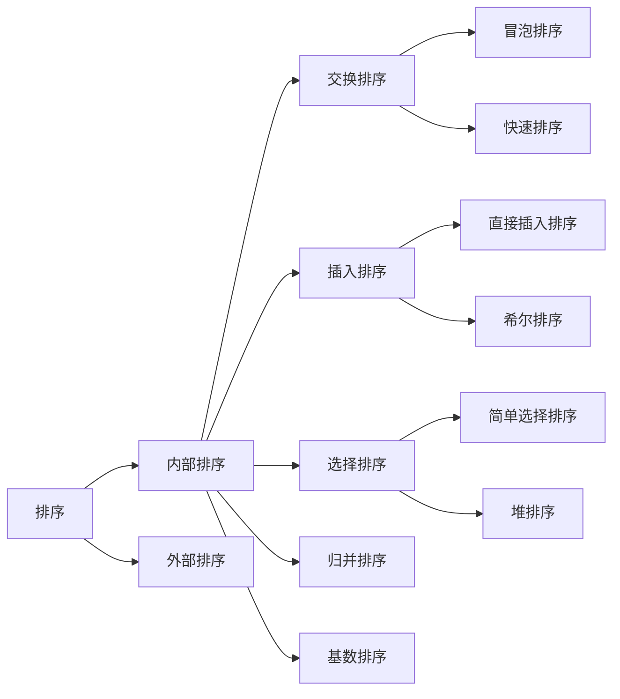

# 7. 排序

八大排序算法之间的关系


## 7.1 排序的稳定性

*   **定义**：如果待排序序列中存在两个或两个以上关键字相等的元素，在排序前和排序后，这些元素之间的相对次序保持不变，则称该排序算法是**稳定**的；否则称为**不稳定**的。
    *   例如：`[(StudentA, 80), (StudentB, 80)]`。如果按分数排序后，A 依然在 B 前面，则稳定；若 B 跑到了 A 前面，则不稳定。
*   **意义**：当进行多关键字排序时（例如先按数学成绩排，再按总分排），稳定性非常重要。


| 排序算法 | 稳定性 | 解释 |
|---------|-------|------|
| **直接插入排序** | **稳定** | 从后向前扫描，遇到相等元素时停止移动，插入到相等元素后面 |
| **冒泡排序** | **稳定** | 相邻元素比较，相等时不交换，保持原顺序 |
| **简单选择排序** | **不稳定** | 选择最小元素时，可能将前面的相等元素交换到后面 |
| **快速排序** | **不稳定** | 分区操作中，可能交换不相邻的相等元素 |
| **堆排序** | **不稳定** | 堆调整过程中可能改变相等元素的相对顺序 |
| **归并排序** | **稳定** | 合并操作中，遇到相等元素优先选择左侧元素 |
| **基数排序** | **稳定** | 基于稳定的子排序（通常是计数排序） |


在实际开发中，稳定性选择需要考虑：
1. **需要稳定性的场景**：
   - 多级排序（先按次要条件排，再按主要条件排）
   - 保持用户数据的原始顺序
   - 需要可重现的结果
2. **Java内置排序**：
   - `Arrays.sort()`：对于基本类型使用快速排序（不稳定），对于对象类型使用TimSort（稳定归并排序变体）
   - `Collections.sort()`：使用TimSort（稳定）
3. **性能与稳定性权衡**：
   - 稳定排序通常稍慢于不稳定排序
   - **归并排序**是常见的稳定且高效的算法
   - 快速排序在大多数情况下最快，但不稳定


## 7.2 各类排序算法的排序过程、排序特点及时间复杂度、空间复杂度、稳定性等特性

### 7.2.1 直接插入排序 (Insertion Sort)

*   **过程**：将数组分为“已排序”和“未排序”两部分。每次从未排序部分取出一个元素，插入到已排序部分的正确位置。类似打扑克牌理牌。
*   **特点**：数据越接近有序，效率越高。$N$ 较小时效率很高。

```java
void insertionSort(int[] arr) {
    for (int i = 1; i < arr.length; i++) {
        int key = arr[i];
        int j = i - 1;
        // 将大于key的元素后移
        while (j >= 0 && arr[j] > key) {
            arr[j + 1] = arr[j];
            j--;
        }
        arr[j + 1] = key;
    }
}
```
最外层循环为轮到第i个数插入，插入到左边的序列中，使得 `0~i` 为有序数列。内层循环是第i个数与其左边的数进行比较以确定它应该插入的位置（从右往左把大于它的数**全部后移** 直到遇到第一个小于它的数停止）。

*   **复杂度**：时间 $O(N^2)$，空间 $O(1)$。
*   **稳定性**：**稳定**。

### 7.2.2 冒泡排序 (Bubble Sort)

*   **过程**：重复走访数组，比较相邻元素，如果顺序错误就交换。每轮走访会将当前最大的元素“冒泡”到顶端。
*   **特点**：实现最简单，但由于交换次数多，通常是最慢的。

```java
void bubbleSort(int[] arr) {
    boolean swapped = true;
    for (int i = 0; i < arr.length - 1 && swapped; i++) {
        swapped = false; // 优化：如果一轮没发生交换，说明已有序
        for (int j = 0; j < arr.length - 1 - i; j++) {
            if (arr[j] > arr[j + 1]) {
                int temp = arr[j];
                arr[j] = arr[j + 1];
                arr[j + 1] = temp;
                swapped = true;
            }
        }
    }
}
```
外层循环是遍历次数，每次遍历从头开始，**两两比较**，每次遍历都会把（未有序的数中）最大的数放到最右边，使得右端成为有序数列。第 i 次遍历则右端的有序数列长度为 i，只需要检查下标为 `0~n-i` 这些数（两两比较）就好。

*   **复杂度**：时间 $O(N^2)$，空间 $O(1)$。
*   **稳定性**：**稳定**。

### 7.2.3 简单选择排序 (Selection Sort)

*   **过程**：每次从未排序区间找到最小（或最大）的元素，将其放到已排序区间的末尾。
*   **特点**：交换次数最少（最多 $N-1$ 次），但比较次数多。

```java
void selectionSort(int[] arr) {
    for (int i = 0; i < arr.length - 1; i++) {
        int minIdx = i;
        for (int j = i + 1; j < arr.length; j++) {
            if (arr[j] < arr[minIdx]) minIdx = j;
        }
        // 交换
        int temp = arr[i];
        arr[i] = arr[minIdx];
        arr[minIdx] = temp;
    }
}
```
最外层为遍历次数。第i趟选择右端无序数列中**最小的值**，与第i个数**交换**，使得左端成为有序数列。内层循环就是找出并记录每趟的最小值及其位置。

*   **复杂度**：时间 $O(N^2)$，空间 $O(1)$。
*   **稳定性**：**不稳定**（例如 `[2, 2, 1]`，第一个 2 会被交换到 1 的后面）。

### 7.2.4 快速排序 (Quick Sort)

*   **过程**：分治法。选一个“基准值”（pivot），将小于它的放左边，大于它的放右边，然后递归处理左右两边。
*   **特点**：平均性能最快的通用排序算法。

```java
void quickSort(int[] arr, int low, int high) {
    if (low < high) {
        int pivot = partition(arr, low, high);
        quickSort(arr, low, pivot - 1);
        quickSort(arr, pivot + 1, high);
    }
}

int partition(int[] arr, int low, int high) {
    int pivot = arr[high]; // 选最后一个元素作为基准
    int i = low - 1;
    for (int j = low; j < high; j++) {
        if (arr[j] < pivot) {
            i++;
            int temp = arr[i]; arr[i] = arr[j]; arr[j] = temp;
        }
    }
    // 将基准放到正确位置
    int temp = arr[i + 1]; arr[i + 1] = arr[high]; arr[high] = temp;
    return i + 1;
}
```
*   **复杂度**：平均时间 $O(N \log N)$，最坏 $O(N^2)$。空间 $O(\log N)$（递归栈）。
*   **稳定性**：**不稳定**。

### 7.2.5 堆排序 (Heap Sort)

*   **过程**：将数组构建成大顶堆，堆顶是最大值。将堆顶与末尾交换，缩小堆范围，重新调整堆。重复直至堆空。
*   **特点**：不需要递归，辅助空间少，适合大数据量且对最坏情况有要求的场景。

```java
void heapSort(int[] arr) {
    int n = arr.length;
    // 建堆
    for (int i = n / 2 - 1; i >= 0; i--) heapify(arr, n, i);
    // 排序
    for (int i = n - 1; i > 0; i--) {
        int temp = arr[0]; arr[0] = arr[i]; arr[i] = temp;
        heapify(arr, i, 0);
    }
}

void heapify(int[] arr, int n, int i) {
    int largest = i, l = 2 * i + 1, r = 2 * i + 2;
    if (l < n && arr[l] > arr[largest]) largest = l;
    if (r < n && arr[r] > arr[largest]) largest = r;
    if (largest != i) {
        int swap = arr[i]; arr[i] = arr[largest]; arr[largest] = swap;
        heapify(arr, n, largest);
    }
}
```
*   **复杂度**：时间 $O(N \log N)$，空间 $O(1)$。
*   **稳定性**：**不稳定**。

### 7.2.6 归并排序 (Merge Sort)

*   **过程**：分治法。将数组递归对半切分，直到只剩一个元素，然后两两合并有序序列。
*   **特点**：性能不受输入数据影响，严格的 $O(N \log N)$，但需要额外内存。

```java
void mergeSort(int[] arr, int l, int r) {
    if (l < r) {
        int m = l + (r - l) / 2;
        mergeSort(arr, l, m);
        mergeSort(arr, m + 1, r);
        merge(arr, l, m, r);
    }
}

void merge(int[] arr, int l, int m, int r) {
    int[] temp = new int[r - l + 1]; // 辅助数组
    int i = l, j = m + 1, k = 0;
    while (i <= m && j <= r) 
        temp[k++] = (arr[i] <= arr[j]) ? arr[i++] : arr[j++];
    while (i <= m) temp[k++] = arr[i++];
    while (j <= r) temp[k++] = arr[j++];
    System.arraycopy(temp, 0, arr, l, temp.length);
}
```
*   **复杂度**：时间 $O(N \log N)$，空间 $O(N)$。
*   **稳定性**：**稳定**。

### 7.2.7 基数排序 (Radix Sort)

*   **过程**：非比较排序。按照低位先排序，收集；再按高位排序，收集；以此类推。
*   **特点**：基于桶排序思想，适用于整数或定长字符串。

```java
void radixSort(int[] arr) {
    int max = Arrays.stream(arr).max().getAsInt();
    // exp: 1, 10, 100... 按位数循环
    for (int exp = 1; max / exp > 0; exp *= 10) {
        int[] output = new int[arr.length];
        int[] count = new int[10];
        
        for (int i : arr) count[(i / exp) % 10]++;
        for (int i = 1; i < 10; i++) count[i] += count[i - 1];
        // 倒序遍历以保证稳定性
        for (int i = arr.length - 1; i >= 0; i--) {
            output[count[(arr[i] / exp) % 10] - 1] = arr[i];
            count[(arr[i] / exp) % 10]--;
        }
        System.arraycopy(output, 0, arr, 0, arr.length);
    }
}
```
*   **复杂度**：时间 $O(d(N+K))$ ($d$为位数)，空间 $O(N+K)$。
*   **稳定性**：**稳定**。


### 7.2.8 希尔排序 (Shell Sort)（考纲没有）

*   **过程**：插入排序的改进版。将数组按增量分组，对每组进行插入排序；逐步缩小增量，重复分组排序；增量减至1时，对整个数组进行插入排序。
*   **特点**：通过增量跳跃式移动，减少比较和交换次数，提升插入排序效率。

```java
void shellSort(int[] arr) {
    int n = arr.length;
    // 逐步缩小增量gap
    for (int gap = n / 2; gap > 0; gap /= 2) {
        // 从第gap个元素开始，对每个分组进行插入排序
        for (int i = gap; i < n; i++) {
            int temp = arr[i];
            int j = i;
            // 在分组内进行插入排序
            while (j >= gap && arr[j - gap] > temp) {
                arr[j] = arr[j - gap];
                j -= gap;
            }
            arr[j] = temp;
        }
    }
}
```
*   **复杂度**：时间 $O(n^{1.3})$ 到 $O(n^2)$（取决于增量序列），空间 $O(1)$。
*   **稳定性**：**不稳定**（相同元素可能分在不同组中移动）。


## 7.3 根据不同应用需求选择合适排序算法


| 排序算法 | 平均时间复杂度 | 最好情况 | 最坏情况 | 空间复杂度 | 稳定性 | 适用场景 | 不适用场景 |
|---------|--------------|----------|----------|------------|--------|----------|------------|
| **直接插入排序** | O(n²) | O(n) | O(n²) | O(1) | 稳定 | 1. 小规模数据<br>2. 基本有序的数据<br>3. 链式存储结构 | 1. 大规模数据<br>2. 完全逆序数据 |
| **冒泡排序** | O(n²) | O(n) | O(n²) | O(1) | 稳定 | 1. 教学示例<br>2. 小规模且接近有序的数据<br>3. 需要稳定性且数据量小 | 1. 实际生产环境<br>2. 大规模数据 |
| **简单选择排序** | O(n²) | O(n²) | O(n²) | O(1) | 不稳定 | 1. 数据量小<br>2. 交换代价高的场景（如大对象）<br>3. 不关心稳定性 | 1. 需要稳定性的场景<br>2. 大规模数据 |
| **快速排序** | O(n log n) | O(n log n) | O(n²) | O(log n)~O(n) | 不稳定 | 1. 大规模随机数据<br>2. 平均性能要求高<br>3. 内存空间有限 | 1. 已排序或基本有序数据<br>2. 需要稳定性的场景<br>3. 递归深度有限制的环境 |
| **堆排序** | O(n log n) | O(n log n) | O(n log n) | O(1) | 不稳定 | 1. 需要保证最坏情况性能<br>2. 数据量极大（内存有限）<br>3. 实时系统（可预测时间） | 1. 需要稳定性的场景<br>2. 数据量很小<br>3. 内存访问模式要求高（缓存不友好） |
| **归并排序** | O(n log n) | O(n log n) | O(n log n) | O(n) | 稳定 | 1. 需要稳定性<br>2. 链表排序<br>3. 外部排序（大数据）<br>4. 并行排序 | 1. 内存空间有限的场景<br>2. 小规模数据（开销大） |
| **基数排序** | O(d·(n+k)) | O(d·(n+k)) | O(d·(n+k)) | O(n+k) | 稳定 | 1. 非负整数排序<br>2. 字符串排序（字典序）<br>3. 固定长度关键字<br>4. 数据范围有限 | 1. 浮点数排序（需转换）<br>2. 关键字范围过大<br>3. 负数需要特殊处理 |

**说明**：
- d：数字的位数或字符串长度
- k：基数范围（如十进制数字，k=10）
- n：数据元素个数


**总结口诀**：
> 只有插、冒、归、基是**稳定**的。
> 快、归、堆、基的时间复杂度优于 $O(N^2)$。
> **快速排序**通常是综合性能之王，但最坏情况用**堆排序**保底，由于内存够用且要稳定用**归并**。
> **直接插入排序**在序列几乎有序时具有最优的适应性，其简单高效的特点使其成为该场景下的最佳选择。而冒泡排序虽然理论最好情况也是 O(n)，但实际效率不及插入排序

