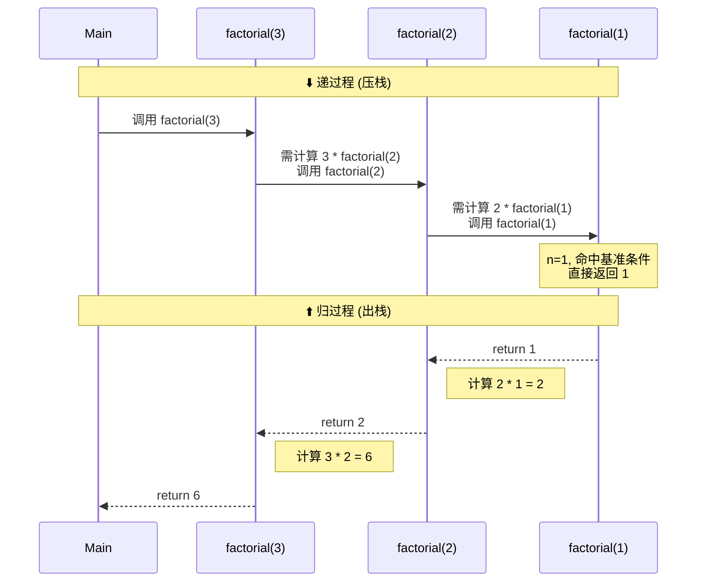
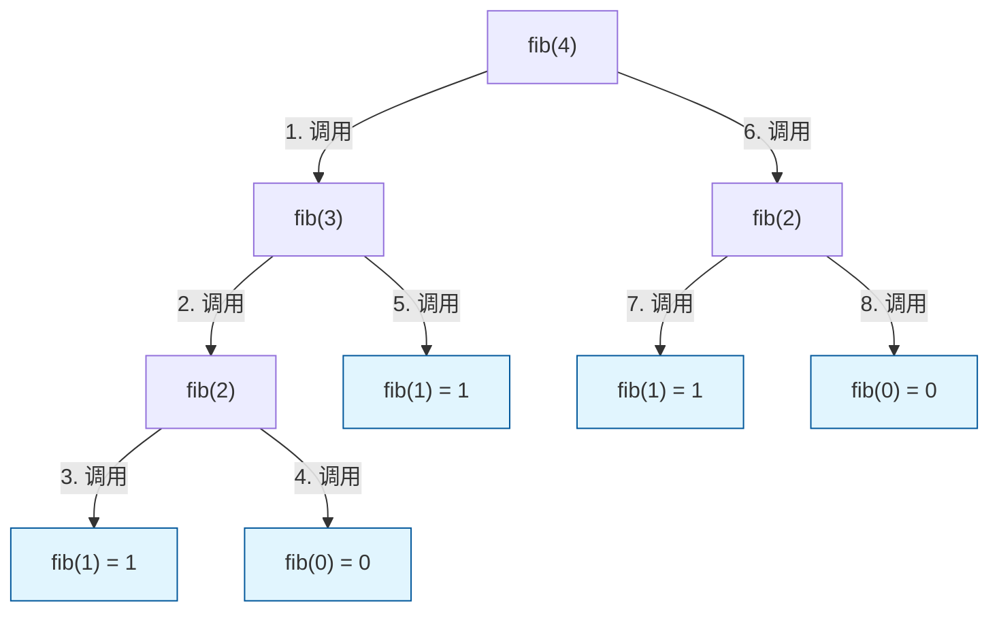

# 题型（不完全总结）

## 八股文概念题

1）基本概念部分

-  **数据**：是描述客观事物的符号的集合，是信息的载体。
-   **数据元素**：是组成数据的的基本**单位**。在程序中作为整体处理。
-   **数据项**：是数据元素的**组成部分**，是数据中不可分割的**最小单位**。一个数据元素可以由若干个数据项组成。
- **数据结构**：由某一数据元素的集合以及该集合所有元素的关系组成，记为 `Data_Structure = {D, R}` ，D 是元素集合，R 是元素间关系的有限集合。
一个完整的数据结构包含以下三个要素：**逻辑结构、存储结构、运算**。
	- 逻辑结构：从逻辑上描述数据元素之间的相互关系，与数据的存储无关，可以看作是抽象意义上的数据结构。
	- 存储结构：指数据结构在计算机中的实际表示（映像），包括数据元素的表示和关系的表示。
	- 运算：：指施加在数据上的一组操作或算法。它定义了在特定逻辑和存储结构上，允许执行哪些功能

- **数据类型**：是一组性质相同的值的集合以及定义在这个集合上的一组操作的总称。(一个类型和定义在该类型上的操作)
- **抽象数据类型 ADT**：是指基于一个逻辑类型的数据类型以及这个类型上的一组操作。包含数据对象、数据关系和基本操作。

- 数据结构、数据类型、抽象数据类型的关系：**数据类型是抽象数据类型的物理基础，抽象数据类型是数据结构的抽象描述，数据结构是抽象数据类型的物理实现**

2）算法分析

- **时间复杂度**：**评估** ~~（获知）~~ 算法执行时间的复杂程度
- **空间复杂度**：**评估** ~~（获知）~~ 算法执行过程中所需占用的存储空间大小
-  **渐进性分析**：指在算法输入规模逐渐增大时，忽略算法执行效率中的（**常数项、低阶项**以及具体硬件环境、数据分布等）**非本质因素**，仅关注**算法执行时间或空间占用**随**输入规模**增长的 “**趋势特征**”，从而客观衡量算法效率优劣的分析方法。


*   **Ο标记法（渐进上界，描述最坏情况）**：如果存在正常数 `c` 和 `n₀`，使得对所有 `n ≥ n₀`，都有 `T(n) ≤ c * f(n)`，则称 `T(n)` 是 `O(f(n))` 的。

*   **Ω标记法（渐进下界，描述最好情况）**：如果存在正常数 `c` 和 `n₀`，使得对所有 `n ≥ n₀`，都有 `T(n) ≥ c * f(n)`，则称 `T(n)` 是 `Ω(f(n))` 的。

* **Θ标记法（大Θ记法，渐进紧确界）**：如果存在正常数 `c₁`， `c₂` 和 `n₀`，使得对所有 `n ≥ n₀`，都有 `c₁ * f(n) ≤ T(n) ≤ c₂ * f(n)`，则称 `T(n)` 是 `Θ(f(n))` 的。

- **时空权衡原则**：用时间换空间或用空间换时间


3）数据结构

- **线性表**：具有相同数据类型的 $n(n≥0)$ 个数据元素的有限序列
- **二叉树（Binary Tree）**：n（n≥0）个节点的有限集合，每个节点最多有两个子树（左子树、右子树），**子树有左右顺序之分**

- **树（Tree）**：n（n≥0）个节点的有限集合，存在唯一 “根节点”，其余节点划分为互不相交的子树（n=0 时为空树），**子树之间没有次序关系。**

- **森林（Forest）**：m（m≥0）棵互不相交的树的集合（m=0 时为空森林，单棵树可视为 m=1 的森林）

- **满二叉树** full binary tree：满二叉树的每一个结点，要么是一个恰有两个非空结点的分支结点要么是一个叶子结点。
- **完全二叉树** complete binary tree：完全二叉树有严格的要求，从根结点起，**每一层从左往右填充**。一棵高度为d的完全二叉树除了d-1层（最后一层）以外，每一层都是满的

* **Huffman编码**：一种不等长编码。高频字符用短码，低频用长码，保证无歧义，且总编码长度最短。

* **二叉搜索树 BST**：任意节点左子树所有节点值 < 该节点值 < 右子树所有节点值。
* **堆**：是一种基于**数组**实现的**完全二叉树**。**大顶堆**，任意节点的值 $\ge$ 其子节点的值。

- **并查集**：是一种用于管理元素分组的树形数据结构。专门用来处理一些不交集（Disjoint Sets） 的合并与查询问题。它能动态地维护多个互不相交的集合，并支持合并与查找这两个核心操作。
## 渐进性分析

- 数组求和
```java
public class ArraySum {
    public static int arraySum(int[] arr) {
        int sumVal = 0;
        for (int num : arr) {
            sumVal += num;
        }
        return sumVal;
    }
}
```
答案：
时间复杂度：O(n)
空间复杂度：O(1)
分析：单循环遍历n个元素，循环内为O(1)操作，时间复杂度O(n)；仅用固定额外变量，空间复杂度O(1)。

- 上三角矩阵求和
```java
public class UpperTriangleSum {
    public static int upperTriangleSum(int[][] matrix) {
        int n = matrix.length;
        int total = 0;
        for (int i = 0; i < n; i++) {
            for (int j = i; j < n; j++) {
                total += matrix[i][j];
            }
        }
        return total;
    }
}
```
答案：
时间复杂度：O(n²)
空间复杂度：O(1)
分析：总循环次数为n+(n-1)+...+1 = n(n+1)/2，忽略低阶项和常数，时间复杂度O(n²)；无额外动态空间，空间复杂度O(1)。

- 递归二分查找
```java
public class BinarySearch {
    public static int binarySearchRecursive(int[] arr, int target, int left, int right) {
        if (left > right) {
            return -1;
        }
        int mid = (left + right) / 2;
        if (arr[mid] == target) {
            return mid;
        } else if (arr[mid] > target) {
            return binarySearchRecursive(arr, target, left, mid - 1);
        } else {
            return binarySearchRecursive(arr, target, mid + 1, right);
        }
    }
}
```
答案：
时间复杂度：O(log n)
空间复杂度：O(log n)
分析：每次递归缩小一半区间，递归深度log₂n，时间复杂度O(log n)；递归栈空间等于深度，空间复杂度O(log n)。

- 数组处理与构建二维列表
```java
import java.util.ArrayList;
import java.util.List;

public class ProcessArray {
    public static List<List<Integer>> processArray(int[] arr) {
        int count = 0;
        for (int num : arr) {
            count++;
        }
        List<List<Integer>> result = new ArrayList<>();
        for (int i = 0; i < count; i++) {
            List<Integer> row = new ArrayList<>();
            for (int j = 0; j < count; j++) {
                row.add(arr[i] * j);
            }
            result.add(row);
        }
        return result;
    }
}
```
答案：
时间复杂度：O(n²)
空间复杂度：O(n²)
分析：单循环O(n)，嵌套循环O(n²)，总复杂度取最高阶O(n²)；构建n×n二维集合，空间复杂度O(n²)。

- 归并排序
```java
public class MergeSort {
    public static int[] mergeSort(int[] arr) {
        if (arr.length <= 1) {
            return arr;
        }
        int mid = arr.length / 2;
        int[] left = new int[mid];
        int[] right = new int[arr.length - mid];
        System.arraycopy(arr, 0, left, 0, mid);
        System.arraycopy(arr, mid, right, 0, arr.length - mid);
        
        left = mergeSort(left);
        right = mergeSort(right);
        return merge(left, right);
    }
    
    private static int[] merge(int[] left, int[] right) {
        int[] res = new int[left.length + right.length];
        int i = 0, j = 0, k = 0;
        while (i < left.length && j < right.length) {
            if (left[i] <= right[j]) {
                res[k++] = left[i++];
            } else {
                res[k++] = right[j++];
            }
        }
        while (i < left.length) res[k++] = left[i++];
        while (j < right.length) res[k++] = right[j++];
        return res;
    }
}
```
答案：
时间复杂度：O(n log n)
空间复杂度：O(n)
分析：递归深度log₂n，每一层合并总时间O(n)，总时间O(n log n)；合并需临时数组，最大空间O(n)，取最高阶为O(n)。

- 计算阶乘
```java
public class Factorial {
    public static int factorial(int n) {
        if (n <= 1) {
            return 1;
        }
        return n * factorial(n - 1);
    }
}
```
答案：
时间复杂度：O(n)
空间复杂度：O(n)
分析：函数执行了n次递归调用，每次调用执行常数时间操作，时间复杂度O(n)。递归调用深度为n，每次调用需要在栈中保存返回地址和参数，占用常数空间，空间复杂度O(n)。

- 数组元素查找
```java
public class FindMax {
    public static int findMax(int[] arr) {
        int maxVal = arr[0];
        for (int i = 1; i < arr.length; i++) {
            if (arr[i] > maxVal) {
                maxVal = arr[i];
            }
        }
        return maxVal;
    }
}
```
答案：
时间复杂度：O(n)
空间复杂度：O(1)
分析：遍历数组一次，执行n-1次比较操作，时间复杂度O(n)。只使用了固定数量的变量，与输入规模n无关，空间复杂度O(1)。

- 二分查找（迭代版）
```java
public class BinarySearchIterative {
    public static int binarySearch(int[] arr, int target) {
        int left = 0, right = arr.length - 1;
        while (left <= right) {
            int mid = (left + right) / 2;
            if (arr[mid] == target) {
                return mid;
            } else if (arr[mid] < target) {
                left = mid + 1;
            } else {
                right = mid - 1;
            }
        }
        return -1;
    }
}
```
答案：
时间复杂度：O(log n)
空间复杂度：O(1)
分析：最坏情况下每次将搜索范围减半，循环次数为⌊log₂n⌋+1，时间复杂度O(log n)。只使用了固定数量的变量，空间复杂度O(1)。

- 嵌套循环
```java
public class TripleNestedLoop {
    public static int processMatrix(int n) {
        int count = 0;
        for (int i = 0; i < n; i++) {
            for (int j = 0; j < n; j++) {
                for (int k = 0; k < n; k++) {
                    count++;
                }
            }
        }
        return count;
    }
}
```
答案：
时间复杂度：O(n³)
空间复杂度：O(1)
分析：三重嵌套循环，每层循环n次，基本操作执行次数n³，时间复杂度O(n³)。只使用了常数个变量，空间复杂度O(1)。

- 斐波那契数列（递归）
```java
public class Fibonacci {
    public static int fibonacci(int n) {
        if (n <= 1) {
            return n;
        }
        return fibonacci(n - 1) + fibonacci(n - 2);
    }
}
```
答案：
时间复杂度：O(2ⁿ)
空间复杂度：O(n)
分析：递归调用形成二叉树，高度约为n，节点总数约为2ⁿ，时间复杂度O(2ⁿ)。递归深度为n，每层调用占用常数栈空间，空间复杂度O(n)。

- 深度优先搜索（DFS）
```java
import java.util.HashSet;
import java.util.Set;

public class DFS {
    public static void dfs(int[][] graph, int node, Set<Integer> visited) {
        if (visited.contains(node)) {
            return;
        }
        
        visited.add(node);
        
        for (int neighbor : graph[node]) {
            dfs(graph, neighbor, visited);
        }
    }
}
```
答案：
时间复杂度：O(V + E)（V为顶点数，E为边数）
空间复杂度：O(V)
分析：每个顶点被访问一次，每条边被遍历一次（无向图每条边访问两次），时间复杂度O(V + E)。visited集合存储所有顶点占用O(V)空间，递归栈深度在最坏情况下为O(V)，空间复杂度O(V)。

- 硬币找零（动态规划）
```java
public class CoinChange {
    public static int coinChange(int[] coins, int amount) {
        int[] dp = new int[amount + 1];
        for (int i = 1; i <= amount; i++) {
            dp[i] = amount + 1;
        }
        dp[0] = 0;
        
        for (int coin : coins) {
            for (int i = coin; i <= amount; i++) {
                dp[i] = Math.min(dp[i], dp[i - coin] + 1);
            }
        }
        
        return dp[amount] > amount ? -1 : dp[amount];
    }
}
```
答案：
时间复杂度：O(k × amount)（k为硬币种类数）
空间复杂度：O(amount)
分析：外层循环遍历硬币列表，设硬币种类数为k；内层循环遍历金额从coin到amount，总操作次数约k × amount，时间复杂度O(k × amount)。使用长度为amount+1的数组dp，空间复杂度O(amount)。

- 查找重复元素
```java
import java.util.ArrayList;
import java.util.HashSet;
import java.util.List;
import java.util.Set;

public class FindDuplicates {
    public static List<Integer> findDuplicates(int[] arr) {
        Set<Integer> seen = new HashSet<>();
        List<Integer> duplicates = new ArrayList<>();
        
        for (int item : arr) {
            if (seen.contains(item)) {
                duplicates.add(item);
            } else {
                seen.add(item);
            }
        }
        
        return duplicates;
    }
}
```
答案：
时间复杂度：O(n)
空间复杂度：O(n)
分析：遍历数组一次，每次操作（查找和插入集合、追加列表）平均为O(1)，时间复杂度O(n)。最坏情况下所有元素都不重复，seen集合存储n个元素；duplicates列表在最坏情况下可能存储n/2个元素，空间复杂度O(n)。

- 矩阵旋转
```java
public class RotateMatrix {
    public static void rotateMatrix(int[][] matrix) {
        int n = matrix.length;
        
        // 转置矩阵
        for (int i = 0; i < n; i++) {
            for (int j = i; j < n; j++) {
                int temp = matrix[i][j];
                matrix[i][j] = matrix[j][i];
                matrix[j][i] = temp;
            }
        }
        
        // 反转每一行
        for (int i = 0; i < n; i++) {
            for (int j = 0; j < n / 2; j++) {
                int temp = matrix[i][j];
                matrix[i][j] = matrix[i][n - 1 - j];
                matrix[i][n - 1 - j] = temp;
            }
        }
    }
}
```
答案：
时间复杂度：O(n²)
空间复杂度：O(1)
分析：转置操作访问矩阵上三角元素，操作次数为n(n-1)/2，即O(n²)；反转每一行需要O(n)时间，共n行，总时间O(n²)。原地操作，仅使用常数个临时变量，空间复杂度O(1)。


## 树的证明题

-  **二叉树基本定理：对任何一棵二叉树T，如果其叶结点数为 $n_0$，则双孩子结点数为 $n_2$，则有  $n_0 = n_2 + 1$**
**证明**：二叉树中，只有三种结点: 叶结点 $n_0$，单孩子结点 $n_1$，双孩子结点 $n_2$，设该树的结点总数为 $n$，则有 $n = n_0 + n_1 + n_2$，也有 $n = \underbrace{0 \times n_0 + 1 \times n_1 + 2 \times n_2}_{分支数} + 1$，结合这两个式子消去 $n$ 即可证明.

- **满二叉树定理：非空满二叉树的叶结点数等于其分支结点数+1**
	**证明**：满二叉树无单孩子结点 $n_1=0$，其分支结点即为双孩子节点 $n_2$，由二叉树基本定理，叶结点数 $n_0$ = 分支节点数 $n_2$ + 1.

- **一棵非空二叉树空子树的数目等于其结点数目+1**
**证明**：二叉树有 $n$ 个结点，每个节点有两个指针，共有 $2n$ 个，其中非空指针数即为树的边数 $n-1$，那么空指针数也就是空子树数目为 $2n-(n-1) = n+1$.


- **高度为k的二叉树最多有 $2^k - 1 (k \geq1)$ 个结点**
**证明**：当二叉树为满二叉树时结点数最多。第 $i$ 层最多有 $2^{i-1}$ 个结点，共 $k$ 层，故最多结点数为：
$$\sum_{i=1}^k 2^{i-1} = 2^k - 1.$$


- **具有 $n$ 个结点的完全二叉树的高度为 $\lfloor log_2 n \rfloor +1$ 或 $\lceil log_2(n+1) \rceil$**
**证明**：设高度为 $h$。由完全二叉树定义，前 $h-1$ 层满（共 $2^{h-1}-1$ 个结点），第 $h$ 层至少 $1$ 个、至多 $2^{h-1}$ 个结点，故：
$$2^{h-1} \le n \le 2^h - 1 < 2^h$$
取对数得
$$h-1 \le \log_2 n< h$$
$$\log_2 n < h  \le \log_2 n + 1$$
$$h = \lfloor \log_2 n \rfloor + 1.$$
同时由 $2^{h-1} < n+1 \le 2^h$ 取对数可得：
$$h-1 < \log_2(n+1) \leq h   $$
$$h = \lceil \log_2 (n+1) \rceil.$$


## 二叉树与树和森林的转换

- 树与二叉树：左孩子右兄弟法

**右连所有兄弟、删非长子（留左长子）**。反之同理，操作可逆。

```
【树】                【中间步骤】              【二叉树】
      A                       A                    A
    / | \                   /                     /
   B  C  D                B-->C-->D              B
  / \                    /                     / \
 E   F                  E-->F                 E   C
                                               \   \
                                                F   D
```

- 森林与二叉树

**树转二叉树、右连下一颗树**。反之同理，操作可逆。

```
  【原始森林】          【树转为二叉树】        【合并后的二叉树】
 树1:       树2:        树1:       树2:            A
   A          X          A         X             / \
  / \        /          /         /             B   X  <-- A右接X
 B   C      Y          B         Y             /   /
                      /                       C   Y
                     C
```
## 画递归调用栈

以阶乘为例

```java
public class Factorial {
    public static int factorial(int n) {
        // 基线条件 (Base Case)
        if (n == 0 || n == 1) {
            return 1;
        }
        // 递归条件 (Recursive Step)
        else {
            return n * factorial(n - 1);
        }
    }

    public static void main(String[] args) {
        int n = 3; // 我们用 n=3 来演示，方便画图
        int result = factorial(n);
        System.out.println(n + "! = " + result);
    }
}
```

递归调用栈（这种画法没有问题）

```
  |                           |
  |                           |
  |---------------------------|
  | factorial(1)              | <--- 栈顶
  | 参数 n=1                  |
  | 命中基准条件: return 1    |
  |---------------------------|
  | factorial(2)              |
  | 参数 n=2                  |
  | 等待: 2 * factorial(1)    |
  |---------------------------|
  | factorial(3)              |
  | 参数 n=3                  |
  | 等待: 3 * factorial(2)    |
  |---------------------------|
  | main 方法                 | <--- 栈底
  | 调用 factorial(3)         |
  -----------------------------
```

时序图




再以 fibonacci 函数为例
```java
public class Fibonacci {
    // 递归计算斐波那契数列
    public static int fib(int n) {
        // 基准情况 (Base Case)
        if (n <= 1) {
            return n;
        }
        // 递归步骤
        return fib(n - 1) + fib(n - 2);
    }

    public static void main(String[] args) {
        int n = 4;
        System.out.println("fib(" + n + ") = " + fib(n));
    }
}
```



(呃啊上课没听 不知道这样画可以不 因为Fibonacci一次调用两个 所以没法画成线性结构)

## 画邻接表

（借yjq学长笔记的一张图）
邻接表画成这样应该就可以了吧


## 补充：怎么写伪代码
**1. 核心原则 (The Golden Rules)**
-  **忽略语法细节**：不需要写分号 `;`，不需要声明变量类型（int, String），不需要写 `public static void main`。
-  **利用缩进**：用缩进（Indentation）来表示层级关系，替代大括号 `{}`。
-  **关键字大写**：为了区分逻辑指令和变量名，通常将关键字（如 `IF`, `ELSE`, `FOR`）全大写。
-  **自然语言**：对于复杂的数学操作或库函数，可以直接用一句话描述（例如：`Sort list` 或 `Swap a and b`）。

**2. 常用词汇表 (Cheat Sheet)**


*   **赋值 (Assignment)**
    *   `x ← 5` (最标准，箭头表示赋值，避免和等于号混淆)
    *   `Set x to 5`
    *   `x = 5` (也可以，但有时会和判断相等混淆)
*   **算术运算**
    *   `+`, `-`, `*`, `/`, `MOD` (取余)
*   **比较**
    *   `=`, `≠`, `<`, `>`, `≤`, `≥`
*   **输入/输出**
    *   `READ`, `INPUT`, `GET`
    *   `PRINT`, `OUTPUT`, `DISPLAY`, `RETURN`
*   **分支 (决策)**
    *   `IF ... THEN ...`
    *   `ELSE IF ... THEN ...`
    *   `ELSE ...`
    *   `ENDIF` (明确结束块)
*   **循环**
    *   `WHILE ... DO ... ENDWHILE`
    *   `FOR ... DO ... ENDFOR`
    *   `REPEAT ... UNTIL ...`
*   **函数**
    *   `FUNCTION name(arguments)`
    *   `CALL name`
    *   `ENDFUNCTION`

**3. 例子**

例子 A：简单的 IF-ELSE (阶乘)

**思路**：如果是 0 或 1，返回 1，否则返回 n * 递归。

```text
FUNCTION Factorial(n)
    IF n = 0 OR n = 1 THEN
        RETURN 1
    ELSE
        RETURN n * Factorial(n - 1)
    ENDIF
ENDFUNCTION
```

例子 B：循环结构 (数组求和)

**思路**：拿到一个数组，遍历它，累加到一个 total 变量里。

```text
FUNCTION SumArray(arr)
    SET total ← 0
    SET length ← length of arr
    
    FOR i FROM 0 TO length - 1 DO
        total ← total + arr[i]
    ENDFOR
    
    RETURN total
ENDFUNCTION
```

例子 C：稍微复杂一点的逻辑 (查找最大值)

**思路**：假设第一个是最大的，然后去和剩下的比。

```text
FUNCTION FindMax(numbers)
    IF numbers is empty THEN
        RETURN error
    ENDIF
    
    SET maxVal ← numbers[0]
    
    FOR EACH num IN numbers DO
        IF num > maxVal THEN
            maxVal ← num
        ENDIF
    ENDFOR
    
    RETURN maxVal
ENDFUNCTION
```

**4. 写伪代码的步骤**

如果你在面试或做题，碰到一个新问题，按这个步骤来：

1.  **用人话描述**：先别管格式，在脑子里或者纸上想一遍流程。“先拿到A，如果A大于10，就做这个，否则做那个。”
2.  **翻译成关键字**：把“如果”改成 `IF`，把“重复做”改成 `WHILE` 或 `FOR`。
3.  **处理缩进**：把属于 `IF` 内部的逻辑往右推一格。
4.  **检查逻辑**：人肉跑一遍代码（Trace），看看有没有死循环或漏掉的情况。

**5. 常见的坑**

*   **太像代码**：不要写 `System.out.println("Hello")`。
    *   **修正**：`PRINT "Hello"`
*   **太抽象**：不要写 `Process the data` (除非那个处理过程极其复杂且不重要)。
    *   **修正**：写出具体的循环或判断逻辑。
*   **滥用语法**：不要纠结是 `i++` 还是 `i = i + 1`，伪代码里两个都行，甚至写 `Increment i` 也行。


