# 二叉树

根据老师的说法，从现在开始，课堂内容更倾向于代码逻辑，而非代码的实现本身。因此，笔记中也将减少涉及具体代码。

>作者：李彦筱
>
>感谢学长 [yijunquan](https://github.com/yijunquan-afk) 的[软件工程笔记](https://github.com/yijunquan-afk/XJTUSE-NOTES)给我的启发。此笔记从二叉树开始的部分中使用了学长笔记中的部分图片以及文字。
>

## 二叉树的定义

为什么需要二叉树？因为：

- 二叉树结合了数组实现的有序线性表的优点（折半查找带来的O(logn)的速度）和链表实现的线性表的优点（链表带来的O(1)级别的插入删除操作）。听起来是不是就很好（
- 我们需要描述的数据之间的逻辑关系可能不再能用线性数据结构维护。比如，当一个数据不仅仅有一个前驱，也不只有一个后继的时候。实际生活中，文件夹和族谱等结构就无法用线性结构描述。

二叉树由**结点**的有限集合组成。这个集合满足：

- 是一个空集。或者：

- 能够被划分为三个部分：根节点，以及两棵**不相交的二叉树**（递归定义）

  这两棵二叉树分别叫做*左子树*和*右子树*。

比如：

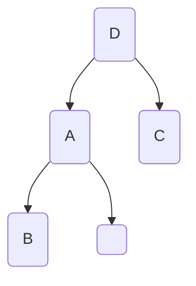

（假设那个空的框表示此子树不存在）

在这棵树上：D是整个二叉树的根节点；A，B节点构成D的左子树；C构成D的右子树。

对于A，B构成的二叉树：A是根节点，B是A的左子树，空节点是A的右子树。

对于C构成的二叉树：C是根节点，C的左子树和右子树都是空节点。

**一些称呼：**

A叫做D的左子节点，C叫做D的右子节点。请注意，**A和C是不等价的，因为他们一个是左一个是右**。如果它们反过来，这两棵二叉树就不一样了。

D称为A和C的父节点；A和C互为彼此的兄弟节点；

在二叉树当中，一个节点仅仅能有：**零个，一个或者两个子节点**；一个节点**有且仅有一个父节点**（除了根节点外）

**二叉树的前驱与后继：**

二叉树中，除了一个节点外（这个节点是根），其他所有节点有且仅有一个前驱；有零个，一个或者两个后继。

**路径，子孙和祖先**

路径：如果二叉树上的一些节点 n<sub>0</sub>, n<sub>1</sub>, n<sub>2</sub>, ..., n<sub>k</sub> 具有如下关系：n<sub>i</sub> 是 n<sub>i+1</sub> 的父节点，那么把这些节点称为 n<sub>0</sub> 到 n<sub>k</sub> 的一条路径。

可以看出，二叉树的路径必须是从上到下的，每层只能有一个节点，且“没有回头路”

子孙和祖先：如果有一条从节点 N 到 M 的路径，那么就把 N 称为 M 的祖先，M 称为 N 的子孙。

### 二叉树的层次结构

**层**是二叉树的一大特点。注意看这棵二叉树，可以看出来，很多节点在横向是同一高度的：

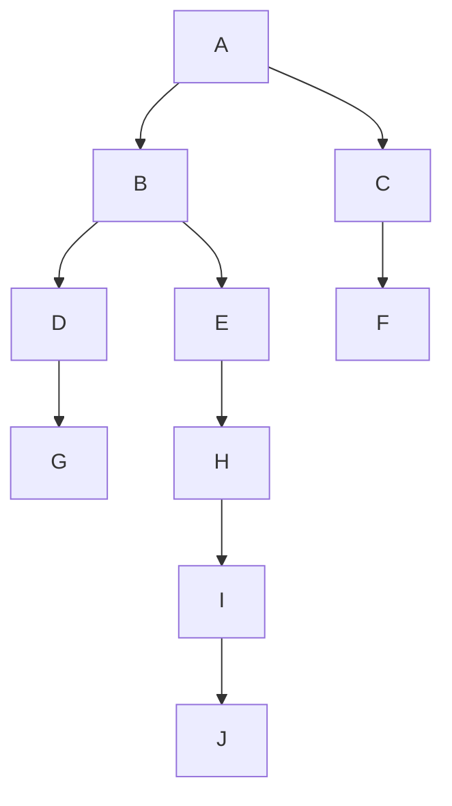

这些同一高度的节点称为**同一层的**。规定：根节点是第0层，B，C是第1层，D，E，F是第2层……

*深度*：节点所在的层数称为它的深度。比如，E的深度为2。

*叶节点*：两棵子树都为空节点的节点叫做叶节点。比如，G，J，F。

*内部节点*：至少有一棵子树不是空节点的节点。比如，H，D，A，……

*高度*：一棵二叉树的高度**等于其中节点最大的深度+1**。比如，这棵树的高度为6。

*度*：一个节点连接的子节点的个数。比如，叶节点的度为0。

### 一些特殊的二叉树

**满二叉树**：每一个节点要么有两个子节点，要么是叶节点。

即：没有任何一个节点有 1 个子节点

**完全二叉树**：从根节点开始，**每一层的元素必须从左向右填充**。对于高度为n的二叉树，除了第 n-1 层（最下边那层）之外，**其他所有层都是满的**。

> 满二叉树用于 Haffman 编码的二叉树中；完全二叉树是唯一在数组存储下不会浪费大量空间的二叉树，而且还可以用于建立*堆*。

一些判断的例子：

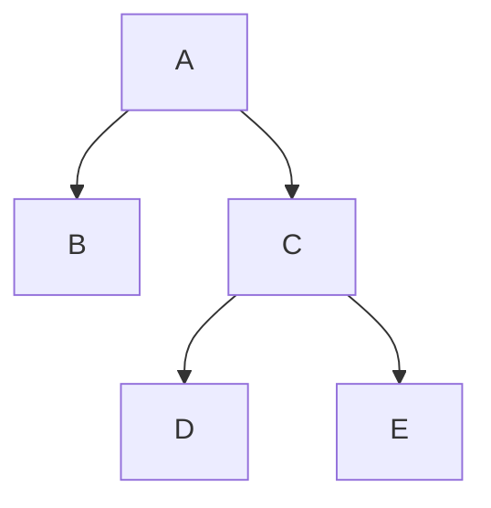

上边那棵二叉树是满二叉树（没有只有1个子节点的节点），但不是完全二叉树。这是因为它的第三层不是从左向右填充的。

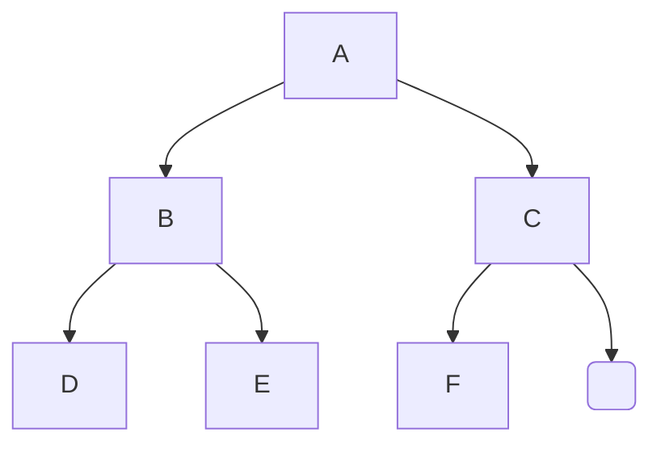

上面这棵树是完全二叉树，但是不是满二叉树。因为C仅仅有一个子节点（图中那个框表示空节点）。

为什么他是完全二叉树呢？因为：它的前两层都是满的；最后的一层虽然没满，但满足内容从左向右填充（空节点在最右侧）

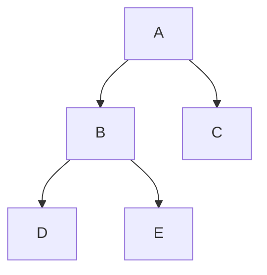

 这棵树既是满二叉树，还是完全二叉树。

### 二叉树的性质

- 对于二叉树的 i 层，其上最多有 2<sup>i</sup> 个节点（自己数一下就行了）

- 深度为 k 的二叉树最多包含了 2<sup>k+1</sup> -1 个节点。（深度k表示最多有k层，高度为k+1）

  2<sup>0</sup> + 2<sup>1</sup> + 2<sup>2</sup> + … + 2<sup>k</sup> = 2<sup>k+1</sup> - 1
  
- 对任何的一棵二叉树，如果其叶节点数量为 n<sub>0</sub>，而其含有两个子树的节点数量为 n<sub>2</sub> ，那么 n<sub>0</sub> = n<sub>2</sub> + 1

- 一棵二叉树的空子树的数量等于其节点数量 +1

- 具有 n 个节点的完全二叉树的高度为 ceil(log(n+1))

  > 这个结论是从第二条性质得出的。ceil 表示向上取整。

  高度为 h 的完全二叉树节点数量的范围：

  最少：2<sup>0</sup> + 2<sup>1</sup> + 2<sup>2</sup> + …… + 2<sup>h-2</sup> + 1（高度为 h-1 的完全二叉树+满二叉树的节点个数+ 1） = 2<sup>h-1</sup> - 1 + 1 = 2<sup>h-1</sup>

  最多：一棵高度为 h 的满二叉树+完全二叉树，即 2<sup>h</sup> - 1 个节点

  因此：
  $$
  2^{h-1} <= n <= 2^h-1
  $$

  $$
  2^{h-1}+1<=n+1<=2^h
  $$

  $$
  2^{h-1} < n+1 <= 2^h
  $$

  $$
  h-1 < log_2(n+1) \\ log_2(n+1)<=h
  $$

  $$
  log_2(n+1)<=h<log_2(n+1)+1
  $$

  因此取 h = ceil(log<sub>2</sub>(n+1))

- 完全二叉树在数组中如何存储：

  对于一棵存在n个节点的完全二叉树（根据上一条性质，其层数为 ceil(log<sub>2</sub>(n+1))），把根节点编号为0，从上到下，从左到右的对所有节点编号。对于其第 i 个节点(0<=i<=n-1)，有性质：

  ```mermaid
  graph TB
  0-->1
  0-->2
  1-->3
  1-->4
  D( )
  2-->D
  2-->i
  3-->i+1
  3-->i+2
  i+1-->2i+3
  i+1-->2i+4
  i-->2i+1
  i-->2i+2
  ```

  （这个编号方法大概长这样。空白节点只是因为我懒得写内容，并不说明它真的是空节点）

  - 如果 i=0,那么这个节点是根节点；
  - 一个编号为 i 的节点左侧后代编号为 2i+1；右侧后代为 2i+2
  - 一个编号为 i 的节点的父节点为 floor((i-1)/2)。（注：这个性质可以和上边那个一起记）
  - 一个节点的左兄弟的编号为 i-1（如果i为偶数且不为0）
  - 一个节点的右兄弟的编号为i+1（如果i为奇数）

  除了完全二叉树之外的其他二叉树也可以按照这种方式编码。不过，必须给部分叶节点补充一些空节点。这种情况下，在数组中存储时，就会有空间被浪费。
  
  例子：这棵完全二叉树是这么存储的：
  
  ```mermaid
  graph TB
  1-->2
  1-->3
  2-->6
  2-->5
  3-->4
  3-->7
  ```
  
  | 1    | 2    | 3    | 6    | 5    | 4    | 7    |
  | ---- | ---- | ---- | ---- | ---- | ---- | ---- |

## 二叉树的基本操作

### 二叉树的 ADT：

二叉树的ADT仅仅对每个树上的节点做出了规定。没有一个“对整棵二叉树操作”之类的数据类型。

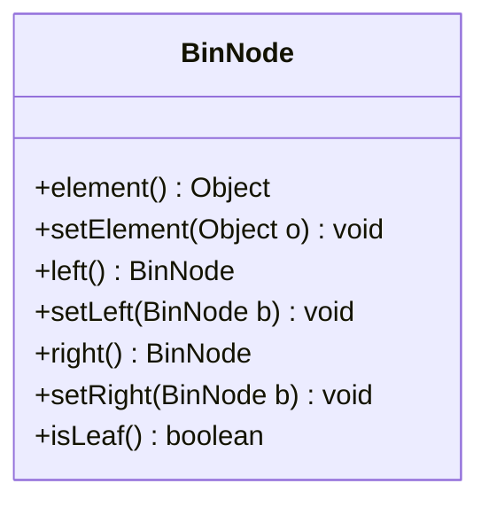

### 二叉树的顺序实现（基于数组）

根据上边二叉树的性质，只有完全二叉树在存储的时候不会浪费空间；其他的二叉树以数组形式存储的时候，都会浪费空间。浪费的空间用于维护每个二叉树节点之间的逻辑关系，保证“一个节点的父节点和子节点是哪个？”这种的逻辑关系不会丢失。

可以根据“完全二叉树在数组中如何存储”这部分内容，得知数组实现的二叉树如何保持二叉树的逻辑关系。（比如，第2个元素的左孩子是数组的第几个元素？右孩子是谁？）

### 二叉树的链式实现（基于链表）

由于二叉树本身就是一个非线性的数据结构，因此，使用非线性的链式实现是比较简单和自然的。

每个节点维护三个数据：

1. 自己存储的数据
2. 左子节点的指针
3. 右子节点的指针

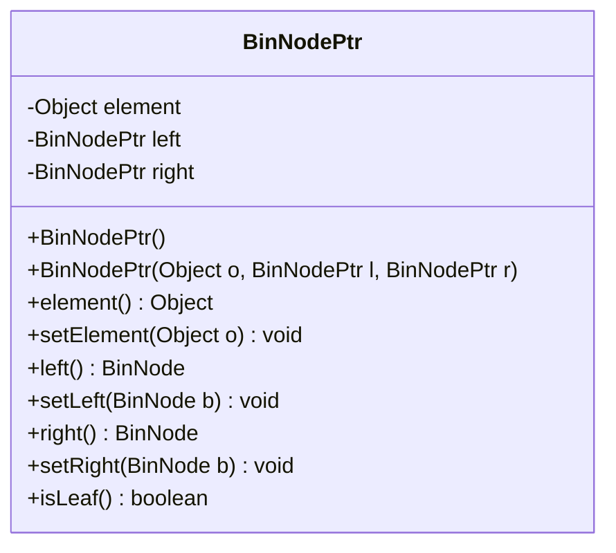

## 二叉树的遍历方式

遍历：按某条路径寻访二叉树的节点，使得**每个节点被访问一次，且仅仅被访问一次**

为什么线性表没有遍历方式的问题？因为线性表的每个元素都只有一个后继，一直取后继取到没有，就遍历完了；但是，二叉树作为非线性的数据结构，每个元素有着两个后继，所以就存在遍历的问题了。

二叉树的三种访问方法：

1. 层序遍历：按照层次，从上到下的遍历二叉树
2. 先遍历左子树，再遍历右子树
3. 先遍历右子树，再遍历左子树

### 二叉树的层序遍历：

访问二叉树的根节点 -> 根节点的孩子节点，从左到右 -> 根节点的孙子节点（从左到右）。比如，对于下边这棵树的遍历顺序为：

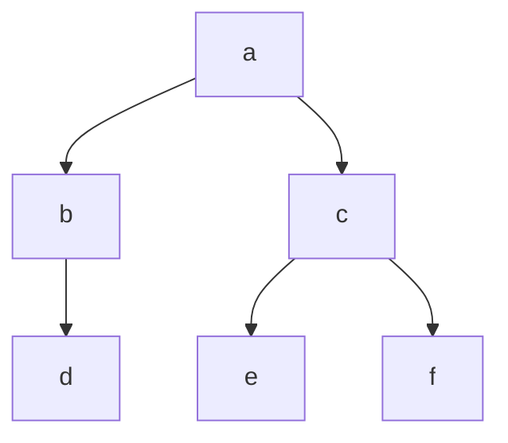

a -> b -> c -> d -> e -> f

在遍历过程中，可以发现b先于c被访问，而恰好，b的子树d先于c的子树（e和f）被访问。这种情况很像是“先进先出”：b先进c后进；b先出（并开始访问其子树），b的子树d弄完后，c后出（并访问其子树）。因此，可以借助队列完成层序遍历：

```java
private static void breadthFirst(BinNode binary){
    LQueue q = new LQueue();
    BinNode p = binary;
    if (p != null){
        q.enqueue(p);
        while (!q.empty()){
            p = (BinNode)q.dequeue();
            if (p.left() != null) q.enqueue(p.left());
            if (p.right() != null) q.enqueue(q.right());
        }
    }
}
```

在后面，这种利用其他数据结构（比如队列）辅助当前数据结构工作的情况还会出现。

### 二叉树的子树遍历方式

按照二叉树的递归定义，按子树遍历包含了**先序**，**中序**，**后序**三种方法：

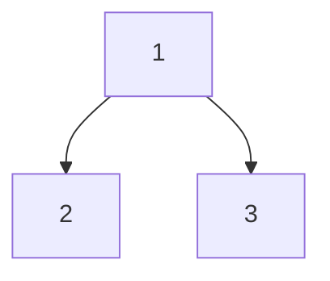

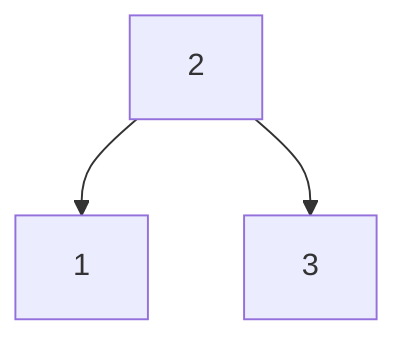


这三种遍历方法分别叫做先序，中序，后序遍历。比如，中序遍历表示先访问每个二叉树的左子树，再根节点，再右子树。“先”，“中”，“后”表示根节点在访问顺序中的位置；这三种遍历方式中，左子树永远先于右子树访问。

### 先（根）序遍历

- 若二叉树为空，则不进行任何操作
- 访问根节点
- 访问左子树
- 访问右子树

```java
private static void preOrder(BinNode binary){
    if (binary == null){
        return;
    }
    visit(binary);
    preOrder(binary.left());
    preOrder(binary.right());
}
```

（比较像是快速排序的递归方法）

### 中（根）序遍历

- 检查节点是否为空

- 访问左子树
- 访问根节点
- 访问右子树

```java
private static void inOrder(BinNode binary){
    if (binary == null){
        return;
    }
    preOrder(binary.left());
    visit(binary);
    preOrder(binary.right());
}
```

### 后（根）序遍历

- 检查节点是否为空

- 访问左子树
- 访问右子树
- 访问根节点

```java
private static void postOrder(BinNode binary){
    if (binary == null){
        return;
    }
    preOrder(binary.left());
    preOrder(binary.right());
    visit(binary);
}
```

### 三种根序遍历的共同点

不管哪种根序遍历，访问左子树的时机永远在访问右子树前面。

如果去掉三种遍历代码中的`visit`函数，那么你会发现这三个函数完全一样；事实上，这三个函数以相同的顺序经过了所有的节点，只不过选择访问每个节点的时机不一样。看下边这个图：


图里那条很长的线代表这三种遍历访问每个节点的方式。显然，三种遍历访问每个节点的方式都是一样的；每个节点被“看到”三次，因而有三个机会被访问（分别用白、蓝、黑的圈圈表示），而三种遍历各自选择了一种机会，

先序遍历代表：在每次遇到白色小球时，访问此节点；忽略蓝色和黑色的

中序遍历：在遇到蓝色小球时访问节点

后序遍历：在遇到黑色小球时访问节点


遍历的作用：统计，完成一些特定的工作。在统计二叉树的部分性质时，只需要正确的遍历二叉树，并且进行计数就行了。比如，如果你需要计算二叉树的高度:

```java
private int height(BinNode binary){
    int height = 0, leftheight, rightheight;
    if (binary == null) return 0;
    leftheight = height(binary.left());
    rightheight = height(binary.right());
    height = (leftheight > rightheight? leftheight : rightheight);
    return height + 1;
}
```

二叉树遍历是一个递归过程。但是，无法清晰地写出递归过程的时间表达式（递归过程规模的衰减函数）

> 注：一些递归函数的时间关于规模的函数
>
> 快速排序在最好情形下的时间复杂度：
> $$
> T(n) = 2T(\dfrac{n}{2}) + cn
> $$
> 汉诺塔：
> $$
> T(n) = 2T(n-1) + 1
> $$

不过，可以用另外的方法得到二叉树遍历的时间复杂度。刚才提到，每个二叉树节点在遍历中会“被看到3次”。因此，对于一棵有n个节点的二叉树，它在一次遍历中，节点会被访问 3n 次，因此，遍历二叉树的时间复杂度为：

**O(n)**

无论二叉树长什么样，时间复杂度永远如此。

### 二叉树的计数

- 一棵二叉树的先序序列和中序序列可以确定此树
- 中序序列和后序序列可以确定此树
- 前序序列和后序序列无法确定一棵二叉树；这说明**中序序列非常重要**。

如果一个二叉树的先序序列是 ABDECFG，中序序列为 DBEAFCG，请问这棵树是什么样子的？

从先序序列中我们可以看出，根节点一定是A了；从中序序列里我们知道，A左侧的DBE一定是左子树，A右侧的FCG一定是右子树。再从先序序列中看，我们可以得到B和C是左/右子树的根节点。再看回中序序列，B左侧的D就是最左侧的左子树，E就是左子树的右子树；同理，F是C这个子树的左子树，G是其右子树。因此，我们可以得到这棵树长这样：

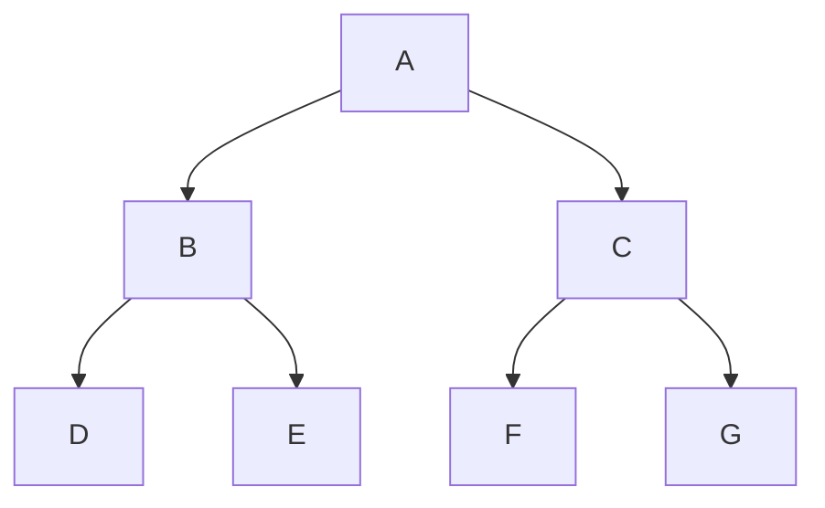


## 二叉树的应用：Huffman 编码树

### 压缩

看看这段文字：`This is isinglass`。有什么方法减少这个东西所占用的空间吗？

这段单词一共有15个英文字符。采用标准的 ASCII 码的时候，需要15个字节，即120位存储。然而，这段文字实际上只包含了8个字母，因此，如果我们创造一种新的编码，只使用3位来表示这8个字母，是不是减少了空间占用呢？

这种方法压缩之后，每个字母占用3位，加起来一共长 45 位。相比之前的120位，已经很好了。

那么，还有什么办法进一步的压缩呢？我们可以采用不等长的编码。比如说，对于出现最多的字母 i 和 s，我们用1位二进制表示；对于t, h, n, g这四个仅仅出现了1次的字母，我们采用2位二进制；对于a, l这两个出现1次的字母，（由于两位的二进制编码用完了）我们（不得不）采用3位的二进制表示。比如，进行如下的编码：

| 字母 | 编码 |
| ---- | ---- |
| s    | 0    |
| i    | 1    |
| t    | 00   |
| h    | 01   |
| n    | 10   |
| g    | 11   |
| a    | 000  |
| l    | 001  |

但是，比如 This 编码之后的字符串为： 000101，那该怎么解码呢？我们可以理解他为 This，但是还可以理解为 sssisi。显然，解码的时候出现了歧义，这简直糟透了，为什么会这样呢？

**编码的前缀性**

刚才我们的编码当中，有的代码完全是其他编码的前缀。比如，i 的编码为0，它是编码t ：00 的前缀。

前缀特性说明：如果一组编码中的某个编码是另一个的前缀，那么**代码解码时会出现歧义**

我们用二叉树来表示一下我们的编码：

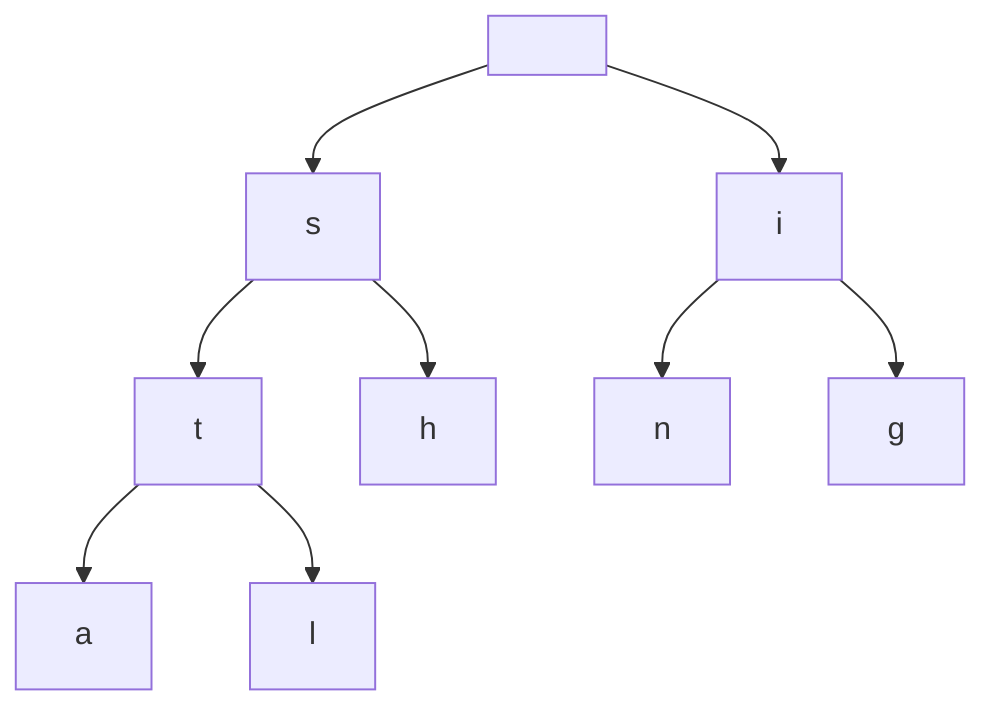


> 这棵二叉树的左分支代表编码中一位是0；右分支代表编码的一位是1；这是第二棵有着现实意义的二叉树

怎么通过二叉树得到一个字符的解码呢？比如我有一个编码 001，我需要先往左分支走，再向左分支，再右分支，到达的叶节点(l)就是这个字符的真实内容。

可以看出，我们的编码不具有前缀特性，反映在二叉树上是：**我们在前往一个字符时会途经其他的字符**

怎么解决呢？我们需要把所有需要编码的字符**放置在二叉树的叶节点上**。**不能放置在内部节点上**。

那，我们应该怎么规划我们的编码二叉树呢？`Huffman` 树登场了。

### 路径长度与 Huffman 二叉树的定义

**路径长度**：两个结点之间路径上的分支数（深层节点的层数-浅层节点的层数）

**树的外部路径长度**：所有的叶结点到根结点的路径长度之和

**树的内部路径长度**：所有非叶结点的节点到根结点的路径长度之和

**带权路径长度**：路径的长度 * 这段路径的“权重”。一般如果带权路径的一端是根节点的话，权重取决于另一侧的节点值。这个权重在Huffman编码问题中代表某种字母出现的次数。字母出现的越多，权重越大。

**树的外部带权路径长度**：树中所有叶子结点的带权路径长度之和

**Huffman树**: 使得带权长度最短的树。**它一定是满二叉树**。

外部带权路径到底表示了什么？如果“权重”表示了一个字母在你的待编码信息里头出现的次数，那么一个字母所在节点的“路径长度”就表示了这个字母编码的长度。他两个的乘积的累加，即（外部）带权路径的总长度，是**编码后的信息的长度**。

可以看出，带权路径最短的树对应的编码能够使得待编码信息在编码完后最短。也就是说，使用 Huffman 树进行信息编码，得到的结果一定是最短的。

Huffman 树的特点：**“权”大的字母路径短，“权”小的字母由于路径短的路径全被占了，路径会比较长。**

> "权"大的叶结点深度小，它相对于总路径长度的花费最小，因此，其他叶结点如果"权"小，就会被推到树的较深处

### Huffman 树的构造算法

这种构造算法类似于贪心算法：尽可能把权值最小的往最远处的叶节点放。

- 根据给定的n个权值$\{w_1, w_2 ..., w_n\}$，构造n棵二叉树的集合$F=\{T_1,T_2,...,T_n\}$，其中每棵二叉树中均**只含一个带权值为$w_i$的根结点**,其左、右子树为空树;

- 在F中选取根结点的权值最小的两棵二叉树，分别作为左、右子树构造一棵新的二叉树，并让这棵新的二叉树根结点的权值为其左、右子树根结点的权值之和;

- 从F中删去这两棵树，同时加入刚生成的新树;

- 重复上两步，直至F中只含一棵树为止

  > 每一轮，都会删去两棵树并添加一颗新的树，因此每次树的数量-1 。由于树的数量到1才停止，因此一共需要 n-1 次循环完成构造。

由于按照这个构造算法，每次都会取 2 棵子树构造成一棵大的二叉树，不会有只选择一棵二叉树的情况，因此，最后构造成的二叉树一定是一棵满二叉树。

### Huffman 树在压缩上的应用

把刚才的例子改为采用 Huffman 树来进行编码，会得到多长的编码后字符串呢？


可以计算出来，使用 Huffman 树压缩之后，字符串的长度为40位；这相比于直接进行三维编码已经节约了5位。

Huffman 这种压缩是无损压缩；解压之后，可以无损失的得到原本的信息。

注：哈夫曼树得出的编码不是唯一的。不过，每种可能的编码都一定会满足让树的外部带权路径长度最短，


基于频率的算法都可以尝试使用 Huffman 树，比如下边这个例子：

### Huffman 思想应用：生成不等概率随机数

比如，要随机的生成一系列范围在1、2、3、4、5、6内的数。编写一个随机发生器，使其能够按照如下概率（0.15、0.20、0.10、0.30、0.12和0.13）生成相应的6个数

**利用 Java 的 API 强行生成不等概率的随机数**

利用 Java API 得到的0～1之间的等概率浮点数，生成不等概率的结果。比如：

```java
public static int generate(){
    v = Math.rand();
    if (v <= 0.15) return 1;
    else if (v <= 0.35) return 2;
    else if (v <= 0.45) return 3;
    else if (v <= 0.75) return 4;
    else if (v <= 0.87) return 5;
    else{return 6};
}
```

这种方法的问题就是：比较次数实在是有点多。比如，生成“1”时会出现1次比较；生成“2”会进行2次比较…

0.15 * 1 + 0.2 * 2 + 0.1 * 3 + 0.3 * 4 + 0.12 * 5 + 0.13 * 6 = 3.58 左右，也就是没生成一个随机数我们平均下来要执行 3.58 次比较！那有什么方法优化比较次数吗？

我们可以把这个分支语句理解为一棵二叉树；每次比较相当于在二叉树上头深入了一层；显然，每个数字都在二叉树的叶节点上，而每个叶节点到根节点的路径长度就是比较的次数。这棵二叉树显然会是一颗相当偏的二叉树：所有的元素都集中在一侧。

**利用 Huffman 思想优化比较次数**

如果认为比较次数是路径长度，数据生成概率是权，那么我们要让比较次数最小，就是让带权路径最小。因此，可以构造一棵类似 Huffman 二叉树：


不过这只是个思路的梳理。实现上，不必要在实现中真的使用二叉树，只要把那一大堆 if 语句按照这种二叉树的样子编写就行了：

```java
public static int randomGenerate() {
        double temp = Math.random();
        int result=0;
        if (temp < 0.42) {
            if (temp < 0.22) {
                if (temp < 0.10) {
                    result = 3;
                } else {
                    result = 5;
                }
            } else {
                result = 2;
            }
        } else {
            if (temp < 0.72) {
                result = 4;
            } else {
                if (temp < 0.85) {
                    result = 6;
                } else {
                    result = 1;
                }
            }
        }
        return result;
    }
```


## 二叉树的应用：二叉检索树

### 二叉检索树的作用

1. 提供了查找元素花费logn的时间能力
2. 提供了插入和删除元素花费logn的时间能力

这种能力使得二叉检索树的检索速度与*有序*的*数组*进行二分检索时的速度一样。同时，它的插入和删除还快于有序数组。

对于10000个数据

- 使用线性表顺序查找元素平均需要比较5000次

- 使用二叉检索树查找元素平均则只需要14次

不过，就像对数组进行二分查找需要此数组有序，能进行二叉检索的二叉树肯定也要满足一些特定的要求（就是某种程度上需要有序）。想被二叉检索的二叉树需要满足如下的定义：

**定义**：二叉检索树的任何一个结点，设其值为K，则该结点左子树中任意一个结点的值都小于K；该结点右子树中任意一个结点的值都大于或等于K。


> 其实，你也可以规定左侧的节点必须 <= k；右侧的节点大于 k （相当于把k划归左边了），反正也没谁规定k必须在右侧子节点上。不过，如果这么规定的话，插入、删除和检索函数可能就需要一点修改了。

ps: 二叉检索树进行中序遍历就可以得到一个有序序列。这是因为中序遍历先左子树，再根，再右子树。

### 二叉检索树的查找

1. 设置当前结点指向根结点
2. 重复以下步骤;

- 如果当前结点为空，则退出，没有找到要匹配的元素
- 如果当前结点所包含的元素的关键字大于要查找的元素的关键字，设当前结点指向其左子结点
- 如果当前结点所包含的元素的关键字小于要查找的元素的关键字，设当前结点指向其右子结点
- 否则，匹配元素找到，退出

具体的实现：

```java
private Elem find(BinNode b, int key){
    if (b == null){ return;} // 没查找到东西
    ELem elem = (Elem)b.element();
    // 待查找内容比节点小，就向左查找
    if (key < elem.key()){
        return find(b.left(), key);
    }
    else if (key > elem.key()){
        return find(b.right(), key);
    }
    else{
        // 这种情况下已经找到了，结束递归
        return elem;
    }
    // 可以看到，递归的结束仅仅有两种情况：没找到（当前节点是null）/找到了（当前节点的值等于待查找的值）
}
```

可以看出，二叉检索树的查找和先序遍历非常相似：我们在遇到一个节点的时候立刻查看它的值，并且根据它的值和待查找内容大小的比较，选择向着它的左子树查找还是右子树查找。

为什么它的速度比先序遍历要快呢？只是因为它每次只选择向左子树/右子树中的一个查找，且永远不会回退；比较次数就等于二叉树的层数。但是，先序遍历显然需要访问所有的节点，因此，访问的内容绝对会比二叉检索多。

### 查找最小/最大的元素

基于二叉检索树树形的特点：一个根节点左子树的值全部小于根节点，右子树的值全都不小于根节点，因此只需要向着左下方不断查找，最终就会得到最小的那个元素。

```java
private Elem getMin(BinNode b){
    // 如果左子树不再有节点，说明已经到了最小了。因为左子树节点<自己<自己的右子树，因此此时返回自己就行了
    if (b.left() == null){
        return (Elem)b.element();
    }
    else{
        return getMin(b.left());
    }
}
```

最大的元素也差不多：只是改成了向着右子树遍历：

```java
private Elem getMax(BinNode b){
    if (b.right() == null){
        return (Elem)b.element();
    }
    else{
        return getMax(b.right());
    }
}
```

### 删除最小/最大元素

删除的代码是这样子的：

```java
private BinNode deleteMin(BinNode b){
    if (b.left() == null){
        return b.right();
    }
    else{
        b.setLeft(deleteMin(b.left()));
        return b;
    }
}
```

这段代码非常的有意思：

由于 `deleteMin` 在没有到达待删除节点的时候返回自己，因此 `b.setLeft()` 实际上把自己的左节点重新设置成自己的左节点了。看起来不是很有用，对吗？

当 `deleteMin` 执行到最小节点（待删除节点）时，它会直接返回此待删除节点的 right。让我们看看这有什么后果。

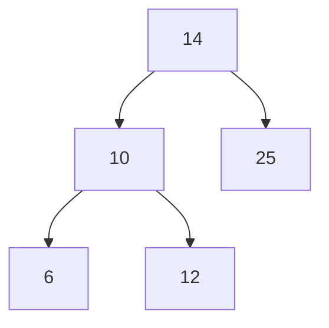

对于这一棵二叉树（代表最小节点的右节点为空的情况）：在 `deleteMin(6)` 的时候（我相信你可以看懂，我想说的是 deleteMin 函数以6所在那个节点作为参数被调用，而不是真的传了个int进去），函数检查到没有左子树了，因此返回6的右节点。但是，6的右节点指针指向null，因此函数实际上返回了null。在上一层调用中，`deleteMin(10)` 在完全退出前，把自己的左子节点设置成了 `deleteMin(6)` 的返回值，就是 null。这是正确的，因为把自己的左节点设为null才能删除此节点。而且因为6这个节点是叶节点，因此这么干的时候没有丢失任何的数据。

在这一过程中，14 -> 10, 10 -> 6的指针发生了赋值。其中，14->10的那个指针仍然被赋值为14->10，而10->6的指针改为从10指向了null。这并没有破坏除了最小节点自己以外这棵树的任何部分。

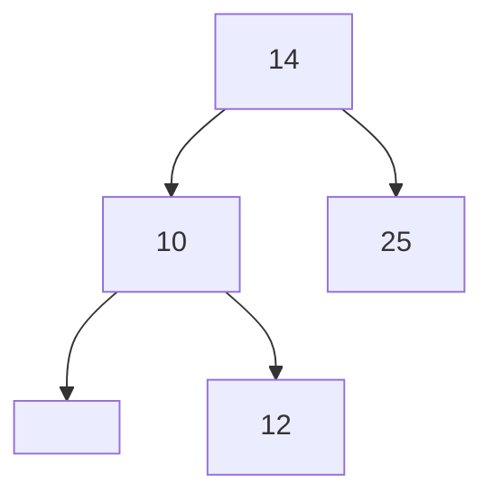

对于这棵树，它的最小节点是有子节点的。我们的代码能不能保证在删除10的同时，留下它的子节点（12）呢？

执行 `deleteMin(10)` 的时候，函数返回了10的右节点，即12节点的地址。而 `deleteMin(10)` 的主调函数，`deleteMin(14)`，在退出前进行了 `b.setLeft(deleteMin(10))`，也就是把`deleteMin(10)`的返回值（指向12的指针）设置成了自己的左节点。这样，二叉树就变成了：

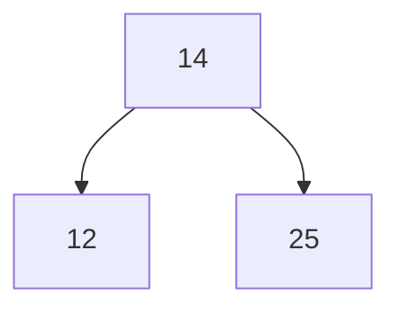

可以看到，10的子节点信息保留了下来，没有丢失。

本质上说，这里不会丢失节点，是因为10被删除后，它的父节点就空出了一个指针；而由于最小节点的定义，10 最多只会有一个右子节点。如果它有一个子节点，那么把这个子节点挂载到父节点空出的指针上，就可以保留它的子节点了。如果最小节点没有子节点，那是更好的，直接删除就不会丢失任何信息。

### 插入任意一个元素

元素插入的位置要么是叶节点（没有一个元素的），要么是只包含了一个子节点的内部节点（因为有两个子节点的节点也没法再添加子节点了，总不能删掉一个吧）。

插入元素在前半截的步骤很像检索：根据二叉检索树大小性质，找到一个还有空位的节点；之后，把待插入的节点插进去作为子节点。具体来说：

1. 根据二叉检索树的大小关系，找到一个插入后不会破坏二叉检索树关系的位置
2. 把自己插入

具体的代码实现中使用了类似于删除最小节点时的那种写法。

```java
public void insert(K key, V value){
    insert(head, key, value);
}

private BinNode2<K, V> insert(BinNode2<K, V> binary, K key, V value){
    // 如果当前节点为空，说明已经到了尽头（可插入的位置），返回一个新的节点对象。
    if (binary == null){
        return new BinNode2<>(key, value, null, null);
    }
    // 如果待插入元素比当前节点元素还小，就去左侧
    if (key.compareTo(binary.key()) < 0){
        binary.setLeft(insert(binary.left(), key, value));
    }
    // 如果待插入元素不小于当前节点元素，去右侧
    // 这里我们规定二叉检索树可以插入重复元素，且重复元素应当放到大小相同的元素的右侧。
    else{
        binary.setRight(insert(binary.right(), key, value));
    }
    return binary;
}
```


### 二叉检索树的平衡性

很可惜，二叉检索树不是什么神奇的灵丹妙药；虽然它可能具有 log(n) 级别的查找性能，但如果内部元素存放的方式不妥当，那就没那么妙了。比如说，考虑一下这串数字都被插入一棵空树时，会发生什么：

1 4 8 12 15

你会得到这么一棵树：

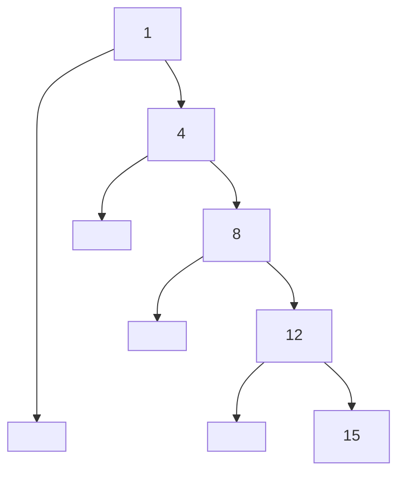

显然。这棵树的树高非常高，而空间利用率很低。这使得查找效率几乎降低到了O(n)的数量级。总结一下：

- 不同的插入顺序会造成二叉树的形状不同
- 为了检索效率最高，需要尽量保证二叉树的高度比较低

平衡因子：一个二叉树节点的左子树高度减右子树高度的差叫做平衡因子。

**平衡二叉树**：如果一棵二叉树上每一个节点平衡因子的绝对值都不大于1，则二叉树是平衡的。

> 就是要求每个节点的左子树和右子树的高度差不大于1（不管谁高谁低）

显然，上面这种形状的树称为**不平衡的**。老师提到，可以通过叫做旋转二叉树的方法进行二叉树的平衡。但是，具体方法不会在课程中涉及到（自然也就不会考）

### 删除任意一个元素

二叉检索树的元素可能有三种情况（叶节点，一个子节点的内部节点，两个子节点的内部节点）：

- 叶节点：很容易删除（因为它没有孩子，直接删掉就完事了）

- 内部节点：不太好删除，因为它有孩子。删除它之后，我们得“照顾”好（存储好）它的孩子，不然他的孩子的数据就会丢失

在内部节点中，只有一个孩子（一个子节点）的内部节点比较好删除：只需要把这个节点唯一的子节点挂载到父节点上自己本来在的地方就行了。具体这样做为什么可行的原因么，删除带有子节点的最小节点那里已经提到了。

有两个子节点的内部节点就很难删除了：它有两个孩子，但它的父节点只会空出一个指针位，怎么把两个孩子都挂载到父节点上呢？

我们可以用“替换”操作代替“删除”操作，然后把被替换的那个东西删除掉。举个例子，对于这棵树：

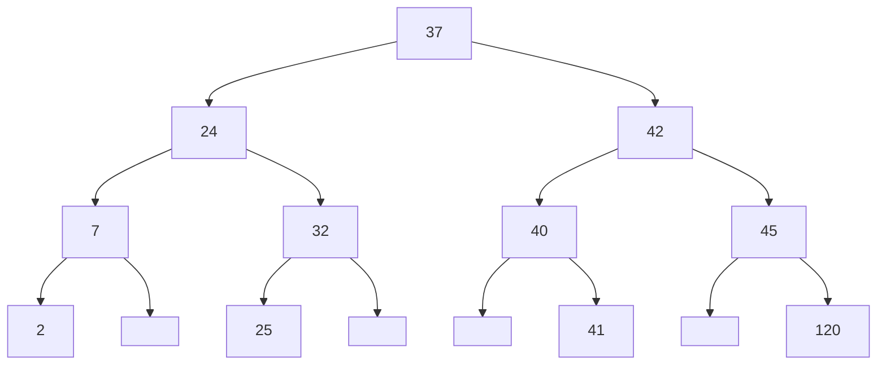

如果我们要删除37，我们可以**把左子树的最大值/右子树的最小值和37交换**，然后**删掉和37交换过的节点**

但实际上，由于在我们的二叉检索树定义中，允许数字的重复，因此仅仅能把右子树的最小值和37交换（而不能换左子树的最大值）。

删除最大/最小节点我们已经学习过；交换节点其实只需要交换元素值，因此也非常简单。

为什么这个方法能保证信息不丢失呢？

1. 删除叶节点是不会造成树不符合二叉检索树定义的
2. 在把待删除节点移动到叶节点的过程中，由于我们是把根节点和右子树的最小值交换，除了这两个数字位置反了之外，其他数字的大小关系都不会被破坏；删除根节点数字之后，这两个数的大小关系随之消失，总而言之就没有破坏二叉检索树的性质

```java
public V remove(K key){
        remove(head, key);
        return removeValue;
    }

private BinNode2<K, V> remove(BinNode2<K,V> binary, K key){
    if (binary == null) return null;
    // 如果待删除元素小于当前节点元素，就向着左侧查找
    if (key.compareTo(binary.key()) < 0){
        binary.setLeft(remove(binary.left(), key));
    }
    // 大于时，向着右侧查找
    else if (key.compareTo(binary.key()) > 0){
        binary.setRight(remove(binary.right(), key));
    }
    // 相等的话，就认为找到了待删除的节点
    else{
        // 如果待删除节点只有一个/零个子节点，那么可以通过类似于删除二叉检索树最小值的方法简单的删除这个节点，不需要交换。
        if (binary.left() == null){
            removeValue = binary.value();
            binary = binary.right();
        }
        else if (binary.right() == null){
            removeValue = binary.value();;
            binary = binary.left();
        }
        else{
            // 如果待删除节点有两个子节点，那么就需要把待删除节点和其右子树的最小节点交换内容后，删除其右子树的最小节点（以便不破坏二叉检索树的结构）
            removeValue = binary.value();
            // 获得右子树的最小值，并把它赋值给待删除节点
            BinNode2<K, V> exchange_node = findMinNode(binary.right());
            binary.setKey(exchange_node.key());
            binary.setValue(exchange_node.value());
            // 删除右子树的最小值
            binary.setRight(deleteMin(binary.right()));
        }
    }
    return binary;
}
```


### 二叉检索树操作的时间代价

- 搜索代价

  - 平衡二叉树的搜索代价为 log(n)
  - 非平衡二叉树最差代价为 O(n)

- 插入/删除代价与搜索代价一致

- 周游代价为 Theta(n)

- 使一棵二叉检索树保持平衡才能发挥二叉树的全部作用

  > 一种简单的保证二叉树平衡的方法：
  >
  > 如果用户每次输入的是一个序列，则用 shuffle 对序列打乱后插入；这样能基本保证树形正常。

平衡的定义：由*平衡因子*决定

平衡因子的定义：一个节点的平衡因子是**左子树的高度-右子树高度之差**。我们认为，如果某个节点平衡因子的绝对值 >= 2（不在-1， 0，1 之中），那么说明这个节点不平衡。

如果一棵二叉树中任何一个节点不平衡，那么**这棵二叉树不平衡**。

平衡二叉树的特点：插入，删除，搜索代价一定为 O(logn) 内（平衡因子为-1/1时可能会比平衡因子全是0的树慢，但还是在 O(logn) 内）。


## 优先队列

定义：

- 按照重要性和优先级（而不仅仅是按照入队顺序）来组织的队列称为优先队列
- 是一种 ADT

应用：

- 在多程序运行的环境下，操作系统必须决定先给哪个程序CPU时间

优先队列的操作：

- 插入：插入一个具有”重要级别“属性的元素。这个元素具体被插入到的位置未知。
- 删除：删除队列中**最重要的元素**并返回
- 访问队头：访问队列内部**最重要的元素**（注意访问和删除不再是按照插入顺序了）

由于优先队列对于插入，删除，访问队头的定义与普通队列完全不同，因此实现方法与普通队列也完全不同。

### 优先队列的实现（脑测版）

#### （排序的）线性表实现

**插入元素**：在线性表中按照重要级别扫描到合适的位置处，然后将该元素插入，耗时O(n)

**删除元素**：在线性表中直接删除头位置的元素即可，耗时 O(1)

可以利用线性表能排序的特点，用优先级作为关键码排序，就可以存储“优先级”这一逻辑关系

#### 使用二叉查找树

**插入元素**：在二叉树平衡的情况下：O(log n)（未平衡时 O(n))

**删除元素**: 在二叉树平衡的情况下：O(log n)（未平衡时 O(n))

可以利用二叉检索树对元素大小关系的约束，存储“优先级”这一逻辑关系

但是，二叉检索树维护了过度的信息：事实上，它维护了每个元素的优先级关系；但是，在删除的时候，我们只需要知道最重要的元素就可以知道要删除哪一个了。这么说来，二叉检索树维护的逻辑关系就太多了，没有必要。而且，它过多的逻辑关系要求了它必须平衡才能有不错的时间复杂度。

其实，我们可以使用堆实现优先队列。不过，我们需要先学习一下堆：


## 堆

定义：

- 堆是一棵完全二叉树。因此，它可以在数组中不浪费空间的被存储。

  此外，由于堆是完全二叉树，而完全二叉树的树高最高为 ceil(log<sub>2</sub>(n+1))，因此，它的检索/插入/删除效率都可以保证在 O(logn) 的范围。

- 堆具有特定的顺序（堆序）：堆能够快速地找出重要级别最高的元素

  - 重要级别最高的为根节点（为了让获取最重要节点的速度最快）

  - 由于二叉树的性质具有递归性，那么：**对于二叉树的每一个节点X，X的父亲的重要级别高于（或者等于）X的重要级别**（根节点除外，因为根节点没父亲节点）

  - 堆中每一个节点的优先级一定比它的孩子（和孙子们）都大

  - 堆事实上并不关心左子节点和右子节点哪一个优先级更大：它只管根节点比两个子节点大就行了。

    即：堆不区分左节点和右节点；左节点和右节点之间不需要满足任何关系。这与二叉检索树不同

- 堆可以使用完全二叉树的树形，正是因为它需要维护的逻辑关系不多

**最大值堆与最小值堆**

最大值堆：根节点的值一定大于（或者等于）其左右子节点

最小值堆：根节点的值一定小于（或者等于）其左右子节点

没有特别说明的话，下面提到的堆都是最大值堆。

### 堆的插入

由于堆必须要是完全二叉树，因此事实上新增的元素的位置是固定的。但是，如果新的元素放在这里破坏了堆序怎么办？别担心，我们只需要把新的元素和父节点交换就行了。

具体来说，为了保持完全二叉树的树形要求，事实上，你只有一个地方能插入新的元素。因此，我们需要：

1. 插入元素到唯一一个可插入的地方（“最后”一个元素）

2. 整理元素的顺序，使其满足堆序的要求：

   1. 如果此节点的元素比父节点元素更大，就和父节点交换值
   2. 如果现在，此元素比他的父节点元素小，就停止；否则，继续交换

   1. 重复上面的步骤，直到此元素比他的父节点小，或者没有父节点（元素已经成为根节点）了

插入操作中，交换操作最多会执行树高h那么多次（最少情况下一次都不交换）。由于完全二叉树的树高和元素数量关系严格满足 h = ceil(log<sub>2</sub>(n+1))，因此插入操作的时间复杂度在 O(logn) 内。

插入操作的实现：**这是数组实现的堆的插入操作的实现**

```java
public void insert(Elem v){
    assert n < size: "Heap is full";
    int cur = n++;
    elements[cur] = v;
    while (cur != 0 && elements[cur].key() > elements[parent(cur)].keys()){
        // 第一个条件：达到了根节点
        // 第二个条件：cur元素的大小比父节点元素更大
        swap(elements, cur, parent(cur));
        // 把cur 设置为此元素现在在的地方
        cur = parent(cur);
    }
}
```

### 堆的删除

由于堆是为了优先队列的实现提供的，而优先队列要求只能删除优先级最高的元素，因此，堆也只需要删除优先级最高的元素。堆中优先级最高的元素就是根节点。因此，我们只需要考虑删除根节点的情况。

和二叉检索树的删除类似，我们可以先替换：把根节点和最后一个元素替换（这是为了保持树形），然后删除最后一个元素。那么，怎么保持堆形呢？很简单，和插入差不多，我们只需要再替换一下就好。

先把根节点和最后一个元素交换，然后把最后一个元素删了（此时实际上删除了根节点），然后，把现在的根节点存储的元素向下比较，如果自己比两个孩子中的任何一个小，就和自己的孩子交换（如果自己比两个孩子都小，那么就和两个孩子里较大的交换）。直到此元素到达了叶节点，或者它的位置满足堆序了。

具体实现：

```java
public Elem delete(){
    if (n==0) return null;
    assert n>0: "Removing from empty heap";
    // 注意这里n是前减，因为我们想把最后一个元素和根节点交换，而不是最后一个元素后边的空位
    swap(elements, 0, --n);
    Elem elem = (Elem)elements[0];
    if (n > 0) siftdown(0);
    return elem;
}

private void siftdown(int pos){
    assert pos >= 0 && pos < n: "Illegal heap position";
    while (!isLeaf(pos)){
        int j = leftchild(pos);
        if (j < (n-1) && (elements[j].key() < elements[j+1].key()))
            j++;
        if (elements[pos].key() > elements[j].key()) return;
        swap(elements, pos, j);
        pos = j;
    }
}

```

### 堆的创建

- 一个一个元素的插入堆：时间复杂度 O(nlogn)
- 如果元素已经全都存放在数组里，只需要排序使其满足堆序：时间复杂度O(n)

那在第二种方法里头，怎么让所有元素都满足堆序呢？

显然，由于“堆序”只限制一棵二叉树的根节点和它的左右子节点，一个子节点也没有的叶节点天生就满足堆序；而且，根据二叉树的性质，度为0的节点个数等于度为2的节点个数+1，然而完全二叉树里几乎全是度为0，2的节点，（最多）只有一个度为1的节点。因此，完全二叉树**一半左右**的节点都是叶节点，且它们**都天然满足堆序**。这就是调整他们的时间复杂度低的原因。

现在，我们只需要**让内部节点满足堆序**。我们遵循如下规则：

- 从下向上的遍历内部节点
- 对于每个内部节点，检查它是否比子节点小，就像堆的删除元素那里一样，把这些元素“拉下去”

遍历完所有内部节点之后，创建完成。

此过程的时间复杂度：1/2的内部节点需要移动1层，1/4的内部节点需要移动2层，1/8的内部节点需要移动3层……大概在O(n)的数量级

```java
private void buildHeap(){
    // 从下向上的下拉每一个内部节点
    for (int i=current_length-1;i>=0;i--){
        if (!isLeaf(i)) siftDown(i);
    }
}

private boolean isLeaf(int pos){
    return pos * 2 + 1 >= currentLength;
}
```


### 堆的操作的时间复杂度总结

创建堆： O(nlogn)（如果不使用优化后的建堆）

O(n)（如果使用上一节的方法建堆）

插入元素：O(logn)

删除元素：O(logn)

## 堆的应用：堆排序

这种排序算法是利用堆的特性，以及其优越的操作时间复杂度创建的。

它的时间复杂度在任何情形下都是 O(nlogn)。

具体算法如下：

- 为所有待排序元素创建一个最大值堆

  > 最大值堆：堆顶为整个堆的最大值的那种堆

- 删除堆顶的元素，把这个元素放在另一个数组里头（或者整个堆数据最后的后边一位）

- 重复第二步，把删除的元素放在其他被删除元素的前面（即还是整个堆数据的最后一位），直到堆中只剩下一个元素

- 排序结束

> 解释：上边提到了“放在堆数据的最后的后边”，最后哪来的后边呢？
>
> 这是因为，堆是数组存储的（至少在这里是）。当堆被删去一个元素时，它的长度就会减小1，且堆数组的最后一个元素会空出来。我们把被删去的这个元素不断放在这个空出来的位置，就可以形成自然的倒序了。

比如：| 42 | 10 | 23 | --> | 23 | 10 | 空 | （删除了42，且删除操作附带的维护堆序操作让23跑到10前头了) --> |23 | 10 | 42 |（把被删除元素42放在空出来的位置）

### 堆排序的思想

本质来说，堆排序也是每次从序列中取出最大值，将其放在最后头，这种思想和选择排序非常的类似。因此，**堆排序也不具有稳定性**。

不过，为什么堆排序比直接选择排序要快呢？这是因为，直接选择排序在每次获得最值时，时间复杂度在O(n)内。然而，得益于堆出色的删除特性，堆排序每次获得最值的时间复杂度在O(logn)内。这就是堆排序比简单选择排序更快的原因。

和选择排序类似，**堆排序也具有部分性**。在寻找前k个最小的元素时，简单选择排序需要O(kn)的时间，而堆排序需要O(n+klogn)的速度（那个n是建堆时间）。在这种情况下，堆排序暴打了简单选择排序。

因此，如果你想要部分排序一个序列，就使用堆排序吧。扔掉愚蠢的简单选择排序和快速排序吧（快速排序需要整整O(nlogn)的时间，我的上帝啊，这可比堆排序的O(klogn+n)大多了）


## 排序问题的下限

限制：**基于比较**的排序算法在最坏情况下的下限为 Ω(nlogn)

> 大Ω标记在这里的意义是：无论如何优化，排序算法**最坏情况下**的时间复杂度**一定不低于nlog级别*

如何证明这一点呢？

我们利用二叉树的概念，引入“判定树”：


- 每一种基于比较的排序算法进行比较时的操作都可以用判断树表示
- 每一条连接代表两个元素间可能的大小关系

- 每个叶节点代表一种元素间可能的顺序
- 对于n个元素的比较时产生的判定树，其一定有n! 片叶子
- 任何一个树根到叶子的路径都代表一个可能的判断过程

判定树的树高就代表了你需要比较的次数。怎么计算呢？

一个有n片叶子节点的二叉树的树层高最少为 ceil(logn)；而对于n个元素的比较时产生的判定树，其一定有n! 片叶子。因此，对n个元素比较时，其判定树的深度为 `ceil(log n!)`。

可以证明 O(log(n!)) = O(nlogn)。因此可以看到，对n个元素进行比较在最坏情况下，时间复杂度无法低于 O(nlogn)。只有比较就花了这么多时间（还没交换呢），那显然整个算法的时间复杂度无法低于O(nlogn)。
