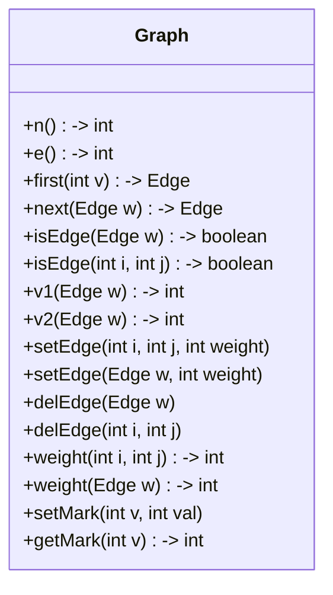
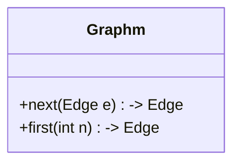
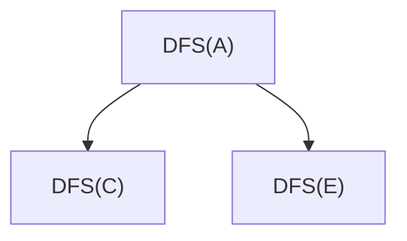
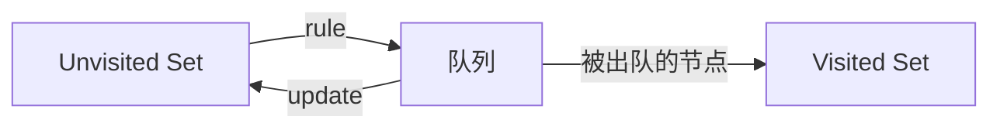

# 图

> 作者：李彦筱
>
> 感谢学长 [yijunquan](https://github.com/yijunquan-afk) 的[软件工程笔记](https://github.com/yijunquan-afk/XJTUSE-NOTES)给我的启发。此笔记从二叉树开始的部分中使用了学长笔记中的部分图片以及文字。
>

## 图的基本概念

图上的节点是“平等的”。二叉树的节点之间是有父子关系的，而且会有一个“绝对的顶点”根节点，知道他就可以访问整棵树；但是，图上的节点没有“父子关系”。

图的定义中**包含两个集合**：

1. V: 顶点集合 V={x|x是一个节点}

   V 必须是有限的，且**不能为空集**

2. E={<x，y>|x，y都属于V，并且x连接到y}

   E是两个顶点之间的关系的集合，**可以是空集**
   

E 相关的性质：

- 如果<x, y>属于E，那么表示x到y的一条弧(arc)，且x称为尾(tail)，y称为头(head),具有这种性质的图称为**有向图(digraph)**

-  如果<x,y>属于E，必有<y,x>也属于E，则用无序对(x, y)代替这两个有序对，表示x和y之间的一条边(edge)， 也就是说，(x, y) 代表了 <x,y>, <y,x> 都在E集合中。

- 如果在一个图当中，对于任何<x,y>属于E，都存在<y,x>属于E，那么这个图是**无向图**。

  根据定义，无向图上的 E（关系集合）满足对称性（离散数学里那个）。
  
- 无向图可以看成一种特殊的有向图

  这是因为，如果你把无向图的一条边拆成两条弧，那它确实就满足有向图的定义了

离散数学里头，A上关系的定义如下所示：

如果对于一个集合A，有集合 R 被包含于 AxA 中，则称R为A上的一个关系。

可以把图定义中的V类比为A，E类比为R。


### 顶点数量与边数量的关系

当不考虑顶点到自身的弧/边时（即E是反自反的时候），顶点数量|V|和边数量|E|有着如下关系

1. 如果G是无向图（E满足对称性），|E|的取值范围是0到|V|(|V|-1)/2

   > 这个取值范围是因为：最大时，每个顶点与其他所有顶点都有关系，共有 |V|\*|V-1| 的关系；但是，无向图把两个顶点之间来回的两条关系算为一条（<x,y> ^ <y,x> <-> (x,y)），所以要除2

   当|E|为最大值时，该无向图称为**完全图**

2. 如果G是有向图，|E|的取值范围是0到|V|(|V|-1)

   > 这个取值范围是因为：最大时，每个顶点与其他所有顶点都有关系，共有 |V|\*|V-1| 的关系。有向图里头不会把两个顶点来回的两条关系算为一条。

   当|E|为最大值时，该有向图称为**有向完全图**

3. 如果G中有少量的边或弧(|E|<|V| log|V|)时，称该G为**稀疏图**,反之称为**稠密图**

   注：|E|<|V| log|V| 只是一个根据经验的定义，不是说你必须按照这个标准判断一切图的稀疏/稠密图。

当G中的边或弧具有与它相关的数,这种与图的边或弧相关的数叫做**权**,这种带权的图通常称为**网**.

> 一般来说，这个“权”可以代表某些附加的条件，比如说，可以用来代表这条边连接的两个节点间运动的耗时

### 子图

假设有两个图G=(V,E)和G'=(V' ,E'),如果V'是V的子集，且E'是E的子集,称G'是G的子图

E 中没有的元素（不存在的关系）不能在E'中出现。比如在下边这个例子里头，如果E'里出现了 <2, 1> （现在已经出现的是 <1,2>），那么G‘就不是G的子图了。


### 顶点相关概念

对于**无向图G**，如果边(v,u)属于E，则称顶点v和u互为**邻接点(adjacent)**,并且称边(v,u)与顶点和u相关联(incident)

> 顶点v的度(degree)是和v相关联的边的个数

对于**有向图G**，如果弧<v,u>属于E，则称顶点v邻接到(to)顶点u，顶点u邻接自(from)顶点v，并且称弧<v,u>与顶点v、u相关联

> 以顶点v为结尾的弧的数目称为v的入度(indegree)
>
> 以顶点v为起点的弧的数目称为v的出度(outdegree)
>
> 顶点v的度=顶点v的入度+顶点v的出度

### 路径

在G=(V，E)中，当从v到u存在如下的边或弧时,我们称这是v到u的一条路径，该路径的长度则为这些边或弧的个数

当G是无向图时，边是:  $(v,v_1),(v_1,v_2),...,(v_n,u)$

当G是有向图时，弧是:   $<v,v_1>,<v_1,v_2>,...,<v_n,u>$

可以看出，由于图的节点之间没有层次关系，它的“路径”定义不像二叉树一样有着层次上的要求。

当在一条路径中出现的顶点不重复出现时则称该路径为**简单路径(simple path)**

如果一条路径最开始的顶点和结束顶点相同，那么这个路径叫做**环**（也可以叫做**回路**）。

### 图的连通

在一个图G中，如果从顶点v到顶点u有路径，则称v和u是连通的

如果G是**无向图**。那么当G中的任意两个顶点 v<sub>i</sub> 和 v<sub>j</sub>，都有 v<sub>i</sub> 和 v<sub>j</sub> 是连通的，则称G是**连通图**

当无向图G不是一个连通图时，那么该无向图的**极大连通子图**则称为连通分量

> 极大的：即每个连通子图里头的节点数量必须做到最大。比如，下面的图里，6，7，8，10是连通子图，但不是极大连通子图。6，7，8，10，9构成的图才是极大的。


如果G是有向图，对于每一对顶点 v<sub>i</sub> 和 v<sub>j</sub>，都有从   v<sub>i</sub> 到 v<sub>j</sub> 和 v<sub>j</sub> 到 v<sub>i</sub> 的路径，则称该G是**强连通图**

如果G不是强连通图，但是将G中的弧想象为边时能成为一个强连通图时，我们称这个有向图G为**弱连通**

有向图中的**极大强连通子图称为有向图的强连通分量**


一个连通图不是强连通的就是弱连通的。因为连通图的定义就是任意两个节点i, j之间至少有一个方向的路径。


如果图G中不存在环，那么称G为**无环图(acycle)**

一个无环图如果既是无向图也是连通图，则该图称为**自由树(free tree)**。显然，自由树要满足三个条件：无环；是无向图；是连通图。比如，本部分最后讲到的最小支撑树就是一种自由树。

> 自由树是图、树两种数据结构之间的桥梁。

一个无环图如果是有向图，则简称为**DAG(directed acyclic graph)**


## 图的 ADT

注：图的 ADT 只保证了你可以随心所欲的操作一个图（添加边，节点，删除边，添加权重等），不包含图的经典算法的实现。

> 这就是 ADT 的意义：只规定一个数据结构上可以进行的操作。具体你想用这些操作实现什么算法，就不是 ADT 关心的了。

由于图的定义只包含一个顶点集合与一个边集合，图的 ADT 基本也只包含对顶点集合，边集合进行操作的方法。



注：

- `isEdge` 方法判断两个顶点之间是否有边连接
- `setEdge` 方法在两个顶点之间添加一条边。
- `first` 和 `next` 方法是配合着使用的：


### 图的两种实现方法

**相邻矩阵实现**（二维数组）

这种存储方法类似于离散数学里头「关系」的「矩阵表示法」。简而言之，它是一个二维数组；其第 a\[i\]\[j\] 位置的元素表示了矩阵的第i行第j列的元素。这个元素如果是1，代表了 <i, j> 是一条弧；是0，代表<i, j> 不是一条弧。

矩阵的第i行上所有为1的元素代表了元素i所能 **连接到** 的元素

第i列上所有为1的元素代表元素j所能 **连接自** 的顶点


无向图的矩阵表示满足对称性。

> 这是因为它的相邻矩阵满足了对称性的定义：对于任何两个元素i, j，如果<i, j> 属于 E（是一条弧），则 <j, i> 属于E（是一条弧）

有向图的矩阵表示一般是不对称的。不过其实无向图也满足有向图的定义，如果你据此说有向图的矩阵表示也可以对称，那也行吧。


表示一张网（有权重的图）的时候，相邻矩阵里的元素取值发生了变化：

如果 <i, j> 是一条弧且权重为p，那么矩阵第i行，第j列的元素为p

如果 <i, j> 不是一条弧，那么矩阵第i行，第j列的元素取无穷（正无穷或者负无穷都行，在java里就是 1.0/0.0 得到的值）

> 不存在时取无穷是因为权重是可能为0的。

**某些操作的时间复杂度分析**

- 判断一条边是否存在: O(1)。

  判断<i,j>是否存在，查查a\[i\]\[j\]是0还是1就行了。只需要查询一个位置

- 判断某个顶点能到达的**相邻**顶点：O(|V|)

  > |V| 代表图里头顶点的个数

  判断这个顶点所在行有多少个1就行了（除自己外），需要查询一行的所有元素

- 寻找所有的边：O(|V|<sup>2</sup>)

  需要检查矩阵的每一个元素，看看有多少个1（对于无向图，1的个数得除2）。矩阵大小是 |V| * |V|。

- 增加或者删除一条边：O(1)

  如果要删除元素 <i, j>，把矩阵(i, j)（i行j列）的位置设成0或者无穷（取决于有没有权重）就完事了。

相邻矩阵实现适合**稠密图**。（如果你不记得什么是稠密图，简单的判断方法就是看 |E| > |V|log|V| 不）


**邻接表实现**（链表构成的数组）

它是一个数组，数组里的每个元素都是一个链表。数组的第i个元素代表了第i个顶点。

第i个节点的链表中存储了所有和这个节点邻接的节点。这些邻接顶点在链表中的存储顺序是无所谓的，因为图对于边的顺序没有要求。举个例子，下图中数组的0个元素所在的链表中包含元素2，3；按照3，2的顺序存也无所谓。

一般为了规范，邻接顶点按照编号大小存储，这其实是不必要的。


存放网的时候，链表的每个元素会增加一个内容：此元素和上一元素间的边的权值。

**某些操作的时间复杂度分析**

- 判断一条边<i, j>是否存在：O(|V|)

  这是因为，判断时，我们需要遍历以第i个元素为开头的链表，而这个链表最长会有 |V| 这么长（在i和所有元素都相连时）

- 得到一个点所能**达到**的所有相邻顶点：O(|V|)

  同样遍历一次链表即可

- 得到全部边：O(|E|)

  遍历所有的链表。全部的链表节点数有 |E| 个，因为总共只有|E|个关系

- 添加/删除一条边：O(|V|)

  如果你要保证链表按照各节点编号排序的话，就需要O(|V|)了。不排序的话，O(1)就行

邻接表适合表示**稀疏图**。


相邻矩阵大约是顺序存储方法；邻接表大概算是链式存储。

### 图的相邻矩阵实现



> `Graphm` 和 `Edgem` 后边那个'm'代表 matrix，提示你这个类是使用*相邻矩阵*实现的图。 

`first` 方法：找到编号为n的节点的第一条边

`next`方法：找到边e的下一条边。具体哪条边是下一条边，取决于具体的存储结构；但不管怎么说，这个方法都不会重复的返回一条边。

> 一般来说，next方法返回边的顺序按照边尾的编号大小

代码 

```java
Edgem e = graph.first(n);
while (e != null){
    e = graph.next(e);
}
```

能够遍历所有n可以连接**到**的节点，且不会重复的得到某条边。

e 是一个**从n到某个节点的弧**，一定是**以n节点为起始的**。

`first` 的实现：

```java
public Edgem first(int v){
    assert(v >=0 && v < Mark.length): "Invaild input";
    for (int i=0;i<Mark.length;i++){
        if (matrix[v][i] != 0){
            return new Edgem(v, i);
        }
    }
    return null;
}
```

`next` 的实现：

```java
public Edgem next(Edgem e){
    for (int i=e.v2+1;i<Mark.length;i++){
        if (matrix[v1][i] != 0){
            return new Edgem(v1, i);
        }
    }
    return null;
}
```

整体的代码：

```java
public class GraphM{
    private double[][] matrix;
    private int[] mark;
    private int edgeNum;
    public GraphM(int size){
        this.matrix = new double[size][size];
        for (int i=0;i<size;i++){
            for (int j=0;j<size;j++){
                matrix[i][j] = Double.POSITIVE_INFINITY;
            }
        }
        this.mark = new int[size];
        this.edgeNum = 0;
    }

    public int n(){
        return mark.length;
    }

    public int e(){
        return edgeNum;
    }

    public Edge first(int v){
        for (int i=0;i<n();i++){
            if (matrix[v][i] != Double.POSITIVE_INFINITY){
                return new EdgeM(v, i);
            }
        }
        return null;
    }

    public Edge next(Edge w){
        if (w==null) return null;
        for (int i=w.v2()+1;i<n();i++){
            if (matrix[w.v1()][i] != Double.POSITIVE_INFINITY){
                return new EdgeM(w.v1(), i);
            }
        }
        return null;
    }

    public boolean isEdge(int i, int j) {
        if (i >= n() || j >= n()) return false;
        return matrix[i][j] != Double.POSITIVE_INFINITY;
    }

    public boolean isEdge(Edge w) {
        if (w==null) return false;
        return isEdge(w.v1(), w.v2());
    }

    public int v1(Edge w) {
        return w.v1();
    }

    public int v2(Edge w) {
        return w.v2();
    }

    public void setEdge(int v1, int v2, int weight) {
        matrix[v1][v2] = weight;
        edgeNum++;
    }

    public void setEdge(Edge w, int weight) {
        if (w != null) setEdge(w.v1(), w.v2(), weight);
    }

    public void delEdge(Edge w) {
        if (w == null) return;
        matrix[w.v1()][w.v2()] = Double.POSITIVE_INFINITY;
        edgeNum--;
    }

    public void delEdge(int v1, int v2) {
        matrix[v1][v2] = Double.POSITIVE_INFINITY;
        edgeNum--;
    }

    public int weight(Edge w) {
        return (int) matrix[w.v1()][w.v2()];
    }

    public int weight(int i, int j) {
        return (int) matrix[i][j];
    }

    public int getMark(int v) {
        return mark[v];
    }

    public void setMark(int v, int val) {
        mark[v] = val;
    }

    public String toString(){
        StringBuilder sb = new StringBuilder();
        sb.append("GraphM(");
        for (int i=0;i<matrix.length;i++){
            sb.append(i).append("=").append(Arrays.toString(matrix[i])).append(',');
        }
        sb.deleteCharAt(sb.length()-1);
        sb.append(')');
        return sb.toString();
    }
}
```

### 图的邻接表实现

下面的代码和书上的代码完全相同。具体实现当中的 `isEdge` 方法存在一个副作用：会修改链表 current 指针的位置到适合插入新元素的位置，因此在和边有关的操作之前，几乎都会调用一次 `isEdge` 方法，以定位 current 指针到合适的位置。

```java
public class GraphL{
    private GraphList[] vertex;
    private int numEdge;
    private int[] mark;
    public GraphL(int size){
        this.vertex = new GraphList[size];
        for (int i=0;i<size;i++){
            vertex[i] = new GraphList();
        }
        numEdge = 0;
        this.mark = new int[size];
    }

    public int n(){
        return mark.length;
    }

    public int e() {
        return numEdge;
    }

    public Edge first(int v) {
        GraphList list = vertex[v];
        list.setFirst();
        if (list.currValue() == null) return null;
        return new EdgeL(v, list.currValue()[0], list.currLink());
    }

    public boolean isEdge(Edge w) {
        if (w == null) return false;
        GraphList list = vertex[w.v1()];
        list.setCurrLink(((EdgeL) w).getSelf());
        if (!list.isInList()) return false;
        return list.currValue()[0] == w.v2();
    }
    
    public boolean isEdge(int i, int j) {
        GraphList temp = vertex[i];
        for (temp.setFirst(); temp.currValue()!=null && temp.currValue()[0] < j;temp.next()){
        }
        return temp.currValue() != null && temp.currValue()[0] == j;
    }

    public int v1(Edge w) {
        return w.v1();
    }

    public String toString(){
        StringBuilder sb = new StringBuilder();
        sb.append("GraphL(");
        for (int i=0;i<mark.length;i++){
            sb.append(i).append(": ").append(vertex[i]);
        }
        sb.append(")");
        return sb.toString();
    }

    public int v2(Edge w) {
        return w.v2();
    }

    public Edge next(Edge w) {
        if (w == null) return null;
        GraphList list = vertex[w.v1()];
        list.setCurrLink(((EdgeL) w).getSelf());
        if (!list.isInList()) return null;
        list.next();
        if (list.currValue() == null) return null;
        return new EdgeL(w.v1(), list.currValue()[0], list.currLink());
    }

    public void setEdge(int v1, int v2, int weight){
        GraphList list = vertex[v1];
        Integer[] new_one = new Integer[]{v2, weight};
        if (isEdge(v1, v2)) list.setValue(new_one);
        else{
            list.insert(new_one);
            numEdge++;
        }
    }

    public void setEdge(Edge w, int weight) {
        if (w == null) return;
        setEdge(w.v1(), w.v2(), weight);
    }

    public void delEdge(int v1, int v2) {
        GraphList list = vertex[v1];
        if (isEdge(v1, v2)){
            list.remove();
            numEdge--;
        }
    }

    public void delEdge(Edge w) {
        if (w != null){
            delEdge(w.v1(), w.v2());
        }
    }

    public int weight(int i, int j) {
        if (isEdge(i, j)) return vertex[i].currValue()[1];
        else return Integer.MAX_VALUE;
    }

    public int weight(Edge w) {
        if (isEdge(w)) return vertex[w.v1()].currValue()[1];
        else return Integer.MAX_VALUE;
    }

    public int getMark(int v) {
        return mark[v];
    }

    public void setMark(int v, int val) {
        mark[v] = val;
    }
}

```

## 图的遍历

定义：基于图的拓扑结构，以特定的顺序依次访问图中的各个顶点。

也需要满足“不重不漏”：不要访问一个节点多次；不要漏下任何一个节点不访问

由于图的每个节点都是“平等的”，因此图没有一个方便的，从它开始就一定能达到所有节点的顶点。


图的遍历可能遇到的问题：

- 从某个顶点出发，可能无法到达所有顶点（树的遍历就肯定没这个问题）

  比如，非连通图里头，从任何一个顶点开始，都无法访问所有其他顶点。

- 如果图中有环，可能会陷入死循环

解决方法：**为遍历过的节点设置一个标志位**。

- 当多次来到此点时，通过读取标识位就知道“我来过这里”而不会继续循环了。解决了死循环的问题
- 一次试探结束之后，如果还有顶点没有被访问，就知道这张图是非连通图了。解决了非连通图的遍历问题

在实际选择遍历的起始点时，大概是这样：

```java
// 遍历所有V中节点（尝试用每个节点作为起始点遍历一次）
for (int v=0;v<G.n();v++){
    // 如果这个点没被访问，说明图可能是非连通图，尝试以它为起始点遍历一次
    if (G.getMark(v) == UNVISISTED){
        doTraverse(G, v);
    }
    // 如果这个点被访问了，那就不用再拿它当起始点遍历了，不然就重复了。
}
```

**一定不要只执行一次遍历**。**小心非连通图**。

### 深度优先搜索（DFS）

- 类似树的*先序遍历*

- DFS是对图的很多问题处理的基础

  给出指定两个顶点之间的路径

  判断图是否有回路

  判断图是否是连通图，如果不连通，则有几个连通分量

过程：

1. 假设初始状态是图中所有顶点未曾被访问，则深度优先搜索可以从图中某个顶点v出发

2. 访问这个v顶点，然后依次从v的未被访问的**邻接点出发深度优先遍历图**,直至图中所有和v有路径相连的顶点都被访问到

   这个步骤当中又提到了深度优先遍历。因此，DFS的定义是递归的。

   实际上，假如我在遍历节点6，其连接了节点4，5，7，则深度优先遍历6相当于做三个任务：

   深度优先遍历4；深度优先遍历5；深度优先遍历7。

   注意：只访问**还没被访问的邻接点**。比如访问4时访问到了5的话（可能是因为存在弧<4,5>），那么之后就不需要再次遍历节点5了。

3. 如果此时图中尚有顶点未被访问，则另选图中一个未曾被访向的顶点作起始点，重复上述过程,直至图中所有顶点都被访问到为止。

   这个步骤对应了上边那段代码。具体实现上，就是把遍历图的方法包裹在一个循环里。

举例：对这张图做深度优先遍历：


在进行遍历之前，我们需要一些辅助数据：

- 这张图的邻接表结构
- 一个称为“Pi数组”的数组，长度和图的节点一样多。它用来记录哪个节点触发了哪个节点的深度优先遍历。
- 一个标识位数组，长度也和图的节点一样多。它用来记录图中的节点有没有被访问过

Pi数组和标识位数组是这样：

| 索引 | Pi数组 | 标识位数组 |
| ---- | ------ | ---------- |
| 0    | -1     | F          |
| 1    | -1     | F          |
| 2    | -1     | F          |
| 3    | -1     | F          |
| 4    | -1     | F          |
| 5    | -1     | F          |


说明：

红线代表第一次遍历到某个节点的路径；返回路径代表每个节点DFS完毕后，如何返回上一次遍历。回边的概念如下：

满足以下两个条件的边称为回边：

1. 此边的第二个节点在第一个节点被访问前已经在同一次深度优先遍历里被访问了

   > 限制“同一次”是为了排除非连通图的干扰

2. 此边第二个节点在调用链上（遍历顺序上）至少是第一个节点的爷爷辈及以上

   > 这个条件是为了排除D调用F时会看到的<F,D>这种没用的“回边”

存在一条回边，就说明图中存在一个**环**。


示例：首先，我们看到了A顶点，它和C、E顶点连接。因此，遍历A的任务会被拆分为遍历C，遍历E两部分。



Pi 数组：

在每次通过边<i, j> 第一次访问到节点j时，把这个数组的第j个元素的值设为i。

比如在上面的例子里，C节点第一次被访问是通过边<A,C>，因此把数组的2（C）位置的值从初始 -1设为0（A）。

在深度优先遍历结束之后，Pi数组存储的就是一棵“深度优先自由树”。通过Pi数组，我们就可以看到从一个顶点出发，可以到达哪些顶点；也可以看到一个顶点如何从开头被访问。

### DFS 的时间复杂度分析

图中的每一次节点都会被访问两次：

- 一次在开头，把所有节点都标记为 UNVISITED
- 一次在遍历过程中，把找到的节点标记为 VISITED

图中的每一条边都会被访问一次。

因此，时间复杂度为：O(|V| + |E|)

在两种图的表示方法下，由于访问边、节点的速度不一样，时间复杂度不同

邻接表表示：O(|V| + |E|)

相邻矩阵表示：O(|V|<sup>2</sup>)（因为相邻矩阵查找所有边需要|V|<sup>2</sup>的时间）

### DFS 的具体实现

```java
public class DFS {
    private int[] PI;

    public void dfs(Graph graph){
        for (int i=0;i<graph.n();i++){
            graph.setMark(i, -1);
        }
        PI = new int[graph.n()];
        Arrays.fill(PI, -1);
        for (int i=0;i< graph.n();i++){
            // 尝试从每个未被访问的顶点出发进行深度优先遍历
            // 这是为了解决非连通图无法从一个节点开始遍历完全图的问题
            if (graph.getMark(i) == -1){
                dfs(graph, i);
                System.out.println("DFS from " + i + " finished.");
            }
        }
    }

    private void dfs(Graph graph, int v){
        visit(graph, v);
        graph.setMark(v, 0);
        for (Edge e = graph.first(v); e != null; e = graph.next(e)){
            if (graph.getMark(e.v2()) == -1) {
                PI[e.v2()] = v;
                dfs(graph, e.v2());
            }
        }
    }

    private void visit(Graph graph, int v){
        System.out.println("Visiting " + v);
    }
}
```


### 广度优先遍历（BFS）

广度优先遍历类似于树的**层序遍历**。它也可以用于很多图的相关算法中：

- 最小支撑树算法

- 求两个顶点的“最短”路径

  这个最短指的是经过的边数最少。

广度优先遍历得到的图的信息一般比深度优先遍历要少。

过程：

假设从图中某个顶点v出发，在访问了v之后：

- 依次**直接**访问v的各个**没被访问过的**的邻接点

  这和深度优先遍历不同。深度优先遍历可能在看到节点时立刻访问，也可能等到对某节点的遍历结束后才访问此节点。这两种顺序对应了树的先序和后续遍历。

- 保证先被访问的顶点的邻接点“要先于”后被访问的顶点的邻接点的访问，直至图中所有已被访问的顶点的邻接点都被访问到

  这一点可以通过“先到先出”的队列来保障。

若此时图中还有未被访问的顶点，则任选其中之一作为起点，重新开始上述过程，直至图中所有顶点都被访问到

在执行广度优先遍历的时候，我们仍然需要Pi数组，标识位数组两个辅助内容，且他们的定义和DFS里的完全一样

广度优先遍历借用队列，而不是递归执行。


在完成广度优先遍历后，也可以通过Pi数组得到一棵自由树（如果是非连通图，得到的就是森林）。相比于DFS的自由树比较“瘦高”，BFS的树非常“矮宽”。这棵树中包含了如何从一个顶点经过最少的边数到达另一个顶点。

实际上，广度优先遍历的队列入队顺序是有特征的：**距离初始节点边数越小的节点越先入队**。利用这个特性，可以实现许多不同的算法。

对队列中节点的访问其实也有两个时机：在入队时访问，在出队时访问。不过，不管你选择哪种，最后的访问顺序其实是一样的，这是因为队列在入队顺序确定时，出队顺序就直接确定了。

广度优先遍历无法探知图中环的信息。

### BFS 的时间复杂度

图中的每一次节点都会被访问两次：

- 一次在开头，把所有节点都标记为 UNVISITED
- 一次在遍历过程中，把找到的节点标记为 VISITED

图中的每一条边都会被访问一次。

因此，时间复杂度为：O(|V| + |E|)

在两种图的表示方法下，由于访问边、节点的速度不一样，时间复杂度不同

邻接表表示：O(|V| + |E|)

相邻矩阵表示：O(|V|<sup>2</sup>)（因为相邻矩阵查找所有边需要|V|<sup>2</sup>的时间）

（其实时间复杂度和DFS一模一样）

### BFS 的具体实现

`LQueue` 是在栈和队列部分提到的一个链式队列。

```java
import java.util.Arrays;

public class BFS {
    private int[] PI;
    public void bfs(Graph g){
        PI = new int[g.n()];
        Arrays.fill(PI, -1);
        for (int i=0;i<g.n();i++){
            g.setMark(i, -1);
        }
        for (int i=0;i<g.n();i++){
            if (g.getMark(i) == -1){
                bfs(g, i);
                System.out.println("Finish BFS on " + i);
            }
        }
    }

    private void bfs(Graph g, int v){
        LQueue<Integer> q = new LQueue<>();
        q.enqueue(v);
        g.setMark(v, 0);
        while (!q.isEmpty()){
            int vertex = q.dequeue();
            visit(g, vertex);
            for (Edge e = g.first(vertex); e != null; e = g.next(e)) {
                if (g.getMark(e.v2()) == -1) {
                    q.enqueue(e.v2());
                    g.setMark(e.v2(), 0);
                    PI[e.v2()] = vertex;
                }
            }
        }
    }

    private void visit(Graph g, int v){
        System.out.println("Visiting " + v);
    }
}
```

### DFS与BFS比较

在访问结点的时机方面:

DFS可以在处理某个结点的所有邻接结点之前接受访问，也可以在处理完某个结点的所有邻接结点之后接受访问。这对应了树的先序遍历和后续遍历

BFS则只有在结点入队时(或者出队时）接受访问。由于队列在入队顺序一致时，出队顺序一致，实际上不管在何时访问，访问顺序都不会变化。


## 拓扑排序

### 如何把一个具体的问题用图表示？

一项工程往往可以分解为一些具有相对独立性的子工程，通常称这些子工程为“活动”

>  子工程的完成意味着整个工程的完成
>
> 子工程之间在进行的时间上有着一定的相互制约关系

在把现实问题转换为图的时候，要记住图包含了顶点和边两部分。你需要思考，你的问题的什么内容可以被表示为顶点？什么内容可以被表示为弧？

比如，在刚才这个“工程拆分成很多子工程”的例子里头，可以用顶点表示任何一个工程，弧表示这些工程之间的先后制约关系。如果把“工程”看成一个“活动”的话，这种图就叫做“活动在顶点上的网络”，简称活动顶点网络，或AOV (Activity On Vertex)网。

还有一种图化方法叫做“活动在边上的网络”。这种网络中，顶点代表某种起始状态，边代表具体的活动。

AOV 网例子：我们在学习课程时，有一些先后顺序的要求：比如数据结构理论上需要在离散数学、Java语言学完后再开始学习。这里，我们可以让每门课程作为顶点，他们的先修关系构成边，从而组成一个AOV网。

### AOV 网的定义

AOV网是一个**有向图**，该图中的**顶点表示活动，图中的弧表示活动之间的优先关系**

**前驱(predecessor)、后继(successor)**：

顶点i是顶点j的前驱当且仅当从顶点i有一条有向路径到达顶点j，顶点j也称为顶点i的后继

> 注意这里的前驱、后继不像线性表的直接前驱，直接后继；更像是一个节点的祖先/子孙

活动之间的优先关系**满足传递关系**、非自反关系

> 对任意顶点i。j,k,如果i是j的前驱并且j是k的前驱，那么i一定也是k的前驱
>
> 对任意顶点i，i是i的前驱永远为假（不然喜提一个死锁）

**不允许有环出现**

> 否则意味着某个活动的开始是以这个活动的结束为先决条件的，出现了“鸡生蛋还是蛋生鸡“的困难问题

### 拓扑排序

拓扑排序是一个图中所有顶点的一种线性顺序。具体来说，它需要满足：

对于G中的任意顶点i和j，如果i是j的前驱，那么在这个线性顺序中i一定在j之前

对于同一个AOV网进行拓扑排序，可能会得到不同的结果。这和之前的排序的特性都不一样。

拓扑排序的顺序和入度数有关：

入度数为0的节点就是没有任何前驱的节点，根据定义，这些节点应该排在线性顺序的最前方。

入度数为n的节点需要等到其n个前驱全都被排序完后，才能被加入到线性序列的最后。

因此，拓扑排序可以如下完成：

1. 先对图中的所有节点都计算一下其入度数，存放在一个临时数组里；

2. 利用入度数数组找到所有入度数为0的顶点，让它们进入一个队列中；

3. 从队列中取出一个顶点，更新其拓扑结构：把所有它相邻的节点的入度数减1。

   当某个相邻节点的入度数减为0时，将其放入队列。

4. 重复的进行 2，3步的操作，直到队列为空

如果还有顶点没有输出，那么说明图中存在环。这种图不符合AOV网的定义。

拓扑排序的具体执行和广度优先遍历很相似：二者都是这样的结构：



rule 指的是满足特定规则且位于未被访问的集合中的顶点才可以进入队列；

update 指的是队列中的元素在出队后，需要对其执行一些操作来让Unvisited Set中的其他集合可以入队。

对于拓扑排序来说，rule是指“节点入度为0”，update是“节点的所有相邻点的入度减一“

对于BFS来说，rule 是”没有一个节点可以直接进入队列“，update是“此节点的所有相邻点全部入队”

也就是说，这个队列类似于“邀请制”：一开始只有一个节点在队列里；每次从队列中删除节点时，才会把被删除节点的相邻点放入队列；Unvisited Set里的点无法主动进入队列。

### 拓扑排序的实现

`LQueue` 是栈和队列部分提到的一个链式队列。

```java
import java.util.Arrays;

public class AOVSort {
    // 用于存储计算出的每个节点的入度数
    private int[] in_number;
    public int[] sort(Graph g){
        in_number = new int[g.n()];
        int[] result = new int[g.n()];
        int cursor = 0;
        LQueue<Integer> queue = new LQueue<>();
        // 先计算当前的入度数
        for (int i=0;i< g.n();i++){
            for (Edge e = g.first(i);e!=null;e=g.next(e)){
                in_number[e.v2()]++;
            }
        }
        // 把所有初始入度数为0的节点入队
        for (int i=0;i<g.n();i++) {
            if (in_number[i] == 0) {
                queue.enqueue(i);
            }
        }
        while (!queue.isEmpty()){
            int v = queue.dequeue();
            result[cursor++] = v;
            // 如果已经处理了所有节点，就直接结束循环
            if (cursor == g.n()) break;
            for (Edge e = g.first(v);e!=null;e=g.next(e)){
                // 把以当前节点为开头的所有弧的弧尾节点的入度数-1.
                in_number[e.v2()]--;
                // 如果有节点入度数为0了，就把此节点入队。
                if (in_number[e.v2()] == 0){
                    queue.enqueue(e.v2());
                }
            }
        }
        return result;
    }
}
```


## 最短路径问题

### 概念

**路径的代价**

- 对于无权图来说，路径的代价就是指路径的长度

- 对于有权图来说，路径的代价是指这个路径所经过的所有边上的权重之和

**最短路径**

给定两个顶点A和B，从A到B的一条有向简单路径。而且：不存在另外一条这样的路径且有更小的代价

最短路径问题中，权值可能有如下情况：

1. 权值全部相等
2. 权值全部为正
3. 存在负权值
4. 存在正权值环（无意义）
5. 存在负权值环（无意义，因为无法让权值最小）

我们学习的的算法目前只能处理1，2种情况。

### 三种具体问题

1. 源点-汇点最短路径（Source Sink Shortest Path)

> 从图G= (V，E）中，给定一个起始顶点s和一个结束顶点t，在图中找出从s到t的一条最短路径
>
> 这种问题最终都会转化为第二种最短路径问题

2. 单源最短路径(Single Source Shortest Path)

> 从图G= (v，E）中，找出从某个给定源顶点s∈v到v中的每个顶点的最短路径

3. 全源最短路径（all-pairs shortest-paths)

> 对于图G=(v，E)，对任意的v，u$\in$v，都能知道v和u之间的最短路径值

具体的解决方法：

- 不带权值的图的最短路径

  不管哪种具体问题，都可以直接用广度优先遍历解决

- 只包含正权值的图的最短路径

  求：单源最短路径：使用Dijkstra算法

  求每对顶点间的最短路径：使用|V|次Dijkstra算法或者使用Floyd算法

- 存在负权值的图的最短路径

  单源最短路径：Bellman-ford算法

  全源最短路径：Floyd算法（为什么不用|V|次Bellman-ford算法呢？因为它太慢太慢了）

我们仅学习 Dijkstra 算法。


### 最短路径的 Dijkstra 算法

这种算法也符合BFS和拓扑排序遵循的那种总体的结构。这种结构长这样：


利用BFS搜索思想，只不过将顶点从一个集合拉到另一个集合的规则不同

这种算法需要两个辅助数组：

d 数组：用于存放起始点到每个点目前已知的最短的路径

pi 数组：用于存放每个终点的起点-自己路径上，自己的直接前驱是谁。

入队规则：从d数组中找出最小值，把最小值对应的节点入队。

update：出队的点对某个点进行松弛之后，如果发现经过这个点到达终点的路径会最短，就修改终点在d数组的值。

#### 算法思想

1. 按路径代价递增的次序产生最短路径

2. 设集合S存放已经求得的最短路径的终点，从V-S中选择一个顶点t，t是目前所有还没有求得最短路径顶点中与V0之间的距离最短的顶点；然后进行**松弛**操作。

   **松弛**：如果起始节点经过节点 t 到另一个节点 a 的距离比直接从起始节点到节点 a 的距离短（即小于 d[a] 处的值），就把 d[a] 的值更新为这个更短的距离，并把 PI 数组的第.a 位改为 t 的索引。

   > 回忆一下：PI 数组存储了起点-每个节点的额路径上，结束节点的直接前驱是哪个节点


#### 算法分析

需要扫描|V|次

> 每次扫描都需要扫描|V|个顶点以求得最短路径值的顶点

每扫描到一条边就需要更新一次distance值，由于有|E|条边，所以需更新|E|次

总的时间消耗为O(|V|<sup>2</sup>+|E|)

#### 算法的具体实现、

```java
import java.util.Arrays;

public class Dijkstra {
    private int[] PI;
    private int[] d;
    public int[] dijkstra(Graph g, int s){
        PI = new int[g.n()];
        d = new int[g.n()];
        for (int i=0;i< g.n();i++){
            // 初始化所有节点的最短距离估计值
            d[i] = Integer.MAX_VALUE;
            g.setMark(i, 0);
        }
        d[s] = 0;
        for (int i=0;i<g.n();i++){
            // 获得 d 数组中记录的，距离本节点最近的节点是哪个
            int v = minVertex(g, d);
            // 如果此节点不可到达，则忽略
            if (d[v] == Integer.MAX_VALUE) break;
            g.setMark(v, 1);
            for (Edge w = g.first(v);w!=null;w=g.next(w)){
                // 进行“松弛”操作
                if (d[w.v2()] > d[v] + g.weight(w)){
                    d[w.v2()] = d[v] + g.weight(w);
                    PI[w.v2()] = v;
                }
            }
        }
        return d;
    }

    private int minVertex(Graph g, int[] d){
        int start = 0, min_value = Integer.MAX_VALUE;
        for (int i=0;i<d.length;i++){
            if (g.getMark(i) == 0) {
                start = i;
                min_value = d[i];
            }
        }
        for (int i=0;i<g.n();i++){
            if (g.getMark(i) == 0 && d[i] < min_value){
                start = i;
                min_value = d[i];
            }
        }
        return start;
    }
}
```

#### 算法的改进

利用**优先队列**寻找 d 数组中的最小值。

总的时间消耗为O((|V|+|E|) log|E|)


## 最小支撑树

**定义**

给定一个**连通无向图G**，且它的每条边均有相应的长度或权值，则MST是一个包括G中的**所有顶点及其边子集的图**，边的子集满足下列条件:

1. 这个子集中所有边的权之和为所有子集中最小的

2. 子集中的边能够保证整个图的所有顶点都是联通的

**环性质**

假设T是一个**有权无向图**G=(V,E)的MST，如果选择一条属于E，但不属于T的边e加入到MST,从而使T形成一个环时，那么这个环中的任意一条边f都洞足如下关系

> weight(f) <= weight(e)


举个例子，如果我把AE拉进来，则A-C-F-E-A构成一个环。而且，A-E的权值9比A-C,C-F,E-F这三段的权值都大。

这是因为，如果A-E比A-C的权值小，那我完全可以扔掉A- C，加入A-E；此时MST就改变了

**分割性质**

设集合U和W是图G=(V,E)的顶点集合的两个子集,这两个顶点子集将图分成了两部分，其中e是所有能够连接两个部分中权最小的边，那么e将是MST的一条边


1. 能一条边都不选吗？不能，那样的话最小支撑树就无法保证所有的顶点的连通了。
2. 如果两条边的权值相等而且都最小，那么选哪一条边都可以


### Prim 算法——从点出发

1. 选择图中的任意一个顶点 N 开始，认为最小支撑树的初始状态为只包含顶点 N。

2. 计算最小支撑树中**每个**顶点到不在最小支撑树中的**每个**顶点之间的距离

3. 选择这些距离中最小的那条边，并将这条边中的不在最小支撑树的那个顶点加入到 MST 中（这利用了 MST 的分割性质）

   由于这里有着“选择最小”的需求，因此可以使用堆做优化。

4. 重复步骤2和3，直到所有顶点都加入了最小支撑树为止。


### Kruskal 算法

这个算法基于之前学习的并查集。

1. 设连通网  N 由顶点集 V 和关系集合 E 组成，令最小生成树初始状态为只有 n 个顶点而没有边的非连通图，此时每个顶点自成一个连通分量。 

2. 在 E 中选取代价最小的边，若该边两侧的顶点落在 T 中不同的连通分量上（就是加上这条边之后，最小支撑树内不会形成环），则将此边加入到 T 中；否则，忽略此边，选取除了此边外代价最小的边。 

3. 持续的进行上一个步骤，直至 T 中所有顶点都能相互连通。

图片的例子如下： 


