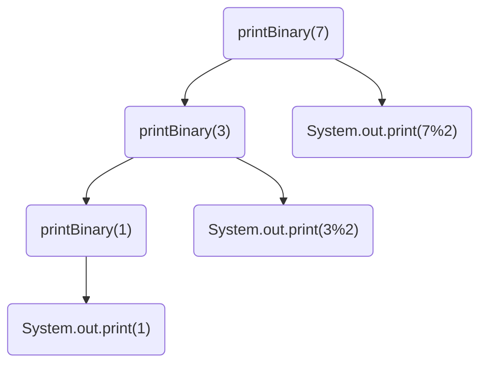
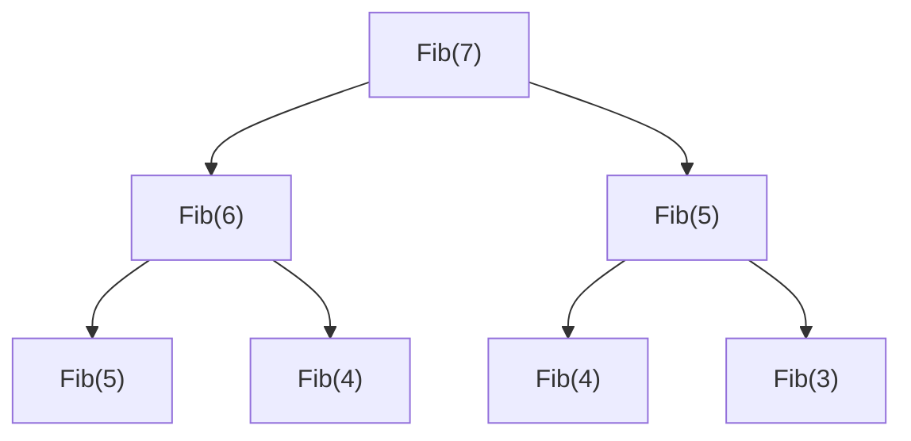

# 数学的预备知识

> 作者：李彦筱
>
> 感谢学长 [yijunquan](https://github.com/yijunquan-afk) 的[软件工程笔记](https://github.com/yijunquan-afk/XJTUSE-NOTES)给我的启发。此笔记从二叉树开始的部分中使用了学长笔记中的部分图片以及文字。
>

本课程需要的一些数学知识。据老师说很简单。

## 集合

互不相同的对象构成的整体。可以由数组或者其他的简单数据结构实现。

其他东西自己去看离散数学。

## 计量单位

| 符号 | 大小          |
| ---- | ------------- |
| 2KB  | 2*1024 个字节 |
| 2 KB | 2*1000个字节  |

注：**数字和计量单位之间有空格**的时候是十进制：2 * 1000字节。

一般硬盘厂家宣传的时候采用 2 GB 这样的符号，代表 2 * 1000 * 1000 * 1000 字节。很不幸，计算机一般认为硬盘的单位是 2GB，即2 * 1024 * 1024 * 1024 这样。因此，你买的 2 GB U盘在计算机上可能显示为 1.9GB 左右。

## 对数

log<sub>b</sub>x = (log<sub>a</sub>x)(log<sub>b</sub>a)

一般计算机学科中，不带底数的log**默认以2为底数。**

## 递归

### 归纳法（与递归有关）

1. 基本情况：证明一个基础情况下待证命题正确
2. 归纳情况：令 s<sub>0</sub>,s<sub>1</sub>,s<sub>2</sub>…s<sub>n-1</sub>成立，在此基础上，证明 s<sub>n</sub> 成立。

### 递归

一个函数在定义中调用了自己，那么就称这个函数是递归的。

所有的高级程序语言几乎都允许函数递归。

为了防止无限递归的发生，递归函数需要满足一些要求：

- 存在基准情形：总有某种情况**不需要递归就能求解**

- 不断推进：对于需要递归的情况，递归调用时，这些情况必须**总是向基准情形的方向推进**。最终**必须能够到达基准方向**

- 设计法则：假设**所有的递归调用都是可以运行的**

  > 就和归纳法一样：假设除了此次运行之外，其他对此函数的调用都可以直接得到正确的结果

- 合成效益法则（最好遵守，但不遵守也没啥问题）

  在求解问题的同一实例时，切勿在不同的递归调用中做重复性的工作。

**存在基准情形，不断推进**两个要求是**必须要满足**的。递归的设计法则与合成效益法则可以帮助提高递归的性能，但即使不满足这两个要求，递归函数一般也能运行。

### 调用树

这里有一个输出一个整数的二进制表示的函数：

```java
public void printBinary(int n){
    if (n < 0) return;
    if (n == 0 || n == 1) System.out.print(n);
    else{
        printBinary(n/2);
        System.out.print(n%2);
    }
}
```

那么，我在调用 printBinary(7) 的时候，这个函数是怎么执行的呢？



函数实际上先向树杈的最左侧执行，然后慢慢沿右上方向返回，即调用 `printBinary(7)` -> `printBinary(3)` -> `printBinary(1)` -> `System.out.print(1)` -> `System.out.print(3%2)` -> `System.out.print(7%2)`

这就是调用树：一个递归函数在执行的时候，先向左下角行进；到达左下角（递归的最深处）时，再向右上方返回
一个递归函数必须存在基准情形，并逐渐向基准情形演进。满足这两个要求后，这个递归函数**在设计上一定是正确的**。这是由数学的归纳法在原理上保证的。

### 递归的合成效益法则：不要重复

假设函数是一个「模版」，每一个对于此函数的具体调用（包含函数名，调用函数用的所有参数）称为**函数的一个实例**。如果一个递归函数**产生了大量相同的调用实例**，那么它的效率就是低下的。

比如，看看这个函数：

```java
public int Fib(int n){
    if (n == 1 || n == 2){
        return 1;
    }
    return Fib(n-1) + Fib(n-2);
}
```

这个函数在递归理论上没有任何问题。但是，它的调用中存在重复内容。看看`Fib(7)`的调用树



（我只画了一部分，看看就好）

可以看到，Fib(5)被计算了2次；Fib(4)被计算了2次，……这些两次重复的计算没有任何的意义，只是在浪费时间。这个函数就违反了合成效益法则。

> 我的电脑上运行这个函数计算 Fib(100)，算了半个小时还没结束…

### 调用树为什么好？

考虑这个函数：

```java
public void f(int k){
    if (k > 0){
        System.out.println(k);
        f(k-1);
        f(k-2);
    }
}
```

1. 它是递归函数吗？

   这个函数包含基准情形（f<=0时，函数隐式的直接结束，不需要再递归求解）

   它在递归时是在向基准情形演进（k逐渐减小直到0）

   所以，这是一个递归函数

2. `f(5)`会输出什么？

   尝试思考一下，你会体会到脑子坏掉的感觉（

   这个时候，调用树可以帮助我们梳理：

   ```mermaid
   graph TB
   O("f(5)")
   A("System.out.println(5)")
   B("f(4)")
   C("f(3)")
   D("f(3)")
   E("f(2)")
   F("f(1)")
   G("f(2)")
   H("System.out.println(1)")
   I("f(1)")
   J("System.out.println(1)")
   K("System.out.println(4)")
   O-->A
   O-->B
   O-->C
   B-->K
   B-->D
   
   D-->E
   E-->F
   F-->H
   B-->G
   D-->I
   I-->J
   

（这棵调用树也不是完整的）

从上向下，从左向右的看调用树的叶节点，就可以看出递归函数实际执行了哪些操作。