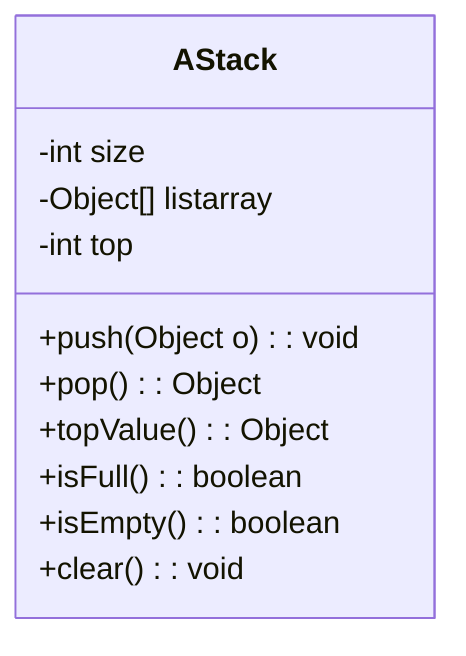
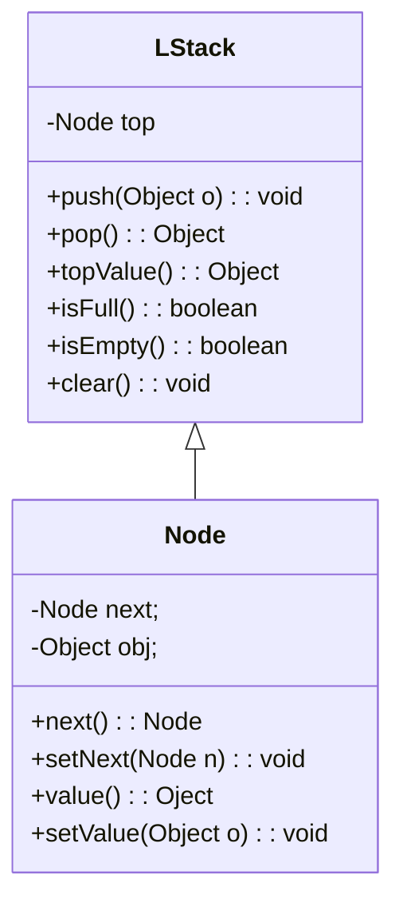
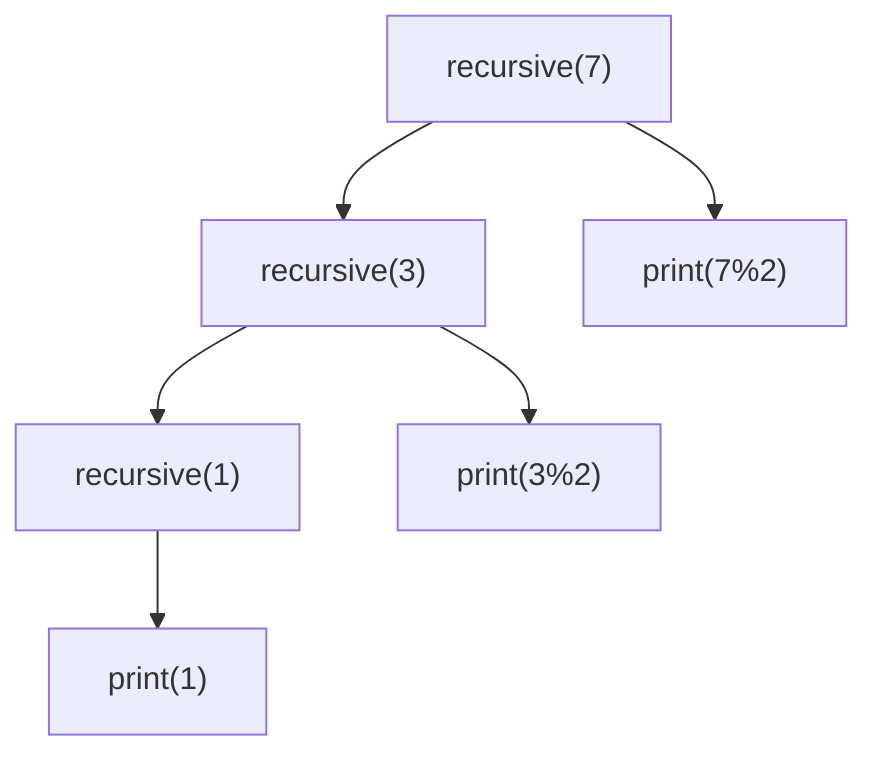
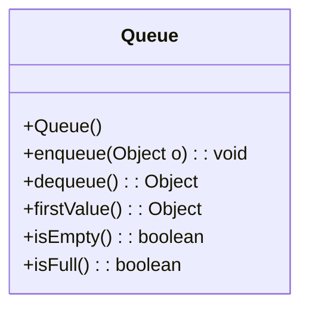
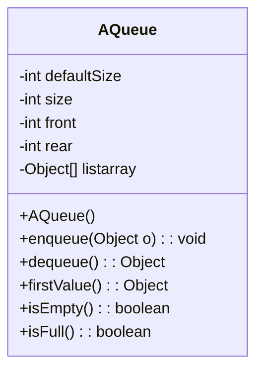
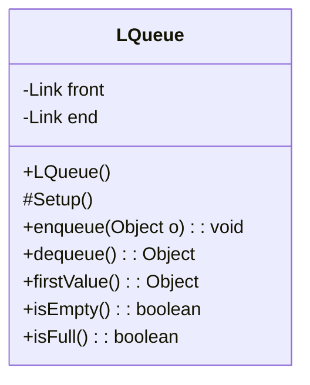

# 栈和队列

>作者：李彦筱
>
>感谢学长 [yijunquan](https://github.com/yijunquan-afk) 的[软件工程笔记](https://github.com/yijunquan-afk/XJTUSE-NOTES)给我的启发。此笔记从二叉树开始的部分中使用了学长笔记中的部分图片以及文字。
>

## 栈

首先记住：**栈是线性表**。

> 线性表的定义：除了表头和表尾之外，每个元素都有一个直接前驱与直接后继

特别之处：**栈只允许在一端进行插入和删除**，只有**1个删除位置，1个插入位置，1个可访问位置**。

栈的性质：存储/删除元素的顺序于元素到达的顺序相反，即**后进先出**

栈的那唯一一个插入和删除位置叫做**栈顶**

- 向栈顶插入元素：入栈或者压栈
- 从栈顶删除元素：出栈

### 栈的 ADT

```java
public interface Stack{
    // 前三个为栈必须拥有的三个操作
    void push(Object o);
    Object pop();
    Object topValue();
    // 下面是三个辅助操作，没有也行
    boolean isFull();
    boolean isEmpty();
    void clear();
}
```

### 顺序栈（栈的数组实现）

区别：没有了`current`成员（因为栈只需要在最上方插入/删除元素）



具体实现的函数：

**注意 top 实际指向当前栈顶+1的位置**（称为指向新的栈顶）。因此，插入时**直接插入到top的位置**，删除时**先把top-1再删除**，取元素时**返回top-1位置的元素**。

这样的好处是，top 实际上就代表了**栈里目前有多少元素**。

插入：

```java
public void push(Object o){
    assert !isFull(): "Stack is overflow";
    listarray[top++] = o;
}
```

删除：

```java
public Object pop(){
    assert !isEmpty(): "Stack is empty";
    return listarray[--top];
}
```

获取栈顶元素

```java
public Object topValue(){
    assert !sEmpty(): "No element";
    return listarray[top-1];
}
```

检查是否已满

```java
public boolean isFull(){
    return top == size;
}
```

检查是否为空

```java
public boolean isEmpty(){
    return top == 0;
}
```

清空栈

```java
public void clear(){
    top = 0;
}
```

还有一种方法：**可以让top指向真正的栈顶**。这种情况下，插入时先把top+1再插入，删除时先删除再top-1，取元素时直接取top位置的元素。判满的实现：检查 top+1 == size；判空的检查：top == -1（**令空栈的指针指向-1，判空时判断top是否为-1即可**）

> 这种把指针位置设为-1来表示空的方法在很多的数据结构中都会用到。

### 链式栈（栈的链表实现）

具体成员如下：



数据成员中的 top 指向栈顶；而**链表的表头在这里作为栈顶**；插入时，在**链表表头插入**；删除时，**删除链表表头节点**。

链表的表头既方便插入还方便删除；而链表的表尾只适合于插入（删除的话需要 O(n) 的复杂度）。由于栈需要在同一端（栈顶）插入与删除，显然把链表表头作为栈顶是最合适的。

### 链式栈的实现（老师给的代码）

```java
public class LStack<T>{
	//在 LStack 类中定义个了一个内部静态类，且声明其访问性为 private。如果这样做了，那么这个内部类只能被 LStack 类所使用
	//有很多时候，某一个类需要使用一个新类型，而这个新类型其实只需要被这个类所使用，此时就可以采用内部类的方式来实现，以增强其封装性。
	private static class LinkedNode<T>{
	    T element;
	    LinkedNode<T> next;
		public LinkedNode(T element , LinkedNode<T> next){
			this.element = element;
			this.next = next;
		}
	}
	private LinkedNode<T> top;
	private int length;
	public LStack(){
		top = null;
		length = 0;
	}
	public void push(T element){
		top = new LinkedNode<>(element, top);
		length++;
	}
	public T pop(){
		if( isEmpty()) return null;
		LinkedNode<T> temp = top;
		T element = temp.element;
		top = top.next;
		temp.next = null;
		length--;
		return element;
	}
	public boolean isEmpty(){
		return top == null;
	}
	public boolean isFull(){
		return false;
	}
	public T topValue(){
		if(isEmpty()) return null;
		return top.element;
	}

	public int length() {
		return length;
	}

	public void clear(){
		if(isEmpty()) return;
		while(top != null){
			LinkedNode<T> temp = top;
			top = top.next;
			temp.element = null;
			temp.next = null;
		}
	}
    
	public String toString()
	{
		StringBuilder out = new StringBuilder((length() + 1) * 4);
		LinkedNode<T> temp = top;
		out.append("< ");
		while(temp != null){
			out.append(temp.element);
			out.append(" ");
			temp = temp.next;
		}
		out.append(">");
		return out.toString();
	}
}
```

## 栈和递归的关系

对象递归：一个对象的定义中包含它自身

算法的递归：一个算法函数执行时调用了他自己

### 自顶向下，逐步分解的策略

1. 子问题应该与父问题做同样的事，且更加简单

2. 解决递归问题：把规模比较大的问题分解为一个或者若干个**规模更小的**问题，再分别对这些比较小的问题求解，再综合他们的结果，得到原问题的解——分治法

   > 一般情况下是一分为二；分为其他个数（比如三个）也不是不可以，但编程起来比较不方便

3. 这些比较小的问题的求解方法应该与原先问题一样

### 递归过程：

递归过程的特点：

- 实现时需要自己调用自己
- 层层向下递归，而且退出函数调用的次序与调用的次序正好相反
- 这种次序与栈入栈出栈的特性正好一致

外部与内部调用

- 主程序第一次调用递归函数为外部调用
- 每次递归函数调用自身称为内部调用

### 递归的工作栈

每次递归调用都需要为过程中的参数，变量等分配存储空间

每次调用的参数-返回地址-局部变量 统称为**活动记录块**

每次调用的活动记录以栈的方式组织。栈中压入的每个数据都是一个活动记录块。

### 递归过程中栈应用的例子

下面是一个递归的函数，以及它的调用树

```java
public static void recursive(long n){
    if (n == 0 || n == 1){
        System.out.print(n);
    }
    else{
        recursive(n/2);
        System.out.print(n%2);
    }
}
```



每次调用时：系统向着系统栈内放入主调函数的**活动记录**。一个活动记录包含三个部分：

1. 主调函数的局部变量
2. 主调函数的参数
3. 调用发生的地址（调用完成后应该返回哪里）。

每次一个函数执行结束之后：系统从系统栈内弹出栈顶，利用活动记录块中的局部变量，恢复之前函数的执行环境；利用调用发生的地址，决定应该在哪里继续执行主调函数。

### 栈式递归的启示

每次递归，系统都需要创建活动记录块保存现场，压栈；结束时，需要弹出栈顶的活动块，恢复现场；这是比较慢的。既然已经知道了递归的特点和实现的原理，可不可以优化函数，使得其**不需要递归就能完成任务**？

老师讲了一种方法：自己维护一个**用户栈**，以便在不使用系统栈的情况下，进行某些递归的操作，但实际不需要递归调用。一般来讲，用户栈中需要保存的东西的大小小于系统栈里的活动记录块。（如果反而更大了，那还不如不优化了）

比如，上边的递归函数可以改为：

```java
private static void useStack(long n){
    if (n <= 0){
        System.out.println("Number out of range");
        return;
    }
    Stack s = new LStack();
    while (n > 0){
        s.push(n);
        n /= 2;
    }
    while (!s.isEmpty()){
        System.out.print(s.pop() % 2);
    }
}
```

这时的用户栈不需要保存返回地址，只需要保存n的值，因此存储内容小于递归版本。

### 通用的方法：转化递归为递推

有的时候，你会发现，使用用户栈需要存储的东西实在是太多了，还不如直接递归呢！

下面就是一种通用的，优化递归的方法：创建“自己的活动记录”

 举一个把汉诺塔算法从递归转化为递推的例子。

汉诺塔算法的实现大概是这样：

```java
void TOH(int n, char start, char end, char temp){
    if (n==0) return;
    if (n==1){
        move(start, end);
        return;
    }
    TOH(n-1, start, temp, end);
    move(start, end);
    TOH(n-1, temp, end, start);
}
```

（不需要关心这个代码是怎么来的；反正我们的工作只是把它转化为递推的）

这个函数中包含两种任务：

1. move()
2. TOH() 。这个任务是一个递归的任务

我们需要创建一个活动记录块类，来记录我们到底想执行什么任务；再创建一个存放这种活动记录块的栈，把这些记录块放进栈里。然后，从栈中取出活动记录块，根据这个记录块记录的任务类型，执行对应的操作。如果这个操作中包含递归调用，就创建一个代表递归调用的活动记录块放回栈里。

对于这个函数而言，活动记录块需要存储这些内容：

1. 参数：start, goal, end 三个参数
2. 类型：到底需要执行 move 还是 TOH 任务

活动记录块类可以如下定义：

```java
enum ActivityType{
    TOH, MOVE;
}

public class Activity{
    public char start;
    public char temp;
    public char goal;
    public int n;
    public ActivityType type;
    public Activity(int n, char start, char temp, char goal, ActivityType type){
        this.n = n;
        this.start = start;
        this.goal = goal;
        this.temp = temp;
        this.type = type;
    }
}
```

具体改写方法为：

1. 在栈中放入一个初始的活动记录块

2. 当栈不为空的时候，弹出栈顶的记录块

3. 根据记录块的类型（type）执行对应的操作。如果需要递归，就创建一个新的活动记录块，记录下递归调用的参数之后，放入栈中。

   注意由于栈后进先出的特性，你想要最晚调用的函数应当被最早放入栈中。

具体的实现：

```java
public class TOH {
    public static void TOH(int n, char start, char end, char temp){
        LStack<Activity> stack = new LStack<>();
        stack.push(new Activity(n, start, temp, end, ActivityType.TOH));
        while (!stack.isEmpty()){
            Activity record = stack.pop();
            switch (record.type){
                case TOH:
                    if (record.n == 0) continue;
                    if (record.n == 1){
                        stack.push(new Activity(0, record.start, record.temp, record.goal, ActivityType.MOVE));
                        continue;
                    }
                    stack.push(new Activity(record.n - 1, record.temp, record.start, record.goal, ActivityType.TOH));
                    stack.push(new Activity(0, record.start, record.temp, record.goal, ActivityType.MOVE));
                    stack.push(new Activity(record.n - 1, record.start, record.goal, record.temp, ActivityType.TOH));
                    break;
                case MOVE:
                    move(record.start, record.goal);
                    break;
            }
        }
    }

    private static void move(char start, char goal){
        System.out.println("move " + start + " to " + goal);
    }
}
```


理论上，任何的递归调用都可以使用此方法转化为非递归的。


## 栈的应用

栈最好用的特点就在于它的**后进先出**的性质。围绕这一核心性质，栈有着许多应用：

### 判断符号的平衡

很多的标点符号或者其他啥子符号，比如 `() [] '' "" {}` ，是需要成对出现的。

我们把这些成对符号当中左侧的符号叫做**开符号**，右侧的叫做**闭符号**。规定：

- 每个开符号都需要对应一个闭符号
- 当看到一个闭符号时，距离此闭符号最近的，左侧的，未匹配的开符号必须能与此闭符号匹配

这种情况下称为符号平衡。

由于需要存储开符号来匹配，而且每次检查开闭符号的匹配性时，检查的是最近插入的开符号，因此栈非常适合于完成此任务。只要每次给出的闭符号和栈顶的开符号匹配全部成功；而且栈空的时候，闭符号也没了，那么符号就正好匹配了。

#### 算法描述

- 建立一个空的栈
- 读入字符序列直到结尾
  - 如果符号是一个开符号，入栈
  - 如果符号是一个闭符号：若栈为空，闭符号多，失败；如果栈不为空，弹出栈顶；如果栈顶符号和此闭符号不匹配，那么失败
- 如果字符序列结束后栈不为空，开符号多，报错；为空，则匹配成功结束

#### 算法的实现

```java
public class BracketMatching {
    //利用栈完成括号匹配
    boolean match(char[]exp){
        char stack[] = new char[exp.length];
        int top=-1;
        for (int i=0;i<exp.length;i++){
            if (exp[i]=='('){
                stack[++top]='(';//遇到'('则入栈
            }
            if (exp[i]==')'){
                if (top==-1){
                    return false;//栈空说明')'比'('多，不匹配
                }else {
                    --top;//栈不空则将栈中的一个'('弹出
                }
            }
        }
        if (top==-1){
            return true;//栈空则说明所有括号都被处理掉
        }
        return false;//否则括号不匹配
    }

    public static void main(String[] args) {
        BracketMatching test = new BracketMatching();
        String string = "((1+1)+(2+1)))";
        char[] exp=string.toCharArray();
        System.out.println(string+"括号匹配: "+test.match(exp));
    }
}
```


### 混合算术表达式的计算

其实，栈的应用也不局限于算术表达式的计算；理论上，栈可以解析任何的表达式。

中缀表达式的定义：

6 + 3 * (4+5) - 2 这种算式就是一个中缀表达式。

- 由操作数和操作符构成
- 操作数出现在操作符的左侧或者/和右侧
- 一个中缀表达式的计算顺序由各个操作符和操作数一同决定；不是从头向尾计算就行

计算机计算中缀表达式是困难的（人倒是好算），因为：

- 计算机基本是按流的方式从左到右的输入，无法“先看一部分”；人可以做到“优先看哪一个部分”

- 如果遇到一个操作符，这个操作符由于优先级的问题，可能无法立刻使用 *优先级问题*

  > 比如 2 + 3 * 5，总不能看见第一个操作符就把 2+3 给算了吧

- 即使一个操作符可以使用，它后边的第二个操作数可能还不能使用（需要先计算后面的操作数） *结合性问题*

  > 比如 3 * (2+5)当中，3 * 无法被计算，除非先计算出（2+5）的结果

后缀表达式：给计算机看的表达式

- 解决了中缀表达式在处理时的 优先级 和 结合性 问题，因为它根本没有这两个概念
- 遇到一个操作符时，总能简单的找到他的操作数（结合性问题）
- 只需要从左向右执行，没有优先级问题（优先级问题）

> 3+4*（5+6）-3 > 3456+\*+-3-

后缀运算符的特点：**读取到的操作符使用最后读到的操作数**

比如 3456 四个操作数入栈后，碰到+操作符，就需要弹出栈顶的两个数（最后读到的操作数）5和6，并且把它们加起来。之后，把（5+6）的结果再压栈。

> 每次碰到操作符的时候，需要弹出几个数取决于运算符的要求；在这里，所有的运算符都是双目运算符，因此全都需要弹出两个数字。

#### 后缀运算符计算的算法描述

先建立一个操作数栈，用于存放数字。

1. 从左向右扫描字符串，遇到操作数的话，将其压入操作数栈里
2. 遇到操作符的话，从操作数栈中弹出对应数量的操作数，根据操作符的含义对这几个操作数计算；计算结果压入操作数栈中
3. 字符串扫描完成后，操作数栈中的唯一一个元素就是运算结果


### 后缀表达式与中缀表达式的转换

显然，后缀表达式的计算很简单；但是，这又引起了一个问题：怎么把中缀表达式转换为后缀表达式？

总不能让人自己计算：你都转换完了，干吗不直接把结果算出来得了？

因此，需要一个自动化的算法，把中缀表达式转换为后缀表达式。

转换的特点：

- 中缀表达式和后缀表达式**操作数**的顺序一致；但是，操作符的顺序发生了变化。

  > 3 + 4 * (5+6) - 3 -> 3456+\*+3-

- 通过对中缀表达式添加括号，去掉表达式优先级对运算符优先级的依赖即可

  > 3 + 4 * (5+6) - 3 -> ((3+(4\*(5+6)))-3) -> ((3(4(56+)*)+)3-)
  >
  > 把加了括号之后，每个括号内的运算符移动到对应的括号的后边，即可得到后缀表达式

不过，由于机器不认识符号的优先级，这种方法不适用于编程的实现。

机器算法：

建立一个操作符栈，用于存放操作符

1. 从左到右扫描中缀表达式

2. 遇到操作数的时候，立刻输出到后缀表达式里；

   遇到操作符的话，需要分情况看待：

   - 操作符栈为空的话，把运算符压入操作符栈里
   - 当当前运算符号不是括号（且栈不空）时，从栈中弹出运算符，直到发现运算优先级比当前运算符号更低的运算符为止。输出所有被弹出的运算符到后缀表达式中
   - 当运算符为(时，压入栈中
   - 当运算符为)时，从栈中弹出运算符，直到遇到（符号。输出所有被弹出的运算符到后缀表达式中，不过，不包含（）括号。

3. 扫描完表达式后，把所有操作符栈中剩余的元素全部弹出，并输出到中缀表达式里。

#### 一步到位的计算

有没有一种方法，让我们不需要把中缀表达式转换为后缀，再计算后缀表达式，而是直接计算中缀表达式？

中缀表达式 -> 后缀表达式：需要一个栈用于存放操作符

后缀表达式的计算：需要一个栈来存放操作数，每碰到一个运算符，就弹出对应数量的操作数。

因此，我们创建两个栈，一个存放操作数，一个存放操作符。

每扫描到一个操作数，就把它直接放入栈中。

运算符能入栈的标准：

- 栈是空的

- 栈不空时，扫描到的运算符的优先级大于栈顶运算符的优先级

  > 假如栈顶是 \+，运算符也是 \+ ，那么应该先算栈里的，不允许入栈
  >
  > 因为目前我们处理的符号 \+ \- \* / 全是左结合的（在两个符号优先级相同时，全都是从左向右算）；栈里的操作符一定是在左侧的。
  >
  > 如果要计算 \^ 运算符（它是一个右结合运算符），那么当栈顶运算符和扫描到的运算符优先级一样时，应该把新的运算符压入栈中，而不是弹出栈顶元素并计算

在不满足这两个标准的任何一个时，需要立刻从运算符栈中弹出栈顶，从操作数栈中弹出对应数量的数字，运算后重新压回操作数栈中。之后，再次检查扫描到的运算符能不能入栈。

> 最多的情况下，假如栈里头的所有运算符的优先级都比新的高，等到栈里头所有运算符算完就可以让新的符号入栈了。

注意：

括号的优先级是最高的，在未入栈之前可以压制所有运算符，使得它一定可以入栈，保障了括号内的运算；但是，如果他的优先级一直是最高的话，那么它入栈之后，任何操作符的尝试入栈都会导致它弹出来并被计算；这是不正确的，因为这种情况下，括号就没有规范优先级的意义了。因此规定：

**左括号在入栈之前，优先级最高；入栈之后，优先级最低**

右括号的作用：无限弹出操作符栈中的运算符并运算，直到找到操作符栈中的左括号（记着把左括号也弹了）

当算式结束之后：弹出操作符栈中的所有操作符并且进行运算。


## 队列

队列也是一种**操作受限的线性表**。

队列只允许两端中的某一端插入，在另一端只能删除。允许插入的那一端叫做队尾；允许删除的那一端叫做队首。

队列的入队顺序和出队顺序完全相同；不像栈可以通过入栈，出栈的顺序变化改变元素出栈的顺序，队列在入队顺序不变时，只能有一种出队顺序。

> 栈：1入1出2入2出3入3出 -> 出栈顺序 123
>
> ​      1入2入3入3出2出1出 -> 出栈顺序 321
>
> 队列：1入1出2入2出3入3出 -> 出队顺序 123
>
> ​       1入2入3入1出2出3出 -> 出队顺序 123 不变

队列的操作：

- 向队尾插入元素称为入队
- 从队首删除元素称为出队

### 队列的 ADT



### 队列的数组实现



由于队列的数组实现需要使用循环数组，因此事实上，队列的数组实现实际比链表实现困难。

数组中对队首和队尾位置的设置方式有好几个方案：

#### 方案一

将队首设置为数组开头；将队尾设置为数组最后一个实际元素的位置

| 1    | 2    | 3    | 4    | 空   | 空   | 空   | 空   | 空   |
| ---- | ---- | ---- | ---- | ---- | ---- | ---- | ---- | ---- |

入队：O(1) 出队：O(n) （相当于一个普通线性表中删除表头）

队空判断：rear == front

队满的判断：rear == size - 1

队长度: rear + 1

#### 方案二

把队首设置为不固定的，出队的时候，把队首+1即可；队尾还是数组实际的最后一个元素的位置。

| 空   | 空   | 空   | 1    | 2    | 3    | 4    | 空   | 空   |
| ---- | ---- | ---- | ---- | ---- | ---- | ---- | ---- | ---- |

入队:O(1) 不变

出队：队首位置 +1 即可，O(1)

队空：rear == front

队满：rear == size -1

> 由于这种实现下，元素出队之后，队首前面的位置就浪费了（没用了），无法再被队列使用，因此这是一种“假满”。
>
> | 空   | 空   | 空   | 空   | 空   | 1    | 2    | 3    | 4    |
> | ---- | ---- | ---- | ---- | ---- | ---- | ---- | ---- | ---- |
>
> 比如这个队列，看起来前面还是空的可以用，但是实际上，前面的空间已经没法再次插入/使用了。
>
> 而且，这种实现下，假如数组长度是10，你插入10个数据再删除10个，这个队列就没法用了。这可不太妙……

队长度：rear - front + 1

#### 方案三：循环数组

通过对索引取模的方法，让数组的开头那些空出来的空间可以被再次的使用，从而克服“假满”的现象。允许队列从数组最高编号的位置延续到编号最低的位置。这种东西可以通过取模操作实现

入队操作：O(1) `rear = (rear + 1) % size`

出队操作：O(1) `front = (front + 1) % size`

问题来了：介于现在 rear 甚至可以到 front 前面，那么应该如何判断队列是空的还是满的？

队列中元素全满：

| 1    | 2    | 3    | 4     | 5    |
| ---- | ---- | ---- | ----- | ---- |
|      |      | rear | front |      |

队列中马上就空：

| 空   | 空   | 1          | 空   | 空   |
| ---- | ---- | ---------- | ---- | ---- |
|      |      | rear/front |      |      |

队列为空: （因为出队的时候 front 会 +1）

| 空   | 空   | 空   | 空    | 空   |
| ---- | ---- | ---- | ----- | ---- |
|      |      | rear | front |      |

显然，不可以再使用 `rear + 1 == front` 来判断空/满了。那应该怎么判断？

> 详细证明：为什么此时一定有两种元素个数状态无法使用 front 和 rear 的位置关系区分？
>
> 这是因为一个长度为5的数组长度有6种（0，1，2，3，4，5），但是front一定时，rear只有五个位置可去(0,1,2,3,4），总有两个长度会对应到相同的front-rear关系。
>
> 目前没法区分的是元素个数为0和满的两种个数状态。现在，这两种状态下，都有 rear + 1 == front

一种方案：状态位，设置一个布尔变量，存储队列是否空了。

缺点：每次对队列操作时都需要校验/修改这个状态位，很麻烦

另一种方案：为数组增加一个元素位置（就像链表的哑节点），并更改 front 和 rear 指向的位置

> 证明：为什么多一个不存储内容的数组元素后，就可以使用 front 和 rear 的位置关系表示数组中所有元素个数的情况？

front ：指向队首的**前一个元素**

rear：指向队尾的实际位置

| 空   | 空   | 空         | 空   | 空   |
| ---- | ---- | ---------- | ---- | ---- |
|      |      | front/rear |      |      |

| 3    | 4    |       | 1    | 2    |
| ---- | ---- | ----- | ---- | ---- |
|      | rear | front |      |      |

此时，front == rear 时队空，rear与front差1时队满。

入队：`rear = (rear + 1) % size`

出队：`front = (front + 1) % size`

队满：`(rear + 1) % size == front`

队空：`rear == front`

判断队长度：

`(rear - front + size) % size`

在具体编写代码的时候，要记住只要使用(front+1)而不是直接使用front的话，都需要对max_size取余数。比如，

`array[front]` 不需要取余数；`array[(front+1)%max_size]`必须有这个取余数。  

#### 数组实现的具体代码

```java
public class AQueue<E>{
    //定义顺序队
    private static final int DEFAULT_SIZE=10;
    private int max_size;//定义队列的实际最大容纳量+1
    private int size;//队列中实际的元素个数
    private int front;//队首元素的前驱元素下标
    private int rear;//队尾元素下标
    private E[] listArray;//存储元素的下标

    private void setUp(int size){
        this.max_size = size + 1;
        this.size = 0;
        front = rear = 0;
        this.listArray = (E[]) new Object[size];
    }

    public AQueue() {
        setUp(DEFAULT_SIZE);
    }
    public AQueue(int size){
        setUp(size);
    }

    public void clear() {//清空队列元素
        front=rear=0;
    }

    public void enqueue(E it) {
        if (isFull()) System.out.println("队列已经满了");
        else{
            rear = (rear + 1) % max_size;
            listArray[rear] = it;
            size++;
        }
    }

    public E dequeue() {
        if (isEmpty()) System.out.println("队列是空的");
        else{
            front = (front + 1) % max_size;
            size--;
            return listArray[front];
        }
        return null;
    }

    public E firstValue() {
        if (isEmpty()) System.out.println("队列是空的");
        else{
            return listArray[(front+1)%max_size];
        }
        return null;
    }

    public boolean isEmpty() {
        return front == rear;
    }

    public boolean isFull() {
        return front == (rear + 1 ) % max_size;
    }

    public int size() {
        return this.size;
    }
}
```


### 队列的链表实现



链表的**表头适合插入和删除，表尾适合插入而不适合删除**

因为表尾删除时需要找到其前驱，从前驱中去掉对表尾的引用；表头没有前驱，把表头改一下就删掉旧表头了。

权衡之下，应该让表尾作为队尾（插入），表头作为队首（用于删除）

判断队空：检查 front 和 rear 是不是都指向 null

判断队满：直接返回 false，链式存储结构满不了

入队：只修改 rear 指向的东西

出队：只修改 front 指向的东西

我个人感觉队列的链式实现其实比数组实现更符合直觉一点，因为循环数组实在不太常见…

#### 链表实现的代码

```java
public class LQueue<T>{
    private static class LinkNode<T>{
        public T element;
        public LinkNode<T> next;
        public LinkNode(T element, LinkNode<T> next){
            this.element = element;
            this.next = next;
        }
    }

    private LinkNode<T> front;
    private LinkNode<T> rear;

    public LQueue(){
        front = rear = null;
    }

    public void enqueue(T element){
        if (isEmpty()){
            front = rear = new LinkNode<>(element, null);
        }
        else{
            rear.next = new LinkNode<>(element, null);
            rear = rear.next;
        }
    }

    public T dequeue(){
        if (isEmpty()) return null;
        T element = topValue();
        front = front.next;
        if (front == null) rear = null;
        return element;
    }

    public T topValue(){
        if (isEmpty()) return null;
        return front.element;
    }

    public boolean isEmpty(){
        return front == null && rear == null;
    }

    public boolean isFull(){
        return false;
    }

    public void clear(){
        front = rear = null;
    }

    public String toString(){
        StringBuilder builder = new StringBuilder();
        builder.append("< ");
        LinkNode<T> temp = front;
        while (temp != null){
            builder.append(temp.element.toString()).append(' ');
            temp = temp.next;
        }
        builder.append('>');
        return builder.toString();
    }
}
```


## 队列的应用：基数排序

时间复杂度表现最好的排序算法是什么？

- 归并排序：O(nlogn) 稳定
- 快速排序：平均情形 O(nlogn)，最坏情形 O(n<sup>2</sup>)，不稳定

有没有比 O(nlogn) 更快的排序算法？

限制：**基于比较**的排序算法在最坏情况下的下限为 Ω(nlogn)

> 大Ω标记在这里的意义是：无论如何优化，排序算法**最坏情况下**的时间复杂度**一定不低于nlogn级别**
>
> 具体的证明在二叉树那块的末尾

突破口：**创建不基于比较的排序算法**，以便绕过此限制。如何实现不基于比较的排序算法呢？这种排序算法**对于关键码有一定的要求**。需要假设：

- 待排序的关键码都是整数
- 待排序的关键码值位于一个有限的范围内（不过可以重复）

在这种条件下，可以在不进行比较时，设计出一种速度更快的排序算法。

### 桶排序

算法的思路：

- 确定关键码的范围（假设其为0-m-1)
- 初始化 m 个桶（每个桶即是容器，目前可以用线性表，栈，队列来表示。在这里使用线性表实现。）
- 按顺序扫描关键码序列。对于 i，把它放入第 i 个桶的最后
- 按照桶的序号从小到大，每个桶从前到后（先入先出）的顺序输出所有数据。比如：

5 2 3 1 1 0 2 3 4（数据序列）

下面是 [0, 5] 的6个桶：

0: 0

1:1 -> 1

2: 2 -> 2

3: 3 -> 3

4: 4

5: 5

输出： (0) -> (1 -> 1) -> (2 -> 2) -> (3 -> 3) -> (4) -> (5)

### 桶排序的算法分析

桶排序需要哪些时间步骤呢？

1. 为每一桶分配空间。由于需要 m 个桶（假设关键码的范围为 m），创建桶需要 O(m) 的时间。
2. 把每个关键码放到它该去的桶里。这个动作叫做**分配**。由于有 n 个关键码，分配步骤需要 O(n) 的时间
3. 从桶中按顺序取出 n 个关键码。这个动作叫做**回收**。需要 O(n) 的时间。

综上：需要 O(m) + O(2n) -> O(m+n) 的时间。**当数据范围m小于数据个数n的时候**，时间复杂度在 O(n) 内。

### 桶排序的局限性与改进

桶排序限制了：

1. 关键码必须在某一范围内
2. 关键码必须是整数或者能被表示成整数
3. 需要 O(n) 的额外空间

桶排序的问题：

桶的数量取决于待排序关键码的最大范围。如果关键码数量很少，但是数据范围很大，那桶排序的空间消耗就惨了。

> 比如，1000个关键码，但是其中最大值为 99999999.
>
> 可以看出，桶排序应用的瓶颈实际上是桶的数目。

如何解决这一个问题呢？可以从关键码的进制上下手。关键码如果是十进制整数，那么它的每一位一定只能在 0-9 之间。怎么利用这一点呢？

我们可以把关键码拆分成多个。比如，99 拆为 (9,9)，46 -> (4, 6), 84 -> (8, 4)，然后：先对最后一位桶排序，再对倒数第二位排序，以此类推……比如：

(6, 6), (9, 9) , (4, 6), (4, 8):

| 0    |               |
| ---- | ------------- |
| 1    |               |
| 2    |               |
| 3    |               |
| 4    |               |
| 5    |               |
| 6    | (6, 6) (4, 6) |
| 7    |               |
| 8    | (4, 8)        |
| 9    | (9, 9)        |

得到：(6,6) (4,6) (4,8) (9,9)。然后，对十位排序：

| 0    |               |
| ---- | ------------- |
| 1    |               |
| 2    |               |
| 3    |               |
| 4    | (4, 6) (4, 8) |
| 5    |               |
| 6    | (6, 6)        |
| 7    |               |
| 8    |               |
| 9    | (9, 9)        |

得到：(4,6) (4,8) (6,6) (9,9)

(4,6) 和 (4,8) 的位置关系是如何保持的呢？这是因为，桶排序具有**稳定性**。**相同关键码的内容在排序前后，其相对位置关系不会丢失**。使用**队列**这种可以保持元素进入顺序与退出顺序一致的线性表，**就可以保证桶排序的稳定性**。

这种把关键码按照位数拆分为多关键码的桶排序叫做**基数排序**。

### 基数排序

多关键码，且具有稳定性的排序在使用时需要：

- 确定关键码的“重要程度”。比如，高考成绩排序可能需要先按照总分排序，总分一样时再按语文，语文一样时再按数学，再按英语。
- 排序时，**先按照最不重要的关键码排序**，再依次按照关键码重要程度逆序排序，直到**最后按照最重要的关键码排序**。比如在上面的例子里，先按照英语排序，再按照数学，再按照语文，再按总分排序。

基数排序的具体算法：

利用桶排序，但是设置的桶的数量并不是按照关键码数值大小的范围，而是按照某个特定的基数 *r*。通过此基数 r ，实现对关键码的分配过程。

假设基数为10，排序对象是一般的十进制整数，那么，排序过程可以如下的进行：

1. 设置10个桶，代表0，1，2，3，5，6，7，8，9
2. 设置i=1
3. 进入第i次扫描。这次扫描当中：
   1. 扫描每个数从右往左数的第i位。把数字放入第 `S[k] / 10<sup>i-1</sup> % 10` 的桶里。
   2. 在把所有数字都放到桶里之后，从桶中按照桶名字的顺序（0，1，2，...，9）把每个桶的数字拷贝回原先的数组当中
4. i = i+1，直到i 超过数组中最大的数字的位数结束。

### 基数排序的时间复杂度分析

桶排序的时间复杂度是 O(m+n) （其中m为桶的数量，n为数据的规模）。如果采用十进制，那么基数排序中 m = 10。

基数排序需要执行多少次桶排序呢？答案是 log<sub>10</sub>max 次（如果 max 是最大的数据）。因此，基数排序的时间复杂度是：

O(log<sub>r</sub>max * (m + n))。（r指的是选择的基数）

如果max不算大的话，基数排序的时间复杂度大概在 O(n) 内。000000

### 基数排序的局限

虽然基数排序已经不害怕很大的整数了，但它仍然有局限性：

**没有明确的位数，或者没有固定范围的关键码无法使用基数排序。**

