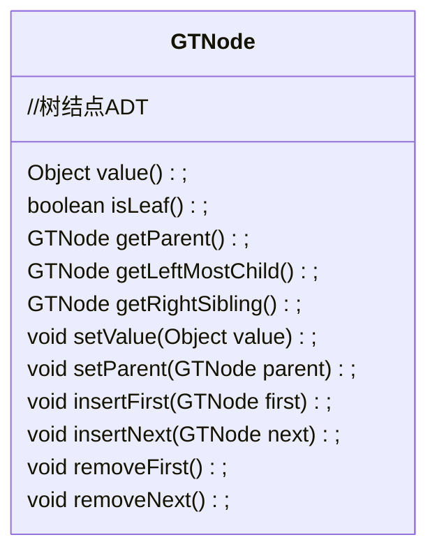
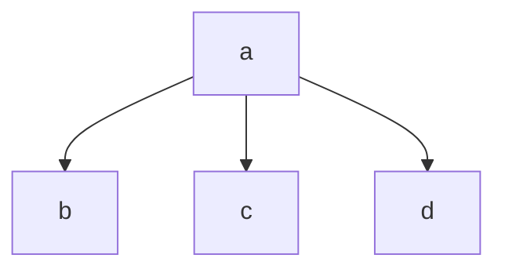
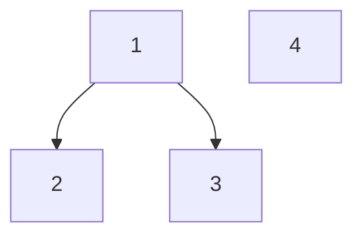
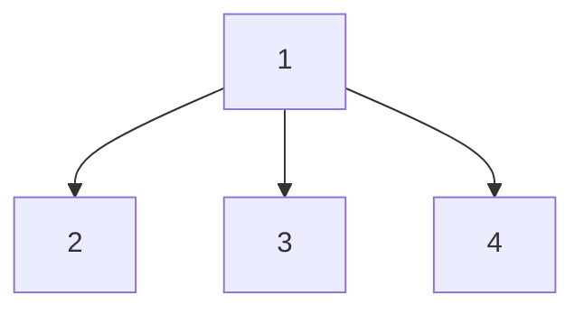
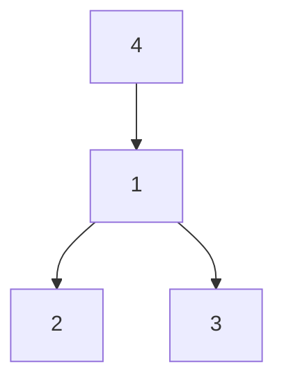
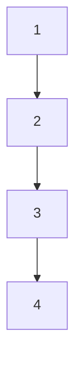

# 树和森林

> 作者：李彦筱
>
> 感谢学长 [yijunquan](https://github.com/yijunquan-afk) 的[软件工程笔记](https://github.com/yijunquan-afk/XJTUSE-NOTES)给我的启发。此笔记从二叉树开始的部分中使用了学长笔记中的部分图片以及文字。
>

## 树

### 树的定义

**树的定义**：一棵树T是由一个或一个以上结点组成，其中有一个结点为T的根结点。其他的n个节点可以被划分为n个子集，并且其相应的根结点R1、R2、 ... 、Rn是R的子结点。

树和二叉树一样，也是一个递归的定义。不同的是，二叉树只有两个孩子，树中每个节点孩子的数量都是可变的（不确定的）

结点的出度：该结点的子结点的数目

子集T(1≤ i ≤n）称为树T的子树(subtree)

### 森林的定义

一个或者多个树的集合。这些树不需要连接在一起（不需要归属于同一棵大树）。不过，这些树不能相互相交。

其实，把每棵树的根节点作为一棵树的子节点，就可以得到一棵大树。

### 树的 ADT



如何利用这个ADT访问树的任何一个子节点呢？



其实很简单：假如我有a节点，我想获取它的孩子b,c,d，那么：

b 可以由 `a.getLeftMostChild`获得：

c 可以由 `b.getRightSibling()` 获得（因为这个方法的作用是返回调用者的右侧最近的兄弟节点）

d 可以由 `c.getRightSibling()`获得。

`insertFirst` 表示插入一个节点到当前节点的第一个子节点的位置。比如，对a调用insertFirst会插入一个孩子到b前面；`insertNext`会把一个节点插入到当前节点`insertFirst`后那个位置右侧的一个位置。

ADT 中还有一个重要的方法 `isLeaf` ，可以判断某个节点有没有孩子。

### 树的遍历

树的遍历仅仅有三种：前序遍历、后序遍历和层序遍历。没有中序遍历。

前序遍历：先访问一个树的根节点，再从左向右前序遍历它的所有子树。比如，上面这个树的前序遍历为a, b, c, d

后序遍历：先从左向右访问一棵树的子树，再访问它的根节点。比如，上面这个树的后续遍历为b,c,d,a.

为什么没有中序遍历呢？因为树的孩子数量不同，怎么能知道把访问树的根节点放在哪两次对子树的访问之间呢？

层序遍历：从上向下一层层的遍历这个树。如果先访问了某个子树的根节点，则这棵子树也要被其他子树先访问。


如何保证树每个节点的所有孩子都被遍历到了呢？可以使用 `leftmost_child()` 和 `right_sibling()` 方法结合使用。举个例子，对于树的先序遍历来说：

```java
private void preOrder(GTNode rt){
    if (rt == null) return;
    visit(rt);
    GTNode temp = rt.leftmost_child();
    while (temp != null){
        visit(temp);
        temp = temp.right_sibling();
    }
}
```


## 树的实现

树的具体实现一般有三种：父指针表示法， 子节点表表示法，和左子节点/右兄弟节点表示法。

不同的表示法是可以一起使用的。

### 父指针表示法

这种表示法下，每个节点都只存储一个指向其父节点的指针。这种方法适用于解决等价类问题，但是，它无法做到“找到每个节点的最左子节点”“找到每个节点的右兄弟”这些重要的ADT中规定的内容。

**数组实现**：每个数组位置存放两个内容：

1. 真正存储的元素
2. 此元素的父元素所在的数组索引

比如，对上面那个树来说，其父节点表示法的数组表示为：

| 编号 | 内容 | 父指针 |
| ---- | ---- | ------ |
| 0    | a    | -1     |
| 1    | b    | 0      |
| 2    | c    | 0      |
| 3    | d    | 0      |

**链式实现**：每个链表节点也是两个内容：真正存储的元素+指向此元素父节点的指针。这种链表节点和实现休线性表用的链表节点似乎没有太大的差别

### 子节点表表示法

这种表示法中，每个节点存储了一个指向线性表的指针，这个线性表存放了所有此节点的子节点。它可以非常方便的找到某节点的子节点，但是，寻找兄弟节点是比较困难的。

**数组实现**：此处父指针表示法和子节点表示法一起使用，数组的每个位置存放父指针和子节点表：


**链表实现**：两种方法。第一种方法：让链表每个节点不定长度，其中存储一个数字表示有几个子节点。

第二种方法：每个节点长度一定，两部分：存储的元素，和一个链表；

链表中存储了每个该节点的子节点。

### 左子节点/右兄弟节点表示法

每个节点存储它的左子节点和右兄弟节点。这种方法可以较好的实现所有的ADT操作。

**数组实现**：数组每个位置存放三个内容：存储的元素，其最左子节点的位置，其右兄弟节点的索引。


**链式实现**：每个链表节点包含三个部分：存储的元素，指向其最左子孩子的指针，指向其右侧兄弟的指针。

这种存储下，树看起来就像二叉树一样，都由实际存储的元素+两个指针构成。


这几种存储方式是可以组合使用的。举个例子，你可以在数组中存放节点的父节点索引，最左子节点索引，右兄弟索引，就组合了第一种和第三种存储方式。


## 森林，树和二叉树的相互转化

二叉树可能转换为树，也可能转换为森林。

树和森林都能转换为一棵唯一的二叉树。二叉树和其森林/树是相互独立的。

### 树 -> 二叉树

我们利用树的最左子孩子/右兄弟节点表示法来表示二叉树。

1. 把树所有的孩子之间连上线
2. 删除掉每个节点和它的除了第一个子节点外其他节点的连线
3. 展开这个结构；节点-最左子节点变为父节点-左子树关系；节点-右侧兄弟节点变为父节点-右子树关系

比如：


### 二叉树 -> 树

1. 转向：把右下方倾斜的线转换成平的
2. 连线：连接父节点和所有的子节点
3. 删线：删除所有兄弟节点之间的相互连线


### 二叉树 -> 森林

如果一棵二叉树的根节点只有左子树没有右子树。那么它一定能转换为一棵树；如果一个二叉树的根节点左右子树都存在，那么它能转换为一个森林。

1. 转向：所有左上方-右下方的线改为平的
2. 连线：连接父节点和所有的子节点
3. 删线：删除所有兄弟节点之间的线。


### 森林->二叉树

1. 把所有树的根节点连接起来，认为他们互为兄弟节点
2. 使用树转换为二叉树的方法转换。


## 树的应用：不相交集（并查集）

并查集是一种抽象数据类型。这意味着我们不会过于纠结其具体代码实现。

定义：

- 由一些互不相交的集合作为元素组成的一个集合。此集合上还定义了操作Union（获得一些小集合的并集）和Find（查找一个元素所在的小集合，返回其所在集合的名字）。

  为了方便描述，把那些互不相交的集合称为小集合，包含所有他们的集合称为大集合。这只是我的规定，不要在考试里这么写。

  每个小集合之内的所有元素之间**都具有等价关系**

- 可以理解这个大集合是一个离散数学中说的*划分*

- 每个元素仅仅属于一个小集合；不会属于多个

- 由于一个元素只存在于一个小集合中，因此每个小集合都可以用**其中任何一个元素命名**。

  （每个小集合可以视为一个离散数学中的*等价类*）

需要支持的操作：

- Find(element_name)

  寻找 element_name 对应元素所在的小集合，返回小集合的名字

  注意 Find 操作需要的输入是元素的名字；但是在后边你会发现，知道元素的名字并不能让你找到它存储在数组的哪个位置/哪棵树中，因此在实际应用中，需要加一个查找表，以实现元素名称-元素存储的位置的对应关系。（这块内容不用掌握）

- Union(element1, element2)

  返回两个元素所在的小集合的并集。这个并集是一个新的集合（怎么感觉有点废话

能解决的问题：

等价关系之间的问题。（等价关系的定义和离散数学里那个完全一样）比如，电器、城市的连通性，每个人朋友的连通性（社交联系）。

> 朋友连通性的举例：比如有的 APP 会推荐给你一些“你可能认识的人”。这些APP怎么做到的呢？大概就是用并查集（

### 并查集的数组实现

由一个具有n个元素组成的数组储存各个不相交的集合

存储方法：下标区分不同元素；实际存储内容是这个元素所在的集合的名字。

初始状态:每个元素都隶属于不同的集合，该集合的名字和该元素名字一样，是该元素在数组的下标：set[i]=i

操作的具体实现：

`Union(i. j)`: 

1. 找出j位置元素的名字
1. 检查数组的所有内容，找到所有名字和j位置元素的名字相同的元素（注意：这些元素中肯定包含j位置的那个元素）
1. 把找到的所有元素的名字都改成i处的元素的名字

显然，这个步骤是把j位置元素所在的集合并入了i位置元素所在的集合，即j向i合并。

`Find(i)`：返回位置为i的元素属于哪个集合（即数组下标为i位置的元素的值）


时间复杂度：

`Union(i, j)`: `O(N+2)`（因为第一步是Find操作，是O(1)；第二步是遍历是O(N)；第三步需要Find(i)找到i位置元素的值，是O(1)）

`Find(i)`: `O(1)`（一次数组的随机位置读取）

但是。这个时间复杂度并不是很理想（主要是Union操作有点慢）。因此，我们想要转而使用森林这一结构

#### 数组实现的代码

这是数组中存储的数据类型的定义：

```java
public class GTNodeA {
    private int parent;//父结点
    private Object element;//存储元素内容

    public GTNodeA() {
        this(null, -1);
    }

    public GTNodeA(Object element) {
        this(element, -1);
    }

    public GTNodeA(Object element, int parent) {
        this.element = element;
        this.parent = parent;
    }

    public int getParent() {
        return parent;
    }

    public int setParent(int parent) {
       return this.parent = parent;
    }

    public Object getElement() {
        return element;
    }

    public void setElement(Object element) {
        this.element = element;
    }
}
```

这是整个并查集类的定义，包含了 find 和 Union 操作的定义：

```java
public class UnionFindArray {
    //用数组实现并查集
    public GTNodeA[] set;

    /**
     * 初始化并查集，每个集合一个元素，其名称即元素值
     *
     * @param N 元素总个数
     */
    public void init(int N) {
        set = new GTNodeA[N];
        for (int i = 0; i < N; i++) {
            set[i] = new GTNodeA(i);
        }
    }

    /**
     * 返回包含给定元素的集合名字
     *
     * @param i 给定元素
     * @return 集合名字
     */
    public int find(int i) {
        return (int) set[i].getElement();
    }

    /**
     * 生成一个新的集合，该集合是i所属的集合set1和j所属的集合set2的并集
     *
     * @param i
     * @param j
     */
    public void union(int i, int j) {
        int setName1 = find(i);
        int setName2 = find(j);
        for (int k = 0; k < set.length; k++) {
            if ((int)set[k].getElement() == setName2) {
                set[k].setElement(setName1);
            }
        }
    }

    public void print() {
        for (int i = 0; i < set.length; i++) {
            System.out.print(set[i].getElement() + " ");
        }
    }
}
```

### 并查集的森林实现

把并查集的每一个小集合用一棵树存储，整个并查集用一片森林表示。

>  每个小集合之间不需要相互连接，对应了森林中的每一棵树之间不需要相互连接。
>
>  这说明了森林能够保持并查集的逻辑关系

- 由于一个小集合当中，节点的顺序是无所谓的；因此在用树存储一个小集合时，可以采用树的父指针表示法

  >  每个节点仅仅存放一个指向父节点的指针的存储方法是父指针表示法
  >
  >  父指针表示法可以让`Find`操作更容易；

- 可以假设小集合对应树根节点就是这个集合的代表元素（反正集合中的任何一个节点都可以是他的代表元素，选个特殊位置的点当然没问题）

  也就是说，**每个小集合以根节点的内容命名**。

森林实现有什么好处吗？有的，`Union` 和 `Find` 操作需要花费的时间减少了。

操作的具体实现：

- `Find(i)`操作：一直寻找这个给定元素 i 的父节点，直到找到根节点。根据定义，根节点内容就是这个树对应集合的名字，因此只需要返回根节点内容的值。

​	由于树的定义中没有限制一个节点的子节点数量，因此，一棵有n个节点的树的高度可能在2到n之间。所以，`Find` 操作的时间复杂度在 O(1)（最好情形） 到 O(n)（最坏情形） 之间。

或者，假如树的高度为 h，那么`Find` 时间在 O(h) 内。

- `Union(i, j)` 操作：利用`Find`操作，找到i，j元素所在树的根节点k, m；如果k,m不一样（说明ij元素不在一个集合里），那么就合并集合，即把 m 挂载为 k 的一个子节点就行了。

  > 为什么要把第二棵树的根节点挂载在第一棵树的根节点下，而非第一棵树的任何一个节点呢？
  >
  > 这是为了减小第一棵树的深度，以便减少 find 操作的耗时

假设 `Find(i)` 一次的时间复杂度在 O(h) 内，那么 `Union` 的时间复杂度在 O(2h+1) 内。显然，优化 `Find` 操作也可以带来 `Union` 操作的速度提升。

#### 树的父指针表示法的数组实现

那么，我们决定了要使用树的父指针表示法；可是，树的父指针表示法可以用链式/数组实现，我们要怎么具体实现呢？对于数组，是这样的：


数组的每个位置都存储了一个自定义数据类型 `GTNode`：这个数据类型包含了 `element` 属性：实际存储的元素，和 `parent` 属性：这个节点的父节点所在的下标。-1 代表这个节点没有父节点。

#### 并查集森林实现的代码

```java
public class UnionFindArray<T> {
    //用数组实现并查集
    public GTNodeA<T>[] set;

    public UnionFindArray(T[] nodes){
        this.set = new GTNodeA[nodes.length];
        for (int i=0;i<nodes.length;i++){
            set[i] = new GTNodeA<>(nodes[i], -1);
        }
    }

    public int find(int index){
        GTNodeA<T> current = set[index];
        if (current.parent() < 0) return index;
        else{
            return find(current.parent());
        }
    }

    public void union(int i, int j){
        i = find(i);
        j = find(j);
        if (i != j){
            set[i].setParent(j);
        }
    }
}
```

数组存储的数据类型仍然是数组实现中提到的数据类型 `GTNodeA`


#### 优化：重量权衡平衡规则

刚才提到过，`find`操作的时间复杂度取决于集合对应树的深度，而`union`操作的耗时绝大部分都由`find`操作带来。因此，减小树的高度，就可以大幅的减少`find`和 `union` 操作的耗时。那么，应该怎么优化树的高度呢？

在挂载的时候，如果能够知道树的重量（树上的节点个数），把重量小的树挂载给重要大的树（而不是反过来），在大多数情况下都可以减缓树高度的增长。这种合并的原则叫作*重量权衡平衡原则*：



如果把重量小的树挂载到重量大的：



可以看出，此时树的高度没有增加

如果把重量大的挂载到小的树：



可以看出，树高增加了一层。这证明了把重量小的树挂载到重量大的树上（而不是反过来）更好。

那么，怎么维护一棵树的重量呢？每次合并前先计算一下树的高度的代价有些过于昂贵了。幸好，有一种非常取巧的方法可以以O(1)的时间成本维护树的重量：

初始化时，每个结点的父结点下标都是-1，如A,B,C都是-1，合并A，B以后，设A的父结点下标为A的父指针值+B父指针值（-1+-1 = -2），其绝对值（2）则为以A为根结点的树的结点数。

每次合并时，都把两个根节点的父指针值加起来，赋给新的根节点的父指针。由于这个数一定小于0，不会和正常有父亲的节点混淆；这个数的绝对值就是新的树的节点个数，可以用于在重量比较时使用。

这个优化具体来说，在 `Union` 函数中进行。

```java
public void union(int i, int j){
    i = find(i);
    j = find(j);
    if (i != j){
        int weight1 = set[i].parent();
        int weight2 = set[j].parent();
        if (Math.abs(weight1) > Math.abs(weight2)){
            set[j].setParent(i);
            set[i].setParent(weight1+weight2);
        }
        else{
            set[i].setParent(j);
            set[j].setParent(weight1+weight2);
        }
    }
}
```

#### 优化：路径压缩

既然我们需要让树的高度越低越好，那我在find的时候需要从节点一路找到根节点，在那时，我随手把路上遇到的节点的父指针全都直接指向根节点，不就把一整棵子树的高度全都减小到2了吗？

具体描述：在查找某个元素是否属于某个集合时，将该结点到根结点路径上所有结点的父指针全部改为指向根结点

举个具体的例子：



我对4做find(4)操作；如果同时进行了路径压缩，那我会得到：


可以看到，从4到1路径上的所有点都被挂载到了根节点上去。

具体怎么实现这个操作呢？可以这样写（类似于二叉检索树删除最小元素那会的技巧）：

```java
public int find(int i) {
    GTNodeA current = set[i];
    if (current.getParent()<0) return i;
    return current.setParent(find(current.getParent()));
}
```

路径压缩消耗的时间复杂度为：对n个结点进行n次find操作的路径压缩开销为O(Nlog\*N）
