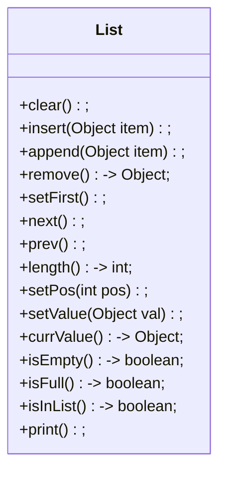
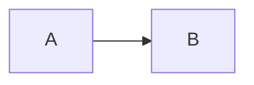

# 线性表

> 作者：李彦筱
>
> 感谢学长 [yijunquan](https://github.com/yijunquan-afk) 的[软件工程笔记](https://github.com/yijunquan-afk/XJTUSE-NOTES)给我的启发。此笔记从二叉树开始的部分中使用了学长笔记中的部分图片以及文字。
>

## 线性表的定义

- 包含许多元素的数据序列
- 可以不包含任何元素，此时叫做空表
- 如果包含 n 个元素，则认为 X[0] 是第一个元素，X[n-1] 是最后一个元素
- X[k] 在 X[k+1] 之前，X[k-1] 之后
- 除了表头 X[0] 和表尾 X[n-1] 之外，每个元素**都有一个前驱和一个后继**

### 线性表的操作

1. 访问某一位置的元素并修改
2. 在某一位置之后插入元素
3. 删除某一个位置的元素

> 以上是“增删查改”这些基本操作。**这些是最重要的操作**

4. 可以组合多个线性表为一个
5. 可以拆分一个线性表为多个
6. 可以得到线性表的元素个数
7. 可以根据线性表元素的某个关键码对其排序
8. 可以根据线性表中元素的某个数据项对其检索

### 线性表的分类

根据不同种类线性表对插入，删除，访问的操作，可以将线性表分为几个子类

1. list （列表）

   允许在任何一个位置插入，删除和访问元素

2. stack（栈）

   只允许在线性表表尾插入，删除和访问元素。栈的表尾也叫做**栈顶**

3. queue（队列）

   只允许在线性表的一端插入元素（这一端叫做队尾），另一端删除和访问元素（这一端叫做队头）。

4. deque（双端队列）

   允许在线性表的两端插入，删除和访问元素。

### 线性表的实现方式

- 数组存储（连续存放）：

  使用数组存储线性表。线性表元素间的位置关系由数组中它们的顺序维护。

- 链式存储（离散存放）：

  使用链表存储线性表。每一个节点包含数据项和指向下一个数据项位置的指针。
  

## 线性表的 ADT

ADT：一个数据结构可以执行的操作

一个长度为 n 的线性表可以在 n+1 个位置插入元素（因为表头前/表尾后都可以插入元素）

课本给出的 ADT 中包含一个 current_position 的概念，相当于一个指针：所有的操作（插入，删除）都在这个位置进行。插入方法自身不包括插入的位置，插入的位置由指针隐式的确定；这个指针可以被前后移动（或者直接移动到一个指定位置），从而完成在不同位置插入的任务。

课本上的示例ADT包含以下操作：




## 数组实现的线性表

私有属性：

- defaultSize：用户未指定时，线性表的默认最大程度
- mSize：用户指定时，线性表的最大长度
- currentSize：数组中目前实际有多少的元素
- current：int，指向线性表中的某个元素（相当于一个索引）
- list：真正存放内容的线性表

除了 list 之外，其他的内容都属于**辅助数据**，是创建一个线性表需要的辅助内容，并不直接存储内容。

注：在线性表为空表时，设置 **current 为 -1**，以此表示目前线性表中没有合法的可访问内容

### 插入方法的实现

void insert(Object obj):

1. 检查数组中的元素是否已经达到最大

2. 检查 current 指针是否在 0-n （n+1个）的范围内

3. 把 current 指针指向的元素和其后的所有元素向后移动

   从表尾开始，把每个左侧的元素往右放一位

4. 将待插入元素放到 current 指向的位置

5. 增加“数组中已有的元素”的大小

插入的时间复杂度：主要来源于“移动已经存在的元素”（第3步）那个 for 循环

最好情况：在表尾插入 O(1)，移动 0 次

最差情况：在表头插入 O(N)，移动 n 次

平均情况：移动 n/2 次，时间复杂度 O(N)

### 删除方法的实现

Object delete()

1. 判断表是否为空，以及 current 指针是否在表内。
2. 取得当前指针指向的元素
3. 将所有后面的元素向前移动一位（从待删除元素开始，把每个右侧的往左放）
4. 返回之前缓存的元素
5. 减少“数组中已有的元素”的大小

删除时只需要移动 (n-1) / 2 （平均情况下）次。

在删除第 i 个位置的元素时（假设一共有 n 个元素），则需要移动 `n-i-1` 次。


## 链表

链表是一个比较难的数据结构。不过，由于链表在某种方面的优点，很多数据结构都需要其链式实现

### 链表的构成

链表由一系列叫做*表*的节点构成；每个*表*都是一种同数据类型的对象，包含两个部分：

1. 自身存储的元素
2. 指向下一个*表*节点的指针

比如一个Java中的链表节点可以是这样：

```java
class Link{
    private Object obj; // 存储的内容
    private Link next; // 指向下个节点的指针
    public Link next();
    public Object element();
    public void setNext(Link link);
    public void setElement(Object obj);
}
```

链表类型的定义中，**使用**了自己类型的对象作为自己的一个属性。

注意：这不是 Link 里头嵌套定义了一个 Link：这只是 Link 在定义时使用了自己。

### 一点不知道放在哪的说明

书上的代码在线性表的链表实现部分使用的是单向链表。它还记录了单向链表的尾节点作为辅助变量。但是，对于单向链表来说，其尾节点毫无使用意义：因为单向链表中的每一个节点不记录自己的前驱，因此无法从尾节点得到任何一个节点。

因此，在下一部分“线性表的链表实现”中，我删除了tail尾部节点属性，并在所有实现中去掉了关于尾部节点的相关部分。

双向链表的实现中仍然包含尾部节点：因为尾部节点对于双向链表是有用的。


## 线性表的链表实现

链表是一个比较难的数据结构（尤其是在C++/C这种指针满天飞，出了问题还直接崩溃的环境里，Java 里至少报错正常点）；不过，由于链表在某种方面的优点，有时需要使用链表实现线性表。

### 为何需要使用链表？

有时候，系统可能找不到足够大的整块内存来让你存放一个数组；这时就需要使用链表。

### 链表实现的辅助内容

1. head: Link：链表的头节点
2. tail: Link：链表的尾节点
3. current: Link：链表目前*被指向的*节点

tail 本质上**并不需要**，它只是为了方便在表尾挂载元素而设置的；理论上，你知道 head 之后，就可以一直一直向后查找，直到找到一个 next 为 null 的 Link 对象，就得到了 tail。

当线性表是一个空表时：**没有任何可用的存储内容**：

head, tail, current 全部都为 null（因为他三是引用数据类型的对象，空值就是 null）

当线性表中不是一个空表时：（假设内容为 [4, 1, 3])

head: 指向一个存放了 4 的 Link 类型；此对象的 next 部分指向存放了 1 的那个 Link；存放了 1 的那个 Link 对象的 next 指向了表尾中提到的，那个存放了 3 的 Link 类型

tail: 指向一个存放了 3 的 Link 类型；此对象的 next 部分为 null （因为表尾没有后继）

current 可以指向上边那三个 Link 类型对象的任何一个；也可以指向 null（用于插入操作）

### 插入操作的实现

函数原型：`void insert(Object o);`

基于链表实现的线性表没有空间长度的限制；因此，不需要查询空间是否已满。

1. 向空的链表插入一个元素

   空表时，表头和表尾都是空；这是比较特殊的，因为你不能把新的节点挂在表尾之后然后结束。

   > 怎么判断线性表是否为空？看 head 是否为 null（是否为空）即可

   需要创建一个新的节点，然后把 head, tail 和 current 全都指向这一个节点。

2. 向链表的表头插入元素

   这种情况比较特殊，因为表头需要更新。此外，current 也需要保持其位置不变（仍然指向新的表头）

   如何判断是不是在表头插入元素？看看 current 和 head 是不是指向一个对象（**用 == 而不是 equals**）就行。

3. 在链表的中间（也包含链表表尾之后那个位置）插入元素

   单向链表的插入本质上需要两件事情：

   - 把新节点前驱的后继修改为新节点自身

   - 把新节点自己的后继修改为原先在此处的节点

     > 如果在向着链表表尾节点处插入，就不用进行这一步，将新节点的后继设置为 null 即可；这是因为链表表尾之后那里原来**没有节点**。

   由于目前使用的链表是单向链表而非双向的，无法直接得到一个元素的前驱。因此，需要从 head 开始检索，直到找到 current 的前驱。

   如果当前节点为 null，而且表长不是0（head 不是 null），那么，我们需要检查此时插入是否正常/怎么工作，

   由于 current 为 null，查找前驱的时候，会查找到当前的表尾才停止；此外，修改前驱的后继没有问题；修改新节点的后继之后，由于原来 current 为 null，因此现在的 next 也是 null。

```java
void insert(Object item){
    // 在空链表中插入元素
    if (head == null){
        head = new Link(item, null);
        tail = head;
        current = head;
        return;
    }
    // 在链表表头位置插入元素
    else if (head == current){
        head = new Link(item, current);
        current = head;
        return;
    }
    // 在其他位置插入元素
    else{
        // 1. 找当前节点的前驱
        Link prev = head;
        while (prev.next != current){
            prev = prev.next;
        }
        // 2. 设置新的节点的后继为之前在这里的那个元素
        // 顺便还把 current 指向的内容替换为了新插入的节点
        current = new Link(item, current);
        // 3. 设置新的节点前驱的后继为自己
        prev.setNext(current);
        return;
    }
}
```

### 链表删除操作的实现

链表的删除大概可以分为三种状态：

1. 删除一个空的链表中的元素/ current 指针为 null：应当避免

2. 删除表头节点

   由于单向链表最关键的就是表头：指向表头的指针一旦丢失，整个链表的内容就会被丢失。因此，必须要在删除表头后小心的重置链表的表头指针

3. 删除除了表头之外的其他有效节点

   这种情况下比较简单：只需要把被删除节点的前驱的后继改成被删除节点现在的后继，然后把被删除节点的空间释放了就行。（如果使用 java，则不需要手动释放这个节点的空间）

### 链表插入的技术改进

在插入操作中，第一种和第二种情况涉及了表头的修改，因此需要特殊的，对表头的操作，需要 if 语句进行条件分割，非常的麻烦。

有没有一种方法，使得第一种情况和第二种情况不需要显式的修改表头呢？如果能做到这一点的话，第一种和第二种情况就可以并入第三种了吧？

为了简化第一种和第二种情况，进行两项技术上的改进：

1. 在线性表的链表实现为空时，引入一个哑节点（没有存储任何内容的节点）作为头节点； head 指针不再指向 null，而是指向这个哑节点。添加元素时，在这个哑节点之后添加元素并把哑节点和那个新的节点连接起来；这个哑节点将永远存在
2. 修改 current 指针的含义：current 指针现在指向当前元素的**前驱节点**

比如：



这样，对于上面的三种情况，可以直接使用一种语句即可完成插入：

```java
current.setNext(new Link(item, current.next));
```

这条语句在 `new Link(item,  current.next)` 这里把新的节点的后继设为了当前节点的后继； `current.setNext()` 把新的节点的前驱的后继（当前节点的后继）设为了新的节点。

#### 具体的实现

链表当中每一个节点的数据类型：

```java
class Link{
    private Object item;
    private Link next;
    public Link next(){
        return this.next;
    }
    public void setNext(Link next){
        this.next = next;
    }
    public Object item(){
        return this.item;
    }
    public void setItem(Object item){
        this.item = item;
    }
}
```

新建链表的时候：

```java
class Table{
    private Link head;
    private Link current;
    public Table(){
        head = new Link(null, null);
        current = head;
    }
}
```

插入元素的时候：

```java
void insert(Object item){
    assert current != null: "No current element!";
    current.setNext(new Link(item, current.next()));
}
```

在这种改进后的实现下，插入元素的时间复杂度从 O(N) 降低为 O(1)

（因为不需要再遍历一次列表，寻找当前节点的前驱了）

删除元素的实现：

```java
void remove(){
    // 检查当前指针 current 是否指向链表中的某一个元素
    if (!isInList()){
        return null;
    }
    // 先拿到目前位置存储的东西
    Object item = current.next().item();
    // 把待删除节点的前驱的后继设置为待删除节点自己的后继
    current.setNext(current.next().next());
    return item;
}
```

这种优化之后的链表叫做**带有头节点的链表**。

## 线性表的两种实现方式的对比

| 比较方面       | 基于数组的线性表                                             | 基于链表的线性表                                             |
| -------------- | ------------------------------------------------------------ | ------------------------------------------------------------ |
| 空间使用       | 1. 元素的最大个数必须事先确定<br />2.每个元素自身没有浪费空间<br />3. 整个线性表中有空闲的空间被浪费 | 1. 元素的个数可以动态的增长<br />2. 链表为了串起离散的空间，消耗了额外空间<br />3. 整个表中没有空闲空间被浪费 |
| 访问操作       | 可以按元素的位置在任何地方随机访问                           | 必须从表头开始，向后依次访问每个元素                         |
| 增加和删除操作 | 必须要把线性表中其他元素向前/向后移动                        | 可以直接增加/删除                                            |


## 双向链表

双向链表的每个节点包含了两个指针和存储数据用的部分。

一个指针称为“next指针“，它用来指向本节点的后续节点；另一个节点被称为”prev指针“，它用来指向本节点的前驱节点。

双向链表也可以使用**哑节点**作为头节点进行代码的简化。

它与单向链表唯一的差距就在于：它多出了一个指针，这个指针用来记录此节点的前驱。

### 双向链表节点的实现

```java
class DLink{
    private DLink prev;
    private DLink next;
    private Object element;
    public DLink(Object element, DLink prev, DLink next);
    public DLink prev();
    public void setPrev(DLink prev);
    public DLink next();
    public void setNext(DLink next);
    public Object element();
    public void setElement();
}
```

### 双向链表的注意事项

由于多出了一个 prev 指针，在插入/删除元素的时候，需要考虑如何设置 prev 指针。

比如，在非表头的位置插入元素的时候，可能需要：

- 把新元素的 prev 指向上个元素，新元素的 next 指向下一元素
- 上个元素的 next 指向新元素
- 下一元素的 prev 指向新元素

双向链表的优势在于，不需要使用哑节点技术，就可以保持任意位置删除的时间复杂度在 O(1) 内。这是因为它有一个 prev 指针可以指向前一个元素。

此外，在执行 gotoPrev 操作，将 current 指针指向前一个元素的时候，双向链表可以保持O(1)内的时间复杂度（单向链表需要 O(n)）。

不过，双向链表操作的便捷也是有代价的。代价就是，每个双向链表节点都要花费额外的4个字节存储 prev 指针。如果元素比较多，这些存储空间加起来也是不小的开销。


## 循环链表

循环链表的最后一个元素的 next 指针再次指向链表的第一个元素。

只需要对双向链表/单向链表的哑节点实现的构造函数进行一点点改动，即可实现循环链表：

```java
public Table(){
    head = new Link(null, null);
    current = head;
    // 新加入的部分
    head.setNext(head); // 让头节点的 next 指针指向自己
}
```

循环链表的实现与对应的单向/双向链表几乎完全一致；唯一的差别在于，**它的构造方法和一般的链表不同。**

目前我们学习的算法和数据结构当中没有对循环链表的应用。
